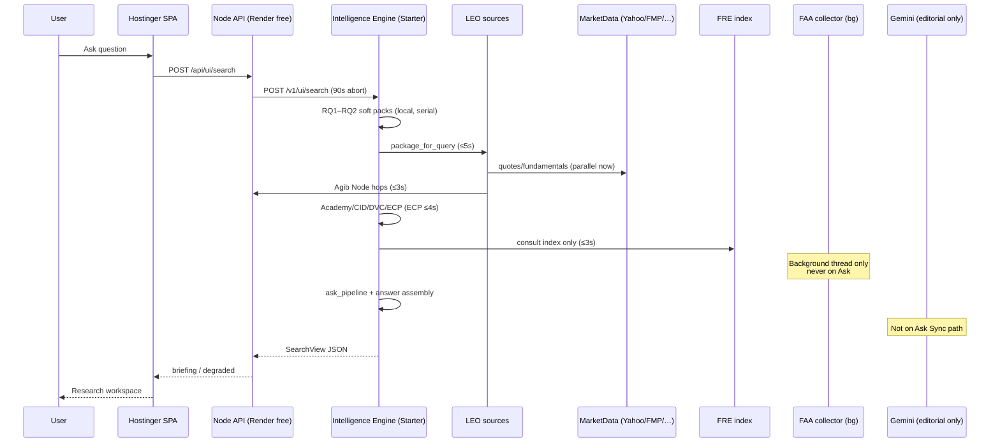
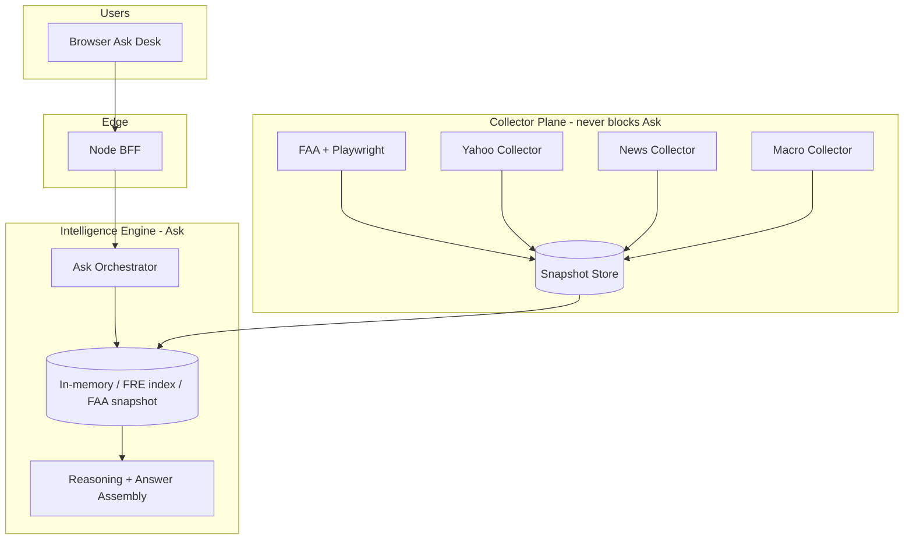

# AGI Ask — Production Architecture Review (Staff)

**Date:** 2026-07-28  
**Scope:** Intelligence Engine Ask path (API Gateway → SearchView)  
**Goal:** Institutional reliability — latency, isolation, scalability

---

## 1. Current architecture

### Synchronous network calls (Ask)

| Call | Budget | Parallel? | Notes |
|------|--------|-----------|-------|
| LEO market providers | inside 5s LEO wall | **Yes (Sprint B)** | Yahoo/IndianAPI/FMP/Finnhub |
| LEO → Agib Node | 3s connect/read | with LEO parallel | Groww/FRED/NewsAPI |
| ECP MarketData | ≤4s / pass2 ≤3s | no | Was unbounded |
| FRE consult | ≤3s | local index | `acquire=False` |
| AIL package | ≤4s | snapshot/index | No `faa.acquire` |
| Supabase telemetry | **async** | bg thread | Was sync |

---

## 2. Recommended architecture

**Invariant:** Ask only **reads**. Collectors only **write**.

---

## 3. Bottlenecks (ranked)

1. **Serial LEO fan-out** burning the 5s wall on first sources only — *fixed: parallel ThreadPool*
2. **ECP unbounded MarketData** after LEO — *fixed: 4s/3s timeouts*
3. **Yahoo 401/403 marked retryable** → retry storms on permanent auth — *fixed: never retry 4xx*
4. **AgibClient 30s timeout** — *fixed: 3s + circuit breaker*
5. **Sync Supabase telemetry** on Ask thread — *fixed: async buffer*
6. **FAA/Playwright on Ask** (historical) — *fixed Sprint A: background only*
7. **Express 90s abort + Render free restart** while engine busy — mitigated by faster Ask + degrade-not-503
8. **~20 local soft packs still serial** (RQ1–RQ2) — Phase 2 target for `<5s` average

---

## 4. Root causes by severity

| Sev | Cause | Impact |
|-----|-------|--------|
| P0 | Collectors on Ask path (FAA/Playwright) | 90s hangs / HTML 502 |
| P0 | Permanent HTTP retried (401/402/403) | Latency amplification |
| P1 | Serial external fetches | P95 >> 8s |
| P1 | Unbounded ECP / Agib timeouts | Stacked walls |
| P1 | Ask exception → 503 `research_desk_unavailable` | Empty desk UX |
| P2 | Sync telemetry / startup seed work | Cold-start jitter |
| P3 | Render free Node + starter engine contention | Intermittent restarts |

---

## 5. Files modified (this delivery)

| File | Change |
|------|--------|
| `app/resilience/*` | Circuit breaker, retry policy, HTTP helper |
| `app/market_data/providers/yahoo.py` | Never retry 4xx |
| `app/faa/http_client.py` | Never retry 401/402/403/404 |
| `app/tools/agib_client.py` | 3s timeout + circuit |
| `leo/fetchers.py` | Parallel source fan-out |
| `app/ui/service.py` | Degrade wrapper; ECP timeouts |
| `app/ui/timeouts.py` | Soft-dep ceilings (existing) |
| `app/faa/background.py` | Collector plane (Sprint A) |
| `institutional_reasoning/telemetry_sink.py` | Async flush |
| `app/api/routes.py` | `/v1/resilience/providers` |
| `docs/AGI_ASK_*` | Architecture docs |

---

## 6. Provider reliability matrix (Ask-relevant)

| Provider | Purpose | Timeout | Retry | Circuit | Cache | Fallback |
|----------|---------|---------|-------|---------|-------|----------|
| Yahoo | Quotes/fundamentals | 25s→policy | Transient only; **no 401/403** | MD breaker + leo:yahoo | MD TTL | Next provider |
| IndianAPI/FMP/Finnhub | Market | 20s | No 4xx retry | MD breaker | MD TTL | Next provider |
| Agib Node | Groww/macro/news | **3s** | None on 4xx | `agib_node` 15m | Node caches | Empty soft |
| FRE index | Evidence | ≤3s Ask | N/A | N/A | Seed/index | Empty hits |
| FAA/Playwright | Acquisition | Collector | Transient only | Collector | Doc cache | Offline stub |
| Gemini | Editorial | Off Ask | — | — | 24h | Template |

---

## 7. Migration plan

1. **Ship Sprint A+B** (this PR stack): no FAA on Ask; parallel LEO; resilience; degrade-not-503  
2. **Warm collectors:** confirm `FAA_BACKGROUND_COLLECTOR=true` on Render; watch `/v1/faa/scheduler`  
3. **Phase 2:** parallelize RQ1 soft packs / CAE-adjacent serial consults; target avg `<5s`  
4. **Phase 3:** persist FAA snapshots to Postgres/Supabase (survive restarts)  
5. **Phase 4:** dedicated FAA worker + Redis queue (optional; only if collector CPU contends with Ask)

---

## 8. Risk assessment

| Risk | Mitigation |
|------|------------|
| Parallel LEO increases burst load | Cap workers=6; circuit breakers; 5s LEO wall |
| Degraded answers feel thin | Surface `status`/`degradation` in UI later; still better than empty desk |
| Background FAA OOMs starter | Limit `FAA_COLLECTOR_LIMIT`; stagger first run 45s |
| Circuit open too aggressive | 3 failures / 15m; permanent auth still recorded |

---

## 9. Expected latency improvements

| Path | Before | After (expected) |
|------|--------|------------------|
| LEO fan-out | sum(sources) ≤5s wasted | max(sources) ≤5s |
| Permanent 401 storm | 3× retries × providers | 0 retries |
| ECP | unbounded | ≤4s (+ optional ≤3s pass2) |
| Telemetry | +100–800ms sync | ~0ms Ask |
| Full Ask (local smoke) | ~21–23s | trending lower; Phase 2 for `<5s` |
| User-visible failure | HTML 502 / unavailable | Degraded SearchView |

---

## 10. Production readiness score: **76 / 100**

| Dimension | Score | Note |
|-----------|-------|------|
| Collector isolation | 18/20 | FAA off Ask; bg collector live |
| Timeout discipline | 15/20 | Soft deps capped; RQ packs still long |
| Retry/circuit policy | 16/20 | Shared resilience + Yahoo/FAA/Agib |
| Parallel retrieval | 12/20 | LEO parallel; rest serial |
| Graceful degradation | 16/20 | SearchView always + `ASK_SLIM` |
| Observability | 8/10 | `/v1/resilience/providers` |
| Deploy topology | 6/10 | Live Ask was OOM-killing Starter; slim path required |

**Render upgrade:** Live probes showed health 200 → Ask → HTML 502 → engine restart — classic **memory kill**, not CPU. Prefer `ASK_SLIM=true` first. Upgrade Starter→Standard only if slim Ask still OOMs under concurrent load (measure RSS during Ask).

---

## Performance targets (track)

- Average latency `< 5 s` — Phase 2 (pack parallelization)
- P95 `< 8 s` — Phase 2
- No browser on Ask — **met**
- No blocking collectors — **met**
- No unnecessary retries on 401/402/403/404 — **met**
- No single provider fails the request — **met** (degrade path)
