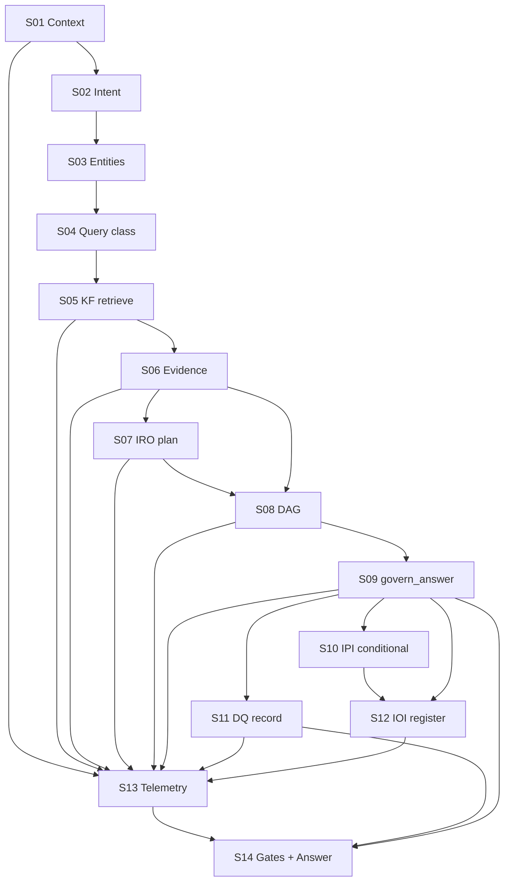

# AGIB v2.1 Track 1 — Ask Pipeline Runtime Dependency Map

**Status:** Integration contract (write before code; verify runtime against this map)  
**Track:** Complete Ask Pipeline  
**Freeze:** Phase 1–7, Knowledge Factory, Governance, Committees, Evidence Contracts, DQ scoring, CAL, Intelligence package internals — **untouched**. Soft-wire only.

This map is the contract for `ask_pipeline`. Integration code must not introduce edges that are not listed here.

---

## Pipeline order (canonical)

```text
Question
  → S01 Request Context
  → S02 Intent Classification
  → S03 Entity Resolution
  → S04 Query Classification (maps intent → governance question_type)
  → S05 Knowledge Retrieval (KF primary; selective)
  → S06 Evidence Assembly
  → S07 Research Planning (existing IRO planner)
  → S08 Research DAG (pipeline DAG; dependency + parallel)
  → S09 Institutional Reasoning (existing govern_answer / Phase 1–7)
  → S10 Portfolio Intelligence (conditional; existing IPI inside govern_answer)
  → S11 Decision Quality Recording (record only; no score redesign)
  → S12 Outcome Tracking Registration (register only; no learning)
  → S13 Telemetry
  → S14 Governed Answer (+ institutional completeness gates)
```

---

## Subsystem contracts

### S01 — Request Context (`AskContext`)

| Field | Contract |
| --- | --- |
| **Inputs** | Raw question; optional session_id, conversation_id, ticker_hint, depth, horizon, asset, portfolio_id, jurisdiction |
| **Outputs** | `AskContext` object: question, timestamp, session, conversation, placeholders for intent/entities/versions, `pipeline_id`, `replay_id` |
| **Consumers** | All later stages; dashboard; `/v1/ask/context`; replay |
| **Execute when** | Always (every Ask) |
| **Skip when** | Never |

---

### S02 — Intent Classification

| Field | Contract |
| --- | --- |
| **Inputs** | `AskContext.question` |
| **Outputs** | `intent` ∈ {Education, Research, Valuation, Comparison, Accounting, BusinessQuality, Macro, Government, Industry, Portfolio, Risk, Watchlist, Screening, Replay, Historical, Expectation, AlternativeData, Unknown}; confidence; reasons |
| **Consumers** | S04, S05 (object selection), S07 policy, S10 policy, S12 policy, gates |
| **Execute when** | Always |
| **Skip when** | Never (Unknown is a valid classification, not a skip) |

---

### S03 — Entity Resolution

| Field | Contract |
| --- | --- |
| **Inputs** | Question, ticker_hint, optional prior entity pack |
| **Outputs** | Entity list: company / sector / industry / commodity / government_policy / macro_variable / alternative_dataset / portfolio / universe / relationship / timeline; primary entity |
| **Consumers** | S05, S06, S07, S09 |
| **Execute when** | Always |
| **Skip when** | Never — may return empty entities (Education / conceptual) |

Uses existing `resolve_entities` where applicable; extends soft multi-type tags without redesigning contracts.

---

### S04 — Query Classification

| Field | Contract |
| --- | --- |
| **Inputs** | Intent + existing `classify_question` (evidence contracts) |
| **Outputs** | Governance `question_type` alignment; execution policy flags |
| **Consumers** | S07–S12 policy matrix |
| **Execute when** | Always |
| **Skip when** | Never |

---

### S05 — Knowledge Retrieval (KF primary)

| Field | Contract |
| --- | --- |
| **Inputs** | Intent, entities, requested depth |
| **Outputs** | Selective knowledge bag: only relevant of {universe, company, corporate_events, government, industry, relationships, alternative_data, expectations, historical, decision_memory, replay} |
| **Consumers** | S06 Evidence Assembly; telemetry coverage |
| **Execute when** | Always for institutional completeness (**required stage**) |
| **Skip when** | Never as a stage — but **individual object types** skipped when irrelevant to intent (see selection matrix) |

**Object selection matrix (retrieve only if ✓):**

| Object | Edu | Val/Acct/BQ | Comp | Ind | Gov | Macro | Alt | Exp | Port/Risk/Invest | Hist/Replay |
| --- | --- | --- | --- | --- | --- | --- | --- | --- | --- | --- |
| company | | ✓ | ✓ | ✓ | | | ✓ | ✓ | ✓ | ✓ |
| corporate_events | | ✓ | ✓ | | | | | | ✓ | ✓ |
| industry | | ○ | ✓ | ✓ | | | ○ | | ○ | ○ |
| government | | ○ | | ○ | ✓ | ○ | | | ○ | ○ |
| relationships | | ○ | ✓ | ✓ | ○ | ○ | ✓ | ○ | ○ | ○ |
| alternative_data | | | | | | | ✓ | | ○ | ○ |
| expectations | | ○ | ○ | | | | ○ | ✓ | ✓ | ○ |
| universe | | | ✓ | | | | | | ○ | ○ |
| historical | | ○ | | | | | | | ○ | ✓ |
| decision_memory | | | | | | | | | ○ | ✓ |
| macro | | | | | ○ | ✓ | ○ | | ○ | ○ |

✓ = retrieve when entity allows · ○ = optional soft · blank = skip object type

---

### S06 — Evidence Assembly

| Field | Contract |
| --- | --- |
| **Inputs** | Knowledge bag; entity ids |
| **Outputs** | Packs: Company / Industry / Government / Relationship / AltData / Expectation / Portfolio / Decision — each with evidence, quality, coverage, provenance, validation, point-in-time integrity |
| **Consumers** | S08, S09 (`govern_answer` packs), S11, gates |
| **Execute when** | Always (stage required). Education may produce empty/academy-oriented packs with provenance `skipped_no_live_required` |
| **Skip when** | Never as a stage; individual pack types follow intent matrix |

**Gate:** Reasoning must not start without this stage completing (even if packs are empty with explicit insufficiency).

---

### S07 — Research Planning (existing IRO `plan_research`)

| Field | Contract |
| --- | --- |
| **Inputs** | Question, primary ticker, intent |
| **Outputs** | IRO plan: goal, tasks, DAG, execution_plan, deliverables |
| **Consumers** | S08, telemetry, gates |
| **Execute when** | Intent ∉ {Education} **OR** governance question_type not education |
| **Skip when** | Education path (`skipped_by_policy`) — **not** a bypass |

No planner redesign — call `institutional_reasoning.iro.orchestrator.plan_research` only.

---

### S08 — Research DAG (pipeline executor)

| Field | Contract |
| --- | --- |
| **Inputs** | IRO plan (if present); knowledge + evidence stage functions; packs |
| **Outputs** | DAG run record: levels, parallel batches, retries, failures, task telemetry, withholding flags |
| **Consumers** | S09 (packs + plan metadata), S13, gates |
| **Execute when** | Non-education (planner ran) |
| **Skip when** | Education (`skipped_by_policy`) |

**DAG nodes (integration DAG — does not rewrite IRO task questions):**

1. `knowledge_retrieval` (depends: context, intent, entities)  
2. `evidence_assembly` (depends: knowledge_retrieval)  
3. `attach_planner` (depends: evidence_assembly; uses S07 output)  
4. `institutional_reasoning` (depends: evidence_assembly + planner unless education)

Supports parallel entity fan-out inside knowledge/evidence nodes. Failure propagation → evidence withholding flags → reasoning still runs but contracts may incomplete.

**Note:** Full IRO `run_assignment` (multi `govern_answer` per task) is **not** the Ask default — it would duplicate Phase 1–7. Ask uses `plan_research` + integration DAG + **one** `govern_answer`. Optional deep IRO assignment remains API-only.

---

### S09 — Institutional Reasoning (existing `govern_answer`)

| Field | Contract |
| --- | --- |
| **Inputs** | Question; packs from S06 (+ soft LEO/FRE extras from UiService); academy; ticker; entity pack; flags build_institutional_evidence / build_portfolio_intelligence / build_outcome_intelligence |
| **Outputs** | Governance record (Phase 1–3 always; Phase 5–6 per flags); DJG |
| **Consumers** | S10 (embedded), S11, S12, S14 UI |
| **Execute when** | Always |
| **Skip when** | Never |

**Must not modify** `execution_governance.py` logic — only call it.

---

### S10 — Portfolio Intelligence (existing IPI)

| Field | Contract |
| --- | --- |
| **Inputs** | Intent / question_type; entity; packs; research record (inside govern_answer) |
| **Outputs** | `ipi`, PDG, portfolio_recommendation when applicable |
| **Consumers** | S11, S12, UI |
| **Execute when** | Intent ∈ {Portfolio, Risk} **OR** investment recommendation language **OR** governance type ∈ {portfolio, investment_decision, risk} |
| **Skip when** | Education, pure definition, non-invest research without portfolio intent (`skipped_by_policy`) |

Invoked by setting `build_portfolio_intelligence` on `govern_answer` — no IPI redesign.

---

### S11 — Decision Quality Recording

| Field | Contract |
| --- | --- |
| **Inputs** | Governance record, packs, latency, coverage, replay_id, pipeline_id |
| **Outputs** | IDQ Decision Object via existing `compile_decision_object` / `put_decision` |
| **Consumers** | Dashboard, `/v1/ask/replay`, IDQ list APIs |
| **Execute when** | Always after S09 (every governed answer) |
| **Skip when** | Never for Ask pipeline completeness |

**Record only** — no scoring algorithm changes, no hall recompute required on Ask path.

---

### S12 — Outcome Tracking Registration

| Field | Contract |
| --- | --- |
| **Inputs** | IPI decision if present; else lightweight registration from governance run_id |
| **Outputs** | IOI `decision_id` / lifecycle handle (or `skipped_by_policy`) |
| **Consumers** | Telemetry, future evaluate (not on Ask) |
| **Execute when** | Non-education **and** (IPI present **or** research path with entity) |
| **Skip when** | Education; clarification-only with no entity (`skipped_by_policy`) |
| **Learning** | Never on this path |

Uses existing `track_decision` when IPI exists; otherwise soft `register_decision`-compatible stub record keyed by `run_id` without calling CAL.

---

### S13 — Telemetry

| Field | Contract |
| --- | --- |
| **Inputs** | All stage statuses, latencies, errors, coverage, gates |
| **Outputs** | Pipeline telemetry record |
| **Consumers** | Dashboard, `/v1/ask/telemetry`, gates |
| **Execute when** | Always |
| **Skip when** | Never |

---

### S14 — Governed Answer + Completeness Gates

| Field | Contract |
| --- | --- |
| **Inputs** | Governance + telemetry + DQ id + IOI id + stage map |
| **Outputs** | Answer payload attachment `ask_pipeline`; `institutionally_complete` bool |
| **Consumers** | UiService SearchView; APIs |
| **Execute when** | Always |
| **Skip when** | Never |

**FAIL completeness if any required violation:**

| Violation | Meaning |
| --- | --- |
| evidence_bypassed | S06 did not run |
| knowledge_bypassed | S05 did not run |
| planner_bypassed | Non-education and S07 did not run |
| missing_provenance | Evidence packs lack provenance envelope |
| decision_not_recorded | S11 missing |
| telemetry_missing | S13 missing |
| replay_missing | No replay_id |
| pipeline_incomplete | Required stage missing without policy skip |

`skipped_by_policy` is allowed and does **not** fail gates.

---

## Consumer graph (who reads whose outputs)



---

## Execution policy matrix (summary)

| Intent | KF | Evidence | Planner | DAG | Reasoning | Portfolio | DQ record | Outcome reg | Telemetry |
| --- | --- | --- | --- | --- | --- | --- | --- | --- | --- |
| Education | run (light) | run (empty OK) | **skip** | **skip** | run | **skip** | run | **skip** | run |
| Valuation / Accounting / BQ | run | run | run | run | run | skip* | run | run† | run |
| Industry / Government / Macro | run | run | run | run | run | skip | run | run† | run |
| Alt / Expectations | run | run | run | run | run | skip* | run | run† | run |
| Comparison | run (multi) | run | run | run | run | skip* | run | run† | run |
| Portfolio / Risk / Invest | run | run | run | run | run | **run** | run | **run** | run |
| Historical / Replay | run | run | run | run | run | skip | run | run† | run |
| Unknown | run | run | run | run | run | skip* | run | run† | run |

\* unless investment keywords present  
† register when entity/run_id available; no learning

---

## Soft-wire points (code)

| Boundary | Allowed integration | Forbidden |
| --- | --- | --- |
| `UiService.search` | Call `ask_pipeline.run_complete_ask` / prepare+finalize; attach payload | Rewrite house-view logic |
| KF | Read `evidence_feed`, stores, IKS `company_bundle` | Edit collectors/producers |
| IRO | `plan_research` only on Ask | Redesign planner; default `run_assignment` on Ask |
| Governance | Call `govern_answer` with packs/flags | Edit Phase 1–7 modules |
| IDQ | `compile_decision_object` record | Change metrics/scoring |
| IOI | `track_decision` / register | `evaluate_decision` / CAL on Ask |
| APIs | Add `/v1/ask/*` read surfaces | Break existing routes |

---

## Verification checklist

For every Ask execution record, assert:

1. Stages S01–S06, S09, S11, S13 present  
2. S07/S08 either executed or `skipped_by_policy` with education  
3. S10 executed or `skipped_by_policy`  
4. S12 executed or `skipped_by_policy`  
5. KF used as primary knowledge source for packs (`source=knowledge_factory` or explicit empty with provenance)  
6. No Phase 1–7 / KF / governance file diffs in the Track 1 PR except soft-wire call sites + new `ask_pipeline` + routes/tests/docs  

---

*End of dependency map — implement only against this contract.*
