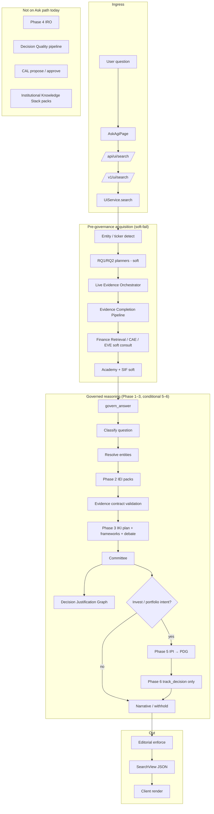
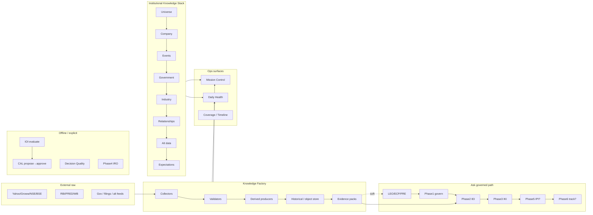
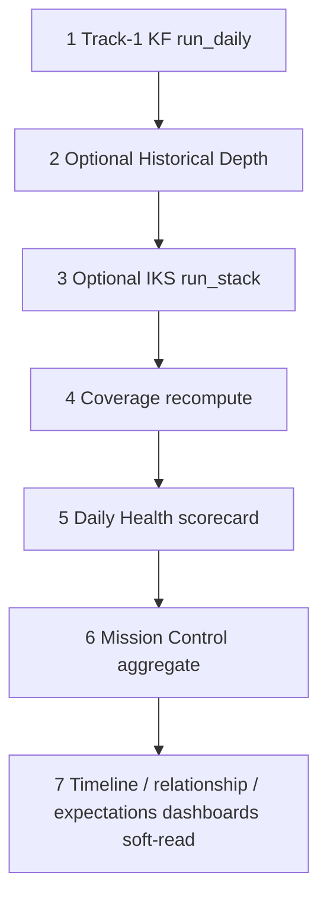
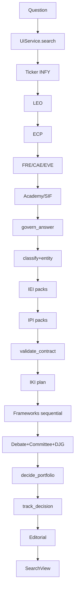
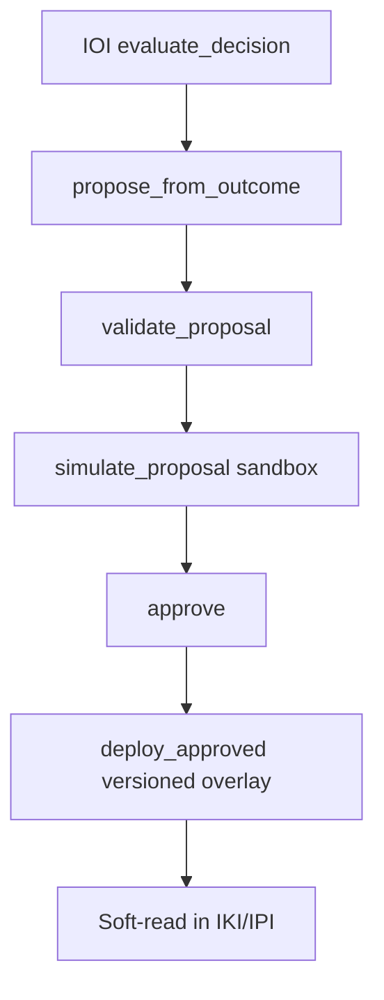

# AGIB System Architecture Book

**Document type:** Institutional technical due diligence & canonical architecture reference  
**Audience:** Principal / staff engineers, platform owners, onboarding  
**Source of truth:** Repository code as of branch `cursor/system-architecture-book-4cc0` (aligned to `main` at book creation)  
**Principle:** Audit the system. Do not answer investment questions. Never fabricate coverage.

---

## How to use this book

1. Treat every claim as **code-verified** unless marked *declared / soft-wire / not wired*.
2. Prefer this book over marketing prose when deciding whether a new feature fits the architecture.
3. When adding a subsystem, update the relevant audit section and the wiring matrix (Appendix A).
4. **Hard freeze:** Phase 1–7 institutional reasoning contracts, governance, committees, planners, evidence contracts, Decision Quality architecture, and Learning governance are soft-wire only from knowledge layers. Knowledge must not rewrite frameworks.

### Wiring legend

| Symbol | Meaning |
| --- | --- |
| **WIRED** | Invoked on the live Ask / API path with observable side effects |
| **SOFT** | Package exists; aggregated into Mission Control / Daily Health / optional `/run`; not primary Ask driver |
| **API** | HTTP surface exists; caller-driven |
| **DECLARED** | Spec + modules exist; not attached to Ask or morning cron |
| **FIXTURE** | Demo / seed / in-memory store; not production market feed |

---

# Audit 1 — Self Architecture

## 1.1 Role

This section answers as **chief systems architect**, not as an investment analyst. It describes the path from user question → governed answer, then morning operations.

## 1.2 End-to-end Ask workflow (live path)

Primary client path:

```text
AskAgiPage (frontend)
  → POST /api/ui/search  (Node proxy)
  → POST /v1/ui/search   (FastAPI)
  → UiService.search     (intelligence-engine/app/ui/service.py)
  → govern_answer(...)   (institutional_reasoning/execution_governance.py)
  → SearchView assembly + editorial gate
```

### Stage diagram (Ask)



## 1.3 Stage catalog (Ask path)

For each stage: purpose, I/O, components, feed/consume, knowledge vs reasoning, governance, provenance, insufficiency.

### S0 — Ingress & transport

| Field | Detail |
| --- | --- |
| Purpose | Accept natural-language question; auth/session; route to UI search |
| Inputs | `query`, optional ticker/context |
| Outputs | `ClientSearchRequest` → `SearchView` |
| Components | Frontend Ask page, Node `server/routes`, FastAPI `/v1/ui/search`, `UiService` |
| Feeds | S1 |
| Consumes from | User |
| Knowledge change? | No |
| Governance | Auth + UI flags; no investment conclusion yet |
| Provenance | Request id / answer id when telemetry present |
| Insufficiency | Network/auth errors surfaced as UI error states |

### S1 — Entity resolution & question shaping

| Field | Detail |
| --- | --- |
| Purpose | Detect ticker/entity; seed research questions (RQ1/RQ2 soft) |
| Inputs | Raw question text |
| Outputs | `detected_ticker`, entity packs, research question metadata |
| Components | `KNOWN_TICKERS`, RQ engines (soft), entity resolution packs |
| Feeds | S2–S4, `govern_answer` |
| Knowledge? | No (read-only) |
| Governance | Clarification path later if entity ambiguous |
| Provenance | Entity resolution pack fields when present |
| Insufficiency | Missing ticker → clarification or generic path |

### S2 — Live evidence acquisition (LEO + ECP + FRE/CAE/EVE)

| Field | Detail |
| --- | --- |
| Purpose | Gather / complete / verify live evidence before academy & IRP |
| Inputs | Question, ticker |
| Outputs | `live_evidence`, `evidence_completion`, retrieval packs |
| Components | LEO, ECP, FRE, CAE, EVE (all soft-fail) |
| Feeds | Academy/SIF, `govern_answer` packs |
| Knowledge? | Read external/live + internal stores; does not mutate Phase 1–7 |
| Governance | Soft failures → empty dicts; never crash Ask |
| Provenance | Source tags inside LEO/FRE objects when available |
| Insufficiency | Empty packs → later contract incomplete → withhold narrative |

### S3 — Domain soft consults (Academy, SIF, dossier)

| Field | Detail |
| --- | --- |
| Purpose | Enrich context with sector framework & academy knowledge |
| Inputs | LEO-supplied evidence |
| Outputs | Sector / academy / dossier soft slices |
| Components | Finance Academy, SIF, company dossier |
| Feeds | Narrative assembly; not a substitute for IEI contracts |
| Knowledge? | Read-only soft |
| Governance | Soft-fail |
| Provenance | Module-level metadata |
| Insufficiency | Skipped silently if unavailable |

### S4 — Phase 1 Execution Governance (`govern_answer`)

| Field | Detail |
| --- | --- |
| Purpose | Classify → contract → validate → frameworks → committee → justification |
| Inputs | Question, packs, academy, ticker hint |
| Outputs | Governance record: validation, frameworks, committee, DJG, editorial mode |
| Components | `execution_governance.py`, evidence contracts, frameworks, committee |
| Feeds | Editorial, IPI (conditional), UI executive text |
| Knowledge? | **Reasoning only** (does not write KF objects) |
| Governance | Contract completeness gates `narrative_allowed`; education/clarification bypasses |
| Provenance | `run_id`, contract versions, pack refs, DJG edges |
| Insufficiency | `editorial_mode=report_insufficient`; stance Insufficient evidence / Clarification |

**Sub-stages inside S4:**

1. **Classify** — question type (valuation, investment_decision, education, …).
2. **Education bypass** — academy explain; no evidence contract.
3. **Entity resolve + clarification** — if ambiguous, stop with clarify-only.
4. **Phase 2 IEI** — `package_for_governance` binds institutional evidence packs; frameworks never fetch.
5. **Phase 5 pack bind (soft)** — IPI pack for exposure/risk/return fields when entity present.
6. **Contract validation** — missing required packs → incomplete.
7. **Phase 3 IKI** — applicability plan → execution order → framework execute → debate finalize.
8. **Committee** — stance / can_conclude / conclusion.
9. **DJG** — justification graph attached via `_attach_justification`.
10. **Narrative gate** — `narrative_allowed` only if executed frameworks + complete validation (with narrow applicability exception).

### S5 — Phase 5 Institutional Portfolio Intelligence (conditional)

| Field | Detail |
| --- | --- |
| Purpose | Convert research package into portfolio actions (Increase/Reduce/Hold/Exit/Watch/Replace/Hedge/**Withhold**) — never Buy/Sell |
| Inputs | Research record, IPI packs, invest/portfolio keywords |
| Outputs | `ipi`, `portfolio_decision_graph`, `portfolio_recommendation` |
| Components | `ipi/decision.decide_portfolio`, PDG |
| Trigger | `qtype ∈ {portfolio, investment_decision, risk}` OR keywords (`should i invest`, `invest £/$/₹`, weight, exposure, …) |
| Knowledge? | Reasoning + optional decision memory write |
| Governance | Policy gates; withhold when incomplete / unsafe |
| Provenance | PDG nodes link research `run_id` |
| Insufficiency | `withheld=true`; committee stance Withhold |

### S6 — Phase 6 Outcome Intelligence (track only on Ask)

| Field | Detail |
| --- | --- |
| Purpose | Register decision lifecycle for later evaluation |
| Inputs | IPI decision |
| Outputs | `ioi.decision_id`, lifecycle status |
| Components | `ioi.pipeline.track_decision` |
| Knowledge? | Stores decision object (memory), not market truth |
| Governance | Withheld decisions tracked but not scored later |
| Provenance | `decision_id` ↔ research `run_id` |
| Insufficiency | No IPI → no IOI handle |
| **Not on Ask** | `evaluate_decision` (market → review → CAL propose) |

### S7 — Editorial assembly & response

| Field | Detail |
| --- | --- |
| Purpose | Build client-safe executive text; scrub; attach governance payload |
| Inputs | Governance record + house view / IRP / evidence lists |
| Outputs | `SearchView` with `execution_governance`, evidence, confidence display fields |
| Components | `governed_executive`, `enforce_editorial`, scrubbers |
| Knowledge? | No |
| Governance | If narrative not allowed, executive reports insufficiency |
| Provenance | Governance block returned to client |
| Insufficiency | Explicit insufficient / clarification copy |

## 1.4 Knowledge layers (Institutional Knowledge Stack)

These are **knowledge factories**, not reasoning engines. Soft-orchestrated by `knowledge_factory/institutional_knowledge_stack/` (`STACK_VERSION` institutional-knowledge-stack-v2.0.0).

| Layer | Package / API | Role | Ask wiring |
| --- | --- | --- | --- |
| Knowledge Factory Track-1 | `knowledge_factory/schedulers/daily.py` | Collect → validate → derive → store → evidence packs | Soft via adapter / ECP / FRE |
| Universe Intelligence | `/v1/universe-intelligence` | Universe coverage / ICI aggregates | SOFT (IKS) |
| Company Intelligence (ICI) | `/v1/company-intelligence` | Per-company institutional object | SOFT (IKS) |
| Corporate Events (ICEI) | `/v1/corporate-events` | Event timeline | SOFT (IKS) |
| Government (IGRI) | `/v1/government` | RBI, Budget, SEBI, GST, PLI, trade (Phase 1) | SOFT (IKS) |
| Industry & Value Chain (IIVI) | `/v1/industry` | Industry map / value chain | SOFT (IKS) |
| Economic Relationships (IERI) | `/v1/relationship` | Structural/financial/policy/market/operational/behavioural links | SOFT (IKS) |
| Alternative Data (IADI) | `/v1/alternative-data` | Phase-1 high-signal datasets (PMI deferred) | SOFT (IKS) |
| Market Expectations (IMEI) | `/v1/expectations` | Guidance/actuals/AGIB forecasts; licensed consensus Phase-2 / UNKNOWN | SOFT (IKS) |
| Evidence Factory | KF packs + IEI packaging | Institutional evidence packs for frameworks | WIRED via IEI package_for_governance |
| Institutional Reasoning 1–7 | `institutional_reasoning/*` | Governed reasoning | 1–3 WIRED; 5 conditional; 6 track; 4/7/DQ DECLARED-API |
| Decision Quality | `decision_quality/` | Separate DQ pipeline | API / fixtures; **not Ask** |
| Outcome Intelligence | `ioi/` | Track + evaluate | Track soft via IPI; evaluate API |
| Continuous Adaptive Learning | `cal/` | Propose→simulate→approve→overlay | Via evaluate / CAL APIs; **never Ask auto** |

### IKS orchestration order (`run_stack`)

```text
universe → company → corporate_events → government → industry
  → relationships → alternative_data → expectations
```

Each step soft-fails independently. `reasoning_changed: false` is asserted on stack reports.

## 1.5 Full platform workflow diagram



## 1.6 Morning pipeline (6 AM conceptual)

There is **no single in-repo cron** that hard-codes “06:00 IST run everything.” Operational morning is composed of:

1. **Track-1 KF daily** — `knowledge_factory.production.run_daily_pipeline()` / `schedulers/daily.run_daily`
2. **Optional Historical Depth** — `historical_depth=True`
3. **Optional IKS** — `institutional_knowledge=True` → `run_stack(ensure_only_missing=…)`
4. **Coverage / Daily Health / Mission Control** — soft-aggregate dashboards (`/v1/...` morning coverage, daily health, mission control)
5. **Separate CIO research desk schedulers** — research content, not KF truth

Expected morning outputs: validated company/macro/sector objects, evidence packs, coverage report, optional IKS layer readiness, Mission Control / Daily Health boards.

See **Audit 3** for the full DAG.

## 1.7 Example: user asks “Should I invest in Infosys?”

**Investment answer is intentionally not produced here** — only system behavior.

1. Ingress → `UiService.search`.
2. Ticker detect → `INFY` (or Infosys alias if configured).
3. LEO/ECP/FRE attempt live packs (soft-fail OK).
4. `govern_answer`:
   - Classify ≈ `investment_decision` (or related).
   - Resolve entity INFY.
   - Bind IEI packs; validate contract.
   - IKI plans frameworks; executes only when packs permit.
   - Committee may set `can_conclude=false` if incomplete.
   - Keyword `should i invest` → **IPI** runs → PDG action space includes **Withhold**.
   - IOI `track_decision` if IPI emits a decision id.
5. Editorial: if `narrative_allowed=false`, executive reports insufficiency / withhold — **does not invent a Buy**.
6. IKS company bundle for INFY is **not** the primary Ask pack builder today; it remains soft knowledge for dashboards / `/v1/institutional-knowledge/company/INFY`.

---

# Audit 2 — Knowledge Flow

## 2.1 Principle

```text
Raw external data
  → Collectors
  → Validators (reject or publish)
  → Derived producers
  → Historical / object store
  → Knowledge objects
  → Evidence packs
  → (Ask) Institutional Evidence packaging
  → Research / frameworks / committees
  → Portfolio intelligence (conditional)
  → Decision quality (offline)
  → Outcome intelligence (evaluate)
  → Learning proposals (never auto-apply)
```

## 2.2 Layer-by-layer

### Collectors

| Field | Detail |
| --- | --- |
| Input | Tickers, dates, source credentials / public endpoints |
| Processing | Source clients under `knowledge_factory/collectors/*` (Yahoo, Groww, NSE, BSE, RBI, FRED, World Bank, …) |
| Output | Raw datasets with timestamps / payload |
| Validation | Collector `ok` flags; empty payload → collection_failure, keep prior object |
| Storage | Validated raw via `store.put_validated` after validator |
| Consumers | Normalizers, producers |

### Validators

| Field | Detail |
| --- | --- |
| Input | Raw datasets + required field tuples |
| Processing | `validators/pipeline.validate_dataset`, `dedupe_filings` |
| Output | Verdict `{ok, …}`; reject → not published |
| Validation | Self (quality gate) |
| Storage | Only if `ok` → `put_validated` |
| Consumers | Normalizers / producers / coverage reports |

### Derived producers

| Field | Detail |
| --- | --- |
| Input | Normalized primitives |
| Processing | Valuation, accounting, business quality, risk, peers, timeline, sector, macro, portfolio |
| Output | Metric objects + insufficiency lists |
| Validation | Producer-level `found` / `insufficient` |
| Storage | Compiled into company/sector/macro objects |
| Consumers | Evidence packs, dashboards, IEI packaging |

### Historical store

| Field | Detail |
| --- | --- |
| Input | Validated series / HD pipeline entities |
| Processing | `historical_depth` enrichment (optional nightly) |
| Output | Historical series objects |
| Validation | Pipeline status; soft-fail vs Track-1 |
| Storage | HD store + KF store |
| Consumers | Adapter historical series, replay, coverage |

### Knowledge objects

| Field | Detail |
| --- | --- |
| Input | Compiled profile + metrics + timeline + pack |
| Processing | `objects/compile.compile_company|macro|sector` |
| Output | Canonical company / sector / macro JSON objects |
| Validation | Published only after raw validation |
| Storage | `store.put_object` |
| Consumers | Evidence feed, IKS layers, Mission Control |

### Evidence packs

| Field | Detail |
| --- | --- |
| Input | Valuation/risk/freshness/coverage fields |
| Processing | Pack assembly in `run_daily`; `store.put_pack` |
| Output | Per-entity pack (`current_pe`, `historical_pe`, `risk_drivers`, coverage, quality, provenance) |
| Validation | Coverage/quality scores; missing_fields listed |
| Storage | Packs directory / store |
| Consumers | IEI `package_for_governance`, evidence_feed, Ask soft reads |

### Research orchestration (Ask)

| Field | Detail |
| --- | --- |
| Input | Question + packs |
| Processing | LEO/ECP/FRE + `govern_answer` (IEI → IKI → committee) |
| Output | Governance record + optional IPI/IOI handles |
| Validation | Evidence contracts |
| Storage | Observability / decision memory (soft) |
| Consumers | UI SearchView, PDG, later IOI evaluate |

### Portfolio intelligence

| Field | Detail |
| --- | --- |
| Input | Research record + IPI packs |
| Processing | `decide_portfolio` → PDG |
| Output | Action + conclusion + graphs |
| Validation | Policy / completeness → Withhold |
| Storage | Decision memory when `persist_memory=True` |
| Consumers | UI, IOI track |

### Decision quality

| Field | Detail |
| --- | --- |
| Input | Fixture or supplied decision rows |
| Processing | `run_decision_quality_pipeline` |
| Output | DQ scorecard |
| Validation | Pipeline checks |
| Storage | DQ module outputs |
| Consumers | `/v1/decision-quality/*` — **not Ask** |

### Outcome intelligence

| Field | Detail |
| --- | --- |
| Input | IPI decision (track) or `decision_id` (evaluate) |
| Processing | Register → later market collect → evaluate → attribute → calibrate → review → outcome graph |
| Output | Lifecycle + review + OG |
| Validation | Withheld not market-scored |
| Storage | IOI lifecycle store |
| Consumers | CAL proposals when `propose_learning=True` |

### Learning proposals

| Field | Detail |
| --- | --- |
| Input | Outcome / review record |
| Processing | Propose → validate → simulate → approve → versioned overlay |
| Output | Proposal rows + learning graph + versions |
| Validation | Forbidden: auto_apply, rewrite_framework |
| Storage | In-memory/version store (module) |
| Consumers | Soft-read overlays in IKI confidence/planner, IPI policy |

---

# Audit 3 — Morning Pipeline

## 3.1 Operational truth

“Morning update” is an **operational composition**, not one hardcoded 6 AM process in git. Callable entrypoints:

| Entry | Path |
| --- | --- |
| Track-1 daily | `POST` KF daily / `run_daily_pipeline()` |
| IKS run | `POST /v1/institutional-knowledge/run` → `run_stack` |
| Morning coverage | `knowledge_factory_morning_coverage` API |
| Daily Health | Daily health scorecard API |
| Mission Control | Mission Control aggregate (soft-reads IKS) |

## 3.2 Execution order (recommended ops DAG)



### Pipeline 1 — Track-1 Knowledge Factory (`run_daily`)

| Field | Detail |
| --- | --- |
| Purpose | Refresh macro, portfolio book, per-entity company objects + packs |
| Frequency | Daily (ops-scheduled) |
| Dependencies | Collector availability |
| Validation | `validate_dataset` before publish; collection/validation failure lists |
| Derived metrics | Valuation, accounting, BQ, risk, peers, timeline, sector, macro |
| Evidence | Per-entity evidence packs |
| Quality gates | Track-1 gate in `knowledge_factory.production` |
| Mission Control / Daily Health / Coverage | Feeds store → dashboards soft-read |
| Timeline / relationship updates | Timeline from filings; relationships via later IKS |
| Expected outputs | `coverage` + `daily` reports; company/sector/macro objects |

**Per-entity loop (simplified):** Yahoo collect → validate → normalize → valuation/accounting/BQ/risk → NSE/BSE filings dedupe → timeline → peers → pack → compile_company → store.

### Pipeline 2 — Historical Depth (optional)

| Field | Detail |
| --- | --- |
| Purpose | Deepen historical series without touching Phase 1–7 |
| Frequency | Nightly / optional flag |
| Dependencies | Track-1 entities |
| Validation | Soft-fail; never breaks Track-1 |
| Expected outputs | HD report nested under daily result |

### Pipeline 3 — Institutional Knowledge Stack (`run_stack`)

| Field | Detail |
| --- | --- |
| Purpose | Soft-run Universe→…→Expectations in order |
| Frequency | Daily optional (`institutional_knowledge=True`) or API `/run` |
| Dependencies | Layer modules importable; prior layers preferred but soft-fail OK |
| Validation | Per-layer try/except; health = layers_ready |
| Evidence | Layer-native evidence objects; KF `evidence_feed` soft-attached in company bundle |
| Quality gates | `layers_ok >= 6` → ok else degraded |
| Mission Control | Soft-read `institutional_knowledge_stack` board |
| Daily Health | Roadmap soft-read from coverage scorecard |
| Coverage / Timeline / Relationships | Updated inside respective layer pipelines |
| Expected outputs | Per-layer reports + stack runtime |

### Pipeline 4–7 — Ops boards

| Board | Purpose |
| --- | --- |
| Morning coverage | North-star coverage KPI |
| Daily Health | One-screen ops health + roadmap_next |
| Mission Control | Multi-source aggregate including IKS |
| Timeline / Relationships / Expectations dashboards | Layer-specific readiness |

## 3.3 Complete execution DAG (ops)

```text
run_daily_pipeline
├── run_daily (Track-1)
│   ├── macro: RBI + FRED + WB → validate → normalize → produce → store
│   ├── portfolio: Groww → validate → produce → store
│   └── for each entity:
│       ├── Yahoo collect
│       ├── validate / normalize
│       ├── producers: valuation, accounting, BQ, risk
│       ├── filings NSE+BSE → dedupe → timeline
│       ├── peers + pack
│       └── compile_company → store
│   └── sector compile + coverage/daily reports
├── [opt] historical_depth.run_historical_pipeline
└── [opt] institutional_knowledge_stack.run_stack
    ├── universe
    ├── company (ICI)
    ├── corporate_events
    ├── government
    ├── industry
    ├── relationships
    ├── alternative_data
    └── expectations

then (read-only aggregate):
coverage → daily_health → mission_control
```

---

# Audit 4 — Knowledge Inventory

> “Everything AGIB currently knows” = **objects the codebase can represent and store**, not guaranteed live market completeness. Maturity scores are engineering maturity of the subsystem.

### Companies

| Dimension | Inventory |
| --- | --- |
| Objects | Company knowledge objects, ICI company records, dossiers (soft) |
| Relationships | Peers, sector membership, IERI company links |
| Metrics | Price/fundamentals primitives, valuation/risk fields |
| Evidence | KF packs, IEI packs, LEO objects |
| APIs | KF company, `/v1/company-intelligence`, IKS company bundle |
| Dashboards | ICI dashboard, Mission Control company slices |
| Coverage | Universe-dependent (NIFTY seed / configured entities) |
| Maturity | **7/10** Track-1+ICI present; live completeness varies |
| Limitations | Collector failures keep prior; not all NIFTY-500 always fresh |
| Expansion | Broader universe, filing depth, management DNA |

### Financials / Accounting / Valuation

| Dimension | Inventory |
| --- | --- |
| Objects | Accounting metrics, BQ, valuation series (PE etc.) |
| Metrics | Producer outputs + insufficiency lists |
| Evidence | Pack PE / historical PE / missing_fields |
| APIs | Via KF / IEI / FRE soft |
| Maturity | **6/10** |
| Limitations | Many fields UNKNOWN without licensed fundamentals |
| Expansion | Deeper statements, quality-of-earnings packs |

### Corporate Events

| Dimension | Inventory |
| --- | --- |
| Objects | ICEI events + timelines |
| APIs | `/v1/corporate-events` |
| Maturity | **6/10** |
| Limitations | Source breadth; soft-wire to Ask |
| Expansion | Richer corporate action taxonomy |

### Government

| Dimension | Inventory |
| --- | --- |
| Objects | RBI, Budget, SEBI, GST, PLI, trade (Phase 1 IGRI) |
| APIs | `/v1/government` |
| Maturity | **5/10** |
| Limitations | Phase-1 scope; Ask soft only |
| Expansion | State policy, regulatory timeline depth |

### Macro

| Dimension | Inventory |
| --- | --- |
| Objects | GLOBAL macro object from RBI/FRED/WB |
| APIs | KF macro store / product macro views |
| Maturity | **6/10** |
| Limitations | Sparse series; not full macro model library on Ask |
| Expansion | Regime library linkage |

### Industries

| Dimension | Inventory |
| --- | --- |
| Objects | Industry maps, value-chain company maps (IIVI) |
| APIs | `/v1/industry` |
| Maturity | **6/10** |
| Limitations | Mapping coverage; soft Ask |
| Expansion | Full chain cost curves |

### Relationships

| Dimension | Inventory |
| --- | --- |
| Objects | IERI economic relationship graph (6 semantic classes) |
| APIs | `/v1/relationship` |
| Maturity | **6/10** |
| Limitations | Soft knowledge; not primary Ask driver |
| Expansion | Causal stress edges |

### Alternative Data

| Dimension | Inventory |
| --- | --- |
| Objects | Phase-1 high-signal datasets; PMI deferred |
| APIs | `/v1/alternative-data` |
| Maturity | **5/10** |
| Limitations | Licensing / freshness; UNKNOWN when absent |
| Expansion | PMI + licensed feeds |

### Expectations

| Dimension | Inventory |
| --- | --- |
| Objects | Guidance, actuals, AGIB forecasts, gap narratives |
| APIs | `/v1/expectations` |
| Maturity | **5/10** |
| Limitations | Licensed consensus Phase-2 / UNKNOWN |
| Expansion | Street consensus adapters |

### Portfolios

| Dimension | Inventory |
| --- | --- |
| Objects | Groww book → portfolio object; IPI packs; PDG |
| APIs | IPI / UI portfolio views |
| Maturity | **6/10** |
| Limitations | Book source dependent; policy incomplete → Withhold |
| Expansion | Multi-book, constraints engine |

### Decision Quality

| Dimension | Inventory |
| --- | --- |
| Objects | DQ pipeline outputs / fixtures |
| APIs | `/v1/decision-quality/*` |
| Maturity | **4/10** (architecture present; not Ask-integrated) |
| Limitations | Offline / fixture-leaning |
| Expansion | Wire post-decision audits |

### Learning

| Dimension | Inventory |
| --- | --- |
| Objects | Proposals, versions, overlays, learning graphs |
| APIs | CAL production / governance |
| Maturity | **6/10** governance design; limited production traffic |
| Limitations | Never auto Outcome→Production; Ask does not propose |
| Expansion | Approved overlay telemetry in prod |

### Historical Replay

| Dimension | Inventory |
| --- | --- |
| Objects | Historical Depth series; CAL sandbox replay proxy |
| Maturity | **5/10** |
| Limitations | Not full tick-level market replay |
| Expansion | Point-in-time research replay |

---

# Audit 5 — Question Execution

## Question under audit

> Should I invest £1,000,000 in Infosys?

**Do not answer the investment question.** Trace execution only.

## 5.1 Modules invoked (expected)

| Order | Module | Parallelism |
| --- | --- | --- |
| 1 | Frontend Ask → Node proxy → FastAPI UI search | sequential |
| 2 | `UiService.search` orchestration | sequential shell |
| 3 | Entity/ticker detect (Infosys → INFY) | sequential |
| 4 | RQ1/RQ2 soft planners | soft sequential |
| 5 | LEO live evidence | soft |
| 6 | ECP completion | after LEO |
| 7 | FRE/CAE/EVE soft consult | soft; may overlap conceptually, implemented sequentially with try/except |
| 8 | Academy + SIF soft | after LEO supply |
| 9 | `govern_answer` | sequential governance core |
| 9a | classify / resolve / clarify? | sequential |
| 9b | IEI `package_for_governance` | sequential |
| 9c | IPI `package_for_governance` | sequential |
| 9d | contract `validate_contract` | sequential |
| 9e | IKI `plan` → framework specs | sequential |
| 9f | `_execute_framework` **per spec** | currently list-comp sequential (parallelizable later) |
| 9g | IKI `finalize_with_debate` | sequential |
| 9h | `_committee` + DJG | sequential |
| 9i | Keyword/qtype trigger → `decide_portfolio` | sequential |
| 9j | `track_decision` (IOI) | sequential |
| 10 | Editorial `governed_executive` + `enforce_editorial` | sequential |
| 11 | `SearchView` return | sequential |

**Not invoked on this Ask path:** Phase 4 IRO research orchestration engine, Decision Quality pipeline, CAL propose/approve, IKS `run_stack`, IOI `evaluate_decision`.

## 5.2 Evidence packs

- LEO / ECP / FRE packs (if available)
- IEI institutional evidence pack bound in governance
- IPI institutional portfolio pack (exposure / risk / downside / expected return fields)
- KF pack for INFY **if** present in store and pulled by IEI packaging — otherwise missing → contract incomplete

## 5.3 Frameworks & committees

- Frameworks selected by IKI planner (applicability-ordered), else type map fallback
- Each framework: status `executed` | rejected | skipped per applicability/evidence
- Research committee + (if IPI) portfolio committee
- Actions allowed: Increase / Reduce / Hold / Exit / Watch / Replace / Hedge / **Withhold** (not Buy/Sell)

## 5.4 Graphs

| Graph | When |
| --- | --- |
| Decision Justification Graph (DJG) | Always attached on governance record |
| Portfolio Decision Graph (PDG) | When IPI runs |
| Outcome Graph | Only after later `evaluate_decision` |
| Learning Graph | Only after CAL proposal path |

## 5.5 Validations & governance gates

1. Question classification  
2. Entity clarification gate  
3. Evidence contract completeness  
4. Framework applicability  
5. Committee `can_conclude`  
6. `narrative_allowed`  
7. Editorial enforce  
8. IPI policy / withhold rules  
9. IOI: withheld tracked but not market-scored later  

## 5.6 Portfolio rules & confidence

- £1,000,000 amount may appear in question text; size rules apply only if IPI policy pack contains sizing constraints — else **Withhold** / insufficient rather than invent sizing.
- Confidence: IEI/IES + committee + UI display fields; CAL overlays only if previously approved (soft-read). Missing → transparent UNKNOWN / low completeness.

## 5.7 Withholding rules (representative)

- Clarification required  
- Contract incomplete / missing packs  
- Applicability-resolved without applicability intent → downgraded to insufficient  
- IPI policy fail / incomplete portfolio pack  
- Education path is separate (not this question)

## 5.8 Execution DAG



## 5.9 Latency estimates (engineering order-of-magnitude)

| Segment | Estimate |
| --- | --- |
| Ingress + proxy | 50–200 ms |
| LEO/ECP/FRE soft | 200 ms–3 s (network-bound; soft-fail faster) |
| `govern_answer` core | 50–500 ms typical in-process |
| IPI + track | 20–200 ms |
| Total Ask | ~0.5–5 s common; higher if live collectors slow |

These are **estimates for capacity planning**, not SLOs encoded in code.

---

# Audit 6 — Data Lineage

## 6.1 Provenance contract (pattern)

Knowledge layers use provenance objects shaped like:

```text
{ source, retrieved_at, validated_at, collector, confidence,
  derived_from, version, fabricated: false }
```

Numbers without provenance must be treated as **non-institutional**.

## 6.2 Reverse lineage template (for any produced number)

| Step | Question |
| --- | --- |
| 1 | Where did the number originate? (vendor field / filing / derived formula) |
| 2 | Which collector retrieved it? (`collectors/<source>/client.py`) |
| 3 | Which validator approved it? (`validate_dataset` verdict) |
| 4 | Which derived producer transformed it? (valuation/accounting/risk/…) |
| 5 | Which evidence pack contains it? (`store.put_pack` / IEI pack) |
| 6 | Which reasoning framework consumed it? (IKI execution_order specs) |
| 7 | Which committee used it? (research and/or portfolio) |
| 8 | Which decision graph contains it? (DJG / PDG node refs) |
| 9 | Which outcome graph stores it? (only after IOI evaluate) |

## 6.3 Example lineage: `current_pe` on an evidence pack

```text
Yahoo (or upstream) price/earnings fields
  → collectors/yahoo.client.collect_company
  → validate_dataset → put_validated(company_market)
  → normalize_company → primitives
  → producers/valuation.metrics.produce_valuation → PE points
  → run_daily evidence_pack.current_pe = last PE point
  → store.put_pack(entity)
  → IEI package_for_governance (if found)
  → framework(s) requiring valuation pack
  → committee / DJG
  → (if invest intent) IPI/PDG may reference research record
  → IOI track stores decision_id (number itself not re-derived)
  → IOI evaluate / CAL do not rewrite the PE; they score decisions / propose overlays
```

## 6.4 Example lineage: portfolio recommendation action

```text
Research governance record (run_id)
  + IPI pack fields (exposure, risk_contribution, downside_case, expected_return)
  → ipi.decision.decide_portfolio
  → recommendation.action ∈ {Increase,…,Withhold}
  → portfolio_decision_graph
  → io.track_decision → lifecycle
  → (later) evaluate_decision → outcome_graph
  → (optional) cal.propose_from_outcome → learning_graph → versioned overlay
```

**Never:** Outcome evaluation silently mutates PE or framework source.

## 6.5 Transparent insufficiency

If any reverse step is missing, AGIB must surface **UNKNOWN / missing_evidence / Withhold**, not a guessed number. Fabrication flag must remain `false`.

---

# Audit 7 — Learning System

## 7.1 Differentiation

| Mode | What it is | Auto? |
| --- | --- | --- |
| Knowledge ingestion | Collectors→validators→objects/packs | Ops-scheduled yes; not “model learning” |
| Outcome storage | IOI lifecycle + evaluate artifacts | Track on Ask; evaluate explicit |
| Learning proposals | CAL candidates from outcomes | Generated only when evaluate/govern_learning called |
| Simulation | Sandbox / replay proxy | Required before approve |
| Approval | Human/gov gate | **Required** |
| Versioned overlays | Confidence / planner / policy / applicability overlays | Only after approve+deploy |
| Reasoning | Phase 1–7 frameworks | Soft-read overlays; **no auto rewrite** |
| Governance | Learning Governance Layer | Enforces Never Outcome→Production |

## 7.2 Complete learning workflow



Canonical chain (from `cal/governance.py`):

```text
Outcome Intelligence → Learning Proposal → Simulation → Benchmark → Approval → Production Overlay
Never: Outcome → Production
```

## 7.3 What changes automatically

- Knowledge objects/packs when collectors succeed and validators pass (ops pipelines)
- Decision lifecycle registration on IPI track
- Proposal **records** when evaluate asks to propose (still not production reasoning)

## 7.4 What never changes automatically

- Framework source code / gold patterns  
- Evidence contracts / committee constitutions  
- Production planner weights / policy limits without approve+deploy  
- Silent Outcome→Production mutation  
- Fabricated numbers to fill gaps  

## 7.5 Why this prevents model drift

1. Separation of **knowledge refresh** vs **reasoning calibration**.  
2. Learning is **proposal-shaped** and **versioned**, not weight-smudging in place.  
3. Sandbox rejects IES regressions on accept path.  
4. Forbidden candidate kinds (`auto_apply`, `rewrite_framework`).  
5. Ask path does not call CAL — interactive answers cannot self-modify mid-flight.

---

# Audit 8 — System Review (Principal Engineer)

Scores are **institutional engineering maturity (0–10)**, not investment alpha.

| Subsystem | Score | Strengths | Weaknesses | Missing | Scalability | Prod readiness | Tech debt | Future risks |
| --- | --- | --- | --- | --- | ---: | ---: | --- | --- |
| Architecture | 7 | Clear KF vs reasoning freeze; staged phases | Ask path is a long soft-fail chain | Single typed orchestration bus | Horizontal OK if stores externalized | Partial | Monolithic `UiService.search` | Accidental tight coupling of new KF into frameworks |
| Knowledge | 7 | Stack layers + Track-1 | Soft-wire dominance | Unified query API across layers | Entity fan-out cost | Staging-ready | Duplicate stores per layer | Coverage illusion vs freshness |
| Evidence | 7 | Contracts + packs + IEI bind | Pack completeness uneven | Stronger cross-source consensus | Cache packs | Partial | Multiple evidence dialects | Silent empty packs |
| Governance | 8 | Contracts, withhold, editorial | Complex branching | Unified audit export | Fine | Strong design | Version sprawl | Bypass via non-Ask APIs |
| Reasoning | 7 | IKI planner + debate + frameworks | Sequential framework exec | Broader framework library gated by evidence | CPU-bound | Partial | Fallback type maps | Applicability edge cases |
| Portfolio intelligence | 6 | Action vocabulary correct; PDG | Depends on pack richness | Full constraint solver | OK | Partial | Policy completeness | Size questions without book context |
| Decision quality | 4 | Pipeline module exists | Not on Ask; fixture lean | Continuous DQ on live decisions | OK | Low | Parallel score taxonomies | DQ theater without traffic |
| Learning | 6 | Hard anti-drift design | Little live approval traffic | Prod overlay telemetry | OK | Design-ready | In-memory proposal store | Pressure to auto-apply |
| Coverage | 7 | North-star KPI culture | Ops cron not in-repo | SLO alerting | OK | Ops-dependent | Many dashboards | Vanity metrics |
| Alternative data | 5 | Phase-1 scoped honestly | Soft; PMI deferred | Licensed feeds | Vendor limits | Low–med | Fixture temptation | Scraping legal risk |
| Expectations | 5 | Reality vs expectations principle | Consensus UNKNOWN | Licensed consensus | Vendor limits | Low–med | Narrative without numbers | Expectation gap misuse as signal |
| Relationships | 6 | Semantic classes | Soft Ask | Causal stress tests | Graph growth | Med | Graph store choice | Spurious edges |
| Industry intelligence | 6 | Value-chain package | Soft Ask | Cost curves | OK | Med | Mapping maintenance | Stale industry maps |
| Government intelligence | 5 | Phase-1 policy set | Narrow corpus | Event impact scoring | OK | Med | Manual refresh | Policy mis-attribution |
| Historical replay | 5 | HD + sandbox proxy | Not full PIT research | Tick/PIT research replay | Storage heavy | Low | Dual history stores | Look-ahead bias |
| APIs | 7 | Broad FastAPI surface | Inconsistent envelopes | Public versioning policy | OK | Med | Route file size | Breaking changes |
| Mission Control | 6 | Soft aggregate | Best-effort imports | Hard SLOs | OK | Med | Null-heavy boards | False green |
| Daily Health | 6 | Single morning screen intent | Depends on stores populated | Pager integration | OK | Med | Score opacity | Ignoring degraded layers |

### Overall institutional maturity score: **6.2 / 10**

**Verdict:** AGIB has a credible institutional **skeleton** — knowledge factories, evidence contracts, governed reasoning, portfolio withhold semantics, and anti-drift learning. Production maturity is gated by (1) pack completeness & live collectors, (2) Ask↔IKS soft-wire gap, (3) offline DQ/CAL/IRO attachment, and (4) operational scheduling/observability outside the repo.

**Do not “fix maturity” by inventing answers.** Raise score by wiring evidence, coverage, and governed evaluation traffic.

---

# Canonical Reference Appendices

## Appendix A — Wiring matrix (Ask vs Ops vs API)

| Capability | Ask | Morning/Ops | Dedicated API |
| --- | --- | --- | --- |
| KF Track-1 | soft read | primary | yes |
| IKS layers | soft / not primary | optional `run_stack` | yes (`/v1/institutional-knowledge/*`, layer APIs) |
| Phase 1 Governance | **wired** | n/a | via Ask / govern |
| Phase 2 IEI | **wired** | n/a | package modules |
| Phase 3 IKI | **wired** | n/a | planner modules |
| Phase 4 IRO | not wired | n/a | declared |
| Phase 5 IPI | **conditional** | n/a | yes |
| Phase 6 IOI track | **conditional** | n/a | yes |
| Phase 6 IOI evaluate | not on Ask | ops/explicit | yes |
| Phase 7 CAL | not on Ask | via evaluate | yes |
| Decision Quality | not on Ask | explicit | yes |
| Mission Control / Daily Health | n/a | soft aggregate | yes |

## Appendix B — Key API prefixes

| Prefix | Role |
| --- | --- |
| `/v1/ui/search` | Ask aggregation |
| `/v1/institutional-knowledge/{health,dashboard,run,company/{ticker}}` | IKS facade |
| `/v1/company-intelligence`, `/v1/corporate-events`, `/v1/government`, `/v1/industry` | Reality layers |
| `/v1/relationship`, `/v1/alternative-data`, `/v1/expectations` | Rel / alt / expectations |
| `/v1/universe-intelligence` | Universe |
| KF morning coverage / daily health / mission control routes | Ops boards |
| Decision quality / IOI / CAL routes | Offline governance loops |

## Appendix C — Deployment & operational guidance

1. **Separate concerns in deploy:** API (Ask) vs batch (KF/IKS) vs boards (Mission Control).  
2. **Batch flags:** `run_daily_pipeline(historical_depth=…, institutional_knowledge=…)`.  
3. **Never** point frameworks at raw collector HTTP.  
4. **Freeze lock:** knowledge PRs must not edit Phase 1–7 contracts/committees/planners.  
5. **Onboarding:** read Audits 1, 2, 7 first; then wiring matrix.  
6. **Change control:** new feature must declare which stage it feeds/consumes and whether it changes knowledge or reasoning.  
7. **Insufficiency policy:** UNKNOWN / Withhold over fabrication — non-negotiable.

## Appendix D — Document maintenance

| Event | Update |
| --- | --- |
| New KF layer | Audit 1 table, Audit 2/3/4, Appendix A/B |
| New Ask wire | Audit 1/5 wiring, scores in Audit 8 |
| New governance rule | Audit 1 S4–S6, Audit 7 |
| Collector change | Audit 2 collectors, Audit 6 examples |

---

## Closing note

This System Architecture Book is the **canonical reference** for future development, onboarding, and maintenance. Validate every new feature against:

1. Does it belong in knowledge or reasoning?  
2. Which stage feeds/consumes it?  
3. How is provenance preserved?  
4. How is insufficiency surfaced?  
5. Does it violate the Phase 1–7 / learning freeze?

If those five answers are unclear, the feature is not ready to merge.
`)