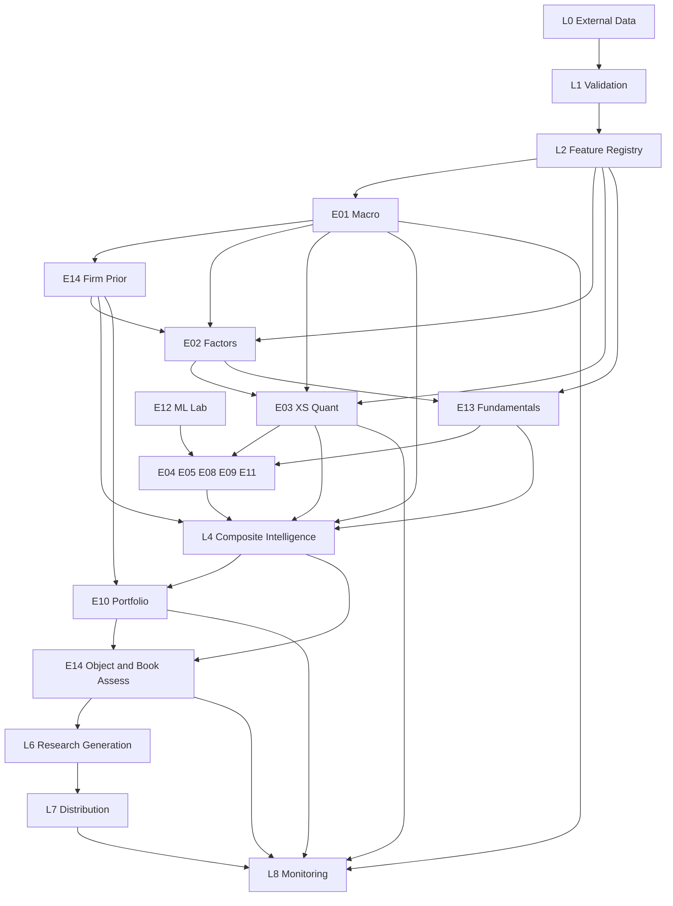

# E00 — AGI Investment Office Constitution  
## Architecture Version 1.0  
### Permanent Operating Standard for Research Systems, Engines, Data, APIs, and Governance

**Document ID:** `E00`  
**Title:** AGI Investment Office Constitution  
**Architecture version:** **1.0**  
**Status:** Binding institutional standard  
**Effective:** 2026-07-25  
**Owner:** Chief Investment Officer / Head of Quantitative Research / Head of Engineering  
**Audience:** All contributors to AGIB research engines, data pipelines, APIs, UI, publishing, and validation  
**Supersedes:** Ad-hoc engine conventions; does not delete engine specs — it **governs** them  

### Constitutional supremacy

1. This document is the **highest-level engineering and institutional governance specification** for the AGI Investment Office.  
2. Frozen engine specifications (`E01`, `E02`, `E03`, `E10`, `E13`, `E14`, and future `E04`–`E09`, `E11`, `E12`) are **subordinate** to E00. Where an engine spec conflicts with E00, **E00 wins** and the engine spec must be amended.  
3. The strategy taxonomy in `INSTITUTIONAL_STRATEGY_ARCHITECTURE.md` defines investment strategy hierarchy; **E00 defines system law**. Strategies map into engines; engines must obey E00.  
4. **Every future PR** that adds or changes an engine, feature, score, API, table, or research UI **must reference E00** (section IDs) in the PR description.  
5. No engine may ship production research outputs that violate Shared Contracts (§5), Confidence (§9), Evidence (§10), Score (§8), Lifecycle (§18), or Research-only rules (§1.5).

### Nature of AGI Investment Office systems

AGI systems are **institutional research infrastructure**. They:

- classify regimes, measure factors, estimate relative alpha, score fundamentals, construct illustrative portfolios, and overlay risk;  
- generate research notes, dashboards, and CIO briefs;  
- **do not** route orders, place trades, or promise returns.

---

# SECTION 1 — Mission, Vision, Objectives, Scope, Non-Goals, Success Criteria

## 1.1 Mission

Build and operate a **coherent, explainable, point-in-time research platform** that transforms market, fundamental, and alternative data into institutional-grade investment intelligence for India-primary and global-overlay markets — with the discipline of Bloomberg / Aladdin / Barra-class systems and the research culture of top multi-strat and quant platforms.

## 1.2 Vision

A single Investment Office where:

- every named company, sector, factor, and portfolio recommendation has a **versioned, auditable state**;  
- every conclusion ships **evidence, confidence, and falsifiers**;  
- engines are **modular** yet **contract-compatible**;  
- contributors can extend the system for years without semantic drift;  
- research remains **internally consistent** under hundreds of PRs.

## 1.3 Objectives

| ID | Objective |
|----|-----------|
| O1 | Unified multi-layer architecture (L0–L8) with deterministic pipelines |
| O2 | Official registry of engines E01–E14 with clear ownership and promotion status |
| O3 | Shared contracts for state, scores, confidence, evidence, and versioning |
| O4 | Permanent Feature Registry and Signal Registry |
| O5 | Dynamic weight registry — no silent hardcoded production blend weights |
| O6 | Database, API, frontend, backtest, and ML governance standards |
| O7 | Lifecycle: Experimental → Research → Candidate → Production → Deprecated → Retired |
| O8 | Preserve research-only boundary forever unless a separate Execution Constitution is ratified |

## 1.4 Scope

In scope:

- All `intelligence-engine` research engines and agents  
- Node gateway services that serve research APIs  
- Supabase / Postgres research schemas  
- Feature stores, score stores, PIT warehouses  
- CIO briefs, Story/Beta research UX, publishing research strips  
- Validation harnesses, promotion gates, observability  
- India equity primary universe; US/global overlay data used by engines  

## 1.5 Non-goals

| Non-goal | Rationale |
|----------|-----------|
| Order management / EMS / brokerage execution | Separate future constitution required |
| Guaranteed alpha or performance marketing | Research ≠ advice ≠ product performance claims |
| Replacing human CIO judgment | Systems inform; CIO decides publish/override policy |
| Single monolithic “AI stock picker” | Modular engines with contracts |
| Retail tip generation | Institutional evidence standard |
| Silent weight hardcoding in production blends | §12 Weight Registry |
| Look-ahead / survivorship-ignorant backtests | §16 |

## 1.6 Success criteria (Architecture v1.0)

| Criterion | Measure |
|-----------|---------|
| Contract compliance | 100% Production engines expose §5 `EngineState` |
| PIT integrity | 0 look-ahead violations in CI for Production engines |
| Evidence completeness | 100% CIO-promoted objects include §10 evidence pack |
| E14 gate | 100% promoted portfolio/note/signal bundles assessed |
| Registry completeness | Every Production feature/signal registered (§6–§7) |
| PR hygiene | New engine/API PRs cite E00 sections |
| Lifecycle hygiene | No Experimental model on client-facing publish path |
| Observability | Pipeline runs emit latency, stale_ratio, gate counts |

---

# SECTION 2 — System Architecture (Layers 0–8)

AGI is organised as a strict layered architecture. **Upper layers may depend on lower layers; lower layers must not depend on upper layers.**

```
L8 Monitoring
L7 Distribution
L6 Research Generation
L5 Portfolio Construction
L4 Composite Intelligence
L3 Research Engines
L2 Feature Registry
L1 Data Validation
L0 External Data
```

## 2.1 Layer 0 — External Data

**Responsibility:** Acquire raw market, fundamental, macro, ownership, alternative, and calendar data from vendors and exchanges.

**Components:** Groww / NSE market APIs, FRED, Alpha Vantage, Finnhub, FMP, IndianAPI, RBI/official prints, licensed positioning/ESG (future), CMS manual overrides.

**Rules:**

- Credentials only in server/engine environment variables.  
- Every pull stamped with `source`, `pulled_at`, `vendor_as_of`.  
- No vendor payload is a research conclusion.  
- Raw PII prohibited.

## 2.2 Layer 1 — Data Validation

**Responsibility:** Admit or reject raw data into the warehouse.

**Checks (minimum):** schema validation, type/range, duplicate keys, timestamp monotonicity, corporate-action consistency, universe membership, vendor error envelopes, staleness thresholds.

**Outputs:** `ValidationReport{dataset_id, passed, failed_rows, warnings, input_hash}`.

**Rule:** Failed critical validations **block** downstream feature builds for affected symbols/datasets (fail closed for Production paths).

## 2.3 Layer 2 — Feature Registry

**Responsibility:** Transform validated data into registered features with stable IDs (§6).

**Outputs:** Point-in-time feature snapshots; online feature vectors for engine runs.

**Rule:** Unregistered features cannot feed Production engines.

## 2.4 Layer 3 — Research Engines

**Responsibility:** Domain engines E01–E14 (except that E10 is Layer 5 primary; E14 is cross-cutting — see registry).

**Rule:** Engines consume features + upstream `EngineState` objects; emit §5 contracts only.

## 2.5 Layer 4 — Composite Intelligence

**Responsibility:** Fuse multi-engine states into CIO-facing composite objects without destroying attribution.

**Components:** Combiners, conflict resolver (§11), dynamic weights (§12), probability calibrators, CIO desk agents.

**Rule:** Composite layer may **haircut or gate**; it may not invent undocumented alpha.

## 2.6 Layer 5 — Portfolio Construction

**Responsibility:** E10 — convert views into constrained illustrative portfolios and rebalance previews.

**Rule:** Never modifies Layer 3 alpha formulas.

## 2.7 Layer 6 — Research Generation

**Responsibility:** Narratives, briefs, note stubs, Story/Beta packages — all bound to evidence packs.

**Rule:** LLMs may narrate; **cannot** be sole source of scores, regimes, or gates.

## 2.8 Layer 7 — Distribution

**Responsibility:** Website, APIs, publishing/newsletter, authenticated research portal.

**Rule:** Client-facing surfaces show Production (or explicitly labeled Research) artifacts only; Experimental never.

## 2.9 Layer 8 — Monitoring

**Responsibility:** Freshness, parity audits, IC monitors, constraint breaches, pipeline SLOs, incident response.

**Rule:** Monitoring cannot be bypassed for Production cron paths.

### Cross-cutting: Risk Overlay

**E14** is a **mandatory cross-cutting control plane** spanning L3–L7 for promotion paths. It is registered as an engine but architecturally a **gate + haircut service**.

---

# SECTION 3 — Official Engine Registry

## 3.1 Registry rules

- Engine IDs are permanent: `E01`…`E14`.  
- New engines require an E00 amendment (Architecture minor/major per §20).  
- **Promotion Status** ∈ `Experimental | Research | Candidate | Production | Deprecated | Retired` (§18).  
- Frozen specs listed below are **normative** for those engines.

## 3.2 Execution order (canonical daily research cycle)

Logical order (IST research day):

1. L0/L1 ingest & validation  
2. L2 features  
3. **E01** Macro & Regime  
4. **E14** firm risk state (prior pass; may refresh after books)  
5. **E02** Factor & Style  
6. **E03** Cross-Sectional Quant  
7. **E13** Equity Fundamental L/S  
8. Specialised alpha (as implemented): **E04, E05, E06, E07, E08, E09, E11** (parallel where independent)  
9. **E12** ML Alpha Lab (shadow / gated)  
10. L4 Composite Intelligence  
11. **E10** Portfolio Construction  
12. **E14** assessment on promoted objects / books  
13. L6 Research Generation  
14. L7 Distribution  
15. L8 Monitoring seal  

## 3.3 Engine catalogue

### E01 — Macro & Regime Engine
| Field | Specification |
|-------|----------------|
| **Purpose** | Classify global/India macro regime axes; size/vol priors; downstream weight hints |
| **Owner** | Head of Quant Research / CIO Macro Desk |
| **Consumers** | E02 timing, E03 combiner, E10 cash/vol, E13 soft priors, E14 macro bridge, L4/L6 |
| **Dependencies** | L0–L2 macro/market features |
| **Outputs** | `E01State` (macro_score, axes, size_multiplier, vol_target, weight_adjustments) |
| **Execution order** | First domain engine after features |
| **Promotion status** | **Candidate → Production** (spec frozen; implement per E01 spec) |
| **Normative spec** | `E01_MACRO_REGIME_ENGINE_SPEC.md` |

### E02 — Factor & Style Engine
| Field | Specification |
|-------|----------------|
| **Purpose** | Measure systematic factor exposures and style scores (not DCF, not screener) |
| **Owner** | Head of Quant Research |
| **Consumers** | E03 residualisation, E10 factor budgets, E13 style context, E14 factor RC |
| **Dependencies** | E01 (timing), L2 price+fundamental features |
| **Outputs** | `E02Exposure`, `E02UniverseSnapshot`, loadings |
| **Execution order** | After E01; before/with E03 residual needs |
| **Promotion status** | Candidate (spec frozen) |
| **Normative spec** | `E02_FACTOR_STYLE_ENGINE_SPEC.md` |

### E03 — Cross-Sectional Quant Engine
| Field | Specification |
|-------|----------------|
| **Purpose** | Primary relative alpha; includes legacy `SM_AGI_TECH` |
| **Owner** | Head of Quant Research |
| **Consumers** | E10 views, E04/E12/E13 overlays, L4/L6, research UI |
| **Dependencies** | E01, E02 (optional residual), L2 OHLCV features; E14 on promotion |
| **Outputs** | `E03Alpha`, universe rankings |
| **Execution order** | After E01/E02 features ready |
| **Promotion status** | Production path via technical compat; institutional composite Candidate |
| **Normative spec** | `E03_CROSS_SECTIONAL_QUANT_ENGINE_SPEC.md` |

### E04 — Statistical Arbitrage Engine
| Field | Specification |
|-------|----------------|
| **Purpose** | Pairs/basket/RV residual alpha research |
| **Owner** | Head of Quant Research |
| **Consumers** | E10, E14, L4 |
| **Dependencies** | E01 (disable in break regimes), E02/E03 residuals, L2 prices |
| **Outputs** | `E04State` / pair scores (contract when specified) |
| **Execution order** | After E03 residual features |
| **Promotion status** | Experimental (spec pending; must obey E00) |

### E05 — Event Driven Engine
| Field | Specification |
|-------|----------------|
| **Purpose** | Merger/special sits/earnings drift/revision events |
| **Owner** | Event Research Lead / CIO Desk |
| **Consumers** | E10, E13 revisions companion, E14 event risk, L6 |
| **Dependencies** | Calendars, E01, E13/E03 context |
| **Outputs** | `E05State` / event assessments |
| **Execution order** | Parallel specialised; after calendars validated |
| **Promotion status** | Research (partial product exists via deal/earnings contexts; full engine Candidate pending spec) |

### E06 — Credit Engine
| Field | Specification |
|-------|----------------|
| **Purpose** | Credit L/S, distress, cap-structure research |
| **Owner** | Credit Research Lead |
| **Consumers** | E10 multi-asset, E14 credit taxonomy, E01 |
| **Dependencies** | Spreads, fundamentals, E01 |
| **Outputs** | `E06State` |
| **Execution order** | Specialised parallel |
| **Promotion status** | Experimental (spec pending) |

### E07 — Rates & Curve Engine
| Field | Specification |
|-------|----------------|
| **Purpose** | Curve, FI RV, rates views feeding macro |
| **Owner** | Rates Research Lead |
| **Consumers** | E01, E10 macro portfolio, E14 |
| **Dependencies** | Yield curves, CB data |
| **Outputs** | `E07State` |
| **Execution order** | May precede E01 refresh for curve features; logical couple with E01 |
| **Promotion status** | Experimental (spec pending) |

### E08 — Volatility & Options Intelligence
| Field | Specification |
|-------|----------------|
| **Purpose** | Vol regime, surface, dispersion, tail-hedge research (not execution) |
| **Owner** | Derivatives Research Lead |
| **Consumers** | E10 hedge sleeves, E14 tail, E03 confirmation optional |
| **Dependencies** | Options data, E01 vol axis |
| **Outputs** | `E08State` |
| **Execution order** | Specialised parallel after vol features |
| **Promotion status** | Experimental / Research (partial VIX usage exists; full engine pending spec) |

### E09 — CTA / Trend Engine
| Field | Specification |
|-------|----------------|
| **Purpose** | Time-series trend / managed-futures style research signals |
| **Owner** | Head of Quant Research |
| **Consumers** | E10 CTA sleeve, L4 |
| **Dependencies** | E01, prices; demean vs E03 XS mom where required |
| **Outputs** | `E09State` |
| **Execution order** | Specialised parallel |
| **Promotion status** | Experimental (spec pending) |

### E10 — Portfolio Construction & Capital Allocation
| Field | Specification |
|-------|----------------|
| **Purpose** | Weights, risk budgets, constraints, rebalance previews — **no alpha creation** |
| **Owner** | Head of Portfolio Construction |
| **Consumers** | L6/L7, E14 book assess, future EMS recommendations |
| **Dependencies** | E01–E03, E13, specialised alphas, **E14 mandatory** |
| **Outputs** | `E10Portfolio`, `E10RebalancePreview`, sleeve budgets |
| **Execution order** | After L4 views assembled |
| **Promotion status** | Candidate (spec frozen); UI feature-flagged |
| **Normative spec** | `E10_PORTFOLIO_CONSTRUCTION_ENGINE_SPEC.md` |

### E11 — Sentiment & Alternative Data
| Field | Specification |
|-------|----------------|
| **Purpose** | NLP sentiment, alt-data features, soft signals |
| **Owner** | Alt-Data / NLP Lead |
| **Consumers** | E03 combiner (optional), E05, E13 divergence, E12 |
| **Dependencies** | Text/news vendors, L1 validation |
| **Outputs** | `E11State` |
| **Execution order** | Parallel specialised |
| **Promotion status** | Experimental (spec pending) |

### E12 — Machine Learning Alpha Lab
| Field | Specification |
|-------|----------------|
| **Purpose** | Sandbox ML alphas with promotion gates |
| **Owner** | Head of ML Research |
| **Consumers** | E03 `A_AGI_CUSTOM` after promotion; E10 only post-gate |
| **Dependencies** | Feature registry; **E14 + explainability gates** |
| **Outputs** | `E12Candidate`, promoted signal records |
| **Execution order** | After features; promotion async |
| **Promotion status** | Experimental lab; **no direct Production publish** without §17 gates |

### E13 — Equity Fundamental Long/Short
| Field | Specification |
|-------|----------------|
| **Purpose** | Business quality & fundamental attractiveness; quantamental L/S views |
| **Owner** | Head of Equity Research / Quantamental |
| **Consumers** | E10 views, E14, L6 notes; metadata to E03 |
| **Dependencies** | PIT fundamentals, E01 soft, E02 context, E14 on promote |
| **Outputs** | `E13Fundamental` |
| **Execution order** | After E02 helpful; parallel to E03 acceptable |
| **Promotion status** | Candidate (spec frozen); greenfield flags off by default |
| **Normative spec** | `E13_EQUITY_FUNDAMENTAL_LS_ENGINE_SPEC.md` |

### E14 — Risk & Crowding Overlay
| Field | Specification |
|-------|----------------|
| **Purpose** | Mandatory risk/crowding overlay; haircuts, gates, stress — **never BUY/SELL** |
| **Owner** | Head of Risk |
| **Consumers** | All promotion paths; E10 constraints; L4/L6/L7 |
| **Dependencies** | E01, E02 loadings, market microstructure, holdings |
| **Outputs** | `E14State`, `E14Assessment` |
| **Execution order** | Early firm pass after E01; late assess after E10/objects |
| **Promotion status** | Candidate (spec frozen); **mandatory control** |
| **Normative spec** | `E14_RISK_CROWDING_OVERLAY_SPEC.md` |

## 3.4 Registry table (summary)

| ID | Name | Layer | Order key | Status |
|----|------|-------|-----------|--------|
| E01 | Macro & Regime | L3 | 10 | Candidate/Prod-track |
| E14 | Risk & Crowding | Cross-cut | 15 / 90 | Candidate/Mandatory |
| E02 | Factor & Style | L3 | 20 | Candidate |
| E03 | XS Quant | L3 | 30 | Prod-track (tech) / Candidate (composite) |
| E13 | Fundamental L/S | L3 | 35 | Candidate |
| E04 | Stat Arb | L3 | 40 | Experimental |
| E05 | Event | L3 | 41 | Research |
| E06 | Credit | L3 | 42 | Experimental |
| E07 | Rates | L3 | 12 | Experimental |
| E08 | Vol & Options | L3 | 43 | Experimental/Research |
| E09 | CTA Trend | L3 | 44 | Experimental |
| E11 | Sentiment & Alt | L3 | 45 | Experimental |
| E12 | ML Alpha Lab | L3 sandbox | 50 | Experimental |
| E10 | Portfolio Construction | L5 | 80 | Candidate |

---

# SECTION 4 — Execution Pipeline

## 4.1 End-to-end flow

```
Market / Alt / Fundamental / Macro Data
        ↓
   Validation (L1)
        ↓
 Feature Engineering (L2)  → Feature Registry persist
        ↓
 Macro (E01)
        ↓
 Risk firm prior (E14)
        ↓
 Factors (E02)
        ↓
 Cross-Sectional (E03)  ←→  Fundamentals (E13)   [parallel OK]
        ↓
 Specialised Alpha (E04–E09, E11) + ML Lab (E12 shadow)
        ↓
 Composite Intelligence (L4)  ← Conflict Resolution + Weight Registry
        ↓
 Portfolio Construction (E10)
        ↓
 Risk assessments on objects/books (E14)
        ↓
 Research Generation (L6)
        ↓
 Website / APIs / Publishing (L7)
        ↓
 Monitoring (L8)
```

## 4.2 Dependency graph



## 4.3 Failure policy along the pipeline

| Stage failure | Policy |
|---------------|--------|
| L1 critical fail | Block features for dataset |
| E01 stale > 6h (weekday) | Downstream `e01_missing`; confidence ×0.85; no invented regime |
| E14 missing on promote | **Fail closed** |
| E03 tech parity fail | Block dual-write cutover; keep legacy worker |
| E10 infeasible | Constraint relax per E10 spec; never drop E14 hard caps |
| L6 LLM outage | Ship structured scores without narrative |

---

# SECTION 5 — Shared Contracts

## 5.1 Universal `EngineState` envelope

Every engine Production/Candidate output **MUST** be representable as:

```json
{
  "engine": "E0X",
  "version": "semver",
  "model_version": "string",
  "as_of": "ISO-8601 timestamp or date per engine",
  "universe_id": "string|null",
  "symbol": "string|null",
  "score": {
    "raw": "number|null",
    "normalized_0_100": "number|null",
    "normalized_signed": "number|null",
    "unit": "score|probability|weight|regime_label|other"
  },
  "confidence": {
    "value": "number 0..1",
    "components": {},
    "method_version": "conf-1.0"
  },
  "reliability": {
    "sample_size": "number|null",
    "historical_accuracy": "number|null",
    "stability": "number|null"
  },
  "metadata": {},
  "evidence": {
    "positive": [],
    "negative": [],
    "contradictions": [],
    "unknowns": [],
    "risks": [],
    "missing_data": []
  },
  "explanation": {
    "summary": "string",
    "top_drivers": [],
    "falsifiers": []
  },
  "warnings": [],
  "stale_inputs": [],
  "input_hash": "sha256:...",
  "hash": "sha256:...",
  "timestamp_generated": "ISO-8601"
}
```

Engine-specific payloads (`E01State`, `E03Alpha`, …) **extend** this envelope; they do not replace `confidence`, `evidence`, `version`, `hash`.

## 5.2 Mandatory consumption rules

- Downstream engines read **typed contracts**, not ad-hoc dict keys from UI scrapes.  
- Missing optional upstream → explicit `stale_inputs` / warnings — never silent zero.  
- `hash` / `input_hash` required for audit replay.

## 5.3 Compatibility shims

Legacy UI fields (e.g. `agi_research_score`) allowed only via **versioned shims** documented in engine migration sections. Shims are Deprecated by default after cutover.

---

# SECTION 6 — Feature Registry Standard

## 6.1 Permanent naming convention

```
{DOMAIN}_{DESCRIPTION}_{VARIANT?}
```

**Domain prefixes (mandatory):**

| Prefix | Domain |
|--------|--------|
| `TECH_` | Technical / price-volume microstructure features |
| `MACRO_` | Macro, rates, growth, inflation, policy |
| `FACTOR_` | Factor characteristic inputs (pre-score) |
| `OPTIONS_` | Options surface / Greeks research features |
| `VOL_` | Volatility realised/implied/regime |
| `FUND_` | Fundamental accounting / quality metrics |
| `SENT_` | Sentiment / NLP |
| `EVENT_` | Event/calendar/catalyst |
| `RISK_` | Risk, liquidity, crowding, stress |
| `ML_` | Pure ML-derived features (lab) |
| `FX_` | Currency |
| `CREDIT_` | Credit spreads / CDS |
| `OWN_` | Ownership / promoter / institutional |
| `META_` | Cross-cutting meta (breadth, coverage) |

Examples: `TECH_RSI_14`, `MACRO_YC_SLOPE_US`, `FACTOR_EP_TTM`, `FUND_ROIC_TTM`, `RISK_CROWDING_INDEX`, `VOL_RV_20D`, `EVENT_EPS_SURPRISE_LAST`, `SENT_NEWS_Z_7D`, `ML_AE_RESID_Z`.

## 6.2 Feature registry record (mandatory fields)

| Field | Type | Description |
|-------|------|-------------|
| `feature_id` | string PK | Unique ID |
| `description` | string | Human meaning |
| `formula` | string | Exact definition / reference to transform code |
| `units` | string | %, ratio, bps, points, boolean |
| `normalisation` | enum | `none\|winsor_z\|rank_pct\|hist_pct\|clip` |
| `refresh_frequency` | enum | `tick\|1m\|5m\|1h\|1d\|1w\|event` |
| `source` | string | Vendor/dataset IDs |
| `confidence_default` | float | Prior data quality 0–1 |
| `pit_required` | bool | Must be point-in-time |
| `engine_owners` | string[] | Engines allowed to write |
| `consumers` | string[] | Declared consumers |
| `status` | lifecycle enum | §18 |
| `created_at` / `updated_at` | timestamps | Audit |

**Storage:** `agi_feature_registry` table + code `features/registry.py` per engine must sync IDs.

## 6.3 Registration process

1. Propose feature in PR citing E00 §6.  
2. Add registry row + unit test for formula.  
3. Lifecycle Experimental until IC/coverage review.  
4. Production engines may read only Research+ features.

---

# SECTION 7 — Signal Registry

## 7.1 Definition

A **signal** is a research output intended to express relative or absolute expected attractiveness / state — distinct from raw features.

## 7.2 Naming

```
SIG_{ENGINE}_{NAME}
```

Examples: `SIG_E03_COMPOSITE`, `SIG_E03_AGI_TECH`, `SIG_E13_COMPOSITE`, `SIG_E01_MACRO_SCORE`, `SIG_E14_RISK_SCORE`.

## 7.3 Signal registry record

| Field | Description |
|-------|-------------|
| `signal_id` | Unique ID |
| `name` | Display name |
| `engine` | E0X |
| `type` | `score\|probability\|regime\|weight\|flag\|view` |
| `expected_range` | e.g. `[0,100]`, `[-100,100]`, enum set |
| `dependencies` | feature_ids + upstream engines |
| `consumers` | engines / L4 / L5 / L6 |
| `validation` | IC horizon, parity tests, fixtures |
| `horizon_days` | Primary forecast horizon |
| `status` | lifecycle |
| `spec_ref` | Path to engine section |

**Rule:** Unregistered signals cannot appear on Distribution (L7) Production surfaces.

---

# SECTION 8 — Score Standard

## 8.1 Allowed primary scales

| Scale | Use |
|-------|-----|
| **0–100** | Default attractiveness / intensity scores (higher = more of the named property as defined by engine) |
| **−100 to +100** | Signed directional views when polarity is intrinsic (rare; must declare) |
| **0–1 probabilities** | Calibrated probabilities; also expose 0–100 via ×100 for UI |
| **Labels / enums** | Regimes, side_hints — always accompanied by numeric confidence |

## 8.2 Required score fields

Every scored object exposes:

| Field | Meaning |
|-------|---------|
| `raw_score` | Pre-normalisation model output if applicable |
| `normalized_score` | 0–100 (or signed, if declared) |
| `confidence` | 0–1 per §9 |
| `reliability` | Pack: sample size, stability, historical_accuracy |
| `historical_accuracy` | Trailing validation metric or null with warning |
| `evidence` | §10 |

## 8.3 Conversion standard

| From | To 0–100 |
|------|----------|
| Percentile rank p∈[0,1] | `100*p` |
| z-score | `100*Φ(z)` (logistic/probit documented per engine) then clip |
| Signed s∈[−100,100] | `(s+100)/2` for combiners that require unsigned |
| Probability p | `100*p` |
| Legacy AGI tech | Already 0–100 — identity |

**Combiners must declare** which scale they consume. Default L4 combiner uses **0–100**.

## 8.4 Polarity declaration

Each score publishes `polarity`: `higher_is_bullish_relative | higher_is_better_quality | higher_is_more_risk | higher_is_cheaper | custom`.

E14 risk scores: `higher_is_more_risk`.  
E03 composite: `higher_is_bullish_relative`.  
E13 composite: `higher_is_fundamentally_attractive`.

---

# SECTION 9 — Confidence Framework (`conf-1.0`)

## 9.1 Single methodology

All engines compute:

\[
C = \mathrm{clip}\Big(
  C_{\mathrm{data}}
  \cdot C_{\mathrm{agree}}
  \cdot C_{\mathrm{hist}}
  \cdot C_{\mathrm{regime}}
  \cdot C_{\mathrm{stable}}
  \cdot C_{\mathrm{n}}
  \cdot C_{\mathrm{complete}}
  \cdot C_{\mathrm{recency}}
,\, 0.05,\, 0.95\Big)
\]

| Component | Definition (standard) |
|-----------|------------------------|
| `C_data` | Data quality from validation + vendor reliability ∈[0.5,1] |
| `C_agree` | Fraction of material sub-signals agreeing with final polarity |
| `C_hist` | Transform of trailing Rank IC / hit-rate (engine-specific map) ∈[0.5,1] |
| `C_regime` | Match vs E01: 1.0 if model suited to regime; 0.7 if mismatched; 0.85 if E01 missing |
| `C_stable` | 1 − normalised recent score flip rate |
| `C_n` | Sample/history adequacy (e.g. bars≥252 →1.0; ≥60 →0.7) |
| `C_complete` | Feature coverage fraction for model |
| `C_recency` | Freshness decay (engine TTL tables) |

## 9.2 Display

- Internal: `confidence∈[0,1]`  
- UI legacy: `confidence_pct = round(100*C)` clipped to engine UI policy (E03 used 40–95 — allowed as display map, not true C)

## 9.3 Prohibition

Engines may not invent alternate confidence maths for Production without amending E00 §9 (method_version bump).

---

# SECTION 10 — Evidence Framework

## 10.1 Mandatory evidence pack

No Production recommendation, CIO brief item, or promoted signal may emit unexplained conclusions. Minimum pack:

| Bucket | Content |
|--------|---------|
| **Positive evidence** | Facts supporting the conclusion |
| **Negative evidence** | Facts opposing |
| **Contradictions** | Explicit engine-to-engine or metric conflicts |
| **Unknowns** | Unmeasured material factors |
| **Risks** | Forward invalidators / taxonomy IDs |
| **Missing data** | Absent features/vendors |

## 10.2 Evidence item schema

```json
{
  "evidence_id": "uuid",
  "claim": "string",
  "direction": "supports|opposes|neutral",
  "source_id": "dataset or engine ref",
  "snippet": "string|null",
  "reliability": 0.0,
  "as_of": "ISO-8601"
}
```

## 10.3 LLM rule

LLMs may rephrase evidence; they may **not** fabricate evidence items. Fabrication is a Release-blocking defect.

---

# SECTION 11 — Conflict Resolution

## 11.1 Conflict object

When material scores disagree, L4 emits:

```json
{
  "conflict_id": "...",
  "parties": ["E03", "E13", "E01", "E14"],
  "summary": "Technical bullish vs fundamental bearish under risk-off",
  "resolution": "haircut|override|block|split_horizon",
  "confidence_mult": 0.0,
  "notes": []
}
```

## 11.2 Authority ladder (promotion path)

| Priority | Engine / control | Power |
|----------|------------------|-------|
| P0 | **E14** gates (`block_promotion`, `hard_derisk`) | **Override / block** publish & sizing |
| P1 | **E01** crisis / `R_STRESS=crisis` | Force defensive weight regime; block fragile specialised alphas |
| P2 | **E13** vs **E03** disagreement | **Haircut** composite confidence; do not auto-delete either score; surface contradiction |
| P3 | **E02** style leakage warnings | Residualise / warn; haircut if unexplained |
| P4 | **E11/E12** soft signals | Never override E13/E03/E01; only additive with caps |

## 11.3 Worked policy examples

### Technical Bullish (E03 high) + Fundamental Bearish (E13 low) + Macro Risk Off (E01) + Risk High (E14)

1. E14 playbook elevated/hard_derisk → size_mult↓, possible block.  
2. L4 confidence_mult ≤ 0.60.  
3. CIO object labeled `conflicted`; both evidences shown.  
4. E10: reduce gross / raise cash; do not treat as high-conviction long view.

### Technical Bearish + Fundamental Strong + Risk Normal + Macro Expansion

1. Allow long fundamental view with technical timing caution.  
2. Confidence_mult ~ 0.85.  
3. Horizon split: fundamental 63–126d; technical 5–21d noted.

### Specialised alpha (E04) vs E01 crisis

1. E01/E14 **override**: disable or weight→0 fragile arb.  

## 11.4 Haircut vs override

| Action | Who |
|--------|-----|
| Override / block | E14, E01 crisis policy, Release governance |
| Haircut confidence / size | L4 combiner, E14 assessments, E10 vol target |
| Never silent average to “Neutral” without conflict flag | All engines |

---

# SECTION 12 — Weight Registry

## 12.1 Principle

**Dynamic weighting only** for Production multi-signal blends and sleeve capital allocation.

Hardcoded constants are allowed for:

- mathematical identities,  
- regulatory/research policy caps (name 8%, etc.),  
- frozen **parity** formulas (E03 `SM_AGI_TECH` P0),  

but **not** for live regime-dependent combiner weights.

## 12.2 Weight registry record

| Field | Description |
|-------|-------------|
| `weight_set_id` | Versioned ID |
| `scope` | `L4_combiner\|E10_sleeves\|E02_timing\|E03_family\|...` |
| `weights` | JSON map |
| `conditions` | Regime/risk/asset/horizon/liquidity/market predicates |
| `effective_from` | timestamp |
| `status` | lifecycle |
| `approval` | CIO/Risk sign-off ref |

## 12.3 Condition dimensions (mandatory awareness)

Weights **must** be selectable by (as applicable):

- E01 regime axes / primary_regime  
- E14 playbook / risk_level  
- Asset class / book type  
- Holding period / horizon  
- Liquidity tier  
- Market (IN/US/…)  

## 12.4 Storage

Tables such as `e0x_model_weights` remain valid **if** `is_active` points to a Weight Registry version and conditions are explicit in JSON.

---

# SECTION 13 — Database Standards

## 13.1 Naming

| Object | Pattern |
|--------|---------|
| Engine tables | `e{nn}_{name}` e.g. `e03_alpha_scores` |
| Registry tables | `agi_feature_registry`, `agi_signal_registry`, `agi_weight_registry` |
| PIT tables | suffix `_pit` |
| Current pointers | suffix `_current` |
| Validation | suffix `_validation_runs` |

## 13.2 Primary keys

- Prefer natural PIT keys `(as_of, universe_id, symbol, ...)` or UUIDs for events.  
- `*_current` tables use stable business keys (`universe_id+symbol`, `book_id+mandate_id`).

## 13.3 Indexes

Mandatory patterns:

- `(as_of DESC)` on time series  
- `(symbol, as_of DESC)`  
- score sort indexes for rankings  
- gate/playbook indexes for risk  

## 13.4 Time series & PIT

- Append-only history for scores/features/statements.  
- **Never UPDATE** historical PIT facts silently; restatements = new versions / flags.  
- Store `report_date` / `vendor_as_of` where applicable.

## 13.5 Versioning & audit

Required columns on Production outputs: `model_version`, `input_hash`, `created_at`.  
Optional: `weight_set_id`, `feature_set_id`.

## 13.6 RLS

- Service role write.  
- Authenticated research read for non-public.  
- Anon read only for deliberately published artifacts.

---

# SECTION 14 — API Standards

## 14.1 Naming

```
/api/intelligence/e{nn}/...
/api/market/...          # legacy market surfaces
/api/research/...        # publishing/research portal
```

Engine APIs live under `/api/intelligence/e{nn}/`.

## 14.2 Versioning

- Envelope `version` + `model_version` inside payloads.  
- Breaking HTTP changes: `/api/intelligence/v2/e{nn}/...` or compatibility dual-read for one release.

## 14.3 Error handling

Standard error body:

```json
{
  "error": {
    "code": "E03_INSUFFICIENT_HISTORY",
    "message": "human readable",
    "engine": "E03",
    "degraded": false,
    "details": {}
  }
}
```

Codes prefixed by engine or `AGI_`.

## 14.4 Authentication

- Public: only published research artifacts.  
- Research APIs: session / PIN portal / service role as currently designed.  
- Mutating `/run` endpoints: service role only.

## 14.5 Pagination

`?limit=&cursor=` or `?limit=&offset=`; default limit ≤100; max 1000.

## 14.6 Caching

- Declare `Cache-Control` on GET current-state endpoints (typical 60–300s).  
- `input_hash` / `as_of` for client freshness.

## 14.7 Response format

JSON; snake_case fields in engine envelopes; ISO-8601 timestamps; always include `as_of`, `model_version` on state GETs.

---

# SECTION 15 — Frontend Standards

## 15.1 Required views per Production engine surface

Every engine UI **must** provide:

1. **Overview** — score/state, as-of, model_version  
2. **Evidence** — §10 pack  
3. **Historical timeline** — state/score history  
4. **Confidence** — value + components  
5. **Risk** — E14 projection / flags  
6. **Attribution** — drivers / pillars / factors  

## 15.2 Prohibitions

- No raw formula sheets as primary UX for end users.  
- No BUY/SELL/EXECUTE buttons on research surfaces.  
- No hiding conflicts.  
- Experimental engines: watermark **EXPERIMENTAL**.

## 15.3 Visual system

Respect AGIB brand rules for marketing pages; research terminals may use dense Bloomberg/Aladdin patterns defined in engine specs (navy, semantic greens/reds). Footnote `as_of` + `model_version` on every widget.

---

# SECTION 16 — Backtesting Standards

## 16.1 Mandatory techniques

| Technique | Requirement |
|-----------|-------------|
| Walk-forward | Expanding/rolling with embargo |
| Cross-validation | Purged / combinatorial CV for ML |
| Historical replay | Crisis fixtures (2008, 2013, 2020, 2022 minimum set when data allows) |
| Transaction costs | Net-of-cost reporting for capacity-sensitive signals |
| Survivorship bias | Use point-in-time universe membership |
| Look-ahead bias | PIT statements/estimates only |
| Point-in-time validation | CI audits |

## 16.2 Reporting minimum

IC / Rank IC, turnover, capacity notes, max DD of research sleeves, degradation OOS vs IS, cost sensitivity.

## 16.3 Prohibited

- Training and testing on the same unordered pool without embargo  
- Using “latest fundamentals” in historical loops  
- Presenting gross IC as Production proof when costs dominate (ST reversal)

---

# SECTION 17 — Machine Learning Governance

## 17.1 Promotion gates (all required)

1. Offline validation pass (§16) with documented metrics  
2. Online/shadow validation ≥ 20 trading sessions (or engine-specific minimum)  
3. Explainability pack (SHAP or approved analytic)  
4. E14 gate ≠ `block_promotion`  
5. Human approval (CIO or delegate) recorded  
6. Registry entries for features/signals  
7. Rollback plan documented  

## 17.2 Champion–challenger

Production combiner/signal remains champion; challenger runs shadow; switch only via Weight Registry + lifecycle promotion.

## 17.3 Rollback

One-click (config) revert to previous `weight_set_id` / `model_version`; retain hashes for audit.

## 17.4 Explainability

Black-box-only scores cannot enter CIO publish path.

---

# SECTION 18 — Release Governance (Lifecycle)

## 18.1 States

| State | Meaning | L7 Production UI | CIO publish |
|-------|---------|------------------|-------------|
| **Experimental** | Dev only | No | No |
| **Research** | Internal Beta | Watermarked optional | No |
| **Candidate** | Prod-track, flags | Flagged | No (unless explicit pilot) |
| **Production** | Approved | Yes | Yes if E14 ok |
| **Deprecated** | Superseded; dual-read | Limited | No new |
| **Retired** | Removed from runtime | No | No |

## 18.2 Transitions

```
Experimental → Research → Candidate → Production → Deprecated → Retired
```

Skip-ahead requires CIO + Risk written approval.

## 18.3 Applies to

Engines, features, signals, weight sets, mandates, UI flags, ML models.

---

# SECTION 19 — Coding Standards

## 19.1 Directory structure (intelligence-engine)

```
intelligence-engine/
  E00_AGI_INVESTMENT_OFFICE_CONSTITUTION.md
  E{nn}_*_SPEC.md
  app/
    engines/
      e{nn}/
        pipeline.py
        schema.py
        features/
        submodels/ | models/
        adapters/
        persistence.py
        explain.py
    agents/
    schemas/
  tests/
```

Node gateways: `server/services/e{nn}*Service.js` + routes under intelligence.

## 19.2 Naming

- Engines: `e01`…`e14` packages  
- Features/signals: §6–§7  
- Python: snake_case; Pydantic schemas for contracts  
- Tables: §13  

## 19.3 Tests

Mandatory for Production-track changes:

- Contract schema tests  
- PIT / look-ahead tests where applicable  
- Parity tests for frozen formulas (E03 tech)  
- Constraint property tests (E10)  
- Golden fixtures for crisis/regime  

## 19.4 Documentation

- Engine spec required before Candidate  
- PR must cite E00 sections  
- OpenAPI/pydantic for HTTP contracts  

## 19.5 Logging & observability

Emit at least: `engine`, `model_version`, `as_of`, `latency_ms`, `stale_ratio`, `status`, `input_hash`.  
Metrics: Prometheus-style counters/histograms preferred; structured JSON logs acceptable v1.

## 19.6 Secrets

Never in repo or `VITE_` client env for privileged keys.

---

# SECTION 20 — Future Roadmap & Evolution Rules

## 20.1 Architecture versions

| Version | Focus |
|---------|-------|
| **v1.0** (this document) | Constitution; frozen E01/E02/E03/E10/E13/E14; registries; contracts; lifecycle |
| **v1.1** | Complete specs for E04–E09, E11; Weight Registry service live |
| **v2.0** | Multi-asset books default; streaming features; unified attribution bus |
| **v3.0** | Optional Execution Constitution linkage; RL allocation under hard safety; cross-fund crowding network |

## 20.2 Expansion rules

- New engine ID requires E00 amendment + registry row + lifecycle start Experimental.  
- New domain prefix requires §6 amendment.  
- New shared contract fields require §5 version bump (`EngineState` minor/major).  

## 20.3 Deprecation rules

- Minimum **one** Architecture minor release of Deprecated dual-read before Retired.  
- Published historical artifacts remain immutable.  

## 20.4 Backward compatibility

- Additive JSON fields preferred.  
- Renames require shim period.  
- Breaking score polarity changes require new `signal_id`.  

## 20.5 Amendment process

1. PR against `E00_AGI_INVESTMENT_OFFICE_CONSTITUTION.md`  
2. CIO + Head of Quant + Head of Engineering approval (Risk for §§11–14,17)  
3. Architecture version bump  
4. Downstream engine specs updated if conflicting  

---

# ANNEX A — Compliance Checklist for PRs

Every engine/feature/API PR must answer:

1. Which E00 sections are affected?  
2. Which engine IDs / feature_ids / signal_ids are added or changed?  
3. Lifecycle target state?  
4. Does output conform to §5 envelope?  
5. Evidence pack present for user-facing conclusions?  
6. Confidence uses `conf-1.0`?  
7. PIT / look-ahead considered?  
8. E14 impact assessed?  
9. Weights via registry (if blend)?  
10. Tests + observability added?

---

# ANNEX B — Normative references (frozen engines)

| Document | Role under E00 |
|----------|----------------|
| `E01_MACRO_REGIME_ENGINE_SPEC.md` | Normative for E01 |
| `E02_FACTOR_STYLE_ENGINE_SPEC.md` | Normative for E02 |
| `E03_CROSS_SECTIONAL_QUANT_ENGINE_SPEC.md` | Normative for E03 |
| `E10_PORTFOLIO_CONSTRUCTION_ENGINE_SPEC.md` | Normative for E10 |
| `E13_EQUITY_FUNDAMENTAL_LS_ENGINE_SPEC.md` | Normative for E13 |
| `E14_RISK_CROWDING_OVERLAY_SPEC.md` | Normative for E14 |
| `INSTITUTIONAL_STRATEGY_ARCHITECTURE.md` | Strategy taxonomy mapping into engines |

Pending engine specs (E04–E09, E11, E12) **must** be written to E00 standards before Candidate.

---

# ANNEX C — Constitutional oath (engineering)

Contributors agree that AGI Investment Office software will remain:

- modular,  
- explainable,  
- point-in-time correct,  
- research-only unless a future Execution Constitution says otherwise,  
- consistent under growth of team and time.

Violations are defects — not “style differences.”

---

*End of E00 — AGI Investment Office Constitution — Architecture Version 1.0*
