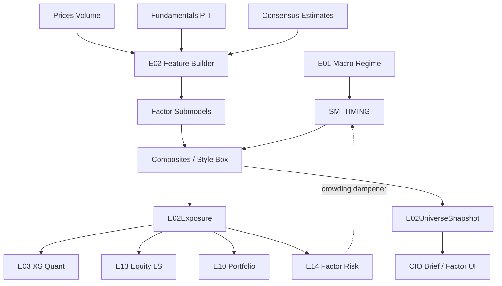

# E02 — Factor & Style Engine  
## Engineering Implementation Specification (AGI Investment Office)

**Owner:** CIO / Head of Quantitative Research  
**Pipeline position:** Runs after **E01** (regime prior). Feeds factor exposures and scores to **E03–E14**. Consumed by **E14** for factor-risk decomposition and by **E10** for style budgeting.  
**Nature:** Institutional factor research intelligence — **not** a stock screener, **not** a DCF/valuation model, **not** a BUY/SELL engine. Measures systematic factor exposures and premia for every security, sector, ETF, index, and research portfolio.  
**Version:** 1.0  
**Status:** Implementation-ready specification  
**Architectural peers:** `E01_MACRO_REGIME_ENGINE_SPEC.md`, `E14_RISK_CROWDING_OVERLAY_SPEC.md`

### Relationship to current AGIB stack (reuse)

| Existing asset | Path | E02 role |
|----------------|------|----------|
| NSE / Nifty research scores | `server/scripts/nifty500_research_engine.py`, `nifty500_stock_research` | Price/momentum **inputs only** (technical momentum feature), never a substitute for E02 factors |
| Market candles / indicators | Groww candles, `server/lib/indicators.js` | Price, volume, realised vol for MOM / LOWVOL / LIQ |
| Macro / E01 state | `macroContextService`, future `E01State` | Regime-aware factor timing priors |
| E14 Risk Overlay | future `E14State` / assessments | Consumes E02 loadings; E02 reads E14 crowding on factor sleeves |
| Fundamentals APIs | `FMP_API_KEY`, `ALPHAVANTAGE_API_KEY`, IndianAPI (planned) | Statement & estimate feeds |
| Intelligence routes | `server/routes/intelligence.js` | Add `/api/intelligence/e02/*` |
| Universe files | `NIFTYstocks.csv` / NSE equity list | Cross-section universe |

**Net-new:** point-in-time fundamental feature store, cross-sectional factor pipeline (winsorise → z → neutralize → score), Barra-style exposure vectors, composite / rotation / timing models, factor return attribution, Bloomberg-style factor dashboard, validation harness for premia persistence.

**Hard rules**
1. E02 never emits BUY / SELL / EXECUTE.  
2. Every score is **cross-sectional** (or clearly labeled time-series residual) with `as_of`, `universe_id`, `model_version`.  
3. Point-in-time fundamentals only — **no look-ahead** on filings or estimates.  
4. Downstream engines consume `E02Exposure` / `E02UniverseSnapshot`; they do not rebuild ad-hoc PE sorts.

---

# 1. Purpose

## 1.1 Investment questions answered

1. **Which systematic style premia** is a name, sector, ETF, index, or research book exposed to?  
2. **How strong is each factor** on a 0–100 institutional score, relative to the eligible universe?  
3. **What is the dominant style**, and how stable is it (style drift)?  
4. **Which factors are rewarded in the current regime** (E01-conditioned timing)?  
5. **How should multi-factor composites** be formed for research sleeves (value+quality, mom+quality, etc.)?  
6. **What factor attribution** explains recent relative performance of a book or index?  
7. **Where is factor crowding building** (joint with E14)?  
8. **What exposures should E03/E13/E10 residualise against** before claiming idiosyncratic alpha?

## 1.2 Why it exists

Institutional equity research without factor discipline confuses **beta-to-style** with skill. A “cheap” stock may be a value trap; a “strong chart” may be pure momentum; a “quality” narrative may be leverage-masked ROE.

E02 is the **single source of truth for style exposures and factor scores** across AGI Investment Office. It standardises language (Value, Quality, Momentum, …) so CIO briefs, risk (E14), and portfolio construction (E10) share one factor map.

## 1.3 What E02 is not

| Not this | Because |
|----------|---------|
| Stock screener UI logic | Screening is a thin consumer of E02 scores |
| Intrinsic valuation / DCF | Absolute fair value is E13 / fundamental desk, not style premia |
| Technical rating replacement | NSE research scores remain features; E02 owns systematic factors |
| Trade signal generator | No orders; scores feed other engines |
| Accounting restatement engine | Consumes cleaned statements; flags quality of data |

## 1.4 Hedge-fund / institutional analogues

| Firm / platform | How factors / style are used |
|-----------------|------------------------------|
| AQR | Academic factor premia, style timing, quality+value, momentum |
| BlackRock / Scientific Active | Factor + smart beta building blocks |
| MSCI Barra | Risk factors & exposure decomposition (E02 feeds E14 Barra-lite) |
| Goldman Sachs Quant | Factor research, baskets, style attribution |
| Research Affiliates | Value, fundamental weighting, RAFI philosophy |
| Robeco | Conservative / quality / momentum quant |
| Dimensional | Size, value, profitability (academic implementation) |
| Bridgewater | Style tilts conditional on macro regimes |
| Two Sigma / DE Shaw | Statistical & fundamental factor features in meta-models |

---

# 2. Investment Philosophy

## 2.1 Academic basis

E02 implements **compensated risk premia and behavioural / structural anomalies** that have been studied cross-sectionally for decades. Premia are **not guaranteed**; they are researched as conditional expected returns with documented decay, crowding, and regime dependence.

### Fama–French three-factor (1993)
\[
R_i - R_f = \alpha + \beta_{\mathrm{MKT}}(R_m-R_f) + \beta_{\mathrm{SMB}}\mathrm{SMB} + \beta_{\mathrm{HML}}\mathrm{HML} + \varepsilon
\]
- **SMB (Size):** small minus big.  
- **HML (Value):** high book-to-market minus low.  

**AGI use:** Size + Value core exposures; α after these factors is the starting residual for E13/E12 claims.

### Carhart four-factor (1997)
Adds **WML / UMD (Momentum):** winners minus losers.  
**AGI use:** Price momentum as first-class factor; residual momentum after market/sector.

### Fama–French five-factor (2015)
Adds **RMW (Profitability)** and **CMA (Investment):** robust minus weak profitability; conservative minus aggressive investment.  
**AGI use:** Profitability + Investment as explicit factors (Dimensional/AQR lineage).

### Quality investing
Composite of profitability, earnings stability, low accruals, low leverage, margins (Asness–Frazzini–Pedersen “Quality Minus Junk”, Novy-Marx gross profitability, etc.).  
**AGI use:** `F_QUALITY` composite; primary defensive long-term sleeve.

### Smart Beta
Rules-based factor portfolios (tilt indexes) that harvest premia with transparent construction.  
**AGI use:** E02 scores power smart-beta **research** baskets; E10 constructs weights; no auto-rebalance to market.

### Alternative Risk Premia (ARP)
Cross-asset / style premia beyond traditional equity long-only (equity QMJ, BAB/low-vol, carry, value across assets).  
**AGI use:** `F_CARRY`, `F_DEFENSIVE`, `F_LIQUIDITY` (premium for bearing illiquidity), and future multi-asset ARP under E07/E09 linkage.

## 2.2 Institutional applications inside AGI

| Application | How E02 is used |
|-------------|-----------------|
| Style map | Every name has exposure vector \(X_i\) |
| Residual alpha | E03/E12/E13 residualise vs \(X_i\) |
| Risk | E14 factor RC uses E02 loadings |
| Portfolio | E10 constraints / tilts on factor budgets |
| Regime timing | E01 × E02 Factor Timing Model |
| CIO narrative | Dominant factor + attribution waterfall |
| Publishing | Style box + factor strip on research notes |

## 2.3 Construction principles

1. **Cross-section first** — ranks within `universe_id` at `as_of`.  
2. **Point-in-time** — fundamentals lagged by filing availability rules (India: use last reported quarter with `report_date ≤ as_of`; estimates as-of snapshot).  
3. **Neutralise** — sector (and optionally size) neutralization before composite scoring.  
4. **Winsorise then z-score** — robust to outliers.  
5. **Multiple signals per factor** — avoid single-metric dogma (e.g. Value ≠ only P/B).  
6. **Explainability** — every composite ships top contributing metrics.  
7. **Regime humility** — timing model adjusts weights; never claims certainty.  
8. **India-primary, global-overlay** — NSE/BSE universe default; US factors optional second lens.

---

# 3. Factor Taxonomy

## 3.1 Hierarchy

```
E02 Factor Taxonomy
├── Core Equity Factors
│   ├── F_VALUE
│   ├── F_QUALITY
│   ├── F_MOMENTUM
│   ├── F_GROWTH
│   ├── F_SIZE
│   ├── F_LOWVOL
│   ├── F_DIVIDEND
│   ├── F_PROFITABILITY
│   ├── F_INVESTMENT
│   ├── F_LIQUIDITY
│   ├── F_RESID_MOM
│   └── F_IDIOVOL
├── Style / ARP Extensions
│   ├── F_CARRY
│   ├── F_DEFENSIVE
│   └── F_LEVERAGE (risk factor; lower is “better” for quality sleeves)
├── Custom AGI Factors
│   ├── F_AGI_EARNINGS_REV
│   ├── F_AGI_BALANCE_SHEET_STRESS
│   └── F_AGI_COMPOSITE_GARP
└── Meta Layers
    ├── Composite Factor Model (multi-factor scores)
    ├── Factor Rotation Model
    └── Factor Timing Model (E01-aware)
```

Each factor emits:
- `raw_metrics[]`
- `z_sector_neutral`
- `score_0_100` (higher = more of that style / premium long side unless noted)
- `loading` (standardized exposure for risk, typically z or capped z)
- `confidence`
- `as_of`, `universe_id`

**Sign convention:** Higher score = stronger characteristic on the **academic long leg** (cheap value, high quality, high momentum, small size, low vol, high profitability, conservative investment, high liquidity *score means more liquid*, etc.). For risk factors where “high” is bad (idio vol, leverage), scores are oriented so **higher score = more attractive research tilt** (i.e. low idio vol → high `F_IDIOVOL` attractiveness score) while `loading_raw` preserves the risk direction for E14.

---

## 3.2 Core factor dictionary

### Value (`F_VALUE`)
- **Definition:** Securities cheap vs fundamentals (book, earnings, cash flows, sales, EBITDA).  
- **Intuition:** Mean-reversion in valuations; compensation for distress / unpopularity.  
- **Alpha source:** Behavioural overreaction + risk (distress) premia.  
- **Holding period:** 6–24 months.  
- **Behaviour:** Works in recovery/early expansion; lags in liquidity-driven growth bubbles.  
- **Strengths:** Deep academic support; diversifies momentum.  
- **Weaknesses:** Value traps; slow; crowded episodes (2018–20).  
- **Examples:** High B/P India PSU cycles; global value 2000–07.

### Quality (`F_QUALITY`)
- **Definition:** Composite of profitability, stability, low accruals, prudent leverage, margin quality.  
- **Intuition:** High-quality firms compound; market underprices durability.  
- **Alpha source:** QMJ / profitability anomalies; investor preference for lottery tickets elsewhere.  
- **Holding period:** 12–36 months.  
- **Behaviour:** Outperforms in stress / late cycle; may lag speculative melt-ups.  
- **Strengths:** Drawdown control; pairs with value.  
- **Weaknesses:** Expensive quality; definition sensitivity.  
- **Examples:** Quality defensives in 2008 / 2020 recoveries.

### Momentum (`F_MOMENTUM`)
- **Definition:** Intermediate-term price continuation (typically 12-1 month), with skip-month.  
- **Intuition:** Underreaction / herding; trend in residuals.  
- **Alpha source:** Behavioural + risk (crash) premia.  
- **Holding period:** 1–6 months (rebalance monthly research).  
- **Behaviour:** Strong in trending regimes; crashes in sharp reversals.  
- **Strengths:** Robust across markets historically.  
- **Weaknesses:** Momentum crashes; high turnover; crowding (E14).  
- **Examples:** India mid-cap momentum cycles; 2009 momentum crash global.

### Growth (`F_GROWTH`)
- **Definition:** High expected/realized growth in sales, earnings, and reinvestment opportunity — **not** automatically “expensive.”  
- **Intuition:** Growth persistence; market underestimates duration of growth.  
- **Alpha source:** Mixed — often a **characteristic**, not a premium, unless residualised. Used as style map + GARP composite.  
- **Holding period:** 6–18 months.  
- **Behaviour:** Leads in liquidity expansion / risk-on; underperforms in tight financial conditions.  
- **Strengths:** Narrative alignment for E13; GARP construction.  
- **Weaknesses:** Growth ≠ alpha; valuation risk.  
- **Examples:** India IT/consumer growth regimes.

### Size (`F_SIZE`)
- **Definition:** Smaller market-cap / free-float vs universe (long small).  
- **Intuition:** SMB premium; illiquidity / distress components.  
- **Alpha source:** Historical size premium (time-varying; often weak after costs).  
- **Holding period:** 12+ months.  
- **Behaviour:** Outperforms in risk-on recoveries; hurts in crises.  
- **Strengths:** Diversifier; India mid/small cycles material.  
- **Weaknesses:** Liquidity & capacity; premium unstable after costs → E14 mandatory.  
- **Examples:** India small-cap bull 2023–24 (research context).

### Low Volatility (`F_LOWVOL`)
- **Definition:** Low beta / low realised vol (Betting-Against-Beta / low-vol anomaly).  
- **Intuition:** Leverage aversion → overpricing of high-beta.  
- **Alpha source:** BAB / low-vol anomaly.  
- **Holding period:** 6–24 months.  
- **Behaviour:** Defensive outperformance in risk-off; lags melt-ups.  
- **Strengths:** Risk-adjusted edge; pairs with E14/E10 vol targeting.  
- **Weaknesses:** Rate-sensitive; can be crowded in bond-proxy equities.  
- **Examples:** Low-vol factors in 2011 / 2018 stress.

### Dividend (`F_DIVIDEND`)
- **Definition:** Sustainable yield + dividend stability / growth.  
- **Intuition:** Income + quality of payout; caution on yield traps.  
- **Alpha source:** Mixed; often quality/value overlap.  
- **Holding period:** 12–36 months.  
- **Behaviour:** Works in sideways/disinflation; hurt by rate spikes & cuts that signal recession.  
- **Strengths:** Stable sleeve for CIO income narrative.  
- **Weaknesses:** Yield traps; sector concentration (financials/energy).  

### Profitability (`F_PROFITABILITY`)
- **Definition:** Gross profitability, ROE/ROIC robustness (Novy-Marx / FF RMW).  
- **Intuition:** Productive assets earn higher returns.  
- **Alpha source:** RMW premium.  
- **Holding period:** 12–36 months.  
- **Behaviour:** Persistent; overlaps quality.  
- **Strengths:** Clean academic definition.  
- **Weaknesses:** Accounting differences India vs US; banks need sector rules.

### Investment (`F_INVESTMENT`)
- **Definition:** Conservative asset growth / capex vs aggressive expansion (FF CMA; long conservative).  
- **Intuition:** Empire-building discount; overinvestment.  
- **Alpha source:** CMA premium.  
- **Holding period:** 12–36 months.  
- **Behaviour:** Works when capital discipline rewarded; fails in capex supercycles if poorly timed.  
- **Strengths:** Diversifies value.  
- **Weaknesses:** India infra/capex cycles can invert signal — regime-aware.

### Liquidity (`F_LIQUIDITY`)
- **Definition:** Trading liquidity (ADV, Amihud, turnover, free float). **Score high = more liquid.**  
- **Intuition:** Illiquidity premium exists but is capacity-constrained.  
- **Alpha source:** Illiquidity premium (long illiquid) vs investability (prefer liquid).  
- **Holding period:** Structural.  
- **Behaviour:** Illiquids outperform in calm risk-on; collapse in stress.  
- **Strengths:** Critical for E14/E10.  
- **Weaknesses:** Premium hard to harvest at scale — E02 exposes; E14 sizes.

### Carry (`F_CARRY`)
- **Definition:** Equity carry proxies: earnings/FCF yield, dividend carry, sector-relative carry.  
- **Intuition:** High carry compensates for risk if not a trap.  
- **Alpha source:** ARP carry family.  
- **Holding period:** 3–12 months.  
- **Behaviour:** Attractive in stable vol; fails in credit/growth shocks.  
- **Strengths:** Links to multi-asset ARP.  
- **Weaknesses:** Overlaps value/dividend; needs quality filter.

### Defensive (`F_DEFENSIVE`)
- **Definition:** Composite of low vol + quality + low beta + earnings stability.  
- **Intuition:** Downside-aware style bundle.  
- **Alpha source:** Combination of BAB + QMJ.  
- **Holding period:** 6–24 months.  
- **Behaviour:** Risk-off outperformer.  
- **Strengths:** CIO defensive sleeve.  
- **Weaknesses:** Opportunity cost in strong bull.

### Residual Momentum (`F_RESID_MOM`)
- **Definition:** Momentum of residual returns after market (and sector) regression.  
- **Intuition:** Pure idiosyncratic continuation.  
- **Alpha source:** Residual momentum literature (Blitz et al.).  
- **Holding period:** 1–6 months.  
- **Behaviour:** Less crash-prone than raw momentum historically in some samples.  
- **Strengths:** Better input to E03/E04.  
- **Weaknesses:** Estimation noise for short histories.

### Idiosyncratic Volatility (`F_IDIOVOL`)
- **Definition:** Volatility of residual returns; **attractiveness score high when idio vol low** (lottery-effect anomaly).  
- **Intuition:** High idio-vol names overpriced (Bali et al. / Ang et al. nuances).  
- **Alpha source:** IVOL anomaly (long low IVOL).  
- **Holding period:** 1–12 months.  
- **Behaviour:** Stronger when retail lottery demand high.  
- **Strengths:** Links to E14 specific risk.  
- **Weaknesses:** Debate in literature; costs matter.

### Alternative Risk Premia basket (`F_ARP_EQUITY`)
- **Definition:** Meta-label for equity ARP stack: Value, Momentum, Quality/QMJ, LowVol/BAB, Carry.  
- **Intuition:** Diversified style premia portfolio.  
- **Alpha source:** Multi-premia diversification.  
- **Holding period:** Dynamic.  
- **Behaviour:** Smoother than single factor.  
- **Strengths:** E10 building block.  
- **Weaknesses:** Still equity-centric in v1.

### Custom AGI — Earnings Revision (`F_AGI_EARNINGS_REV`)
- **Definition:** Direction & breadth of EPS/Sales estimate revisions.  
- **Intuition:** Analyst information diffusion (links E05 PEAD).  
- **Alpha source:** Revision drift.  
- **Holding period:** 1–3 months.  
- **Strengths / Weaknesses:** High turnover; estimate coverage uneven in India mid/small.

### Custom AGI — Balance Sheet Stress (`F_AGI_BALANCE_SHEET_STRESS`)
- **Definition:** Leverage, interest coverage, current ratio stress (higher attractiveness = lower stress).  
- **Intuition:** Avoid fragility; feed E14/E06.  
- **Holding period:** Structural until report update.

### Custom AGI — GARP Composite (`F_AGI_COMPOSITE_GARP`)
- **Definition:** Growth at Reasonable Price = Growth + (inverse expensive Value penalty) + Quality.  
- **Intuition:** Style box “blend” institutional sleeve.  
- **Holding period:** 6–18 months.

---

# 4. Sub Models

Package root: `intelligence-engine/app/engines/e02/submodels/`.

### Common interface

```python
class FactorSubModelResult(TypedDict):
    model_id: str                 # e.g. "SM_VALUE"
    factor_ids: list[str]         # e.g. ["F_VALUE"]
    score_0_100: float
    loading: float                # standardized exposure for risk
    z: float
    confidence: float             # [0, 1]
    metrics: dict[str, float]
    contributions: list[dict]     # metric → signed weight contribution
    as_of: str
    universe_id: str
    symbol: str | None            # None for universe-level aggregates
    stale: bool
    evidence: list[str]
```

---

### 4.1 Value Model (`SM_VALUE`)
| | |
|--|--|
| **Purpose** | Multi-metric cheapness score |
| **Inputs** | E/P, B/P, EBITDA/EV, FCF yield, S/P; sector maps |
| **Outputs** | `F_VALUE` score/loading |
| **Dependencies** | Fundamentals PIT; sector neutralisation |
| **Confidence** | High large-cap; medium if missing FCF |

**Metric weights (v1 default):** E/P 0.25, EBITDA/EV 0.25, FCF yield 0.20, B/P 0.15, S/P 0.15.  
Banks/insurance: use B/P + earnings yield sector variants; suppress EBITDA/EV.

---

### 4.2 Quality Model (`SM_QUALITY`)
| | |
|--|--|
| **Purpose** | QMJ-style quality composite |
| **Inputs** | ROE, ROIC, gross margin, operating margin, accruals, leverage, earnings variability |
| **Outputs** | `F_QUALITY`, feeds `F_DEFENSIVE` |
| **Dependencies** | Profitability, Balance Sheet Stress |
| **Confidence** | High when ≥4 metrics present |

**Weights (v1):** profitability block 0.40, margins 0.20, accruals (low) 0.15, leverage (low) 0.15, earnings stability 0.10.

---

### 4.3 Growth Model (`SM_GROWTH`)
| | |
|--|--|
| **Purpose** | Realized + expected growth style |
| **Inputs** | Sales growth YoY/3y CAGR, EPS growth, reinvestment, forward growth estimates |
| **Outputs** | `F_GROWTH`, feeds GARP |
| **Dependencies** | Estimates coverage |
| **Confidence** | Medium (estimate noise)

---

### 4.4 Momentum Model (`SM_MOMENTUM`)
| | |
|--|--|
| **Purpose** | Classic 12-1 price momentum + intermediate variants |
| **Inputs** | Daily prices, total return if available |
| **Outputs** | `F_MOMENTUM` |
| **Dependencies** | Liquidity filter (ADV floor) |
| **Confidence** | High with ≥252 sessions |

**Signals:** `ret_12_1` 0.60, `ret_6_1` 0.25, `ret_3_0` 0.15 (research). Skip last month in 12-1.

---

### 4.5 Profitability Model (`SM_PROFIT`)
| | |
|--|--|
| **Purpose** | RMW / Novy-Marx block |
| **Inputs** | Gross profits/assets, ROE, ROA, ROIC |
| **Outputs** | `F_PROFITABILITY` |
| **Dependencies** | Sector accounting rules |
| **Confidence** | High |

---

### 4.6 Low Volatility Model (`SM_LOWVOL`)
| | |
|--|--|
| **Purpose** | BAB / low-vol scores |
| **Inputs** | Trailing β, σ_60d/120d, downside σ, India VIX interaction optional |
| **Outputs** | `F_LOWVOL` |
| **Dependencies** | E01 vol regime for timing only |
| **Confidence** | High |

---

### 4.7 Liquidity Model (`SM_LIQ_FACTOR`)
| | |
|--|--|
| **Purpose** | Investability & liquidity characteristic |
| **Inputs** | ADV, Amihud, turnover, free float |
| **Outputs** | `F_LIQUIDITY` |
| **Dependencies** | Shared formulas with E14 liquidity (same features, different use) |
| **Confidence** | High |

---

### 4.8 Dividend Model (`SM_DIVIDEND`)
| | |
|--|--|
| **Purpose** | Sustainable yield style |
| **Inputs** | DY, payout, 5y dividend growth/stability, FCF coverage |
| **Outputs** | `F_DIVIDEND` |
| **Dependencies** | Quality filter recommended before CIO use |
| **Confidence** | Medium–High |

---

### 4.9 Residual Momentum Model (`SM_RESID_MOM`)
| | |
|--|--|
| **Purpose** | Momentum orthogonal to market/sector |
| **Inputs** | Residual returns from β regression vs Nifty (+ sector index) |
| **Outputs** | `F_RESID_MOM` |
| **Dependencies** | Momentum, market index history |
| **Confidence** | Medium |

---

### 4.10 Investment Model (`SM_INVESTMENT`)
| | |
|--|--|
| **Purpose** | CMA / asset growth discipline |
| **Inputs** | ΔTotal assets, ΔShares, capex/assets |
| **Outputs** | `F_INVESTMENT` (high = conservative) |
| **Dependencies** | PIT balance sheet |
| **Confidence** | Medium |

---

### 4.11 Composite Factor Model (`SM_COMPOSITE`)
| | |
|--|--|
| **Purpose** | Multi-factor research scores (equal-risk, inv-vol, or timed weights) |
| **Inputs** | All core factor scores |
| **Outputs** | `composite_score`, `F_ARP_EQUITY`, `F_AGI_COMPOSITE_GARP`, style box coords |
| **Dependencies** | Factor Timing Model for weights |
| **Confidence** | Mean of component confidences |

**Default ARP weights (untimed):** Value 0.20, Momentum 0.20, Quality 0.20, LowVol 0.15, Profitability 0.15, Size 0.10 (Size optional off for capacity books).

---

### 4.12 Factor Rotation Model (`SM_ROTATION`)
| | |
|--|--|
| **Purpose** | Detect leadership shifts among factors (cross-sectional factor momentum) |
| **Inputs** | Factor portfolio returns (long-short or long-only tilts) over 1m/3m/6m/12m |
| **Outputs** | `rotation_state`, `leader_factors[]`, `laggard_factors[]`, heatmap series |
| **Dependencies** | Daily factor return series job |
| **Confidence** | Medium |

**States:** `value_led`, `momentum_led`, `quality_defensive`, `growth_led`, `mixed`, `factor_crash`.

---

### 4.13 Factor Timing Model (`SM_TIMING`)
| | |
|--|--|
| **Purpose** | Regime-aware weights \(w_f(E01)\) for composites |
| **Inputs** | `E01State`, factor valuations (spread of z), factor momentum, crowding from E14 |
| **Outputs** | `timing_weights`, `timing_confidence`, `recommended_sleeve_tilts` |
| **Dependencies** | **E01 mandatory**; E14 crowding optional but recommended |
| **Confidence** | = 0.6·E01.confidence + 0.4·internal score stability |

**v1 rule layer (explicit, auditable):**

| E01 condition | Tilt up | Tilt down |
|---------------|---------|-----------|
| `risk_on` + `expansion` + `low/normal_vol` | Momentum, Growth, Size | LowVol, Dividend |
| `risk_off` / `high_vol` | Quality, LowVol, Defensive | Momentum, Size |
| `inflationary` | Value, Profitability (commodity-tilted sectors via sector map) | Long-duration Growth |
| `liq_contraction` | Quality, LowVol | Size, illiquid Value |
| `crisis` | Defensive / Quality only | Momentum, Size, ARP risk-on |

Bayesian layer (P1) updates weights with recent factor Sharpe posterior.

---

### 4.14 Earnings Revision Model (`SM_REV`)
| | |
|--|--|
| **Purpose** | `F_AGI_EARNINGS_REV` |
| **Inputs** | EPS/Sales FY1/FY2 revisions 1m/3m, surprise history |
| **Outputs** | Revision score |
| **Dependencies** | Consensus vendor |
| **Confidence** | Coverage-dependent |

---

### 4.15 Style Drift Monitor (`SM_DRIFT`)
| | |
|--|--|
| **Purpose** | Track exposure drift of names and books |
| **Inputs** | Historical loadings time series |
| **Outputs** | `style_drift_score`, `drift_vector`, alerts |
| **Dependencies** | Exposure history table |
| **Confidence** | High with ≥4 quarterly points |

---

# 5. Inputs

## 5.1 Market
Price (adj close), total return, volume, ADV, market cap, free float, beta, realised volatility, sector/industry classification, index membership, corporate actions flags.

## 5.2 Financial statements (PIT)
Income statement, balance sheet, cash flow — quarterly + TTM. Fields: revenue, EBITDA, EBIT, PAT, gross profit, operating profit, total assets, equity book, net debt, capex, CFO, FCF, shares, interest expense.

## 5.3 Estimates / consensus
EPS FY1/FY2, sales FY1/FY2, long-term growth, target price (optional), revision history, surprise history.

## 5.4 Dividends
DPS, ex-dates, trailing DY, payout, dividend cut flags.

## 5.5 Classification
Sector, industry, market-cap bucket (large/mid/small), investability tier.

## 5.6 Upstream engines
| Source | Use |
|--------|-----|
| **E01** | Timing priors, stress gates on factor sleeves |
| **E14** | Crowding/liquidity haircuts on factor scores for CIO use; factor RC |

## 5.7 Input registry

| input_id | Description | Unit |
|----------|-------------|------|
| `PX_ADJ_CLOSE` | Adjusted close | currency |
| `VOLUME` | Shares | count |
| `ADV_20D_VALUE` | ADV value | currency |
| `MKT_CAP` | Market cap | currency |
| `FREE_FLOAT` | Free float | % / currency |
| `BETA_60D` | β vs benchmark | β |
| `RV_60D` | Realised vol | ann. % |
| `BOOK_EQUITY` | Book value | currency |
| `REVENUE_TTM` | Revenue TTM | currency |
| `EBITDA_TTM` | EBITDA TTM | currency |
| `PAT_TTM` | PAT TTM | currency |
| `CFO_TTM` | CFO TTM | currency |
| `FCF_TTM` | FCF TTM | currency |
| `GROSS_PROFIT_TTM` | Gross profit | currency |
| `TOTAL_ASSETS` | Total assets | currency |
| `NET_DEBT` | Net debt | currency |
| `CAPEX_TTM` | Capex | currency |
| `ROE` | ROE | % |
| `ROIC` | ROIC | % |
| `EPS_FY1` | Consensus EPS | currency |
| `EPS_FY1_REV_1M` | Revision 1m | % |
| `SALES_GROWTH_YOY` | Sales growth | % |
| `EPS_GROWTH_YOY` | EPS growth | % |
| `DPS_TTM` | Dividends | currency |
| `SECTOR_ID` | Sector | enum |
| `INDUSTRY_ID` | Industry | enum |
| `E01_STATE` | Regime object | JSON |
| `E14_STATE` | Risk object | JSON |
| `UNIVERSE_ID` | e.g. `NSE_INVESTABLE_L1` | string |

## 5.8 APIs & refresh

| input family | Primary API | Refresh | Cost | Reliability | Fallback |
|--------------|-------------|---------|------|-------------|----------|
| NSE prices/volume | Groww candles (existing) | 1d | Existing token | Medium–High | NSE bhav / OHLC cache |
| US prices (overlay) | Finnhub / Twelve / AV | 1d | Tiered | High | FRED for indexes only |
| Fundamentals India | **FMP** / IndianAPI fundamentals | 1d check / event | Paid | Medium | Manual CMS PIT tables |
| Fundamentals US | FMP / AV | 1d | Paid | High | SEC-derived vendors |
| Estimates | Finnhub estimates / FMP analyst | 1d | Paid | Medium | Skip revision factor if absent |
| Dividends | FMP / exchange feed | 1d | Low–Med | Medium | Price-only factors remain |
| Sector map | Internal GICS-like table | Quarterly | Internal | High | NSE industry meta |
| E01 / E14 | Internal APIs | Intraday jobs | Internal | High | Degrade timing / haircuts |

**Env vars:** `FMP_API_KEY`, `ALPHAVANTAGE_API_KEY`, `FINNHUB_API_KEY`, `INDIANAPI_KEY`, `GROWW_ACCESS_TOKEN`, Supabase keys, plus E01/E14 service URLs.

---

# 6. Feature Engineering

Feature store: `e02_feature_snapshot` (PIT). Pipeline: raw → clean → winsorise → z → neutralize → factor score.

| feature_id | Definition | Factor link |
|------------|------------|-------------|
| `ep_ttm` | PAT_TTM / MKT_CAP | Value |
| `forward_pe_inv` | EPS_FY1 / Price | Value |
| `bp` | BOOK_EQUITY / MKT_CAP | Value |
| `ev_ebitda_inv` | EBITDA / EV | Value |
| `fcf_yield` | FCF_TTM / MKT_CAP | Value / Carry |
| `sp` | REVENUE_TTM / MKT_CAP | Value |
| `peg_inv` | (EPS growth) / PE — inverted carefully | GARP |
| `roe` | Net income / Equity | Profit / Quality |
| `roa` | Net income / Assets | Profit |
| `roic` | NOPAT / Invested capital | Profit / Quality |
| `roce` | EBIT / Capital employed | Profit |
| `gross_margin` | Gross profit / Sales | Quality |
| `oper_margin` | EBIT / Sales | Quality |
| `accruals` | (NI − CFO) / Assets (lower better) | Quality |
| `leverage` | Net debt / EBITDA (lower better) | Quality / Stress |
| `earn_stability` | −σ(EPS growth 5y) | Quality / Defensive |
| `sales_g_yoy` | YoY sales growth | Growth |
| `sales_cagr_3y` | 3y CAGR | Growth |
| `eps_g_yoy` | YoY EPS growth | Growth |
| `eps_rev_1m` | FY1 revision | AGI Rev |
| `eps_rev_3m` | FY1 revision 3m | AGI Rev |
| `ret_12_1` | \(P_{t-21}/P_{t-252}-1\) | Momentum |
| `ret_6_1` | 6-1 month return | Momentum |
| `ret_3_0` | 63d return | Momentum |
| `resid_ret_12_1` | Residual momentum | Resid Mom |
| `beta_60d` | β | LowVol (invert) |
| `rv_60d` | Realised vol | LowVol (invert) |
| `downside_vol_60d` | Downside σ | LowVol |
| `idio_vol_60d` | Residual σ | IdioVol |
| `amihud_60d` | Illiquidity | Liquidity (invert for score) |
| `adv_value_20d` | ADV | Liquidity |
| `turnover_20d` | Vol / float | Liquidity |
| `dy_ttm` | DPS / Price | Dividend |
| `div_stability` | Frequency of cuts (invert) | Dividend |
| `payout` | DPS / EPS | Dividend |
| `asset_growth` | ΔAssets YoY (invert for CMA) | Investment |
| `capex_assets` | Capex / Assets (invert) | Investment |
| `size_log_mcap` | log mcap (invert for SMB) | Size |
| `factor_persistence_12m` | Rank autocorrelation of factor score | Meta |
| `value_spread` | P90−P10 of value z in universe | Timing |
| `mom_spread` | P90−P10 momentum | Timing |

**Cleaning rules**
- Negative book / meaningless ratios → metric `NaN`, not zero.  
- Banks: replace EV/EBITDA with sector earnings yield + B/P.  
- Winsorise cross-sectionally at **2.5% / 97.5%** per sector bucket (fallback: universe).  
- Require minimum history: prices 252d for momentum; fundamentals ≥1 TTM for value/quality.

---

# 7. Mathematical Models

## 7.1 Cross-sectional pipeline (canonical)

For each `as_of`, `universe_id`, metric \(m\):

1. **Eligible mask** — listing, ADV ≥ floor, not suspended, data present.  
2. **Winsorise** within sector: \(m^w = \mathrm{clip}(m, Q_{0.025}, Q_{0.975})\).  
3. **Z-score** within sector:  
   \[
   z^{sec}_{i,m} = \frac{m^w_i - \mu_{s(i),m}}{\sigma_{s(i),m} + \varepsilon}
   \]
4. **Optional size neutralization** — regress \(z^{sec}\) on \(\log\mathrm{MCap}\); take residual.  
5. **Market neutralization** for long-short research portfolios: demean loadings within universe.  
6. **Factor z** — weighted sum of metric z’s:  
   \[
   z_{i,f} = \sum_m w_{f,m}\, z_{i,m},\quad \sum w=1
   \]
7. **Score map to 0–100** via cross-sectional percentile:  
   \[
   S_{i,f} = 100 \cdot \mathrm{rank}(z_{i,f}) / N
   \]
   (percentile rank; stable for CIO UX).  
8. **Loading for risk** — cap \(z_{i,f}\) at ±3 for E14:  
   \[
   X_{i,f} = \mathrm{clip}(z_{i,f}, -3, 3)
   \]

## 7.2 Sector & market neutralisation

**Sector-neutral score (default for composites):** compute ranks inside sector, then map; or demean z by sector (v1 uses sector z then universe percentile for display).

**Market-neutral portfolio construction (research):**  
\[
w_i^{+} \propto \max(z_i,0),\quad w_i^{-} \propto \max(-z_i,0),\quad
\sum w^{+}=0.5,\ \sum w^{-}=-0.5
\]
(dollar-neutral research book; not executed).

## 7.3 Factor-specific formulas

| Factor | Core formula | Norm | Typical z | High score threshold | Low score threshold | Robustness notes |
|--------|--------------|------|-----------|----------------------|---------------------|------------------|
| Value | \(0.25z_{EP}+0.25z_{EBITDA/EV}+0.20z_{FCFY}+0.15z_{BP}+0.15z_{SP}\) | sec-z | −3…3 | score≥70 | score≤30 | Exclude neg equity; bank variant |
| Quality | See §4.2 weights on z(ROE,ROIC,margins,−accruals,−lev,stability) | sec-z | −3…3 | ≥70 | ≤30 | Strong in stress OOS |
| Momentum | \(0.6z_{12-1}+0.25z_{6-1}+0.15z_{3-0}\) | uni-z* | −3…3 | ≥70 | ≤30 | *sector-neutral optional flag |
| Growth | \(0.4z_{salesg}+0.3z_{epsg}+0.3z_{fwdg}\) | sec-z | −3…3 | ≥70 | ≤30 | Characteristic |
| Size | \(z(-\log MCap)\) | uni-z | −3…3 | ≥70 small | ≤30 large | Apply liq filter |
| LowVol | \(0.5z(-\beta)+0.5z(-\sigma_{60})\) | sec-z | −3…3 | ≥70 | ≤30 | BAB linked |
| Dividend | \(0.5z_{DY}+0.3z_{divstab}+0.2z_{cover}\) | sec-z | −3…3 | ≥70 | ≤30 | Trap filter via quality |
| Profitability | \(0.4z_{GPA}+0.3z_{ROE}+0.3z_{ROIC}\) | sec-z | −3…3 | ≥70 | ≤30 | FF RMW |
| Investment | \(0.6z(-\Delta Assets)+0.4z(-\mathrm{capex/assets})\) | sec-z | −3…3 | ≥70 cons. | ≤30 | Regime-sensitive IN |
| Liquidity | \(0.4z_{ADV}+0.3z(-\mathrm{Amihud})+0.3z_{float}\) | uni-z | −3…3 | ≥70 liquid | ≤30 | E14 shared |
| Resid Mom | \(z(\prod(1+e_t)-1)\) 12-1 on residuals | uni-z | −3…3 | ≥70 | ≤30 | β vs Nifty |
| IdioVol attr. | \(z(-\sigma_{\varepsilon})\) | sec-z | −3…3 | ≥70 low IVOL | ≤30 | Lottery effect |
| Carry | \(0.5z_{FCFY}+0.3z_{EY}+0.2z_{DY}\) | sec-z | −3…3 | ≥70 | ≤30 | ARP |
| Defensive | \(0.4 S_{LOWVOL}+0.4 S_{QUALITY}+0.2 S_{IDIOVOL}\) | score | 0–100 | ≥70 | ≤30 | Composite |
| Earn Rev | \(0.6z_{rev1m}+0.4z_{rev3m}\) | sec-z | −3…3 | ≥70 | ≤30 | Coverage gaps |
| GARP | \(0.4 S_{GROWTH}+0.3 S_{QUALITY}+0.3 (100-S_{VALUE\_EXPENSIVE})\)** | score | 0–100 | ≥65 | ≤35 | **see note |

\*`S_VALUE_EXPENSIVE` = Value score inverted only for the expensive leg: use `100 - S_VALUE` so cheap+growth both can score (classic GARP uses reasonable — not deepest — value). GARP implementation:  
\[
S_{\mathrm{GARP}} = 0.4 S_G + 0.3 S_Q + 0.3\,\mathrm{triangle}(S_V)
\]
where \(\mathrm{triangle}\) peaks at Value score 45–65 (reasonable), penalises <30 traps and >80 deep value without growth.

## 7.4 Composite ARP score

\[
S_{\mathrm{ARP}} = \sum_f \tilde{w}_f S_{i,f},\quad
\tilde{w}_f = \frac{w_f^{\mathrm{timing}}}{\sum w^{\mathrm{timing}}}
\]
\(w^{timing}\) from `SM_TIMING`. Untimed defaults in §4.11.

## 7.5 Dominant factor & style box

**Dominant factor:** \(\arg\max_f S_{i,f}\) among `{Value, Growth, Momentum, Quality, LowVol, Size}` (display set).  

**Style box (2×3 research):**  
- x-axis: Value ↔ Growth via \(S_G - S_V\)  
- y-axis: Size via \(S_{\mathrm{SIZE}}\)  
Map to Morningstar-like cells for UI (Large-Value … Small-Growth).

## 7.6 Factor portfolio returns (for rotation / validation)

Daily:  
\[
R_{f,t} = \sum_i w_{i,f,t-1}\, r_{i,t}
\]
with monthly reconstitution, 20% winsorised weights, transaction cost haircut model for OOS (10–20 bps one-way India large-cap default research).

## 7.7 Confidence contribution

\[
c_i = c_{\mathrm{coverage}}\cdot c_{\mathrm{history}}\cdot c_{\mathrm{freshness}}\cdot c_{\mathrm{vendor}}
\]
- coverage = fraction of required metrics present  
- history = 1 if price history OK else 0.6  
- freshness = 1 if fundamentals age ≤ 120d else decay to 0.5 at 365d  
- vendor = 1.0 primary / 0.8 fallback  

Confidence contributes to downstream: \(\mathrm{conf}^{eff} = \mathrm{conf}^{engine}\cdot c_i\) when E02 is cited.

## 7.8 Expected behaviour summary

| Environment (E01) | Factors expected to lead |
|-------------------|--------------------------|
| Expansion + risk_on | Momentum, Growth, Size |
| Slowdown | Quality, LowVol, Profitability |
| Recession / crisis | Defensive, Quality, LowVol |
| Inflationary | Value, Profitability (real assets sectors) |
| Liquidity expansion | Growth, Momentum, Size |
| Liquidity contraction | Quality, LowVol, liquid Value |

---

# 8. Machine Learning

| Technique | Use | Library | Notes |
|-----------|-----|---------|-------|
| Elastic net / LightGBM | Predict next-month factor returns from E01 + spreads + crowding | `sklearn` / `lightgbm` | Timing assist; rule layer remains primary in v1 |
| Bayesian shrinkage | Shrink metric weights toward academic priors | custom | Stability |
| Dynamic factor weighting | Inverse-vol / risk-parity across factor sleeves | numpy | E10-aligned |
| Feature selection | Drop unstable metrics (low IC) | IC / IR screens | Quarterly |
| SHAP | Explain composite & timing | `shap` | CIO mandatory |
| HMM on factor returns | Rotation regimes | `hmmlearn` | Align with E01 philosophy |
| PCA | Statistical style factors fallback | `sklearn` | If fundamentals missing |

**Regime-aware selection:** timing model may set \(w_f=0\) for Size/Momentum in `hard_derisk` (E14) even if E01 not yet crisis — fail-safe.

**Explainability requirements**
- Each symbol exposure ships `top_metrics[3]` per factor and `top_factors[3]` overall.  
- LLM may narrate style; **cannot** invent factor scores.  
- Weekly job writes `e02_feature_importance`.

---

# 9. Outputs

## 9.1 Symbol exposure contract `E02Exposure`

```json
{
  "engine": "E02",
  "version": "1.0.0",
  "as_of": "2026-07-25",
  "universe_id": "NSE_INVESTABLE_L1",
  "symbol": "TCS",
  "sector_id": "IT",
  "scores": {
    "F_VALUE": 42.0,
    "F_QUALITY": 78.0,
    "F_MOMENTUM": 65.0,
    "F_GROWTH": 70.0,
    "F_SIZE": 18.0,
    "F_LOWVOL": 72.0,
    "F_DIVIDEND": 55.0,
    "F_PROFITABILITY": 80.0,
    "F_INVESTMENT": 60.0,
    "F_LIQUIDITY": 88.0,
    "F_CARRY": 48.0,
    "F_DEFENSIVE": 74.0,
    "F_RESID_MOM": 61.0,
    "F_IDIOVOL": 70.0,
    "F_AGI_EARNINGS_REV": 58.0,
    "F_AGI_BALANCE_SHEET_STRESS": 82.0,
    "F_AGI_COMPOSITE_GARP": 69.0,
    "F_ARP_EQUITY": 66.0
  },
  "loadings": {
    "F_VALUE": -0.40,
    "F_QUALITY": 1.25,
    "F_MOMENTUM": 0.55,
    "F_GROWTH": 0.90,
    "F_SIZE": -1.40,
    "F_LOWVOL": 0.85,
    "F_PROFITABILITY": 1.30,
    "F_INVESTMENT": 0.20,
    "F_LIQUIDITY": 1.60,
    "F_RESID_MOM": 0.45,
    "F_IDIOVOL": 0.70
  },
  "composite_score": 66.0,
  "dominant_factor": "F_QUALITY",
  "style_box": {"size": "large", "style": "growth_blend"},
  "factor_confidence": 0.81,
  "factor_attribution": {
    "horizon": "63d",
    "contributions": [
      {"factor": "F_MOMENTUM", "contrib_pct": 1.2},
      {"factor": "F_QUALITY", "contrib_pct": 0.4},
      {"factor": "residual", "contrib_pct": -0.3}
    ]
  },
  "expected_style_drift": {
    "drift_score": 22.0,
    "comment": "Stable quality/growth profile over 4 quarters"
  },
  "timing_context": {
    "e01_primary_regime": "expansion_risk_on",
    "timing_weight_hint": {"F_MOMENTUM": 1.1, "F_QUALITY": 0.95}
  },
  "top_metrics": [
    {"metric": "roic", "z": 1.8},
    {"metric": "gross_margin", "z": 1.5}
  ],
  "stale_inputs": [],
  "model_version": "e02-1.0.0",
  "hash": "sha256:..."
}
```

## 9.2 Universe snapshot `E02UniverseSnapshot`

```json
{
  "engine": "E02",
  "as_of": "2026-07-25",
  "universe_id": "NSE_INVESTABLE_L1",
  "n_symbols": 820,
  "factor_medians": {},
  "rotation": {
    "state": "momentum_led",
    "leaders": ["F_MOMENTUM", "F_GROWTH"],
    "laggards": ["F_VALUE", "F_DIVIDEND"],
    "confidence": 0.64
  },
  "timing_weights": {
    "F_VALUE": 0.16,
    "F_MOMENTUM": 0.24,
    "F_QUALITY": 0.18,
    "F_LOWVOL": 0.12,
    "F_PROFITABILITY": 0.15,
    "F_SIZE": 0.15
  },
  "value_spread": 2.1,
  "mom_spread": 1.7,
  "model_version": "e02-1.0.0",
  "e01_ref": {"hash": "sha256:...", "primary_regime": "expansion_risk_on"},
  "hash": "sha256:..."
}
```

## 9.3 Portfolio factor report `E02PortfolioFactors`

```json
{
  "book_id": "research_core",
  "as_of": "2026-07-25",
  "active_exposures": {"F_MOMENTUM": 0.45, "F_VALUE": -0.20, "F_QUALITY": 0.30},
  "composite_score": 61.0,
  "dominant_factor": "F_MOMENTUM",
  "attribution_1m": [],
  "style_drift": {"drift_score": 35.0},
  "constraints_vs_policy": [{"factor": "F_MOMENTUM", "status": "within", "limit": 0.80}]
}
```

## 9.4 Compatibility

| Consumer need | E02 field |
|---------------|-----------|
| E14 `E02_LOADINGS` | `loadings` |
| E03 residualisation | `loadings` + scores |
| UI style box | `style_box` |
| CIO one-liner | `dominant_factor` + `composite_score` |
| NSE research page | Optional panel; do **not** replace `agi_research_score` |

---

# 10. Downstream Consumers

| Engine | How E02 influences it |
|--------|------------------------|
| **E03 XS Quant** | Momentum/reversal signals **orthogonalise** vs `F_MOMENTUM` / `F_RESID_MOM` / size; multi-factor equity sleeve consumes `S_ARP` ranks; sector rotation uses sector-aggregate factor scores. |
| **E04 Stat-Arb** | Pair selection prefers residual spreads after hedging `X_i` factor loadings; reject pairs with unstable style drift. |
| **E05 Event** | PEAD / revision overlays combine with `F_AGI_EARNINGS_REV`; post-event style drift monitored. |
| **E08 Vol/Options** | LowVol / Defensive scores inform dispersion single-stock vs index research; high idio-vol names flagged for options narrative. |
| **E09 CTA/Trend** | Equity trend sleeves demean by momentum factor to separate CTA trend from XS momentum; timing weights shared when E01 risk-on. |
| **E10 Portfolio** | Factor budgets & constraints (`active_exposures` caps); smart-beta research portfolios from scores; Black–Litterman views can be factor-level. |
| **E11 Sentiment** | Sentiment extremes vs Quality/Momentum misalignment → caution flags; ESG future factors land here first. |
| **E12 ML Alpha Lab** | Labels/features include E02 loadings; promotion requires residual α after E02 + E14 gate. |
| **E13 Equity L/S** | Fundamental theses must declare style; books residualised to target factor profile; GARP/quality-value hybrids use composites. |
| **E14 Risk** | **Primary consumer of `loadings`** for factor risk RC, concentration, and stress; crowding on factor sleeves uses distribution of scores. |

**E01 interaction:** E02 does not overwrite regimes; `SM_TIMING` reads E01.  
**Weight contract:** When E01 and E14 publish `weight_adjustments` for factor sleeves, E10 applies them on top of E02 timing weights:

\[
w_f^{\mathrm{final}} \propto w_f^{E02\_timing}\cdot w_f^{E01}\cdot w_f^{E14}
\]

---

# 11. Database Design

## 11.1 Reuse
- Price/candle caches from research engine runs  
- `nifty500_stock_research` for technical momentum feature join (not as factor output)  
- Future `e01_*`, `e14_*` for priors / haircuts  

## 11.2 New tables

```sql
-- Point-in-time fundamentals (vendor normalised)
CREATE TABLE e02_fundamentals_pit (
  symbol text NOT NULL,
  as_of date NOT NULL,
  report_date date,
  period text,                      -- Q1/Q2/Q3/Q4/TTM/FY
  metrics jsonb NOT NULL,           -- raw accounting fields
  vendor text NOT NULL,
  quality_flag text DEFAULT 'ok',
  PRIMARY KEY (symbol, as_of, period, vendor)
);
CREATE INDEX e02_fund_symbol_idx ON e02_fundamentals_pit (symbol, as_of DESC);

-- Engineered features
CREATE TABLE e02_feature_snapshot (
  as_of date NOT NULL,
  universe_id text NOT NULL,
  symbol text NOT NULL,
  feature_id text NOT NULL,
  value double precision,
  winsor_value double precision,
  z_sector double precision,
  z_universe double precision,
  meta jsonb DEFAULT '{}',
  PRIMARY KEY (as_of, universe_id, symbol, feature_id)
);
CREATE INDEX e02_feat_symbol_idx ON e02_feature_snapshot (symbol, as_of DESC);
CREATE INDEX e02_feat_feature_idx ON e02_feature_snapshot (feature_id, as_of DESC);

-- Per-symbol factor scores & loadings
CREATE TABLE e02_factor_scores (
  as_of date NOT NULL,
  universe_id text NOT NULL,
  symbol text NOT NULL,
  scores jsonb NOT NULL,
  loadings jsonb NOT NULL,
  composite_score double precision NOT NULL,
  dominant_factor text NOT NULL,
  style_box jsonb NOT NULL,
  factor_confidence double precision NOT NULL,
  top_metrics jsonb NOT NULL DEFAULT '[]',
  model_version text NOT NULL,
  input_hash text NOT NULL,
  PRIMARY KEY (as_of, universe_id, symbol)
);
CREATE INDEX e02_scores_composite_idx ON e02_factor_scores (as_of, universe_id, composite_score DESC);
CREATE INDEX e02_scores_dominant_idx ON e02_factor_scores (as_of, dominant_factor);

CREATE TABLE e02_factor_scores_current (
  universe_id text NOT NULL,
  symbol text NOT NULL,
  as_of date NOT NULL,
  payload jsonb NOT NULL,
  updated_at timestamptz NOT NULL DEFAULT now(),
  PRIMARY KEY (universe_id, symbol)
);

-- Universe-level rotation / timing
CREATE TABLE e02_universe_state (
  as_of date NOT NULL,
  universe_id text NOT NULL,
  rotation jsonb NOT NULL,
  timing_weights jsonb NOT NULL,
  spreads jsonb NOT NULL DEFAULT '{}',
  e01_ref jsonb NOT NULL DEFAULT '{}',
  model_version text NOT NULL,
  input_hash text NOT NULL,
  PRIMARY KEY (as_of, universe_id)
);

CREATE TABLE e02_universe_state_current (
  universe_id text PRIMARY KEY,
  as_of date NOT NULL,
  state jsonb NOT NULL,
  updated_at timestamptz NOT NULL DEFAULT now()
);

-- Factor portfolio returns (long-short research)
CREATE TABLE e02_factor_returns (
  date date NOT NULL,
  universe_id text NOT NULL,
  factor_id text NOT NULL,
  ret double precision NOT NULL,
  ret_net_cost double precision,
  n_long int,
  n_short int,
  PRIMARY KEY (date, universe_id, factor_id)
);

-- Attribution
CREATE TABLE e02_attribution (
  as_of date NOT NULL,
  scope text NOT NULL,              -- symbol|book|index
  scope_id text NOT NULL,
  horizon text NOT NULL,            -- 21d|63d|126d
  contributions jsonb NOT NULL,
  model_version text NOT NULL,
  PRIMARY KEY (as_of, scope, scope_id, horizon)
);

CREATE TABLE e02_model_weights (
  version text PRIMARY KEY,
  weights jsonb NOT NULL,
  notes text,
  created_at timestamptz DEFAULT now(),
  is_active boolean DEFAULT false
);

CREATE TABLE e02_feature_importance (
  as_of date NOT NULL,
  factor_id text NOT NULL,
  feature_id text NOT NULL,
  importance double precision NOT NULL,
  method text NOT NULL,
  PRIMARY KEY (as_of, factor_id, feature_id, method)
);

CREATE TABLE e02_validation_runs (
  id uuid PRIMARY KEY DEFAULT gen_random_uuid(),
  started_at timestamptz,
  finished_at timestamptz,
  method text,
  metrics jsonb,
  model_version text
);

CREATE TABLE e02_universe_def (
  universe_id text PRIMARY KEY,
  name text NOT NULL,
  rule jsonb NOT NULL,              -- adv floors, exchanges, exclusions
  benchmark_symbol text,
  active boolean DEFAULT true
);
```

**RLS:** authenticated research read on `*_current` and published aggregates; service role write; anon read only for deliberately published factor heatmaps (optional flag).

## 11.3 Caching

| Layer | Policy |
|-------|--------|
| Fundamentals PIT | Append-only; TTL refresh job 24h |
| Features / scores | Rebuild daily; intraday only if corporate action |
| `e02_factor_scores_current` | Overwrite daily; API max-age 300s |
| Redis | `e02:exp:{universe}:{symbol}` 300s; `e02:universe:{id}` 300s |
| Factor returns | Daily EOD append |

---

# 12. Backend Services

## 12.1 Package layout

```
intelligence-engine/app/engines/e02/
  __init__.py
  config.py
  pipeline.py
  schema.py
  universe.py
  fundamentals/
    pit.py
    vendors_fmp.py
    vendors_indianapi.py
    sector_rules.py
  features/
    registry.py
    transforms.py
    builder.py
    neutralize.py
  submodels/
    value.py
    quality.py
    growth.py
    momentum.py
    profitability.py
    lowvol.py
    liquidity.py
    dividend.py
    investment.py
    residual_momentum.py
    idiovol.py
    carry_defensive.py
    revisions.py
    composite.py
    rotation.py
    timing.py
    drift.py
  models/
    scoring.py
    attribution.py
    factor_portfolios.py
  adapters/
    e01.py
    e14.py
    prices_agib.py
  persistence.py
  explain.py
```

Node gateway: `server/services/e02FactorService.js` + routes on `intelligence.js`.

## 12.2 Pipeline (`pipeline.run_e02`)

1. Resolve `universe_id` membership + investability masks  
2. Pull prices & fundamentals PIT (mark stale)  
3. Build features → winsorise → z → neutralize  
4. Run factor submodels (vectorised; parallel by factor OK)  
5. Composites + style box + dominant factor  
6. Load E01 → timing weights; optional E14 crowding dampener  
7. Rotation from factor return history  
8. Attribution for benchmark & research books  
9. Persist scores, universe state, current pointers  
10. Emit metrics (coverage %, median confidence, latency)

## 12.3 Jobs / cron (IST)

| Job | Schedule | Action |
|-----|----------|--------|
| `e02_daily_scores` | 17:15 IST weekdays | Full universe score rebuild after EOD prices |
| `e02_fundamentals_refresh` | 06:30 & 13:30 IST | Vendor pull / PIT update |
| `e02_factor_returns` | 17:45 IST | Append factor portfolio returns |
| `e02_timing_refresh` | After E01 close job | Update timing weights |
| `e02_weekly_rotation` | Sunday 17:00 IST | Rotation state + heatmap seal |
| `e02_monthly_validate` | 1st 21:00 IST | Validation harness |
| `e02_quarterly_weights` | Calendar quarter | Review metric weights / IC |

**Ordering:** E01 close → E02 timing → E14 factor RC refresh (E14 job depends on E02 loadings).

## 12.4 SLOs

| SLO | Target |
|-----|--------|
| Daily score job p95 | < 15 min for ≤3000 names |
| Single-symbol API warm | < 300ms |
| Fundamental coverage (Nifty 500) | ≥ 85% names with Value+Quality computable |
| Point-in-time audit | 100% scores store `input_hash` |
| Stale fundamentals > 180d | confidence penalty applied |

---

# 13. API Contracts

### 13.1 `GET /api/intelligence/e02/exposure/{symbol}?universe_id=`
Returns `E02Exposure` current.

### 13.2 `GET /api/intelligence/e02/universe?universe_id=`
Returns `E02UniverseSnapshot`.

### 13.3 `GET /api/intelligence/e02/scores?universe_id=&factor=F_VALUE&limit=100`
Top/bottom lists for a factor.

### 13.4 `GET /api/intelligence/e02/heatmap?universe_id=&by=sector`
Sector × factor median scores matrix.

### 13.5 `POST /api/intelligence/e02/portfolio`
```json
{
  "book_id": "research_core",
  "as_of": "2026-07-25",
  "holdings": [{"symbol": "TCS", "weight": 0.05}, {"symbol": "RELIANCE", "weight": 0.04}]
}
```
Response: `E02PortfolioFactors`.

### 13.6 `GET /api/intelligence/e02/attribution?scope=book&scope_id=&horizon=63d`

### 13.7 `GET /api/intelligence/e02/rotation?universe_id=&lookback=252`

### 13.8 `GET /api/intelligence/e02/timing`

### 13.9 `POST /api/intelligence/e02/run`
Service-role full rebuild: `{ "universe_id": "NSE_INVESTABLE_L1", "reason": "cron|manual" }`.

### 13.10 `GET /api/intelligence/e02/taxonomy`
Static factor dictionary for UI.

### 13.11 Error codes
`E02_UNIVERSE`, `E02_SYMBOL_NOT_IN_UNIVERSE`, `E02_DATA_STALE`, `E02_E01_MISSING`, `E02_INTERNAL`.

### 13.12 Versioning
Pydantic schemas; `model_version` on all persisted rows; dual-read one release on breaking changes.

---

# 14. Frontend (Bloomberg-style)

Route: `/beta/e02-factors` (+ panels on stock research, portfolio, CIO brief).

**Visual language:** AGI navy `#0A1E38`, value blue `#1D4ED8`, growth teal `#0F766E`, quality slate `#334155`, momentum amber `#B54708`, defensive green `#0F7A4A`. Heatmaps over cards; no retail screener chrome as hero.

## 14.1 Widgets

1. **Factor Hero** — universe as-of, rotation state, timing weight chips, E01 regime badge  
2. **Factor Heatmap** — factors × sector median scores  
3. **Style Box** — bubble chart (size×style) for selected book or index  
4. **Sector Factor Heatmap** — drillable  
5. **Factor Rotation Timeline** — 5y ribbon of leader factors  
6. **Factor Score Profile** — radar / bar for a symbol (0–100)  
7. **Factor Attribution Waterfall** — book/index horizon toggle  
8. **Portfolio Exposure** — active loadings vs policy caps  
9. **Value/Momentum Spread Monitor** — timing inputs  
10. **Top/Bottom Tables** — per factor with liquidity badges  
11. **Drift Alerts** — names/books with high `style_drift`  
12. **Data Coverage** — % metrics present by sector  

## 14.2 Stock research integration
On NSE research pages: compact **Style strip** — Dominant factor · Quality · Value · Momentum · Composite — linking to full E02 profile. Does not replace technical `agi_research_score`.

## 14.3 API bindings
```ts
getE02Exposure(symbol: string, universeId?: string): Promise<E02Exposure>
getE02Universe(universeId: string): Promise<E02UniverseSnapshot>
getE02Heatmap(universeId: string): Promise<HeatmapMatrix>
postE02Portfolio(req: PortfolioFactorRequest): Promise<E02PortfolioFactors>
getE02Rotation(universeId: string): Promise<RotationView>
```

---

# 15. Validation

## 15.1 Historical factor persistence
- Build monthly long-short (or long-only top-bottom quintile) portfolios per factor ≥10y global / max India history.  
- Report mean return, vol, Sharpe, max DD, t-stat, turnover.  
- Persistence: rank IC (Spearman of score vs forward 1m/3m residual return).

## 15.2 Walk-forward
- Expanding universe; annual re-estimation of metric weights under IC maximisation with shrinkage to v1 priors.  
- Embargo 1 month; costs applied.

## 15.3 Cross-validation
- Purged time-series CV for timing model (Lopez de Prado).  
- Sector-blocked CV for metric stability.

## 15.4 Out-of-sample
- Hold out last 24 months from weight fitting; report degradation.  
- India vs US overlay consistency checks (sign of premia).

## 15.5 Factor decay analysis
- Horizon IC curves: 1w, 1m, 3m, 6m, 12m.  
- Flag factors with half-life < 1m for higher rebalance / E14 crowding watch.

## 15.6 Sector neutrality tests
- Assert sector-neutral value/momentum portfolios have sector exposure ≈ 0 within tolerance.  
- ANOVA: factor scores should retain cross-sectional variance after neutralization.

## 15.7 Targets (research-grade)

| Metric | Target |
|--------|--------|
| Value / Quality / Momentum monthly IC (India investable) | Document; |IC| mean > 0 preferred after costs for composite |
| Composite ARP Sharpe net of research cost model | Track vs benchmark; review quarterly |
| Coverage Nifty 500 Value+Quality | ≥ 0.85 |
| Neutralisation: mean sector exposure | \|bias\| < 0.05 |
| Timing model: crisis defensive tilt recall | ≥ 0.75 of E01 crisis weeks |
| No look-ahead failures in PIT audits | 0 in CI fixtures |

Store in `e02_validation_runs`.

---

# 16. Future Enhancements

| Enhancement | Description | Priority |
|-------------|-------------|----------|
| Alt-data factors | Credit card, app traffic, web exhaust | P2 |
| Satellite factors | Night lights, plant activity → growth nowcast | P3 |
| Supply-chain factors | Customer/supplier graph centrality | P2 |
| Patent / innovation factors | Filing intensity, citation graphs | P3 |
| ESG factors | E/S/G scores as style (Robeco-like) | P2 |
| LLM-derived factors | NLP on filings → “moat/governance” scores (human-gated) | P2 |
| Custom AGI alpha factors | E12-promoted factors graduating into taxonomy | P1 process |
| Full commercial Barra link | Licensed factor cov for E14 | P2 |
| Multi-asset ARP | Rates/FX/commodity value-carry-mom with E07/E09 | P3 |
| Intraday estimate revisions | Faster `F_AGI_EARNINGS_REV` | P2 |

---

# 17. Implementation phases (engineering)

| Phase | Scope | Exit criteria |
|-------|-------|---------------|
| **P0** | Price factors (Momentum, LowVol, Size, Liquidity) + stub fundamentals Value/Quality from FMP for Nifty 500; scores API; style strip on research UI | Live `E02Exposure` for Nifty 500 |
| **P1** | Full core taxonomy; sector neutralization; composites; universe heatmap; E14 loadings feed | E14 reads E02 loadings |
| **P2** | Timing (E01), rotation, attribution, residual momentum, validation harness | CIO factor dashboard |
| **P3** | Estimates revisions, ARP refinements, ML timing assist, ESG/alt-data pilots | Coverage + IC monitoring automated |

---

# 18. Non-functional requirements

- Deterministic given inputs + `model_version` + universe definition  
- Full audit: `input_hash`, vendor, report_date, timestamps  
- No look-ahead: CI tests with shifted filings  
- Secrets only in server/engine env  
- India-primary accounting sector rules documented in `sector_rules.py`  
- Research-only language in UI  
- Capacity awareness: Size/Liquidity factors always carry E14 warning metadata  

---

# 19. Acceptance tests (sample)

1. Fixture universe of 50 names → all receive `scores` 0–100 and `loadings` for core factors; no NaN in Momentum if 252d prices present.  
2. Two names identical except B/P → higher B/P gets higher `F_VALUE` after neutralization within sector.  
3. Sector neutralization: mean `X_VALUE` within each sector ≈ 0 (±0.05) on large fixture.  
4. E01 fixture `crisis` → timing weights raise Quality/LowVol vs Momentum.  
5. `POST /e02/portfolio` returns active exposures linear in holdings (additive check).  
6. PIT test: metric using future report_date must not appear in `as_of` before report_date.  
7. Warm `GET /e02/exposure/TCS` < 300ms schema-valid.  
8. E14 adapter receives capped loadings \|X\| ≤ 3.

---

# 20. Dependency graph (runtime)



---

# 21. Mapping to institutional strategy architecture

| Architecture L3 examples | E02 factor IDs |
|--------------------------|----------------|
| Value Investing / Deep Value | `F_VALUE` |
| Quality / GARP | `F_QUALITY`, `F_AGI_COMPOSITE_GARP` |
| Factor Investing / Smart Beta | `F_ARP_EQUITY` + composites |
| Momentum (style) | `F_MOMENTUM`, `F_RESID_MOM` |
| Low Volatility / Defensive | `F_LOWVOL`, `F_DEFENSIVE` |
| Profitability / Investment | `F_PROFITABILITY`, `F_INVESTMENT` |
| Alternative Risk Premia (equity) | `F_ARP_EQUITY`, `F_CARRY` |

E02 owns **measurement & scoring**; E10 owns **portfolio maths**; E14 owns **risk of those exposures**; E13 owns **idiosyncratic fundamental narrative**.

---

*End of E02 Factor & Style Engine Specification v1.0*
