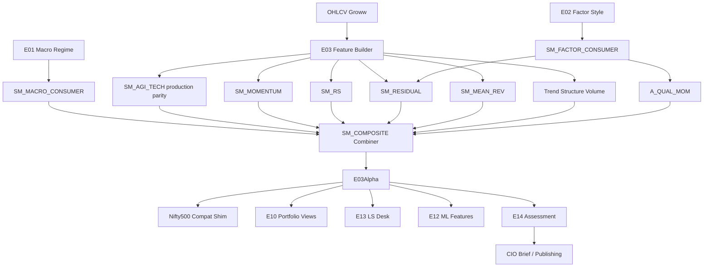

# E03 — Cross-Sectional Quant Engine  
## Engineering Implementation Specification (AGI Investment Office)

**Owner:** CIO / Head of Quantitative Research  
**Pipeline position:** Primary **alpha-generation** engine. Runs after **E01** (regime priors) and **E02** (factor exposures). Produces relative expected-performance scores for every eligible name. Outputs are consumed by **E04, E05, E08–E14**, CIO brief, and publishing. **E14** is mandatory before CIO/client promotion.  
**Nature:** Cross-sectional quantitative research intelligence — estimates **relative** expected performance within a universe. **Never** performs portfolio optimisation (E10), macro analysis (E01), or risk management (E14). **Never** emits BUY / SELL / EXECUTE.  
**Version:** 1.0  
**Status:** Implementation-ready specification  
**Architectural peers:** `E01_MACRO_REGIME_ENGINE_SPEC.md`, `E02_FACTOR_STYLE_ENGINE_SPEC.md`, `E14_RISK_CROWDING_OVERLAY_SPEC.md`

### Relationship to current AGIB stack (reuse & migration)

| Existing asset | Path | E03 role |
|----------------|------|----------|
| **Production AGI technical score** | `server/scripts/nifty500_research_engine.py` → `score_research()`, `category()`, `confidence()` | Becomes submodel **`SM_AGI_TECH`** (preserved; see §16) |
| Indicator calc (Python research) | `calculate_indicators()` in same script | Feature builder v1 for `SM_AGI_TECH` |
| JS indicators | `server/lib/indicators.js` | Shared pure-math library; port parity tests |
| Index / market technicals | `server/services/marketIntelligenceEngine.js` | Breadth/index consumers; not per-name alpha |
| Research tables | `nifty500_research_runs`, `nifty500_stock_research` | Compatibility write path during migration |
| Universe | `NIFTYstocks.csv` / NSE investable lists | Cross-section universe |
| E01 / E02 / E14 | future state APIs | Weight priors, residualisation, gates |
| Intelligence routes | `server/routes/intelligence.js` | Add `/api/intelligence/e03/*` |

**Net-new:** full XS alpha taxonomy, residual/sector-relative models, composite alpha combiner with E01/E02/E14-aware weights, probability outputs, attribution, IC validation harness, Bloomberg-style XS dashboard, dual-write migration from production technical engine.

**Hard rules**
1. E03 scores are **relative** within `universe_id` at `as_of` — not absolute valuation.  
2. No portfolio weights, no risk budgets, no regime invention.  
3. Every promoted idea carries `E03Alpha` + later `E14Assessment`.  
4. Existing `agi_research_score` remains available via shim until migration exit criteria met (§16).

---

# 1. Purpose

## 1.1 Investment questions answered

1. **Which names are expected to outperform / underperform peers** over research horizons (5d / 21d / 63d)?  
2. **What is the cross-sectional rank** of momentum, reversal, residual alpha, and relative strength?  
3. **How should technical, volume, earnings-revision, and residual signals combine** into one composite alpha?  
4. **How confident is the signal**, and which components drive it?  
5. **How should E01/E02/E14 rescale signal weights** without E03 doing their jobs?  
6. **What is the bullish / bearish / neutral probability** implied by the ensemble?

## 1.2 Investment philosophy

E03 assumes that **relative** expected returns are forecastable from:

- Intermediate-term continuation (momentum)  
- Short-term reversal after microstructure overreaction  
- Residual continuation after neutralizing market/sector/style (E02)  
- Earnings and revision diffusion  
- Participation (volume/liquidity confirmation)  
- Price structure / trend persistence  

Alpha is defined as **expected relative performance**, not “the stock looks good on a chart.” Single-name technical scores without cross-sectional context are **features**, not the product.

## 1.3 Institutional background

| Firm / style | Relevance to E03 |
|--------------|------------------|
| Renaissance / Medallion tradition | Systematic statistical edges, short–medium horizons, ruthless validation |
| Two Sigma / D. E. Shaw | Feature-rich XS models, residualisation, ensemble meta-models |
| Citadel Global Equities / Cubist / Point72 Cubist | Pod-ready XS signals, high research production discipline |
| AQR | Academic momentum / reversal / quality-momentum hybrids |
| WorldQuant | Alpha expression factories; many weak signals → combination |
| Winton | Trend + statistical overlays; persistence measurement |

## 1.4 Academic literature (canonical anchors)

| Theme | Anchors (representative) | E03 use |
|-------|--------------------------|---------|
| Cross-sectional momentum | Jegadeesh & Titman (1993); Carhart (1997) | `A_XS_MOM`, intermediate/long mom |
| Short-term reversal | Jegadeesh (1990); Lo / Lehmann | `A_ST_REV` |
| Residual momentum | Blitz, Huij, Martens | `A_RESID_MOM` |
| 52-week high / RS | George & Hwang; relative strength practitioners | `A_RS`, `A_SECTOR_RS` |
| Post-earnings drift / revisions | Bernard & Thomas; Stickel | `A_EARN_MOM`, `A_REV_MOM` |
| Quality momentum | Combined quality + mom literature | `A_QUAL_MOM` |
| Volume / illiquidity confirmation | Various microstructure | Volume / liquidity models |

## 1.5 Expected alpha sources

| Source | Horizon | Economic / behavioural story |
|--------|---------|------------------------------|
| Intermediate momentum | 1–6m | Underreaction / herding |
| Short-term reversal | 1–10d | Overreaction / liquidity provision |
| Residual momentum | 1–6m | Idiosyncratic continuation after style hedge |
| Earnings / revision momentum | 1–3m | Information diffusion |
| Relative strength | 1–6m | Leadership persistence |
| Volume-confirmed trend | days–weeks | Participation validates move |
| AGI technical composite | days–weeks | Structured technical agreement (legacy production) |

**Capacity note:** Short-horizon and illiquid signals are capacity-constrained — E14 sizes; E03 only reports expected relative edge and turnover class.

## 1.6 Explicit non-goals

| Not E03 | Owner |
|---------|-------|
| Macro regime classification | E01 |
| Factor exposure measurement | E02 |
| Pairs / basket RV | E04 |
| Event deal maths | E05 |
| Options surface | E08 |
| CTA trend systems (futures) | E09 |
| Portfolio optimisation | E10 |
| Sentiment NLP | E11 |
| ML sandbox promotion | E12 |
| Fundamental narrative L/S | E13 |
| Risk / crowding / gates | E14 |

---

# 2. Alpha Taxonomy

## 2.1 Hierarchy

```
E03 Alpha Taxonomy
├── Momentum Family
│   ├── A_XS_MOM              Cross-Sectional Momentum
│   ├── A_RESID_MOM           Residual Momentum
│   ├── A_INT_MOM             Intermediate Momentum (6-1 / 12-1)
│   ├── A_LT_MOM              Long-Term Momentum (12–36m research)
│   ├── A_RS                  Relative Strength (vs benchmark)
│   ├── A_SECTOR_RS           Sector Relative Strength
│   ├── A_IND_RS              Industry Relative Strength
│   ├── A_PRICE_ACCEL         Price Acceleration
│   ├── A_VOL_ACCEL           Volume Acceleration
│   ├── A_QUAL_MOM            Quality Momentum (E02 Quality × Mom)
│   ├── A_EARN_MOM            Earnings Momentum
│   └── A_REV_MOM             Revision Momentum
├── Reversal Family
│   ├── A_MEAN_REV            Mean Reversion (XS)
│   └── A_ST_REV              Short-Term Reversal
├── Structure / Technical Family
│   ├── A_TREND_PERS          Trend Persistence
│   ├── A_PRICE_STRUCT        Price Structure / Breakout
│   └── A_AGI_TECH            Legacy AGI Technical Composite (production)
├── Meta
│   ├── A_COMPOSITE           Composite Alpha
│   └── A_AGI_CUSTOM          Custom AGI Alpha (promoted from E12 / research)
└── Consumers (not alpha themselves)
    ├── Macro weight prior (E01)
    ├── Factor residualiser (E02)
    └── Risk gate metadata (E14) — applied post-score for CIO path
```

**Sign convention:** Higher score (0–100) = higher expected **relative outperformance** vs universe peers on the model’s horizon. Bearish relative view = low score (not a separate short engine in v1 — short research uses inverted rank explicitly).

---

## 2.2 Alpha dictionary

### Cross-Sectional Momentum (`A_XS_MOM`)
- **Definition:** Rank of intermediate past returns within universe (classically 12-1).  
- **Intuition:** Winners continue to outperform losers cross-sectionally.  
- **Horizon:** 21–126 trading days forecast.  
- **Strengths:** Robust historically. **Weaknesses:** Crashes; crowded (E14).

### Residual Momentum (`A_RESID_MOM`)
- **Definition:** Momentum of residual returns after market + sector (+ optional E02 styles).  
- **Intuition:** Pure idiosyncratic continuation.  
- **Horizon:** 21–126d.  
- **Strengths:** Less style contamination. **Weaknesses:** Estimation noise.

### Mean Reversion (`A_MEAN_REV`)
- **Definition:** XS preference for recent underperformers mean-reverting toward cross-sectional mean (medium bands, not ST).  
- **Intuition:** Temporary dislocations.  
- **Horizon:** 5–21d (configurable).  
- **Strengths:** Diversifies momentum. **Weaknesses:** Fails in strong trends — E01 down-weights.

### Short-Term Reversal (`A_ST_REV`)
- **Definition:** Invert 1–5d residual/raw returns cross-sectionally.  
- **Intuition:** Liquidity-driven overreaction.  
- **Horizon:** 1–5d.  
- **Strengths:** High IC short horizon. **Weaknesses:** Turnover/costs — capacity class `micro`.

### Intermediate Momentum (`A_INT_MOM`)
- **Definition:** 6-1 month return rank (skip last month).  
- **Horizon:** 21–63d. Subset/refinement of XS mom.

### Long-Term Momentum (`A_LT_MOM`)
- **Definition:** 12–36m return rank (research; often weaker / reversal at very long horizons).  
- **Horizon:** 63–252d. Used cautiously; low default weight.

### Relative Strength (`A_RS`)
- **Definition:** Cumulative outperformance vs benchmark (Nifty 50 / universe equal-weight).  
- **Horizon:** 21–126d.

### Sector / Industry Relative Strength (`A_SECTOR_RS`, `A_IND_RS`)
- **Definition:** Name return minus sector/industry peer average.  
- **Horizon:** 21–63d. Leadership inside groups.

### Price Acceleration (`A_PRICE_ACCEL`)
- **Definition:** Change in momentum (Δ ROC / Δ residual mom).  
- **Horizon:** 5–21d. Early trend shift detector.

### Volume Acceleration (`A_VOL_ACCEL`)
- **Definition:** Rising volume participation with signed price move.  
- **Horizon:** 5–21d.

### Quality Momentum (`A_QUAL_MOM`)
- **Definition:** Momentum conditioned on high E02 Quality (interact or filter).  
- **Horizon:** 21–126d. Crash-aware momentum variant.

### Earnings Momentum (`A_EARN_MOM`)
- **Definition:** Trajectory of reported EPS/Sales growth surprises.  
- **Horizon:** 21–63d.

### Revision Momentum (`A_REV_MOM`)
- **Definition:** Cross-sectional rank of estimate revisions (links E02 `F_AGI_EARNINGS_REV` / E05).  
- **Horizon:** 21–63d.

### Composite Alpha (`A_COMPOSITE`)
- **Definition:** Ensemble of family scores with dynamic weights (§7).  
- **Horizon:** Blended; primary CIO score.

### Custom AGI Alpha (`A_AGI_CUSTOM`)
- **Definition:** Promoted research expressions from E12 with E14 gate.  
- **Horizon:** Expression-specific.

### Legacy AGI Technical (`A_AGI_TECH`)
- **Definition:** Production `score_research` mapped into 0–100 XS-compatible score (§16).  
- **Horizon:** ~5–20d technical. **Preserved** as institutionalised submodel.

---

# 3. Sub Models

Package: `intelligence-engine/app/engines/e03/submodels/`.

### Common interface

```python
class AlphaSubModelResult(TypedDict):
    model_id: str                 # e.g. "SM_MOMENTUM"
    alpha_ids: list[str]          # e.g. ["A_XS_MOM", "A_INT_MOM"]
    score_0_100: float            # higher = expected relative outperformance
    z: float                      # sector- or universe-neutral z
    rank_pct: float               # [0, 1] cross-sectional percentile
    horizon_days: int
    confidence: float             # [0, 1]
    features: dict[str, float]
    contributions: list[dict]
    decay_halflife_days: float
    turnover_class: str           # micro|low|medium|high
    as_of: str
    universe_id: str
    symbol: str
    stale: bool
    evidence: list[str]
```

---

### 3.1 Momentum Model (`SM_MOMENTUM`)
| | |
|--|--|
| **Purpose** | `A_XS_MOM`, `A_INT_MOM`, `A_LT_MOM` |
| **Inputs** | Total/price returns 3/6/12/36m with skip rules |
| **Outputs** | Momentum family scores |
| **Dependencies** | Liquidity floor; optional E02 size neutralize |
| **Confidence** | High with ≥252 sessions |

---

### 3.2 Mean Reversion Model (`SM_MEAN_REV`)
| | |
|--|--|
| **Purpose** | `A_MEAN_REV`, `A_ST_REV` |
| **Inputs** | 1d/5d/10d/21d residual & raw returns; RSI extremes optional |
| **Outputs** | Reversal scores (high = expect bounce) |
| **Dependencies** | E01: down-weight in strong trend regimes |
| **Confidence** | Medium; costs sensitive |

---

### 3.3 Relative Strength Model (`SM_RS`)
| | |
|--|--|
| **Purpose** | `A_RS`, `A_SECTOR_RS`, `A_IND_RS` |
| **Inputs** | Name, sector index, industry peers, benchmark returns |
| **Outputs** | RS scores |
| **Dependencies** | Sector map |
| **Confidence** | High |

---

### 3.4 Residual Alpha Model (`SM_RESIDUAL`)
| | |
|--|--|
| **Purpose** | `A_RESID_MOM` + residual z forecast features |
| **Inputs** | Returns; β vs benchmark; sector demean; optional E02 loadings regression |
| **Outputs** | Residual momentum / residual z |
| **Dependencies** | **E02** when available; else market+sector only |
| **Confidence** | Medium–High |

**Residualisation (v1):**  
\[
r_{i,t} = \alpha_i + \beta_i r_{m,t} + \gamma_i r_{s(i),t} + \sum_k \lambda_{i,k} f_{k,t} + e_{i,t}
\]
Use trailing 126d OLS; clip betas; require E02 loadings if coverage ≥ 70% else drop factor terms.

---

### 3.5 Technical Composite Model (`SM_AGI_TECH`) — **production migration**
| | |
|--|--|
| **Purpose** | Preserve & institutionalise current AGI research score as `A_AGI_TECH` |
| **Inputs** | Same indicator set as `calculate_indicators()` / `score_research()` |
| **Outputs** | `agi_tech_score` identical to production formula in P0; XS-normalised twin in P1 |
| **Dependencies** | OHLCV history |
| **Confidence** | Mapped from production `confidence()` then recalibrated |

See **§16** for formula freeze, upgrades, and deprecation schedule.

---

### 3.6 Volume Model (`SM_VOLUME`)
| | |
|--|--|
| **Purpose** | `A_VOL_ACCEL` + volume confirmation features |
| **Inputs** | Volume, ADV20, volume ratio, signed volume proxy |
| **Outputs** | Volume score |
| **Dependencies** | None |
| **Confidence** | Medium (India volume quality varies) |

---

### 3.7 Liquidity Model (`SM_LIQ_ALPHA`)
| | |
|--|--|
| **Purpose** | Investability mask + liquidity-conditioned alpha validity (not E14 sizing) |
| **Inputs** | ADV, Amihud, spread proxy |
| **Outputs** | `tradability_score`, eligibility flags, turnover class hints |
| **Dependencies** | Shared features with E02/E14 liquidity |
| **Confidence** | High |

**Note:** Does **not** cut size — only marks signals `capacity_ok` false for microcaps when ADV below universe floor.

---

### 3.8 Trend Persistence Model (`SM_TREND_PERS`)
| | |
|--|--|
| **Purpose** | `A_TREND_PERS` |
| **Inputs** | EMA alignment, ADX, SMA slopes, days since MA cross |
| **Outputs** | Persistence score |
| **Dependencies** | Indicators library |
| **Confidence** | Medium–High |

---

### 3.9 Price Structure Model (`SM_PRICE_STRUCT`)
| | |
|--|--|
| **Purpose** | `A_PRICE_STRUCT`, breakout / range position |
| **Inputs** | 52w position, Donchian/N-day high proximity, Bollinger `%B`, ATR% |
| **Outputs** | Structure / breakout score |
| **Dependencies** | None |
| **Confidence** | Medium |

---

### 3.10 Market Breadth Consumer (`SM_BREADTH`)
| | |
|--|--|
| **Purpose** | Condition XS weights using market breadth (not name alpha) |
| **Inputs** | Advance/decline, % above SMA50/200 from market services |
| **Outputs** | `breadth_state`, weight multipliers for mom vs reversal |
| **Dependencies** | `marketIntelligenceEngine` / session facts |
| **Confidence** | Medium |

---

### 3.11 Factor Consumer (`SM_FACTOR_CONSUMER`)
| | |
|--|--|
| **Purpose** | Ingest E02 loadings/scores for residualisation & quality-momentum |
| **Inputs** | `E02Exposure` |
| **Outputs** | Residual design matrix; `A_QUAL_MOM` inputs |
| **Dependencies** | **E02** |
| **Confidence** | = E02 `factor_confidence` |

---

### 3.12 Macro Consumer (`SM_MACRO_CONSUMER`)
| | |
|--|--|
| **Purpose** | Ingest E01 for combiner weights only |
| **Inputs** | `E01State` |
| **Outputs** | `regime_weight_vector` over alpha families |
| **Dependencies** | **E01** |
| **Confidence** | = E01 confidence |

---

### 3.13 Earnings / Revision Models (`SM_EARN`, `SM_REV`)
| | |
|--|--|
| **Purpose** | `A_EARN_MOM`, `A_REV_MOM` |
| **Inputs** | Surprises, FY1/FY2 revisions |
| **Outputs** | Earnings/revision alpha scores |
| **Dependencies** | Estimates vendor; E05 calendar optional |
| **Confidence** | Coverage-dependent |

---

### 3.14 Composite Alpha Model (`SM_COMPOSITE`)
| | |
|--|--|
| **Purpose** | `A_COMPOSITE` + probability triple |
| **Inputs** | All family scores + consumers |
| **Outputs** | Composite score, probs, attribution, confidence |
| **Dependencies** | E01, E02, E14 metadata |
| **Confidence** | Ensemble agreement (§7) |

---

### 3.15 Price Acceleration Model (`SM_ACCEL`)
| | |
|--|--|
| **Purpose** | `A_PRICE_ACCEL` |
| **Inputs** | ΔROC, Δ residual mom |
| **Outputs** | Acceleration score |
| **Dependencies** | Momentum / Residual |
| **Confidence** | Medium |

---

# 4. Inputs

## 4.1 Market / security
OHLCV (daily v1; intraday future), corporate actions (splits/dividends adjustment flags), sector, industry, index membership, listing status, trading currency.

## 4.2 Cross-section context
Universe membership, peer sets, sector/industry indices, benchmark (Nifty 50 / equal-weight universe).

## 4.3 Engine inputs
| Source | Fields |
|--------|--------|
| **E01** | `primary_regime`, axes (`R_VOL`, `R_RISK`, `R_STRESS`), `weight_adjustments.E03_*`, `size_multiplier` (passed through metadata only) |
| **E02** | `loadings`, Quality/Momentum/Size scores |
| **E14** | `playbook`, crowding dampener, gate (applied for promotion path; E03 still emits raw alpha) |

## 4.4 Market breadth / vol
Advance/decline, % above MAs, India VIX / VIX (context features), realised vol.

## 4.5 Optional
Options implied move / skew (E08) as confirmation features; sentiment (E11) as soft feature — default off until licensed.

## 4.6 Input registry

| input_id | Description |
|----------|-------------|
| `OHLCV_1D` | Daily bars |
| `CORP_ACTIONS` | Split/div flags |
| `SECTOR_ID` / `INDUSTRY_ID` | Classification |
| `INDEX_MEMBER` | Membership flags |
| `BENCH_RET` | Benchmark returns |
| `SECTOR_RET` | Sector index returns |
| `E01_STATE` | Macro regime JSON |
| `E02_EXPOSURE` | Factor loadings/scores |
| `E14_STATE` | Risk playbook JSON |
| `BREADTH_AD` | A/D ratio |
| `PCT_ABOVE_SMA50` | Breadth |
| `INDIA_VIX` | Vol context |
| `ADV_20D` | Liquidity |
| `EPS_SURPRISE` | Earnings |
| `EPS_REV_1M` | Revisions |
| `UNIVERSE_ID` | e.g. `NSE_INVESTABLE_L1` |

## 4.7 APIs & refresh

| Family | Primary | Refresh | Cost | Reliability | Fallback |
|--------|---------|---------|------|-------------|----------|
| NSE OHLCV | Groww historical (existing research engine) | 1d | Token | Medium–High | Cached research candles |
| Indicators | Internal `indicators` libs | On build | Free | High | — |
| Breadth | Market session / intelligence services | Intraday/1d | Existing | Medium | Skip breadth consumer |
| E01/E02/E14 | Internal APIs | Job-ordered | Internal | High | Degrade weights / residualisation |
| Estimates | Finnhub / FMP | 1d | Paid | Medium | Disable earn/rev alphas |
| Options | E08 when live | 1d | Paid | Medium | Off |

---

# 5. Feature Engineering

Feature store: `e03_feature_snapshot`.

| feature_id | Definition | Family |
|------------|------------|--------|
| `rsi_14` | Wilder RSI(14) — production parity | Tech |
| `macd` / `macd_signal` / `macd_hist` | EMA12−EMA26, signal9 | Tech |
| `macd_positive` | macd > signal | Tech |
| `sma_20/50/200` | Simple MAs | Tech |
| `above_sma20/50/200` | Boolean close > SMA | Tech |
| `sma20_above_sma50` | Boolean | Tech |
| `ema_9/21/50/200` | EMAs | Trend |
| `ema_alignment` | Ordered EMA score 0–6 | Trend |
| `macd_js_score` | Parity with JS `scoreMacd` 0–1 | Tech |
| `adx_14` | ADX approx | Trend |
| `roc_10` | 10d ROC % | Mom |
| `change_5d/20d/60d` | % changes — production | Mom |
| `ret_12_1` | 12-1 month return | XS Mom |
| `ret_6_1` | 6-1 month return | Int Mom |
| `ret_1d/5d` | Short returns | ST Rev |
| `volume_ratio` | Vol / ADV20 — production | Volume |
| `vol_accel` | z(Δ volume_ratio) | Vol Accel |
| `percent_b` | Bollinger %B | Structure |
| `atr_percent` | ATR/Close % — production | Structure |
| `position_52w` | (C−L)/(H−L) 252d — production | Structure |
| `breakout_score` | Proximity to N-day high | Structure |
| `range_position_20d` | Close in 20d range | Structure |
| `rs_vs_bench_63d` | Cum residual vs bench | RS |
| `rs_vs_sector_63d` | Cum vs sector | Sector RS |
| `rs_vs_industry_63d` | Cum vs industry | Ind RS |
| `resid_ret_12_1` | Residual momentum | Resid |
| `resid_z_5d` | Recent residual z | Rev/Resid |
| `price_accel` | `roc_10 - roc_10[t-10]` | Accel |
| `mom_percentile` | XS percentile of `ret_12_1` | Meta |
| `xs_rank_*` | Rank features per signal | Meta |
| `rolling_z_*` | Trailing z of features | Meta |
| `rolling_pct_*` | Trailing percentile | Meta |
| `trend_persistence` | ADX×alignment composite | Trend |
| `quality_x_mom` | E02 Quality score × mom z | Qual Mom |
| `eps_surprise_z` | Surprise z | Earn |
| `eps_rev_1m_z` | Revision z | Rev |
| `breadth_confirm` | +1/−1 from breadth state | Consumer |

**Production feature parity (must match Python research engine):**  
`rsi`, `macd_histogram`, `macd_positive`, `above_sma20/50/200`, `sma20_above_sma50`, `percent_b`, `atr_percent`, `volume_ratio`, `change_5d/20d/60d`, `roc_10`, `position_52w`.

**Normalisation standard:** within `universe_id` (and sector where specified): winsorise 2.5/97.5 → z-score → percentile score.

---

# 6. Mathematical Models

## 6.1 Core transforms

**Return**  
\( r_{t,n} = P_t/P_{t-n} - 1 \) (use log returns for residual regressions).

**Winsorise (XS)**  
\( x^w = \mathrm{clip}(x, Q_{0.025}, Q_{0.975}) \) within sector (fallback universe).

**Z-score**  
\( z = (x^w - \mu)/\sigma \)

**Cross-sectional rank / percentile**  
\( \mathrm{pct} = \mathrm{rank}(x) / N \) → score \( S = 100\cdot\mathrm{pct} \)

**Sector neutralisation**  
Demean feature/return within sector before ranking for RS/residual families.

## 6.2 Feature formulas, ranges, thresholds

| Feature | Formula | Norm | Range | Bullish XS | Bearish XS | Conf. impact | Decay half-life | Robustness |
|---------|---------|------|-------|------------|------------|--------------|-----------------|------------|
| `ret_12_1` | \(P_{t-21}/P_{t-252}-1\) | sec-z→pct | — | pct>0.7 | pct<0.3 | +0.05 if N≥400 | ~63d | High |
| `ret_6_1` | 6-1m | sec-z→pct | — | >0.7 | <0.3 | +0.04 | ~42d | High |
| `ret_5d` (reversal) | 5d return | uni-z invert | — | low ret → high ST_REV | high ret | +0.03 | ~3d | Med (costs) |
| `rsi_14` | Wilder RSI | raw + XS | 0–100 | XS high if mom regime | — | production | ~5–10d | Med |
| `macd_hist` | MACD−signal | z | — | >0 | <0 | production | ~5–15d | Med |
| `ema_alignment` | count EMA order | raw 0–6 | 0–6 | ≥5 | ≤1 | +0.04 | ~20d | Med–High |
| `adx_14` | ADX | raw | 0–60 | >25 strengthens trend signals | <15 chop | ±0.05 gate | — | Med |
| `volume_ratio` | V/ADV20 | raw | 0–5 | ≥1.2 with +ret | ≥1.2 with −ret | production | ~2–5d | Med |
| `position_52w` | 52w pos | raw | 0–1 | ≥0.7 mom confirm | ≤0.3 | production | ~20d | Med |
| `rs_vs_sector_63d` | cum(r−r_sec) | pct | — | >0.7 | <0.3 | +0.06 | ~40d | High |
| `resid_ret_12_1` | resid mom | pct | — | >0.7 | <0.3 | +0.07 | ~50d | High if β stable |
| `price_accel` | ΔROC | z | — | z>0.5 | z<−0.5 | +0.03 | ~10d | Med |
| `eps_rev_1m_z` | revision | sec-z | −3…3 | >0.5 | <−0.5 | +0.05 | ~21d | Med–High |
| `atr_percent` | ATR% | raw | 0–15 | context only | — | vol penalty if extreme | — | High meas. |

## 6.3 Alpha score mapping

For pure XS alphas:  
\[
S_{i,a} = 100 \cdot \mathrm{percentile\_rank}(z_{i,a})
\]

For `A_ST_REV` / mean-reversion: percentile rank of **negative** short-horizon residual.

For `A_AGI_TECH` (P0): **exact** production `score_research` output in \([0,100]\).  
P1 adds `agi_tech_xs` = percentile rank of production score within universe (for combiner fairness).

## 6.4 Probability model (composite)

Let \( s = S_{\mathrm{composite}} / 100 \). Baseline softmax over three classes with temperature \(T=0.35\):

\[
\begin{aligned}
p_{\mathrm{bull}} &\propto \exp((s - 0.55)/T) \\
p_{\mathrm{bear}} &\propto \exp((0.45 - s)/T) \\
p_{\mathrm{neutral}} &\propto \exp((1 - 2|s-0.5|)/T)
\end{aligned}
\]

Normalise to sum 1. Calibrate on historical hit-rates quarterly (Platt/isotonic optional P2).

## 6.5 Label bands (composite — CIO display)

| Composite score | Label |
|-----------------|-------|
| ≥ 72 | Strong Bullish (relative) |
| ≥ 58 | Bullish |
| ≥ 43 | Neutral |
| ≥ 28 | Bearish |
| < 28 | Strong Bearish |

**Compatibility:** Identical cut-points to production `category()` for `A_AGI_TECH` and for composite **during migration** so UI does not jump; revisit after IC study (§16.5).

---

# 7. Alpha Combination

## 7.1 Framework

\[
S_i^{\mathrm{raw}} = \sum_{a \in \mathcal{A}} w_a \cdot S_{i,a}
\]

\[
S_i = 100 \cdot \mathrm{percentile\_rank}(S_i^{\mathrm{raw}})
\]
(optional final XS renormalisation so composite remains cross-sectional).

Default family set \(\mathcal{A}\) (v1):  
`A_AGI_TECH`, `A_XS_MOM`, `A_RESID_MOM`, `A_RS`/`A_SECTOR_RS`, `A_ST_REV`, `A_TREND_PERS`, `A_PRICE_STRUCT`, `A_VOL_ACCEL`, `A_QUAL_MOM` (if E02), `A_REV_MOM` (if estimates).

## 7.2 Base weights (untimed)

| Alpha | Base \(w\) | Notes |
|-------|------------|-------|
| `A_AGI_TECH` | 0.18 | Legacy production anchor during P0–P1 |
| `A_XS_MOM` / `A_INT_MOM` | 0.16 | |
| `A_RESID_MOM` | 0.14 | |
| `A_SECTOR_RS` + `A_RS` | 0.12 | split 0.07 / 0.05 |
| `A_TREND_PERS` | 0.08 | |
| `A_PRICE_STRUCT` | 0.06 | |
| `A_VOL_ACCEL` | 0.05 | |
| `A_ST_REV` | 0.05 | small; costs |
| `A_QUAL_MOM` | 0.08 | 0 if E02 missing → redistribute |
| `A_REV_MOM` | 0.08 | 0 if estimates missing → redistribute |
| `A_MEAN_REV` | 0.00 | activated when E01 chop / high_vol via timing |
| `A_LT_MOM` | 0.00 | research optional |

Weights renormalised to 1.0 after drops.

## 7.3 E01 influence (macro consumer)

Multiply family weights (then renormalise):

| E01 condition | Momentum / RS / Tech | ST Reversal / Mean Rev | Qual Mom |
|---------------|----------------------|------------------------|----------|
| `risk_on` + `expansion` + `normal/low_vol` | ×1.15 | ×0.70 | ×1.00 |
| `sideways` / chop (ADX breadth weak) | ×0.80 | ×1.25 | ×1.05 |
| `risk_off` / `high_vol` | ×0.75 | ×1.10 | ×1.20 |
| `crisis` / `R_STRESS=crisis` | ×0.40 | ×0.50 | ×1.30 |
| Also apply `E01.weight_adjustments["E03_xs_momentum"]` etc. as additional multipliers when present |

E03 **does not** invent regimes; missing E01 → use base weights, `confidence *= 0.85`, flag `e01_missing`.

## 7.4 E02 influence (factor consumer)

1. Residual model uses loadings when present.  
2. `A_QUAL_MOM = percentile( z_mom \times \mathbf{1}\{S_{QUALITY} \ge 60\} + 0.5\,z_mom \times \mathbf{1}\{S_{QUALITY}<60\} )` (soft gate).  
3. Optional: demean composite raw score by E02 Size/Momentum loadings (P2) to reduce style leakage — report both `composite` and `composite_style_neutral`.

## 7.5 E14 influence

E14 **does not change raw research alpha** in the feature store. For **CIO/publishing projection**:

\[
S_i^{\mathrm{cio}} = 50 + (S_i - 50)\cdot \mathrm{confidence\_adjustment}_{E14}\cdot \psi(\mathrm{crowding})
\]

where \(\psi = 0.85\) if name crowding ≥ 70 else 1.0.  
`gate=block_promotion` → still store raw E03; block promotion path only.

## 7.6 Confidence

\[
c_i = c_{\mathrm{agree}} \cdot c_{\mathrm{coverage}} \cdot c_{\mathrm{history}} \cdot c_{\mathrm{regime}} \cdot c_{\mathrm{liq}}
\]

- **Agreement:** fraction of family scores on same side of 50 as composite (extends production `confidence()` idea).  
- **Coverage:** fraction of enabled alphas with non-stale data.  
- **History:** 1.0 if bars ≥ 252 else 0.7 if ≥ 60 (short-history path — production v4 adaptive).  
- **Regime:** E01 confidence (min 0.7 floor).  
- **Liquidity:** 1.0 if ADV ok else 0.75.

Map to `confidence_pct ∈ [40, 95]` for UI parity with production.

## 7.7 Conflicting signals

| Conflict | Resolution |
|----------|------------|
| Momentum high + ST reversal high | Horizon split: publish both; composite uses regime weights (trend → mom; chop → reversal) |
| AGI_TECH bullish + Resid mom bearish | Attribution flags `conflict`; confidence ↓; prefer resid if E02 present and `|Δ| > 15` score points |
| RS strong + sector weak | Keep name RS; tag `sector_headwind` |
| Earn rev up + price mom down | Keep both; composite mild; evidence lists divergence |

Never average to silence — always emit `alpha_attribution` and `conflicts[]`.

---

# 8. Machine Learning

| Technique | Use | Library | Notes |
|-----------|-----|---------|-------|
| Dynamic weighting | Predict family weights from E01 + IC trailing | LightGBM / elastic net | P2; rule layer primary P0–P1 |
| Feature selection | Drop low-IC features quarterly | Rank IC screens | Mandatory governance |
| Ensembles | Stack SM scores → meta learner | sklearn | Promotion via E12 gate |
| SHAP | Explain composite | shap | CIO mandatory |
| Online learning roadmap | Rolling refit weekly on IC | — | P3; shadow mode first |
| Isolation / winsor | Outlier days | — | Shared with E14 philosophy |

**Promotion gates (E12 → `A_AGI_CUSTOM`)**
1. Walk-forward Rank IC ≥ policy threshold  
2. E14 `gate` allow / allow_with_haircut  
3. Explainability pack present  
4. CIO research approval recorded  
5. Dual-run shadow ≥ 20 trading days vs composite

**Explainability:** every `E03Alpha` ships `top_features[5]` and per-family contributions.

---

# 9. Outputs

## 9.1 Canonical `E03Alpha`

```json
{
  "engine": "E03",
  "version": "1.0.0",
  "as_of": "2026-07-25",
  "universe_id": "NSE_INVESTABLE_L1",
  "symbol": "TCS",
  "sector_id": "IT",
  "technical_score": 64.0,
  "momentum_score": 71.0,
  "relative_strength_score": 68.0,
  "mean_reversion_score": 42.0,
  "residual_momentum_score": 66.0,
  "agi_tech_score": 63.5,
  "composite_alpha_score": 67.0,
  "label": "Bullish",
  "probabilities": {
    "bullish": 0.54,
    "bearish": 0.18,
    "neutral": 0.28
  },
  "confidence": 0.72,
  "confidence_pct": 72,
  "horizons": {
    "5d": {"score": 58.0, "primary_alphas": ["A_ST_REV", "A_VOL_ACCEL"]},
    "21d": {"score": 67.0, "primary_alphas": ["A_COMPOSITE"]},
    "63d": {"score": 65.0, "primary_alphas": ["A_XS_MOM", "A_RESID_MOM"]}
  },
  "alpha_attribution": [
    {"alpha_id": "A_AGI_TECH", "weight": 0.18, "score": 63.5, "contrib": 11.4},
    {"alpha_id": "A_XS_MOM", "weight": 0.16, "score": 74.0, "contrib": 11.8},
    {"alpha_id": "A_RESID_MOM", "weight": 0.14, "score": 66.0, "contrib": 9.2}
  ],
  "conflicts": [],
  "family_scores": {},
  "ranks": {
    "composite_rank": 120,
    "composite_pct": 0.84,
    "n_universe": 820
  },
  "e01_ref": {"primary_regime": "expansion_risk_on", "hash": "sha256:..."},
  "e02_ref": {"dominant_factor": "F_QUALITY", "hash": "sha256:..."},
  "e14_projection": {
    "score_cio": 64.0,
    "confidence_adjustment": 0.95,
    "gate": "allow_with_haircut"
  },
  "turnover_class": "medium",
  "capacity_ok": true,
  "top_features": [],
  "stale_inputs": [],
  "model_version": "e03-1.0.0",
  "hash": "sha256:..."
}
```

## 9.2 Universe snapshot `E03UniverseSnapshot`

```json
{
  "engine": "E03",
  "as_of": "2026-07-25",
  "universe_id": "NSE_INVESTABLE_L1",
  "n_scored": 790,
  "n_rejected": 30,
  "weight_vector": {},
  "breadth_state": "constructive",
  "median_composite": 50.0,
  "label_counts": {"Strong Bullish": 40, "Bullish": 180, "Neutral": 300, "Bearish": 200, "Strong Bearish": 70},
  "ic_trailing": {"21d_rank_ic": 0.04},
  "model_version": "e03-1.0.0",
  "hash": "sha256:..."
}
```

## 9.3 Compatibility shim → `nifty500_stock_research`

| Legacy field | E03 source (migration) |
|--------------|------------------------|
| `agi_research_score` | `agi_tech_score` (P0 exact); optional migrate to `composite_alpha_score` in P2 with dual-publish |
| `overall_sentiment` | `category(agi_tech_score)` then later `label` from composite |
| `ai_confidence_percent` | `confidence_pct` |
| narrative fields | Generated from features (existing `narrative()` port) |

---

# 10. Downstream Consumers

| Engine | Interaction |
|--------|-------------|
| **E04 Stat-Arb** | Uses residual series / `resid_z` from E03 residual model; disables pairs when XS mom crash flag on; mean-rev scores inform z-entry context |
| **E05 Event** | Revision/earnings alphas combine with event windows; E03 provides pre-event RS context |
| **E08 Vol** | High `|composite|` + high ATR → options narrative candidates; dispersion lists from top/bottom residual mom |
| **E09 CTA/Trend** | Equity trend ideas distinct from XS mom; E09 may demean vs `A_XS_MOM` to avoid double counting in CIO |
| **E10 Portfolio** | Treats `composite_alpha_score` / probabilities as **views** (Black–Litterman / ranking tilts) — E10 optimises, E03 does not |
| **E11 Sentiment** | Optional soft feature into combiner when enabled; disagreement flags |
| **E12 ML Lab** | Features = E03 feature store; labels = forward residual returns; promotions enter `A_AGI_CUSTOM` |
| **E13 L/S Desk** | Technical/XS overlay on fundamental books; residual alpha for stock selection shortlist |
| **E14 Risk** | Mandatory assessment on top ranks; crowding on high `A_XS_MOM`; liquidity on `capacity_ok` |

E01/E02 are **inputs**, not downstream.

---

# 11. API Contracts

### 11.1 `GET /api/intelligence/e03/alpha/{symbol}?universe_id=`
Current `E03Alpha`.

### 11.2 `GET /api/intelligence/e03/universe?universe_id=`
`E03UniverseSnapshot`.

### 11.3 `GET /api/intelligence/e03/rankings?universe_id=&metric=composite&limit=100&side=top`
Cross-sectional table.

### 11.4 `GET /api/intelligence/e03/heatmap?by=sector&metric=momentum`
Sector × metric medians.

### 11.5 `GET /api/intelligence/e03/attribution/{symbol}`
Detailed family decomposition + SHAP/analytic contributions.

### 11.6 `GET /api/intelligence/e03/history/{symbol}?limit=252`
Historical composite / agi_tech time series.

### 11.7 `POST /api/intelligence/e03/run`
Service-role rebuild: `{ "universe_id", "reason", "mode": "full|tech_only" }`.

### 11.8 `GET /api/intelligence/e03/compat/nifty500/current`
Shim matching existing research API shape for UI during migration.

### 11.9 `GET /api/intelligence/e03/taxonomy`

### 11.10 Errors
`E03_UNIVERSE`, `E03_INSUFFICIENT_HISTORY`, `E03_E01_MISSING`, `E03_INTERNAL`.

---

# 12. Database Design

```sql
CREATE TABLE e03_feature_snapshot (
  as_of date NOT NULL,
  universe_id text NOT NULL,
  symbol text NOT NULL,
  feature_id text NOT NULL,
  value double precision,
  z_value double precision,
  pct_value double precision,
  meta jsonb DEFAULT '{}',
  PRIMARY KEY (as_of, universe_id, symbol, feature_id)
);
CREATE INDEX e03_feat_symbol_idx ON e03_feature_snapshot (symbol, as_of DESC);

CREATE TABLE e03_alpha_scores (
  as_of date NOT NULL,
  universe_id text NOT NULL,
  symbol text NOT NULL,
  technical_score double precision,
  momentum_score double precision,
  relative_strength_score double precision,
  mean_reversion_score double precision,
  residual_momentum_score double precision,
  agi_tech_score double precision NOT NULL,
  composite_alpha_score double precision NOT NULL,
  label text NOT NULL,
  probabilities jsonb NOT NULL,
  confidence double precision NOT NULL,
  confidence_pct int NOT NULL,
  family_scores jsonb NOT NULL,
  alpha_attribution jsonb NOT NULL,
  conflicts jsonb NOT NULL DEFAULT '[]',
  ranks jsonb NOT NULL,
  horizons jsonb NOT NULL DEFAULT '{}',
  e01_ref jsonb NOT NULL DEFAULT '{}',
  e02_ref jsonb NOT NULL DEFAULT '{}',
  e14_projection jsonb NOT NULL DEFAULT '{}',
  turnover_class text,
  capacity_ok boolean DEFAULT true,
  top_features jsonb NOT NULL DEFAULT '[]',
  stale_inputs jsonb NOT NULL DEFAULT '[]',
  model_version text NOT NULL,
  input_hash text NOT NULL,
  PRIMARY KEY (as_of, universe_id, symbol)
);
CREATE INDEX e03_alpha_composite_idx ON e03_alpha_scores (as_of, universe_id, composite_alpha_score DESC);
CREATE INDEX e03_alpha_agi_tech_idx ON e03_alpha_scores (as_of, universe_id, agi_tech_score DESC);

CREATE TABLE e03_alpha_current (
  universe_id text NOT NULL,
  symbol text NOT NULL,
  as_of date NOT NULL,
  payload jsonb NOT NULL,
  updated_at timestamptz NOT NULL DEFAULT now(),
  PRIMARY KEY (universe_id, symbol)
);

CREATE TABLE e03_universe_state (
  as_of date NOT NULL,
  universe_id text NOT NULL,
  snapshot jsonb NOT NULL,
  weight_vector jsonb NOT NULL,
  model_version text NOT NULL,
  PRIMARY KEY (as_of, universe_id)
);

CREATE TABLE e03_universe_state_current (
  universe_id text PRIMARY KEY,
  as_of date NOT NULL,
  state jsonb NOT NULL,
  updated_at timestamptz NOT NULL DEFAULT now()
);

-- IC / validation
CREATE TABLE e03_ic_series (
  date date NOT NULL,
  universe_id text NOT NULL,
  alpha_id text NOT NULL,
  horizon_days int NOT NULL,
  rank_ic double precision,
  pearson_ic double precision,
  n int,
  PRIMARY KEY (date, universe_id, alpha_id, horizon_days)
);

CREATE TABLE e03_model_weights (
  version text PRIMARY KEY,
  weights jsonb NOT NULL,
  notes text,
  created_at timestamptz DEFAULT now(),
  is_active boolean DEFAULT false
);

CREATE TABLE e03_validation_runs (
  id uuid PRIMARY KEY DEFAULT gen_random_uuid(),
  started_at timestamptz,
  finished_at timestamptz,
  method text,
  metrics jsonb,
  model_version text
);

CREATE TABLE e03_migration_audit (
  id uuid PRIMARY KEY DEFAULT gen_random_uuid(),
  as_of date NOT NULL,
  symbol text NOT NULL,
  legacy_score double precision NOT NULL,
  e03_agi_tech_score double precision NOT NULL,
  abs_diff double precision NOT NULL,
  ok boolean NOT NULL,
  details jsonb DEFAULT '{}'
);
```

**Caching:** daily scores overwrite `*_current`; API `max-age=120`; Redis `e03:alpha:{u}:{s}` 120s.  
**RLS:** research auth read; service write; public read only via existing published nifty500 policies during shim era.

---

# 13. Backend Services

## 13.1 Package layout

```
intelligence-engine/app/engines/e03/
  __init__.py
  config.py
  pipeline.py
  schema.py
  universe.py
  features/
    registry.py
    transforms.py
    builder.py
    production_parity.py      # calculate_indicators parity
  submodels/
    agi_tech.py               # score_research port
    momentum.py
    mean_reversion.py
    relative_strength.py
    residual.py
    volume.py
    liquidity.py
    trend_persistence.py
    price_structure.py
    acceleration.py
    breadth_consumer.py
    factor_consumer.py
    macro_consumer.py
    earn_rev.py
    composite.py
  models/
    combiner.py
    probabilities.py
    attribution.py
  adapters/
    e01.py
    e02.py
    e14.py
    groww_prices.py
    nifty500_compat.py        # dual-write shim
  persistence.py
  explain.py
  validation/
    ic.py
    walk_forward.py
```

Node: `server/services/e03QuantService.js`; keep `nifty500ResearchService.js` reading compat endpoint until cutover.

## 13.2 Pipeline (`pipeline.run_e03`)

1. Load universe + OHLCV  
2. Build features (`production_parity` + XS features)  
3. Run `SM_AGI_TECH` first (parity guarantee)  
4. Run other submodels parallel  
5. Consume E01/E02; build weight vector  
6. Composite + probabilities + attribution  
7. Attach E14 projection if available  
8. Persist scores + universe snapshot  
9. Dual-write compat rows / migration audit  
10. Metrics: coverage, parity max abs diff, latency  

## 13.3 Jobs / cron (IST)

| Job | Schedule | Action |
|-----|----------|--------|
| `e03_eod` | 17:30 IST weekdays | Full XS rebuild after prices (after E02 daily if possible) |
| `e03_tech_intraday` | 11:30, 14:30 IST | Optional `tech_only` refresh for UI |
| `e03_ic_daily` | 18:15 IST | Append IC series when forward returns available |
| `e03_weekly_weights` | Sunday 17:30 | Review dynamic weights shadow |
| `e03_monthly_validate` | 1st 21:30 | Validation harness |
| `e03_parity_audit` | Daily with EOD | `e03_migration_audit` vs legacy engine |

**Ordering:** E01 → E02 → **E03** → E14 assess top ranks → E10 views.

## 13.4 SLOs

| SLO | Target |
|-----|--------|
| EOD run ≤3000 names | p95 < 20 min |
| Parity \|legacy − agi_tech\| | ≤ 0.1 on ≥99% names (float rounding) |
| Warm alpha API | < 300ms |
| Rejected (thin history) | tracked; narrative unchanged |

---

# 14. Frontend (Bloomberg-style)

Route: `/beta/e03-quant` + upgrade existing Nifty/NSE research pages.

**Visual language:** AGI navy `#0A1E38`, bullish `#0F7A4A`, bearish `#B42318`, neutral `#667085`, momentum amber `#B54708`. Ranking tables and heatmaps primary; avoid retail “buy tips” chrome.

## 14.1 Widgets

1. **Universe Hero** — n scored, label distribution, breadth state, E01 badge  
2. **Cross-Sectional Ranking Table** — sortable composite / mom / RS / agi_tech / residual; sector filter  
3. **Momentum Heatmap** — sector × momentum score  
4. **Relative Strength Dashboard** — vs bench / sector / industry  
5. **Technical Dashboard** — RSI/MACD/MA alignment (production indicators)  
6. **Alpha Attribution** — waterfall of family contributions  
7. **Signal Decomposition** — conflicts + horizon tabs (5d/21d/63d)  
8. **Historical Evolution** — score ribbons vs price (research)  
9. **Probability Strip** — bull/bear/neutral stacked  
10. **Migration Parity Panel** (internal) — legacy vs E03 agi_tech diff  
11. **IC Monitor** — trailing Rank IC by alpha_id  

## 14.2 Existing UI mapping
`Nifty500StockResearch` continues to show `agi_research_score` via compat API; add “Institutional alpha” panel binding `composite_alpha_score` behind feature flag `VITE_E03_COMPOSITE_UI`.

---

# 15. Validation

## 15.1 Information Coefficient / Rank IC
Daily/weekly: Spearman of score vs forward residual return at 5d/21d/63d. Store in `e03_ic_series`.

## 15.2 Hit rate
Fraction of top-quintile names with positive residual forward return; bottom-quintile negative.

## 15.3 Decay curves
IC by horizon; half-life estimate per alpha_id.

## 15.4 Turnover & capacity
Monthly quintile portfolio turnover; ADV coverage of top quintile; capacity class distribution.

## 15.5 Transaction cost sensitivity
Net Rank IC after 10/20/50 bps one-way assumptions (India large vs mid buckets).

## 15.6 Walk-forward / CV
Expanding window weight estimation; purged CV for ML meta-weights; embargo 5–21d by horizon.

## 15.7 Historical robustness
Stress windows: 2008, 2013 taper, 2020 COVID, 2022 — require momentum crash protocol (reversal weights↑) when E01 crisis fixture applied.

## 15.8 Targets

| Metric | Target |
|--------|--------|
| Parity audit pass rate | ≥ 99% |
| Composite 21d Rank IC (OOS, gross) | Track; review if persistently ≤ 0 |
| ST_REV net IC after 20bps | Must stay non-negative to keep nonzero weight |
| Label stability (daily flip rate) | Investigate if > 25%/day on composite |
| Promotion: custom alpha | Shadow IC ≥ legacy composite IC |

---

# 16. Migration Strategy

## 16.1 Principle

**Do not discard** the production AGI technical engine. It becomes **`SM_AGI_TECH` / `A_AGI_TECH`**, the continuity anchor for CIO UI and published research while institutional XS alphas are layered around it.

## 16.2 Component mapping

| Production component | Path | E03 destination | Migration action |
|----------------------|------|-----------------|------------------|
| `calculate_indicators()` | `nifty500_research_engine.py` | `features/production_parity.py` | **Unchanged formulas** (P0 bit-parity) |
| `score_research()` | same | `submodels/agi_tech.py` | **Unchanged scoring rules** (P0) |
| `category()` | same | shared `label_bands.py` | **Unchanged thresholds** |
| `confidence()` | same | base of confidence module | **Preserve**; multiply by ensemble agreement in composite |
| `narrative()` | same | `adapters/nifty500_compat.py` | **Preserve** text builders for shim |
| Groww fetch windows | same | `adapters/groww_prices.py` | Reuse |
| JS `computeMomentum` / `computeTrendScore` / `computeIndexBullishness` | `marketIntelligenceEngine.js` | Breadth/index consumers + parity tests | **Not** per-name composite; keep for market dashboard |
| `agi_research_score` column | Supabase | Compat field ← `agi_tech_score` | Dual-write |
| Reject thin history | engine v4 (≥60 bars adaptive) | universe eligibility | **Preserve** short-history policy |

## 16.3 Formulas — unchanged (P0 freeze)

The following remain **byte-for-byte identical** in logic to production `score_research`:

```
score = 50.0
+ 8 if rsi >= 60 else +3 if rsi >= 50 else -3 if rsi <= 40 else 0
+ 7 if macd_positive and macd_histogram > 0 else -7 if (not macd_positive) and macd_histogram < 0 else 0
+ 3/-3 per above_sma20, above_sma50, above_sma200
+ 5 if sma20_above_sma50 else -5
+ 5 if change_20d > 2 else -5 if change_20d < -2 else 0
+ 5 if change_60d > 5 else -5 if change_60d < -5 else 0
+ 4 if volume_ratio >= 1.2 and change_5d > 0 else -4 if volume_ratio >= 1.2 and change_5d < 0 else 0
+ 5 if position_52w >= 0.7 else -5 if position_52w <= 0.3 else 0
+ 3 if roc_10 > 0 else -3 if roc_10 < 0 else 0
clip to [0, 100], round 1 decimal
```

Indicator definitions (RSI Wilder ewm com=13, MACD 12/26/9, SMA 20/50/200, ATR ewm com=13, volume ADV period from CONFIG, 52w position, ROC10, changes 5/20/60) remain unchanged in P0.

Label thresholds: 72 / 58 / 43 / 28 — unchanged.

## 16.4 Formulas — upgraded (P1+)

| Upgrade | Change | Why |
|---------|--------|-----|
| `agi_tech_xs` | Percentile-rank of frozen score within universe | Fair combiner scale vs other XS alphas |
| Residualisation | Optional demean tech features by E02 momentum/size | Reduce style leakage |
| Confidence | Production confidence × ensemble agreement × E01/E14 factors | Institutional calibration |
| Short history | Keep adaptive SMA (v4) but emit `stale_inputs` / lower confidence explicitly in schema | Transparency |
| Sector-neutral twin | `agi_tech_sector_neutral` rank | Peer-relative technicals |
| Probability layer | Softmax bull/bear/neutral on composite | New output; not changing legacy score |

## 16.5 Formulas / behaviours — deprecated (scheduled)

| Item | Deprecation plan |
|------|------------------|
| Treating `agi_research_score` as **the** alpha product | P2: UI primary = `composite_alpha_score`; legacy field remains |
| Absolute technical interpretation without XS rank | P1: always show `composite_pct` / ranks |
| Narrative implying execution advice | Already research-only; reinforce copy in compat narratives |
| Parallel ad-hoc scoring in random services | Consolidate reads through E03 APIs by P2 |
| Using index `computeIndexBullishness` as stock score | Explicitly forbidden — remains index-only |

**Not deleted:** `score_research` logic remains as `SM_AGI_TECH` indefinitely unless CIO votes retirement after ≥2 quarters of composite dominance on net IC.

## 16.6 Phased migration path

| Phase | Engineering | User-facing | Exit criteria |
|-------|-------------|-------------|---------------|
| **M0 — Parity** | Port indicators + `score_research` to `SM_AGI_TECH`; daily `e03_migration_audit` | No UI change; research worker can call either path | ≥99% scores within 0.1 |
| **M1 — Dual write** | E03 EOD writes `e03_alpha_*` + updates `nifty500_stock_research` via compat (`agi_tech_score` → `agi_research_score`) | Same UI | Parity holds 10 consecutive sessions |
| **M2 — Composite shadow** | Combiner live; `composite_alpha_score` stored; flag UI | Internal Beta panel | Rank IC dashboard live |
| **M3 — Composite primary** | Compat API adds `composite` fields; feature flag default on for `/beta` | Beta shows composite + legacy | CIO sign-off |
| **M4 — Cutover** | `nifty500_research_engine.py` becomes thin wrapper calling E03 `tech_only` or retires fetch-to-score path | Production UI primary composite | Wrapper-only legacy; audit job remains |

## 16.7 Compatibility guarantees

1. Published historical runs **immutable** — no backfill rewrite of old `agi_research_score`.  
2. New runs during M1–M3 must set `meta.e03_model_version`.  
3. If E03 degraded, failover to legacy Python worker for `SM_AGI_TECH` only.  
4. Research disclaimers unchanged (no Buy/Sell).

## 16.8 Test vectors for migration

1. Golden fixture of 20 symbols’ indicator dicts → exact `score_research` match.  
2. Boundary RSI 40/50/60 branches.  
3. Volume ratio confirmation sign branches.  
4. Category thresholds 27.9 / 28 / 43 / 58 / 72.  
5. Confidence agreement monotonicity vs production.  
6. Full-universe audit job fails CI if pass rate < 99%.

---

# 17. Implementation phases (engineering)

| Phase | Scope | Exit criteria |
|-------|-------|---------------|
| **P0** | `SM_AGI_TECH` parity + feature store + `/e03/alpha` + migration audit | Parity ≥99% |
| **P1** | Momentum, RS, residual (mkt+sector), volume, structure, trend persistence, combiner v1, dual-write | Universe rankings live |
| **P2** | E01/E02 consumers, qual/rev moms, probabilities, Beta UI, IC series | Composite shadow |
| **P3** | Dynamic ML weights, custom alpha promotions, cost-aware net IC automation | Cutover M4 ready |

---

# 18. Non-functional requirements

- Deterministic given OHLCV + model_version + weight_version  
- Full audit: `input_hash`, versions, E01/E02 refs  
- Parity tests gate merges touching `agi_tech`  
- Secrets in server/engine env only  
- Fail open for research raw scores if E14 missing; fail closed for promotion  
- India-primary universe; horizons in trading days  

---

# 19. Acceptance tests (sample)

1. Golden indicators fixture → `agi_tech_score == score_research` exact.  
2. Universe of 100 names → all `composite_alpha_score` in [0,100]; ranks unique dense order.  
3. E01 crisis fixture → momentum family weights drop; reversal/quality-mom rise.  
4. Missing E02 → residual falls back to market+sector; `stale_inputs` omits factors; qual mom weight redistributed.  
5. Top-quintile ADV filter marks `capacity_ok=false` for ADV below floor.  
6. Compat API returns `agi_research_score` equal to `agi_tech_score`.  
7. Warm GET alpha < 300ms schema-valid.  
8. Conflict case (mom vs ST rev) populates `conflicts` non-empty and confidence < agreement-only case.

---

# 20. Dependency graph (runtime)



---

*End of E03 Cross-Sectional Quant Engine Specification v1.0*
