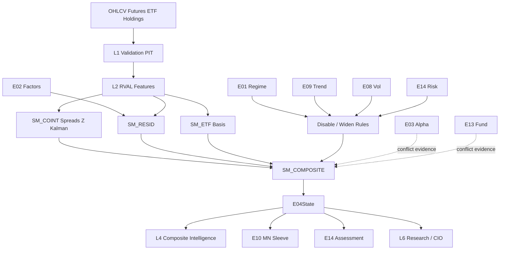

# E04 — Statistical Arbitrage & Relative Value Engine  
## Engineering Implementation Specification (AGI Investment Office)

**Document ID:** `E04`  
**Architecture compliance:** **E00 Constitution — Architecture v1.0** (binding)  
**Status:** Implementation-ready Candidate-track specification  
**Version:** 1.0.0  
**Owner:** Head of Quantitative Research / Market-Neutral Research Lead  
**Lifecycle (E00 §18):** **Experimental → Research → Candidate → Production** via §16 gates

### E00 supremacy

Subordinate to `E00_AGI_INVESTMENT_OFFICE_CONSTITUTION.md`. On conflict, **E00 wins**.  
Implementing PRs **must cite E00 section IDs** (E00 Annex A).

### Boundary vs peer engines (critical)

| Engine | Role | E04 relationship |
|--------|------|------------------|
| **E03** | Cross-sectional / technical relative alpha | Orthogonal; E04 may residualise using E03/E02; **never rewrites E03** |
| **E09** | Time-series CTA trend | Orthogonal; strong E09 trend may **disable/widen** fragile pairs (E00 §11) |
| **E01** | Regime | Break/crisis → cut/disable fragile cointegration |
| **E02** | Factor exposures | Hedge ratios / residual design matrix |
| **E08** | Vol / dispersion research | Spread vol, dispersion equity implementation inputs |
| **E13** | Fundamentals | Soft filter / conflict evidence on capital-structure RV |
| **E14** | Risk / crowding / liquidity | Mandatory gates; hard caps on promotion |
| **E10** | Portfolio construction | Consumes E04 views; E04 does **not** optimise books |

E04 is **additive market-neutral evidence**. No regressions to E03 or E09 (E00 §20.4).

### Hard rules (E00-aligned)

1. Research only — never BUY/SELL/EXECUTE (E00 §1.5).  
2. No portfolio optimisation (E00 §2.6 → E10).  
3. No macro regime invention (E00 §2 → E01).  
4. Outputs obey **EngineState** envelope (E00 §5).  
5. Scores **0–100** with polarity; spreads also expose signed z (E00 §8).  
6. Confidence = **conf-1.0** (E00 §9).  
7. Evidence pack mandatory (E00 §10).  
8. Weights via **Weight Registry** (E00 §12).  
9. Features registered under **`RVAL_`** (relative value) domain prefix — see Annex for E00 §6 amendment; v1.0 dual-alias `TECH_RVAL_*`.  
10. E14 gate on promotion; E01 crisis can override (E00 §11).

---

# 1. Purpose

## 1.1 Investment questions answered

1. **Which related securities are temporarily mispriced** relative to a hedge?  
2. **Is the spread stationary / cointegrated**, and what is its half-life?  
3. **What hedge ratio** (OLS / rolling / Kalman) defines the residual?  
4. **How extreme is the residual z-score**, and is mean reversion expected?  
5. **Does regime, trend, or vol** invalidate the pair/basket?  
6. **What capacity and cost** remain after ADV and borrow constraints (research)?

## 1.2 Institutional philosophy

E04 assumes that **relative** prices of economically linked instruments mean-revert faster than absolute prices, after hedging systematic risks. Alpha is the **residual**, not the leg direction.

Inspired by Renaissance / DE Shaw / Two Sigma / Citadel GE / Cubist / AQR StatArb / WorldQuant / Millennium / Point72 Cubist — adapted to AGI **research-only** constraints (E00 §1.5).

## 1.3 Academic foundations

| Theme | Anchors (representative) | E04 use |
|-------|--------------------------|---------|
| Pairs / distance | Gatev–Goetzmann–Rouwenhorst | Pair selection |
| Cointegration | Engle–Granger; Johansen | Stationarity of spreads |
| Residual / factor neutrality | Barra / FF residualisation | E02-aware residuals |
| Ornstein–Uhlenbeck / half-life | OU MLE / AR(1) | Expected reversion horizon |
| Kalman hedge | Adaptive β | Time-varying hedge ratios |
| Index / ETF arb literature | Basis & creation/redemption economics | ETF–basket / futures–spot |

## 1.4 Market-neutral principles

- Target **net ≈ 0**, **β ≈ 0** (and often sector-neutral) at the *signal* definition level.  
- E10 enforces portfolio neutrality; E04 must emit hedge ratios that make neutrality feasible.  
- Prefer **residual alpha** after E02 factors when coverage allows.

## 1.5 Capacity considerations

| Constraint | Implication |
|------------|-------------|
| ADV / participation | Cap notional via E14 capacity formulas |
| Borrow on short leg | `BORROW_OK` required for short-candidate legs |
| ETF create/redeem frictions | Soften ETF arb confidence when APs stressed |
| Crowded pairs | E14 crowding haircut; disable if extreme |
| Half-life too short | Costs destroy edge — Weight Registry / TCA gate |

## 1.6 Expected alpha source

Temporary **relative mispricing** + slow diffusion of information across substitutes, after hedging common factors — harvested as expected residual mean reversion, not directional beta.

---

# 2. Relative Value Taxonomy

```
E04 Relative Value Taxonomy
├── Equity Statistical Arbitrage
│   ├── Pairs Trading
│   ├── Basket Arbitrage
│   ├── Sector Relative Value
│   ├── Industry Relative Value
│   ├── Residual Alpha (multi-factor)
│   └── Spread Mean Reversion
├── Index / ETF Structure
│   ├── ETF vs Basket
│   ├── Index Arbitrage (cash–futures research)
│   ├── Futures vs Spot / Basis
│   └── Cash vs Futures Basis
├── Cross-Section Structure
│   ├── Cointegration Systems
│   └── Dispersion (equity implementation only)
├── Capital Structure (equity side only)
│   └── Pref / holdco–opco / dual-list equity RV (when data)
└── Meta
    ├── Cross-Asset Relative Value (limited; futures–spot)
    └── Composite Relative Value Intelligence
```

### Dictionary

| Node | Definition |
|------|------------|
| **Pairs Trading** | Two names; hedge ratio; residual z mean-reversion |
| **Sector / Industry RV** | Name vs sector/industry peer basket residual |
| **ETF Arbitrage** | ETF vs weighted constituents mispricing research |
| **Index Arbitrage** | Index / futures vs cash basket basis research |
| **Basket Arbitrage** | Multi-leg residual vs synthetic basket |
| **Cointegration** | Long-run equilibrium residual stationary |
| **Residual Alpha** | Return after market/sector/E02 regression |
| **Spread Mean Reversion** | Generic OU/z framework on any spread |
| **Dispersion (equity)** | Index vs constituents realised/IV dispersion research (links E08; equity legs only) |
| **Capital Structure RV** | Equity-side relative value across related tickers (not credit OMS) |

---

# 3. Sub Models

Package: `intelligence-engine/app/engines/e04/submodels/` (E00 §19).

### Common interface

```python
class E04SubModelResult(TypedDict):
    model_id: str
    signal_ids: list[str]
    object_id: str                   # pair_id | basket_id | basis_id
    object_type: str                 # pair|basket|etf|basis|residual
    score_0_100: float
    signed_spread_z: float           # + => leg A rich vs hedge
    confidence: float                # conf-1.0
    half_life_days: float | None
    hedge_ratios: dict[str, float]
    features: dict[str, float]
    evidence: dict                   # E00 §10
    explanation: dict
    warnings: list[str]
    as_of: str
    stale: bool
    model_version: str
```

---

### 3.1 Cointegration Model (`SM_COINT`)
| | |
|--|--|
| **Purpose** | Engle–Granger / Johansen tests; coint score |
| **Inputs** | Log prices of legs; lag selection |
| **Outputs** | `RVAL_COINT_SCORE`, p-values, eigenvectors |
| **Dependencies** | Minimum history (≥252d preferred) |
| **Confidence** | High when p<0.05 stable OOS; else haircut |

### 3.2 Spread Model (`SM_SPREAD`)
| | |
|--|--|
| **Purpose** | Construct spread \(s_t = y_t - \beta x_t - \alpha\) |
| **Inputs** | Prices, hedge ratio |
| **Outputs** | Spread series, spread vol |
| **Dependencies** | OLS / Kalman β |
| **Confidence** | Ties to β stability |

### 3.3 Z-Score Model (`SM_Z`)
| | |
|--|--|
| **Purpose** | Rolling z of spread; entry/exit research thresholds |
| **Inputs** | Spread, window W (default 60) |
| **Outputs** | `RVAL_SPREAD_Z`, mispricing magnitude |
| **Dependencies** | SM_SPREAD |
| **Confidence** | Medium–High |

### 3.4 Kalman Beta Model (`SM_KALMAN`)
| | |
|--|--|
| **Purpose** | Time-varying hedge ratio |
| **Inputs** | Log prices; process/observation noise priors |
| **Outputs** | \(\beta_t\), \(\alpha_t\), residual |
| **Dependencies** | None |
| **Confidence** | Medium; warn if β jumps |

### 3.5 Residual Return Model (`SM_RESID`)
| | |
|--|--|
| **Purpose** | Multi-factor residual alpha (market + sector + E02) |
| **Inputs** | Returns, E02 loadings, sector returns |
| **Outputs** | Residual returns, residual z, residual rank |
| **Dependencies** | **E02** when coverage ≥70% else market+sector |
| **Confidence** | Medium–High |

### 3.6 Relative Strength Spread Model (`SM_RS_SPREAD`)
| | |
|--|--|
| **Purpose** | RS differential mean-reversion (not E03 primary) |
| **Inputs** | Cumulative residual RS between peers |
| **Outputs** | RS-spread z |
| **Dependencies** | Sector map |
| **Confidence** | Medium |

### 3.7 ETF Basket Model (`SM_ETF`)
| | |
|--|--|
| **Purpose** | ETF vs reconstituted basket premium/discount |
| **Inputs** | ETF price, holdings weights, constituent prices, fees |
| **Outputs** | `RVAL_ETF_PREMIUM`, z, capacity flags |
| **Dependencies** | Holdings PIT |
| **Confidence** | Medium (holdings lag) |

### 3.8 Basis Model (`SM_BASIS`)
| | |
|--|--|
| **Purpose** | Futures–spot / cash–futures basis research |
| **Inputs** | Fut, spot/index, rates, dividends proxy, days to expiry |
| **Outputs** | Rich/cheap basis z |
| **Dependencies** | Calendar |
| **Confidence** | Medium–High liquid indices |

### 3.9 Sector Neutral Model (`SM_SECT_NEUT`)
| | |
|--|--|
| **Purpose** | Enforce sector-neutral residual construction |
| **Inputs** | Sector returns / peer basket |
| **Outputs** | Sector-neutral residual features |
| **Dependencies** | Classification |
| **Confidence** | High |

### 3.10 Composite Relative Value Model (`SM_COMPOSITE`)
| | |
|--|--|
| **Purpose** | Fuse pair/basket/basis/residual into E04 outputs |
| **Inputs** | Submodels + E01/E03/E09/E08/E14 conditions |
| **Outputs** | §9 outputs |
| **Dependencies** | Weight Registry (E00 §12) |
| **Confidence** | conf-1.0 |

---

# 4. Inputs

## 4.1 Market & structure
OHLCV, corporate actions, index constituents (PIT), ETF holdings (PIT), sector/industry map, continuous futures, borrow flags, corporate events calendar.

## 4.2 Upstream engines

| Engine | Use |
|--------|-----|
| **E01** | Disable/widen in crisis/high_vol break regimes |
| **E02** | Residual regression design matrix |
| **E03** | Conflict/agreement; optional residual demean |
| **E08** | Spread vol, dispersion inputs, event EM |
| **E09** | Trend break detector — cut mean-rev when trend strong |
| **E13** | Fundamental divergence flags on pairs |
| **E14** | Liquidity, crowding, gates, max allocation |

## 4.3 Input registry

| input_id | Description |
|----------|-------------|
| `OHLCV_1D` | Daily bars |
| `CORP_ACTIONS` | Adjustments |
| `INDEX_MEMBERS_PIT` | Constituents |
| `ETF_HOLDINGS_PIT` | Weights |
| `SECTOR_ID` / `INDUSTRY_ID` | Classification |
| `CONT_FUT` | Futures continuous |
| `BORROW_OK` | Short availability |
| `E01_STATE` … `E14_STATE` | Upstream |
| `PAIR_UNIVERSE` | Eligible pair graph |
| `BASKET_DEF` | Basket definitions |

## 4.4 APIs & refresh

| Family | Primary | Refresh | Fallback |
|--------|---------|---------|----------|
| NSE equities/indices | Groww / research caches | 1d | Existing E03 candles |
| ETF holdings | Vendor / NSE disclosures | Event–1d | Stale holdings → confidence↓ |
| Futures | Derivatives feed | 1d | Basis model off |
| Upstream engines | Internal | Job-ordered | Degrade residuals / gates |

---

# 5. Feature Engineering

Domain prefix **`RVAL_`** (alias `TECH_RVAL_*` until E00 §6 v1.1).

| feature_id | Definition |
|------------|------------|
| `RVAL_SPREAD` | \(y-\beta x-\alpha\) |
| `RVAL_SPREAD_ROLL_MEAN` / `_STD` | Rolling moments |
| `RVAL_SPREAD_Z` | Rolling z-score |
| `RVAL_RESID_RET` | Residual return |
| `RVAL_COINT_PVAL` | Engle–Granger p-value |
| `RVAL_COINT_SCORE` | Mapped 0–100 stationarity strength |
| `RVAL_HALF_LIFE` | OU/AR(1) half-life days |
| `RVAL_BETA_OLS` | Hedge ratio |
| `RVAL_BETA_KALMAN` | Adaptive β |
| `RVAL_BETA_STAB` | 1/(1+σ_β) |
| `RVAL_ROLL_CORR_60` | Rolling correlation |
| `RVAL_ROLL_COV` | Rolling covariance |
| `RVAL_RESID_VOL` | Residual σ |
| `RVAL_SPREAD_VOL` | Spread σ |
| `RVAL_SPREAD_PERSIST` | Autocorr of spread sign |
| `RVAL_RESID_XS_RANK` | Cross-sectional residual percentile |
| `RVAL_MISPRICE_ABS` | \|z\| |
| `RVAL_ETF_PREMIUM` | ETF/basket − 1 |
| `RVAL_BASIS_Z` | Futures basis z |
| `RVAL_DISP_EQUITY` | Index vs median name RV/IV dispersion proxy |
| `RVAL_TREND_CONFLICT` | E09 strength on legs |
| `RVAL_REGIME_OK` | 1 if E01 allows mean-rev |

**Normalisation (E00 §6):** winsorise residuals; z within object history; XS rank across universe for residual alpha.

---

# 6. Mathematical Models

## 6.1 OLS hedge ratio

On log prices \(Y, X\) over window \(L\) (default 126–252):  
\[
Y_t = \alpha + \beta X_t + e_t
\]
\(\hat\beta,\hat\alpha\) → spread \(s_t=Y_t-\hat\beta X_t-\hat\alpha\).

## 6.2 Engle–Granger cointegration

1. Estimate OLS hedge.  
2. ADF test on residuals.  
3. `RVAL_COINT_SCORE = 100*(1-p)` clipped, with sample-size haircut if \(L<252\).

**Thresholds:** p<0.05 → coint eligible; p>0.10 → pair research disabled unless basket/Johansen supports.

## 6.3 Johansen cointegration (baskets)

VECM/Johansen trace/eigen tests on log-price vector (dimension ≤6 v1).  
Store rank, eigenvectors as hedge basket weights (normalised).

## 6.4 Kalman filter hedge

State \((\alpha_t,\beta_t)\); observation \(Y_t=\alpha_t+\beta_t X_t+\varepsilon_t\).  
Defaults: process var small on β; tune via likelihood on Research lifecycle only; Production uses locked `assumption_set_id`.

## 6.5 Residual regression (E02-aware)

\[
r_{i,t}=\alpha_i+\beta_i r_{m,t}+\gamma_i r_{s(i),t}+\sum_k \lambda_{i,k}f_{k,t}+e_{i,t}
\]
Trailing 126d OLS; clip betas; drop factor terms if E02 coverage low.

## 6.6 Rolling correlation / covariance

Windows 20/60/120; used for pair filters (corr too low → unstable; corr→1 with no residual → no edge).

## 6.7 Z-score

\[
z_t=\frac{s_t-\mu_{t,W}}{\sigma_{t,W}+\varepsilon},\quad W=60
\]
Winsorise \|z\| at 4 for features; raw z retained in metadata.

**Research thresholds (not orders):**  
|z|≥2 entry candidate; |z|≤0.5 exit/neutralise candidate; |z|≥3.5 stress — widen / E14 review.

## 6.8 Half-life (AR(1) / OU)

\[
\Delta s_t = \phi s_{t-1} + \epsilon_t,\quad
\mathrm{HL}=\frac{\ln 2}{-\ln(1+\phi)}\quad (\phi<0)
\]
**Expected behaviour:** HL 5–20d tradable research; HL<2d usually TCA-negative; HL>60d slow — lower urgency score.

## 6.9 Expected mean reversion score

\[
S_{\mathrm{MR}} = 100\cdot\Phi\big(a\cdot|z| - b\cdot\log(\mathrm{HL}) - c\cdot\mathbf{1}_{\neg\mathrm{coint}}\big)
\]
with a,b,c in Weight Registry / model_weights (not silent magic in code paths for Production).

## 6.10 Sector / XS normalisation

Sector-neutral residuals demeaned within sector; residual alpha score = percentile rank of residual z across universe (E00 §8).

## 6.11 Failure modes & validation

| Failure | Mitigation |
|---------|------------|
| Structural break | Rolling coint; E01 crisis disable |
| β instability | Kalman + β_stab haircut |
| Trend legs | E09 conflict → confidence↓ or disable |
| Illiquid short | E14 / borrow gate |
| Look-ahead holdings | PIT ETF/index members only (E00 §16) |

Unit tests: synthetic OU recovery of HL; EG p-value fixtures; Kalman β step response.

---

# 7. Composite Relative Value Framework

## 7.1 Signal combination

For each object:  
\[
S_{\mathrm{RV}} = \sum_k w_k S_k
\]
Typical registered set `e04_composite_v1`:

| Component | Base w |
|-----------|--------|
| \|z\|-mapped mispricing | 0.30 |
| Cointegration score | 0.20 |
| Half-life attractiveness | 0.15 |
| β stability | 0.10 |
| Residual XS rank (if residual book) | 0.15 |
| Basis/ETF premium module | 0.10 |

Renormalise when modules absent.

## 7.2 Conflict resolution (E00 §11)

| Conflict | Resolution |
|----------|------------|
| E04 mean-rev long A vs E03 strong XS bearish A | Haircut; evidence contradiction; do not delete either |
| E09 strong trend on both legs same direction | **Disable or widen** z entry (override power via E01/E09 condition weights) |
| E01 crisis / E14 hard_derisk | Weight→0 for fragile pairs; basis-only maybe survive |
| E13 quality divergence extreme | Flag; reduce confidence |
| E08 vol expansion | Widen z thresholds via weight conditions |

**Authority:** E14/E01 override; E09/E08/E13 haircut; E04 never overrides E14.

## 7.3 Confidence (conf-1.0)

Standard E00 §9 product with E04-specific maps:

- `C_hist` ← trailing hit-rate of z-reversion  
- `C_regime` ← `RVAL_REGIME_OK`  
- `C_stable` ← β_stab × coint stability  
- `C_n` ← history length  
- `C_complete` ← holdings/borrow/E02 coverage  

## 7.4 Interaction with E03

- E03 remains primary XS/tech engine.  
- E04 may consume E03 residuals as features; **must not** modify `agi_tech_score` / composite E03 writes.  
- L4 shows both when conflicted.

## 7.5 Interaction with E09

- If `SIG_E09_STRENGTH` high and same-sign on legs → mean-rev confidence ×≤0.6 or object status `disabled_trend_break`.  
- Panel CTA sleeve (E09) and MN sleeve (E04) coexist in E10 with separate risk budgets.

## 7.6 Interaction with E14

- Every promoted pair/basket requires `E14Assessment`.  
- Liquidity on both legs; crowding; gross of two legs; borrow.  
- Stress corr→1: E14 stress Σ may invalidate diversification assumption — confidence↓.

---

# 8. Machine Learning

E00 §17.

| Technique | Use |
|-----------|-----|
| Pair selection | Distance / clustering / embedding similarity → candidate graph |
| Cluster detection | Industry graphs; GNN roadmap (Research) |
| Residual forecasting | Predict next residual Δ from z, HL, E01, E08 |
| Graph-based similarity | Peer edges for basket construction |
| Bayesian updating | Posterior on HL / mean reversion speed |
| SHAP | Explain S_RV drivers — mandatory on promote |
| RL roadmap | Execution scheduling research only (P4 shadow); no orders |

Promotion requires offline+shadow+E14+human approval (E00 §17.1).

---

# 9. Outputs

## 9.1 Object-level `E04State` (E00 §5 + body)

```json
{
  "engine": "E04",
  "version": "1.0.0",
  "model_version": "e04-1.0.0",
  "as_of": "2026-07-25",
  "universe_id": "RVAL_NSE_V1",
  "object_id": "PAIR:TCS_INFY",
  "object_type": "pair",
  "legs": [
    {"symbol": "TCS", "side_hint": "short_if_z_pos", "hedge_weight": -1.0},
    {"symbol": "INFY", "side_hint": "long_if_z_pos", "hedge_weight": 1.12}
  ],
  "score": {
    "raw": null,
    "normalized_0_100": 72.0,
    "normalized_signed": null,
    "unit": "score"
  },
  "confidence": {
    "value": 0.69,
    "components": {
      "C_data": 0.9,
      "C_agree": 0.75,
      "C_hist": 0.65,
      "C_regime": 0.85,
      "C_stable": 0.8,
      "C_n": 1.0,
      "C_complete": 0.9,
      "C_recency": 0.95
    },
    "method_version": "conf-1.0"
  },
  "reliability": {
    "sample_size": 504,
    "historical_accuracy": 0.57,
    "stability": 0.8
  },
  "relative_value_score": 72.0,
  "spread_score": 70.0,
  "cointegration_score": 78.0,
  "residual_alpha_score": 66.0,
  "pair_confidence": 0.69,
  "mispricing_magnitude": 2.35,
  "signed_spread_z": 2.35,
  "expected_mean_reversion_score": 71.0,
  "half_life_days": 9.5,
  "hedge_ratios": {"TCS": -1.0, "INFY": 1.12},
  "status": "active",
  "signals": {
    "SIG_E04_RV": 72.0,
    "SIG_E04_SPREAD_Z": 2.35,
    "SIG_E04_COINT": 78.0,
    "SIG_E04_RESID": 66.0,
    "SIG_E04_MR_EXPECT": 71.0
  },
  "polarity": {
    "relative_value_score": "higher_is_stronger_rv_opportunity",
    "signed_spread_z": "custom_leg_A_rich_positive"
  },
  "metadata": {
    "e01_ref": {},
    "e02_ref": {},
    "e03_ref": {},
    "e08_ref": {},
    "e09_ref": {},
    "e13_ref": {},
    "e14_ref": {},
    "assumption_set_id": "e04_kalman_v1"
  },
  "evidence": {
    "positive": [],
    "negative": [],
    "contradictions": [],
    "unknowns": [],
    "risks": ["Structural break if merger/demerger"],
    "missing_data": []
  },
  "explanation": {
    "summary": "EG cointegrated; z=+2.35; HL≈10d; β stable; regime OK.",
    "top_drivers": [],
    "falsifiers": ["coint p>0.1", "E09 strength>80 both legs", "E14 hard_derisk"]
  },
  "warnings": [],
  "stale_inputs": [],
  "input_hash": "sha256:...",
  "hash": "sha256:...",
  "timestamp_generated": "2026-07-25T18:00:00+05:30"
}
```

## 9.2 Universe snapshot `E04UniverseSnapshot`

```json
{
  "engine": "E04",
  "as_of": "2026-07-25",
  "universe_id": "RVAL_NSE_V1",
  "n_objects_active": 120,
  "n_disabled_regime": 40,
  "median_half_life": 12.0,
  "median_abs_z": 1.1,
  "weight_set_id": "e04_composite_v1",
  "model_version": "e04-1.0.0"
}
```

## 9.3 Signal registry (E00 §7)

| signal_id | Type | Range | Consumers |
|-----------|------|-------|-----------|
| `SIG_E04_RV` | score | 0–100 | L4, E10 |
| `SIG_E04_SPREAD_Z` | metric | signed | L4, UI |
| `SIG_E04_COINT` | score | 0–100 | L4 |
| `SIG_E04_RESID` | score | 0–100 | L4, E10 |
| `SIG_E04_MR_EXPECT` | score | 0–100 | L4 |
| `SIG_E04_ETF_PREMIUM` | score/metric | signed | L4 |
| `SIG_E04_BASIS` | score | 0–100 | L4 |

---

# 10. Downstream Consumers

| Consumer | Influence |
|----------|-----------|
| **Composite Intelligence (L4)** | Primary MN/RV evidence; conflicts with E03/E09 surfaced |
| **E10 Portfolio** | Market-neutral / residual views; hedge_ratios as construction hints; E10 solves |
| **E14 Risk** | Two-leg liquidity, crowding, stress corr; assessments mandatory on promote |
| **Research Generator (L6)** | Pair/spread narratives bound to evidence |
| **CIO Reports** | Top mispricings, HL, coint, falsifiers — watermark until Production |

E04 does not feed back into E03/E09 score writers.

---

# 11. Database Design

E00 §13.

```sql
CREATE TABLE e04_object_master (
  object_id text PRIMARY KEY,
  object_type text NOT NULL,
  legs jsonb NOT NULL,
  universe_id text NOT NULL,
  active boolean DEFAULT true,
  meta jsonb DEFAULT '{}'
);

CREATE TABLE e04_feature_snapshot (
  as_of date NOT NULL,
  object_id text NOT NULL,
  feature_id text NOT NULL,
  value double precision,
  meta jsonb DEFAULT '{}',
  PRIMARY KEY (as_of, object_id, feature_id)
);

CREATE TABLE e04_spread_series (
  as_of date NOT NULL,
  object_id text NOT NULL,
  spread double precision NOT NULL,
  z_score double precision,
  beta double precision,
  PRIMARY KEY (as_of, object_id)
);
CREATE INDEX e04_spread_obj_idx ON e04_spread_series (object_id, as_of DESC);

CREATE TABLE e04_state (
  id uuid PRIMARY KEY DEFAULT gen_random_uuid(),
  as_of date NOT NULL,
  object_id text NOT NULL,
  payload jsonb NOT NULL,
  relative_value_score double precision NOT NULL,
  signed_spread_z double precision,
  half_life_days double precision,
  confidence double precision NOT NULL,
  status text NOT NULL,
  model_version text NOT NULL,
  weight_set_id text NOT NULL,
  input_hash text NOT NULL,
  created_at timestamptz DEFAULT now(),
  UNIQUE (as_of, object_id, model_version)
);
CREATE INDEX e04_state_score_idx ON e04_state (as_of, relative_value_score DESC);

CREATE TABLE e04_state_current (
  object_id text PRIMARY KEY,
  as_of date NOT NULL,
  payload jsonb NOT NULL,
  updated_at timestamptz NOT NULL DEFAULT now()
);

CREATE TABLE e04_universe_state_current (
  universe_id text PRIMARY KEY,
  as_of date NOT NULL,
  state jsonb NOT NULL,
  updated_at timestamptz NOT NULL DEFAULT now()
);

CREATE TABLE e04_pair_graph (
  as_of date NOT NULL,
  symbol_a text NOT NULL,
  symbol_b text NOT NULL,
  score double precision NOT NULL,
  method text NOT NULL,
  PRIMARY KEY (as_of, symbol_a, symbol_b, method)
);

CREATE TABLE e04_assumption_sets (
  assumption_set_id text PRIMARY KEY,
  rules jsonb NOT NULL,
  is_active boolean DEFAULT false,
  created_at timestamptz DEFAULT now()
);

CREATE TABLE e04_validation_runs (
  id uuid PRIMARY KEY DEFAULT gen_random_uuid(),
  started_at timestamptz,
  finished_at timestamptz,
  method text,
  metrics jsonb,
  model_version text
);

CREATE TABLE e04_migration_flags (
  key text PRIMARY KEY,
  enabled boolean NOT NULL DEFAULT false,
  updated_at timestamptz DEFAULT now()
);
```

PIT for ETF/index membership; append-only spreads; RLS service write / research read.

---

# 12. Backend Services

```
intelligence-engine/app/engines/e04/
  __init__.py
  config.py
  pipeline.py
  schema.py
  universe/
    pair_graph.py
    baskets.py
  features/
    registry_sync.py
    builder.py
  submodels/
    cointegration.py
    spread.py
    zscore.py
    kalman_beta.py
    residual.py
    rs_spread.py
    etf_basket.py
    basis.py
    sector_neutral.py
    composite.py
  models/
    engle_granger.py
    johansen.py
    half_life.py
    pair_select_ml.py
  adapters/
    e01.py
    e02.py
    e03.py
    e08.py
    e09.py
    e13.py
    e14.py
    prices.py
    etf_holdings.py
  explain.py
  persistence.py
  validation/
    walk_forward.py
    stability.py
    tca.py
```

Node: `server/services/e04StatArbService.js`.

## 12.1 Pipeline (E00 §4 order key ~40)

1. Build/refresh pair graph & baskets  
2. Prices + PIT holdings validation  
3. Hedge ratios (OLS/Kalman) + spreads  
4. Cointegration + HL + z  
5. Residual model with E02  
6. ETF/basis modules if data  
7. E01/E09/E08/E14 condition filters  
8. Composite + evidence + conf-1.0  
9. Persist; metrics (n_active, median HL, disable counts)

## 12.2 Cron (IST)

| Job | Schedule | Action |
|-----|----------|--------|
| `e04_eod` | 18:10 IST | Full rebuild after E03/E09 |
| `e04_graph_weekly` | Sunday 16:00 | Pair graph refresh |
| `e04_stability_weekly` | Sunday 19:00 | Coint stability audit |
| `e04_monthly_validate` | 3rd 22:00 | Walk-forward + TCA |
| `e04_holdings_ingest` | 07:00 & 16:30 | ETF/index PIT |

## 12.3 SLOs

| SLO | Target |
|-----|--------|
| 500 pairs EOD | p95 < 10 min |
| Warm GET object | < 300ms |
| PIT membership violations | 0 |

---

# 13. API Contracts

E00 §14.

### 13.1 `GET /api/intelligence/e04/state/{object_id}`
### 13.2 `GET /api/intelligence/e04/universe?universe_id=`
### 13.3 `GET /api/intelligence/e04/spread/{object_id}?limit=`
### 13.4 `GET /api/intelligence/e04/rankings?metric=relative_value_score&limit=`
### 13.5 `GET /api/intelligence/e04/heatmap?by=sector`
### 13.6 `GET /api/intelligence/e04/graph?as_of=`
### 13.7 `POST /api/intelligence/e04/run` (service-role)
### 13.8 `GET /api/intelligence/e04/taxonomy`
### 13.9 Errors
`E04_OBJECT`, `E04_NOT_COINTEGRATED`, `E04_DISABLED_REGIME`, `E04_STALE`, `E04_INTERNAL`.

---

# 14. Frontend (Bloomberg-style)

E00 §15 required views.

Route: `/beta/e04-stat-arb` (flagged). Watermark until Production.

## Widgets

1. **Pairs Dashboard** — top |z| with HL, coint, confidence  
2. **Spread Monitor** — live z vs thresholds (research bands)  
3. **Cointegration Explorer** — p-values, stability timeline  
4. **Relative Value Heatmap** — sector/industry  
5. **Residual Alpha Explorer** — XS residual ranks  
6. **ETF Premium / Basis Panels**  
7. **Historical Spread Timeline** — price legs + spread + β  
8. **Evidence & Conflicts** — E03/E09/E01/E14  
9. **Risk strip** — E14 assessment summary  
10. **Capacity / TCA notes** |

No trade tickets; no raw formula dump as primary UX (E00 §15.2).

---

# 15. Validation

E00 §16.

| Test | Detail |
|------|--------|
| Walk-forward | Pair selection + z rules; embargo; OOS hit-rate of reversion |
| Pair stability | Fraction remaining cointegrated next quarter |
| Cointegration stability | Rolling p-value paths |
| Half-life accuracy | Synthetic OU recovery MAE |
| Capacity analysis | ADV participation at research notionals |
| TCA | Net edge after 10–30 bps round-trip by HL bucket |
| Historical replay | Crisis: disable rates spike; correlation break fixtures |
| Spread decay | Edge vs holding days curve |

**Targets:**

| Metric | Target |
|--------|--------|
| HL<3d bucket net edge | Must not stay Production-weighted if TCA-negative |
| Coint stability q/q | Track; investigate if <40% |
| Envelope compliance | 100% |
| E03/E09 regression suites | 100% green on E04 merges |

---

# 16. Migration

## 16.1 Principle

E04 is a **new additive market-neutral evidence engine**.  
E03 technical/XS and E09 CTA paths remain unchanged.

```
E03  ----------------→ unchanged
E09  ----------------→ unchanged
E04 RV/StatArb (new) → flagged Beta / L4 / E10 MN sleeve
```

## 16.2 Flags

```json
{
  "e04_api_enabled": false,
  "e04_ui_tab": false,
  "e04_l4_evidence": false,
  "e04_e10_mn_sleeve": false,
  "e04_cio_brief_block": false,
  "e04_etf_module": false,
  "e04_basis_module": false,
  "e04_kalman": false
}
```

## 16.3 P0–P4 (E00 §18)

| Phase | Scope | Exit criteria |
|-------|-------|---------------|
| **P0** | Pair universe (liquidity filtered); OLS β; z; HL; EG coint; `E04State` | Envelope+evidence; E03/E09 regression green |
| **P1** | Sector-neutral residual; pair graph; rankings API; Weight Registry composite | Top pairs daily |
| **P2** | Kalman flag; Beta UI; `e04_l4_evidence`; E01/E09 disable rules | Conflict tests pass |
| **P3** | ETF premium + index basis modules; E10 MN sleeve; E14 assess hook | Holdings PIT audits green |
| **P4** | ML pair selection shadow; Johansen baskets; Production vote | E00 §17 gates + CIO/Risk approval |

## 16.4 Rollback

Disable flags → zero user impact; E03/E09 untouched.

---

# 17. Implementation phases (checklist)

| Phase | Deliverables |
|-------|--------------|
| P0 | object master, OLS spread/z/HL/EG, schema, APIs, tests |
| P1 | residual+E02, graph job, composite weights |
| P2 | Kalman, UI, regime/trend gates |
| P3 | ETF/basis, E10/E14 adapters |
| P4 | ML shadow, Johansen, Production review pack |

---

# 18. Non-functional requirements

- Deterministic given prices + assumption_set_id + weight_set_id + model_version  
- Full audit hashes (E00 §5/§13)  
- Secrets server-side only (E00 §19.6)  
- Research disclaimers on all pair UIs  
- Fail closed on missing E14 for promote; fail open raw research GET with warnings  

---

# 19. Acceptance tests (sample)

1. Synthetic cointegrated OU pair → coint score high; HL within 20% of true.  
2. Random-walk pair → coint fails; status not `active` for MR.  
3. E09 strength high both legs → status `disabled_trend_break` or confidence ≤0.45.  
4. E01 crisis fixture → active fragile equity pairs weight/status cut.  
5. E04 merge does not change E03 golden tech vectors or E09 TSMOM fixtures.  
6. ETF module with future holdings date > as_of → PIT violation test fails closed.  
7. Envelope validates conf-1.0 + evidence.  
8. Flags off → no UI regression.

---

# 20. Dependency graph



---

# 21. E00 compliance matrix

| E00 | E04 |
|-----|-----|
| §1 | Research-only MN/RV evidence |
| §2–§4 | L3 specialised; order ~40; after E02/E03 features |
| §5–§10 | Envelope, RVAL features/signals, scores, conf-1.0, evidence |
| §11 | E01/E14 override; E09/E08 haircut; no E03 rewrite |
| §12 | Composite weights in Weight Registry |
| §13–§15 | DB/API/UI standards |
| §16–§18 | Validation, ML gates, lifecycle |
| §19–§20 | Package layout; additive migration |

---

# ANNEX — E00 §6 prefix amendment request

**Architecture v1.1 request:** add domain prefix `RVAL_` for statistical arbitrage / relative value features.  
Until merged, dual-register `TECH_RVAL_*` aliases equal to `RVAL_*`.

---

*End of E04 Statistical Arbitrage & Relative Value Engine Specification v1.0 — governed by E00 Architecture v1.0*
