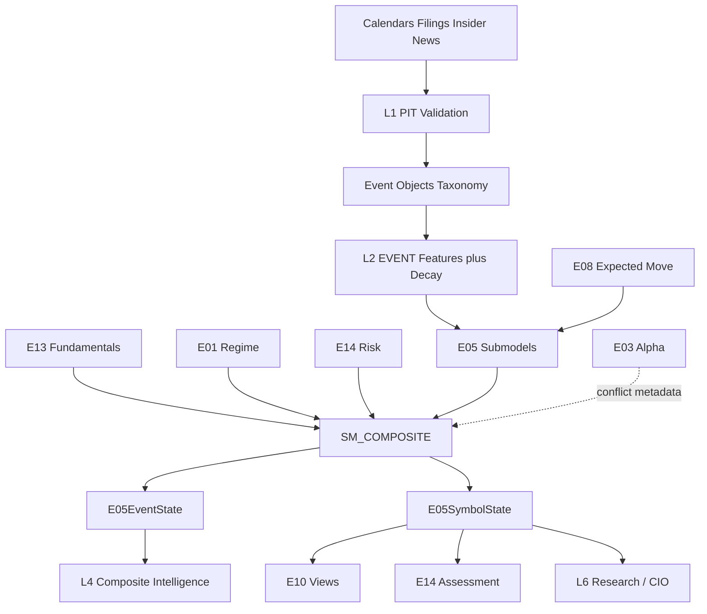

# E05 — Event-Driven & Special Situations Engine  
## Engineering Implementation Specification (AGI Investment Office)

**Document ID:** `E05`  
**Architecture compliance:** **E00 Constitution — Architecture v1.0** (binding)  
**Status:** Implementation-ready Candidate-track specification  
**Version:** 1.0.0  
**Owner:** Event Research Lead / CIO Desk / Head of Quantamental Research  
**Lifecycle (E00 §18):** **Experimental → Research → Candidate → Production** via §16 gates

### E00 supremacy

Subordinate to `E00_AGI_INVESTMENT_OFFICE_CONSTITUTION.md`. On conflict, **E00 wins**.  
Implementing PRs **must cite E00 section IDs** (E00 Annex A).

### Boundary vs peer engines (critical)

| Engine | Role | E05 relationship |
|--------|------|------------------|
| **E03** | XS / technical alpha | Orthogonal timing; E05 may haircut E03 confidence near binary events — **never rewrites E03 scores** |
| **E13** | Fundamental quality | Pre/post fundamental context; E05 owns **event objects**, not quality pillars |
| **E04** | Stat-arb / RV | Deal spreads may inform; E05 owns catalyst taxonomy |
| **E08** | Options / expected move | Consumes EM for event windows; does not own filings |
| **E01** | Regime | Soft prior on risk-off deal breaks |
| **E14** | Risk | Gap/event taxonomy, gates, size haircuts — mandatory on promote |
| **E10** | Portfolio | Consumes event views; E05 does **not** optimise |

E05 is **additive event evidence**. No regressions to E03 or E13 (E00 §20.4).

### Relationship to current AGIB stack (reuse)

| Existing asset | E05 role |
|----------------|----------|
| Finnhub earnings calendar in `preMarketContextService.js` | L0 calendar adapter (extend) |
| Market/news briefing categories (results/M&A keywords) | Weak NLP priors → migrate to structured events |
| E13 revisions / ownership | Companion features, not substitutes |
| Intelligence routes | `/api/intelligence/e05/*` (E00 §14) |

**Net-new:** event object warehouse (PIT), taxonomy classifier, deal probability, surprise/guidance models, decay engine, catalyst scores, Bloomberg calendar/M&A UI, validation against look-ahead.

### Hard rules (E00-aligned)

1. Research only — never BUY/SELL/EXECUTE (E00 §1.5).  
2. No portfolio optimisation (E00 §2.6 → E10).  
3. Outputs obey **EngineState** envelope (E00 §5).  
4. Scores **0–100** with polarity; deal probabilities 0–1 also exposed (E00 §8).  
5. Confidence = **conf-1.0** (E00 §9).  
6. Evidence pack mandatory (E00 §10).  
7. Weights via **Weight Registry** (E00 §12).  
8. Features under **`EVENT_`** prefix (already in E00 §6).  
9. Point-in-time filings only — **no look-ahead** (E00 §16).  
10. E14 gate on promotion; E01 may haircut risk-on deal books (E00 §11).

---

# 1. Purpose

## 1.1 Investment questions answered

1. **What material corporate events** are active or imminent for a name?  
2. **How large is the expected informational impact** (surprise, premium, guidance delta)?  
3. **What is deal / completion probability** for hard catalysts (M&A)?  
4. **How should event intensity decay** after the announcement or print?  
5. **Does the event conflict** with E03/E13 views?  
6. **What falsifies** the catalyst thesis (deal break, miss, regulatory block)?

## 1.2 Institutional philosophy

Events create **temporary dislocations** and **information diffusion** windows. E05 structures catalysts as first-class research objects with type, timing, magnitude, probability, and decay — in the spirit of Elliott / Pershing / Third Point / Paulson / Farallon / DK / Citadel & Millennium event books / JPM & GS event research — under AGI **research-only** law (E00 §1.5).

## 1.3 Academic foundations

| Theme | Use |
|-------|-----|
| Post-earnings announcement drift (PEAD) | Earnings surprise persistence |
| Analyst revision drift | Guidance / estimate updates |
| Merger arbitrage spread literature | Deal probability & break risk (research) |
| Insider trading studies | Alignment / conflict signals |
| Corporate action ex-date effects | Buyback/dividend/split mechanics |

## 1.4 Expected alpha sources

| Source | Horizon |
|--------|---------|
| Earnings surprise + PEAD | 1–60 sessions |
| Guidance / revision shocks | 1–40 sessions |
| M&A spread convergence (research) | Days–months to close |
| Spin-off / demerger stubs | Weeks–quarters |
| Insider / promoter alignment shifts | Weeks |
| Regulatory overhang resolution | Event-defined |

## 1.5 Typical holding periods (research labels)

| Class | Typical research horizon |
|-------|--------------------------|
| Soft earnings / revisions | 5–21d primary; PEAD to 63d |
| Hard M&A | To expected close (calendar) |
| Corporate actions | Around ex/record windows |
| Governance / management | 21–126d |
| Special situations | Idiosyncratic; mandate-tagged |

## 1.6 Capacity considerations

- Binary events: E14 gap buffers mandatory.  
- Illiquid names: ADV caps via E14.  
- Deal arb research: borrow + deal break scenarios; never size in E05.  
- Crowded PEAD: E14 crowding haircut.

---

# 2. Event Taxonomy

```
E05 Event Taxonomy
├── Corporate Results
│   ├── Quarterly Earnings
│   ├── Annual Results
│   ├── Earnings Surprise
│   ├── Revenue Surprise
│   ├── EPS Surprise
│   └── Guidance Changes
├── Corporate Actions
│   ├── Buybacks
│   ├── Dividends
│   ├── Bonus Issues
│   ├── Stock Splits
│   ├── Rights Issues
│   └── Preferential Issues
├── Corporate Transactions
│   ├── Mergers
│   ├── Acquisitions
│   ├── Demergers
│   ├── Spin-offs
│   ├── Reverse Mergers
│   └── Delistings
├── Capital Structure
│   ├── Debt Refinancing
│   ├── Equity Raising
│   ├── Convertible Issues
│   └── Warrants
├── Governance
│   ├── CEO / CFO / Board Changes
│   ├── Promoter Changes
│   ├── Insider Buying
│   └── Insider Selling
├── Regulatory
│   ├── SEBI Actions
│   ├── Competition Commission
│   ├── Court Judgements
│   └── Government Policy (name/sector tagged)
└── Special Situations
    ├── Distressed
    ├── Turnarounds
    ├── Asset Sales
    ├── Strategic Reviews
    └── Activist Campaigns
```

**Canonical `event_type` IDs** (stable strings):  
`earn_q`, `earn_fy`, `earn_surprise`, `rev_surprise`, `eps_surprise`, `guidance`, `buyback`, `dividend`, `bonus`, `split`, `rights`, `pref_issue`, `merger`, `acquisition`, `demerger`, `spinoff`, `rev_merger`, `delist`, `debt_refi`, `equity_raise`, `convertible`, `warrant`, `mgmt_ceo`, `mgmt_cfo`, `mgmt_board`, `promoter_chg`, `insider_buy`, `insider_sell`, `sebi`, `cci`, `court`, `gov_policy`, `distressed`, `turnaround`, `asset_sale`, `strategic_review`, `activist`.

---

# 3. Sub Models

Package: `intelligence-engine/app/engines/e05/submodels/` (E00 §19).

### Common interface

```python
class E05SubModelResult(TypedDict):
    model_id: str
    event_id: str
    event_type: str
    symbol: str
    score_0_100: float
    catalyst_score: float
    expected_impact: float          # signed research impact score [-100,100] or mapped
    deal_probability: float | None  # [0,1] when applicable
    confidence: float               # conf-1.0
    decay_halflife_days: float
    features: dict[str, float]
    evidence: dict                  # E00 §10
    explanation: dict
    warnings: list[str]
    as_of: str
    event_time: str                # PIT announcement/effective time
    stale: bool
    model_version: str
```

---

### 3.1 Earnings Model (`SM_EARN`)
| | |
|--|--|
| **Purpose** | Results / EPS / revenue surprises |
| **Inputs** | Actuals vs consensus, prior year, calendar |
| **Outputs** | Surprise scores, PEAD prior |
| **Dependencies** | Estimates PIT |
| **Confidence** | Coverage-scaled |

### 3.2 Guidance Model (`SM_GUIDE`)
| | |
|--|--|
| **Purpose** | Guidance raises/cuts / qualitative tone→score |
| **Inputs** | Guidance text/structured deltas, revisions |
| **Outputs** | Guidance delta score |
| **Dependencies** | NLP assist optional (cannot sole-set score, E00 §2.7) |
| **Confidence** | Medium |

### 3.3 Corporate Action Model (`SM_CA`)
| | |
|--|--|
| **Purpose** | Buybacks, dividends, bonus, splits, rights, preferential |
| **Inputs** | Exchange CA feed, sizes, ex-dates |
| **Outputs** | CA catalyst scores, buyback yield |
| **Dependencies** | Calendar |
| **Confidence** | High on structured CA |

### 3.4 M&A Model (`SM_MA`)
| | |
|--|--|
| **Purpose** | Mergers/acquisitions/demergers/spin-offs/delist |
| **Inputs** | Deal terms, premium, spread, timelines, regulatory flags |
| **Outputs** | Deal probability, expected impact, break risk |
| **Dependencies** | E14 event risk; news/filings |
| **Confidence** | Medium — always warn incomplete terms |

### 3.5 Management Change Model (`SM_MGMT_CHG`)
| | |
|--|--|
| **Purpose** | CEO/CFO/board changes |
| **Inputs** | Announcements, unexpected vs planned |
| **Outputs** | Governance shock score |
| **Dependencies** | None |
| **Confidence** | Medium |

### 3.6 Governance Model (`SM_GOV_EVT`)
| | |
|--|--|
| **Purpose** | Promoter changes, pledge shocks, governance events |
| **Inputs** | Shareholding, pledge, filings |
| **Outputs** | Governance event score |
| **Dependencies** | E13 ownership features optional |
| **Confidence** | Medium |

### 3.7 Capital Raise Model (`SM_CAPITAL`)
| | |
|--|--|
| **Purpose** | Equity raising, convertibles, warrants, debt refi |
| **Inputs** | Dilution %, pricing vs market, use of proceeds tags |
| **Outputs** | Dilution / refi impact scores |
| **Dependencies** | Shares outstanding PIT |
| **Confidence** | Medium–High |

### 3.8 Insider Activity Model (`SM_INSIDER`)
| | |
|--|--|
| **Purpose** | Insider buy/sell clusters |
| **Inputs** | Insider trade filings |
| **Outputs** | Insider alignment score |
| **Dependencies** | Filing completeness |
| **Confidence** | Medium |

### 3.9 Regulatory Model (`SM_REG`)
| | |
|--|--|
| **Purpose** | SEBI/CCI/court/policy tagged events |
| **Inputs** | Regulatory texts / structured flags |
| **Outputs** | Regulatory overhang / relief scores |
| **Dependencies** | NLP + human CMS override for Production |
| **Confidence** | Medium–Low until structured |

### 3.10 Special Situations Model (`SM_SPEC`)
| | |
|--|--|
| **Purpose** | Distressed, turnaround, asset sale, strategic review, activist |
| **Inputs** | Multi-source filings + E13 stress + news |
| **Outputs** | Spec-sit catalyst scores |
| **Dependencies** | E13/E14 |
| **Confidence** | Medium — human review recommended for CIO |

### 3.11 Composite Event Model (`SM_COMPOSITE`)
| | |
|--|--|
| **Purpose** | Per-symbol and per-event fusion with decay |
| **Inputs** | Active event set + Weight Registry |
| **Outputs** | §9 symbol/event states |
| **Dependencies** | E01/E13/E14 refs |
| **Confidence** | conf-1.0 |

---

# 4. Inputs

## 4.1 Primary
Exchange filings, quarterly/annual results, corporate announcements, investor presentations, conference-call transcripts, earnings calendars, economic calendar (context), analyst revisions, promoter holdings, insider trades, news wires (research).

## 4.2 Upstream engines

| Engine | Use |
|--------|-----|
| **E01** | Risk-off → raise deal-break priors |
| **E13** | Pre-event quality/BS context; revision companion |
| **E14** | Gap/event risk, gates, size metadata |
| **E08** | Expected move for earnings windows |
| **E03** | Conflict metadata only |

## 4.3 Input registry

| input_id | Description |
|----------|-------------|
| `FILING_RAW` | Exchange filing payload |
| `EARN_ACTUAL_*` / `EARN_CONSENSUS_*` | Results vs estimates |
| `GUIDANCE_DELTA` | Structured/NLP guidance |
| `CA_RECORD` | Corporate action record |
| `DEAL_TERMS` | M&A terms JSON |
| `INSIDER_TRADE` | Insider transactions |
| `PROMOTER_PIT` | Ownership snapshot |
| `TRANSCRIPT` | Call text |
| `NEWS_EVENT` | Tagged news |
| `CAL_EARNINGS` / `CAL_MACRO` | Calendars |
| `E01_STATE` / `E13_FUNDAMENTAL` / `E14_STATE` / `E08_STATE` | Upstream |

## 4.4 APIs & refresh

| Family | Primary | Refresh | Fallback |
|--------|---------|---------|----------|
| Earnings calendar | Finnhub (existing) | 1d | Manual CMS |
| Estimates/actuals | Finnhub / FMP | Event+1d | Disable surprise module |
| NSE filings/announcements | Exchange / aggregator | Intraday–1d | CMS ingest |
| Insider/shareholding | NSE disclosures | Event–weekly | E13 ownership |
| News | Existing briefing stack | Intraday | Lower confidence |
| Transcripts | Vendor/NLP | Event | Skip tone features |

---

# 5. Feature Engineering

All IDs under E00 §6 **`EVENT_`** (plus shared `FUND_`/`OWN_` where reused).

| feature_id | Definition |
|------------|------------|
| `EVENT_EPS_SURPRISE` | (actual−consensus)/\|consensus\| |
| `EVENT_REV_SURPRISE` | Revenue surprise % |
| `EVENT_GUIDE_DELTA` | NTM guide vs prior / consensus |
| `EVENT_EST_REV_1D` / `_5D` | Post-event revision |
| `EVENT_PROMOTER_CHG` | Δ promoter pp |
| `EVENT_INST_OWN_CHG` | Δ FII+DII |
| `EVENT_MGMT_STAB` | Inverse of recent C-suite churn |
| `EVENT_BUYBACK_YIELD` | Buyback amount / mcap |
| `EVENT_DIV_SURPRISE` | DPS vs prior/consensus |
| `EVENT_ACQ_PREMIUM` | Offer/undisturbed − 1 |
| `EVENT_DEAL_PROB` | Model probability [0,1] |
| `EVENT_DEAL_SPREAD` | (offer−price)/offer |
| `EVENT_DAYS_TO_CLOSE` | Calendar |
| `EVENT_CONFIDENCE_RAW` | Coverage/completeness |
| `EVENT_IMPACT_PRIOR` | Historical median \|ret\| for type |
| `EVENT_AGE_DAYS` | Days since event_time |
| `EVENT_DECAY_W` | exp decay weight |
| `EVENT_OVERLAP_N` | Count active events |
| `EVENT_EM_E08` | E08 expected move join |
| `EVENT_INSIDER_NET_90D` | Net insider |
| `EVENT_DILUTION_PCT` | Shares issued / shares |
| `EVENT_REG_SEVERITY` | 0–1 regulatory severity |

**Normalisation:** surprises winsorised within sector; scores via logistic/percentile maps; probabilities stay [0,1].

---

# 6. Mathematical Models

## 6.1 Surprise

\[
\mathrm{Surp}_{EPS}=\frac{A-C}{\max(|C|,\varepsilon)},\quad
S_{surprise}=100\cdot\Phi(z(\mathrm{Surp}))
\]
**Range:** Surp typically −0.5…+0.5 after winsor; extremes flagged.  
**Behaviour:** Positive surprises → PEAD drift historically uneven by market — track India IC.  
**Decay half-life default:** 10 trading days for surprise intensity in composite.

## 6.2 Guidance delta

Structured: % change in guided metric. NLP assist → score in [−100,100] then map; **LLM cannot sole-author Production score** (E00 §2.7).  
**HL:** 15d.

## 6.3 Buyback / dividend

\[
\mathrm{BBYield}=\frac{\mathrm{AuthorisedNotional}}{\mathrm{Mcap}},\quad
S_{BB}=100\cdot\Phi(z(\mathrm{BBYield}))
\]
Dividend surprise vs trailing DPS.  
**HL:** to ex-date then rapid decay (2–5d post ex).

## 6.4 M&A deal probability (research)

Baseline logistic on features: premium, spread, regulator flag, financing tag, hostile flag, E01 risk_off, days_to_close:

\[
p=\sigma\big(w^\top x\big),\quad w\ \mathrm{in\ Weight\ Registry\ } e05\_deal\_prob\_v1
\]
**Expected impact:** \(S_{imp}=100\cdot(2p-1)\cdot g(\mathrm{premium})\) clipped.  
**Break risk evidence** mandatory when \(p<0.7\).  
**HL:** until close/terminate; accelerate decay on adverse regulatory news.

## 6.5 Spin-off / demerger

Stub mispricing vs sum-of-parts prior (when available); otherwise catalyst score from announcement novelty + E13 quality.  
**HL:** 20–60d research.

## 6.6 Insider / promoter

\[
S_{ins}=100\cdot\Phi\big(z(\mathrm{net\_buys})-z(\mathrm{net\_sells})\big)
\]
Promoter sharp ↓ or pledge ↑ → negative governance event score.  
**HL:** 30d.

## 6.7 Capital raise dilution

\[
S_{dil}=100\cdot\Phi\big(-z(\mathrm{dilution\_pct})\big)
\]
(higher score = less dilutive / more benign). Separate `expected_impact` signed negative for heavy dilution.  
**HL:** 20d from pricing.

## 6.8 Regulatory severity

Mapped ordinal {info=0.2, investigation=0.5, material_order=0.8, ban_suspend=1.0} → scores.  
**HL:** until resolution event closes object.

## 6.9 Decay kernel (canonical)

For event intensity contribution at time \(t\):  
\[
w(t)=\exp\big(-\lambda\cdot \mathrm{age\_days}\big),\quad
\lambda=\frac{\ln 2}{\mathrm{HL}}
\]
Recurring earnings: each print is a **new event_id**; prior print decays independently (no double count).

## 6.10 Validation hooks

- PIT: features with `event_time > as_of` forbidden.  
- Surprise uses consensus snapshot **as_of ≤ event_time**.  
- Deal terms versioned; amendments create new event versions linked by `deal_family_id`.

---

# 7. Composite Event Framework

## 7.1 Per-event score

\[
S_{event}= \sum_k w_k S_k \cdot w_{decay}(age)
\]
Weights from `e05_event_type_v1` registry keyed by `event_type` + E01 playbook (E00 §12).

## 7.2 Per-symbol composite

Active events \(\mathcal{E}(symbol)\):  
\[
S_{symbol}=\mathrm{clip}\Big(\sum_{e\in\mathcal{E}} \omega_e S_e,\,0,\,100\Big)
\]
\[
\omega_e=\frac{w(t_e)\cdot c_e}{\sum w(t)c+\varepsilon}
\]
with \(c_e\) event confidence.

## 7.3 Overlapping events

| Pattern | Rule |
|---------|------|
| Same-day earnings + guidance | Merge into one `earn_*` family; guidance as sub-feature |
| M&A + equity raise financing | Link `deal_family_id`; raise dilution/break risks in evidence |
| Conflicting signs (buyback + heavy dilution) | Preserve both; `contradictions[]`; confidence↓ |
| Regulatory + M&A | Multiply deal_prob by (1−severity_severity) |

**Never** silent-average opposing catalysts without contradiction flag (E00 §11).

## 7.4 Stale events

- `status=expired` when \(w(t)<0.05\) or explicit end (ex-date+HL, deal close/break).  
- Expired events excluded from composite; retained in history.

## 7.5 Recurring events

- Quarterly earnings: new object each print; PEAD features reference prior surprises.  
- Seasonality metadata optional; not a Production sole driver.

## 7.6 Conflict with E03 / E13 (E00 §11)

| Conflict | Resolution |
|----------|------------|
| Strong positive event vs E13 weak BS | Haircut; evidence; E14 gap↑ |
| Event vs E03 technical | Horizon split; both shown |
| E14 hard_derisk | Cap expected_impact; gate promotion |
| E01 crisis | Deal_prob↓; risk-off haircut on soft catalysts |

---

# 8. Machine Learning

E00 §17.

| Technique | Use |
|-----------|-----|
| Event classification | Map filings/news → `event_type` |
| Event impact prediction | Next 1d/5d/21d residual return |
| Deal probability | Champion–challenger vs logistic baseline |
| Earnings surprise prediction | Pre-print probability of beat/miss |
| SHAP | Explain scores — mandatory on promote |
| RL roadmap | Research scheduling of attention; no orders |

Human CMS override allowed for Production regulatory/M&A labels with audit (E00 §18).

---

# 9. Outputs

## 9.1 Event-level `E05EventState` (E00 §5 + body)

```json
{
  "engine": "E05",
  "version": "1.0.0",
  "model_version": "e05-1.0.0",
  "as_of": "2026-07-25T15:30:00+05:30",
  "universe_id": "EVENT_NSE_V1",
  "symbol": "TCS",
  "event_id": "evt_2026Q1_TCS_earn",
  "event_type": "earn_q",
  "event_time": "2026-07-10T18:00:00+05:30",
  "score": {
    "raw": null,
    "normalized_0_100": 74.0,
    "normalized_signed": 48.0,
    "unit": "score"
  },
  "confidence": {
    "value": 0.77,
    "components": {
      "C_data": 0.95,
      "C_agree": 0.8,
      "C_hist": 0.7,
      "C_regime": 0.85,
      "C_stable": 0.75,
      "C_n": 0.9,
      "C_complete": 0.9,
      "C_recency": 0.85
    },
    "method_version": "conf-1.0"
  },
  "reliability": {
    "sample_size": 24,
    "historical_accuracy": 0.58,
    "stability": 0.75
  },
  "event_score": 74.0,
  "catalyst_score": 71.0,
  "event_confidence": 0.77,
  "expected_event_impact": 42.0,
  "deal_probability": null,
  "decay_halflife_days": 10.0,
  "decay_weight": 0.35,
  "status": "active",
  "signals": {
    "SIG_E05_EVENT": 74.0,
    "SIG_E05_CATALYST": 71.0,
    "SIG_E05_IMPACT": 42.0
  },
  "polarity": {
    "event_score": "higher_is_stronger_catalyst_intensity",
    "expected_event_impact": "higher_is_more_bullish_expected_impact"
  },
  "metadata": {
    "e01_ref": {},
    "e13_ref": {},
    "e14_ref": {},
    "e08_ref": {},
    "deal_family_id": null
  },
  "evidence": {
    "positive": [],
    "negative": [],
    "contradictions": [],
    "unknowns": [],
    "risks": [],
    "missing_data": []
  },
  "explanation": {
    "summary": "EPS beat with stable guidance; PEAD window still active.",
    "top_drivers": [],
    "falsifiers": ["Next revision collapse", "E14 hard_derisk"]
  },
  "warnings": [],
  "stale_inputs": [],
  "input_hash": "sha256:...",
  "hash": "sha256:...",
  "timestamp_generated": "2026-07-25T16:00:00+05:30"
}
```

## 9.2 Symbol rollup `E05SymbolState`

```json
{
  "engine": "E05",
  "as_of": "2026-07-25T16:00:00+05:30",
  "symbol": "TCS",
  "event_score": 68.0,
  "catalyst_score": 65.0,
  "event_confidence": 0.72,
  "expected_event_impact": 30.0,
  "active_events": ["evt_2026Q1_TCS_earn"],
  "primary_event_type": "earn_q",
  "decay_curve": [{"age_days": 0, "w": 1.0}, {"age_days": 10, "w": 0.5}],
  "model_version": "e05-1.0.0",
  "confidence": {"value": 0.72, "method_version": "conf-1.0"},
  "evidence": {},
  "hash": "sha256:..."
}
```

## 9.3 Signal registry (E00 §7)

| signal_id | Type | Range | Consumers |
|-----------|------|-------|-----------|
| `SIG_E05_EVENT` | score | 0–100 | L4, E10, UI |
| `SIG_E05_CATALYST` | score | 0–100 | L4, CIO |
| `SIG_E05_IMPACT` | signed score | −100…100 | L4, E10 views |
| `SIG_E05_DEAL_PROB` | probability | 0–1 | L4, E14 |
| `SIG_E05_DECAY_W` | metric | 0–1 | L4 |

---

# 10. Downstream Consumers

| Consumer | Influence |
|----------|-----------|
| **E03** | Near-event confidence haircut / horizon tags; **no score writes** |
| **E10** | Event views & deal_prob as BL/Q views; binary event max allocation via E14 |
| **E13** | Post-event fundamental refresh trigger; shared revisions |
| **E14** | `RK_EVENT`/`RK_GAP`; assessments on active catalysts |
| **Composite Intelligence** | Primary catalyst evidence stream |
| **Research Generator** | Event cards bound to evidence |
| **CIO Reports** | Calendar + top catalysts strip (flagged until Production) |

---

# 11. Database Design

E00 §13.

```sql
CREATE TABLE e05_event_object (
  event_id text PRIMARY KEY,
  event_type text NOT NULL,
  symbol text NOT NULL,
  event_time timestamptz NOT NULL,
  end_time timestamptz,
  deal_family_id text,
  source text NOT NULL,
  payload jsonb NOT NULL,
  pit_available_at timestamptz NOT NULL,
  status text NOT NULL DEFAULT 'active',
  created_at timestamptz DEFAULT now()
);
CREATE INDEX e05_event_symbol_time_idx ON e05_event_object (symbol, event_time DESC);
CREATE INDEX e05_event_type_idx ON e05_event_object (event_type, event_time DESC);

CREATE TABLE e05_feature_snapshot (
  as_of timestamptz NOT NULL,
  event_id text NOT NULL,
  feature_id text NOT NULL,
  value double precision,
  meta jsonb DEFAULT '{}',
  PRIMARY KEY (as_of, event_id, feature_id)
);

CREATE TABLE e05_event_state (
  id uuid PRIMARY KEY DEFAULT gen_random_uuid(),
  as_of timestamptz NOT NULL,
  event_id text NOT NULL,
  payload jsonb NOT NULL,
  event_score double precision NOT NULL,
  catalyst_score double precision NOT NULL,
  expected_event_impact double precision,
  deal_probability double precision,
  confidence double precision NOT NULL,
  decay_weight double precision NOT NULL,
  status text NOT NULL,
  model_version text NOT NULL,
  input_hash text NOT NULL,
  created_at timestamptz DEFAULT now(),
  UNIQUE (as_of, event_id, model_version)
);

CREATE TABLE e05_event_state_current (
  event_id text PRIMARY KEY,
  as_of timestamptz NOT NULL,
  payload jsonb NOT NULL,
  updated_at timestamptz NOT NULL DEFAULT now()
);

CREATE TABLE e05_symbol_state_current (
  symbol text PRIMARY KEY,
  as_of timestamptz NOT NULL,
  payload jsonb NOT NULL,
  updated_at timestamptz NOT NULL DEFAULT now()
);

CREATE TABLE e05_filing_raw (
  filing_id text PRIMARY KEY,
  symbol text,
  received_at timestamptz NOT NULL,
  source text NOT NULL,
  url text,
  raw jsonb NOT NULL
);

CREATE TABLE e05_validation_runs (
  id uuid PRIMARY KEY DEFAULT gen_random_uuid(),
  started_at timestamptz,
  finished_at timestamptz,
  method text,
  metrics jsonb,
  model_version text
);

CREATE TABLE e05_migration_flags (
  key text PRIMARY KEY,
  enabled boolean NOT NULL DEFAULT false,
  updated_at timestamptz DEFAULT now()
);
```

**PIT rule:** `pit_available_at` ≤ `as_of` for any feature/state build.  
RLS: service write; research read.

---

# 12. Backend Services

```
intelligence-engine/app/engines/e05/
  __init__.py
  config.py
  pipeline.py
  schema.py
  ingest/
    filings.py
    calendar_finnhub.py
    announcements.py
    insider.py
  classify/
    taxonomy.py
    ml_classify.py
  features/
    registry_sync.py
    builder.py
    decay.py
  submodels/
    earnings.py
    guidance.py
    corporate_actions.py
    ma.py
    management.py
    governance.py
    capital.py
    insider.py
    regulatory.py
    special_sits.py
    composite.py
  models/
    deal_prob.py
    surprise.py
    impact_forecast.py
  adapters/
    e01.py
    e03.py
    e08.py
    e13.py
    e14.py
  explain.py
  persistence.py
  validation/
    pit_audit.py
    walk_forward.py
    decay_tests.py
```

Node: `server/services/e05EventService.js`; extend pre-market calendar adapters rather than forking silently.

## 12.1 Pipeline (E00 §4 order ~41)

1. Ingest filings/calendar/insider (L0)  
2. Validate PIT timestamps (L1)  
3. Classify → `event_object`  
4. Features + decay  
5. Submodels  
6. Composite symbol rollup  
7. E01/E13/E14/E08 joins; evidence/conflicts  
8. Persist; metrics (active events, stale filings, classify accuracy)

## 12.2 Cron (IST)

| Job | Schedule | Action |
|-----|----------|--------|
| `e05_calendar_refresh` | 07:30, 12:00, 16:00 IST | Earnings/macro calendars |
| `e05_filings_poll` | every 15–30m market hours | Announcements |
| `e05_eod_score` | 18:20 IST | Score refresh + decay |
| `e05_weekly_decay_audit` | Sunday 18:30 | Expire stale |
| `e05_monthly_validate` | 4th 21:00 | Walk-forward / PIT |

## 12.3 SLOs

| SLO | Target |
|-----|--------|
| Filing→object (structured CA) | p95 < 15m when feed healthy |
| Warm GET event/symbol | < 300ms |
| PIT violations | 0 in CI |

---

# 13. API Contracts

E00 §14.

### 13.1 `GET /api/intelligence/e05/event/{event_id}`
### 13.2 `GET /api/intelligence/e05/symbol/{symbol}`
### 13.3 `GET /api/intelligence/e05/calendar?from=&to=&types=`
### 13.4 `GET /api/intelligence/e05/rankings?metric=catalyst_score&limit=`
### 13.5 `GET /api/intelligence/e05/deals` (M&A subset)
### 13.6 `GET /api/intelligence/e05/insiders?symbol=`
### 13.7 `POST /api/intelligence/e05/run` (service-role)
### 13.8 `POST /api/intelligence/e05/override` (P3 human label audit)
### 13.9 `GET /api/intelligence/e05/taxonomy`
### 13.10 Errors
`E05_EVENT`, `E05_PIT`, `E05_STALE`, `E05_CLASSIFY`, `E05_INTERNAL`.

---

# 14. Frontend (Bloomberg-style)

E00 §15: Overview, Evidence, Timeline, Confidence, Risk, Attribution.

Route: `/beta/e05-events` (flagged).

## Widgets

1. **Corporate Calendar** — filterable by type  
2. **Catalyst Timeline** — per symbol / universe  
3. **Earnings Dashboard** — surprises, EM (E08), PEAD score  
4. **M&A Dashboard** — premium, spread, deal_prob, break risks  
5. **Insider Activity** — cluster chart  
6. **Management Timeline** — C-suite changes  
7. **Corporate Actions** — buyback/dividend/rights board  
8. **Regulatory Watch**  
9. **Evidence & Conflicts** — vs E03/E13  
10. **Risk strip** — E14 gap/event  

No BUY/SELL; watermark until Production (E00 §15.2 / §18).

---

# 15. Validation

E00 §16.

| Test | Detail |
|------|--------|
| Walk-forward | Impact models; embargo through event_time |
| Historical replay | Known India results seasons; sample deal breaks |
| Event decay | Intensity vs forward \|IC\| by age buckets |
| Hit rate | Sign(impact) vs forward residual return |
| False positive rate | Classified material events with null impact |
| Look-ahead bias | Consensus/filings PIT audits |
| Point-in-time validation | CI fixtures |

**Targets:**

| Metric | Target |
|--------|--------|
| PIT audit | 0 violations |
| Surprise module coverage (Nifty 500) | Track ≥70% when vendor live |
| Deal_prob calibration | Reliability diagram quarterly |
| E03/E13 regression | 100% green on E05 merges |

---

# 16. Migration

## 16.1 Principle

E05 is additive. Existing technical (E03) and fundamental (E13) engines unchanged. Pre-market earnings calendar becomes an **adapter** into E05 objects.

```
E03 / E13  --------------------→ unchanged
Finnhub calendar / news weak tags → E05 structured events (new)
```

## 16.2 Flags

```json
{
  "e05_api_enabled": false,
  "e05_ui_tab": false,
  "e05_l4_evidence": false,
  "e05_e10_views": false,
  "e05_cio_brief_block": false,
  "e05_ma_module": false,
  "e05_nlp_guidance": false,
  "e05_premarket_bridge": true
}
```

## 16.3 P0–P4 (E00 §18)

| Phase | Scope | Exit criteria |
|-------|-------|---------------|
| **P0** | Calendar ingest→`earn_*` objects; surprise when actuals exist; decay; `E05EventState` | Envelope+PIT tests; E03/E13 regression green |
| **P1** | Corporate actions + insider; symbol rollup API; Weight Registry types | Calendar UI data API |
| **P2** | Guidance + management/governance; Beta UI; `e05_l4_evidence` | Conflict tests vs E13 |
| **P3** | M&A deal_prob; E08 EM join; E10/E14 hooks; overrides | Deal dashboard; E14 assess |
| **P4** | Spec-sits/regulatory NLP; ML impact shadow; Production vote | E00 §17 gates + CIO/Risk approval |

## 16.4 Rollback

Disable flags → pre-market calendar remains; E03/E13 untouched.

---

# 17. Implementation phases (checklist)

| Phase | Deliverables |
|-------|--------------|
| P0 | event_object schema, Finnhub bridge, surprise+decay, APIs, PIT tests |
| P1 | CA+insider submodels, symbol rollup, rankings |
| P2 | guidance/mgmt/gov, UI, L4 adapter |
| P3 | M&A, E08/E10/E14 adapters, overrides |
| P4 | ML/classify shadow, Production review pack |

---

# 18. Non-functional requirements

- Deterministic given filings PIT + model_version + weight_set_id  
- Audit hashes (E00 §5/§13)  
- Secrets server-side only (E00 §19.6)  
- LLM narration cannot set deal_prob alone  
- Research disclaimers on deal UIs  

---

# 19. Acceptance tests (sample)

1. Consensus dated after print must not enter surprise at `as_of=print`.  
2. EPS beat fixture → positive `expected_event_impact`, decay_weight↓ over HL.  
3. Two opposing events → `contradictions` non-empty; confidence < single-event case.  
4. Deal fixture with CCI block flag → deal_prob↓ and risks listed.  
5. E05 merge does not change E03 tech golden vectors or E13 composite fixtures.  
6. Envelope validates conf-1.0 + evidence.  
7. Flags off → no UI regression on technical/fundamental pages.  
8. Warm GET < 300ms cached.

---

# 20. Dependency graph



---

# 21. E00 compliance matrix

| E00 | E05 |
|-----|-----|
| §1 | Research-only event evidence |
| §2–§4 | L3 specialised; order ~41 |
| §5–§10 | Envelope, EVENT_ features/signals, scores, conf-1.0, evidence |
| §11 | Haircuts/conflicts; E14/E01 authority |
| §12 | Type/regime weights in Weight Registry |
| §13–§15 | DB/API/UI standards |
| §16–§18 | PIT validation, ML gates, lifecycle |
| §19–§20 | Package layout; additive migration |

---

*End of E05 Event-Driven & Special Situations Engine Specification v1.0 — governed by E00 Architecture v1.0*
