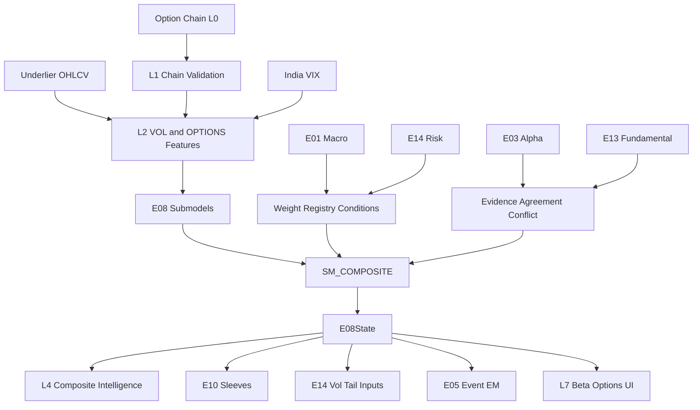

# E08 — Volatility & Options Intelligence Engine  
## Engineering Implementation Specification (AGI Investment Office)

**Document ID:** `E08`  
**Architecture compliance:** **E00 Constitution — Architecture v1.0** (binding)  
**Status:** Implementation-ready Candidate-track specification  
**Version:** 1.0.0  
**Owner:** Derivatives Research Lead / Head of Quantitative Research  
**Lifecycle (E00 §18):** starts **Experimental** → **Research** → **Candidate** → **Production** via gated rollout (§16)

### E00 supremacy

This specification is subordinate to `E00_AGI_INVESTMENT_OFFICE_CONSTITUTION.md`. On conflict, **E00 wins** (E00 Constitutional supremacy).  
Every PR implementing E08 **must cite E00 section IDs** (E00 Annex A).

### Relationship to current AGIB stack (reuse)

| Existing asset | Path | E08 role |
|----------------|------|----------|
| India VIX / index facts | `marketSessionFactsService.js`, Groww `INDIA VIX` | `VOL_` / index vol features (L0–L2) |
| ATR / realised helpers | `marketIntelligenceEngine.js`, `indicators.js` | Seed `VOL_RV_*` until full chain feed |
| E01 / E02 / E03 / E13 / E14 specs | `intelligence-engine/E0*.md` | Upstream contracts (E00 §3) |
| Intelligence routes | `server/routes/intelligence.js` | `/api/intelligence/e08/*` (E00 §14) |
| Feature / signal registries | E00 §6–§7 | Mandatory registration before Production |

**Net-new:** option-chain warehouse, IV surface & term structure, dealer/GEX research models, expected move, event vol, composite vol intelligence, Bloomberg-style options UI, validation harness.

### Hard rules (E00-aligned)

1. **Research only** — never BUY/SELL/EXECUTE (E00 §1.5).  
2. Contributes **evidence** into Composite Intelligence (L4); does not sole-author CIO conclusions (E00 §2.5, §10).  
3. Outputs obey **EngineState envelope** (E00 §5).  
4. Scores use **0–100** or declared polarity (E00 §8); risk-like intensities use `higher_is_more_risk` or explicit sentiment polarity.  
5. Confidence uses **`conf-1.0`** (E00 §9).  
6. Evidence pack mandatory (E00 §10).  
7. Weights via **Weight Registry** — no silent hardcoded Production blends (E00 §12).  
8. Promotion requires **E14** gate (E00 §3, §11, §17).  
9. Unregistered `OPTIONS_` / `VOL_` features cannot feed Production (E00 §6).

---

# 1. Purpose

## 1.1 Investment questions answered

1. **What is the volatility regime** for index, sector, and single-name underliers?  
2. **Is implied vol rich or cheap** vs realised / history (IV rank/percentile)?  
3. **What does the surface say** — term structure, skew, smile, forward vol?  
4. **How are dealers positioned** (gamma/vanna/charm research estimates), and what pinning / acceleration risks follow?  
5. **What expected move** is priced into near-dated options around events?  
6. **Should Composite Intelligence / E10** favour tail-hedge research vs short-vol research sleeves?  
7. **What evidence** supports or contradicts directional views from E03/E13?

## 1.2 Mission under E00

E08 is a **specialist institutional alpha / evidence engine** (E00 §3 registry: Volatility & Options Intelligence). It consumes E01, E02, E03, E13, E14 and produces options-derived intelligence for L4 Composite Intelligence and downstream consumers — **without** creating final trade decisions (E00 §1.5, §11).

## 1.3 Non-goals

| Non-goal | Owner instead |
|----------|----------------|
| Portfolio optimisation | E10 (E00 §2.6) |
| Macro regime invention | E01 |
| Factor exposure measurement | E02 |
| XS price alpha primary | E03 |
| Fundamental quality primary | E13 |
| Firm risk gates / sizing law | E14 |
| Order routing / market making EMS | Future Execution Constitution (E00 §20) |

---

# 2. Institutional Philosophy

## 2.1 Market-structure first

Options prices embed **distributional forecasts** and **intermediary hedging flows**. E08 treats:

- IV and surface geometry as **information**,  
- dealer hedging approximations as **fragile but useful research priors**,  
- realised/IV gaps as **relative value research**, not arb execution.

Inspired by SIG / Citadel Securities / Jane Street / Optiver / DRW / IMC market-structure discipline and GS/JPM derivatives research packaging — adapted to **research-only** AGI constraints (E00 §1.5).

## 2.2 Principles

1. **Separate measurement from narrative** — numbers first; LLM last (E00 §2.7).  
2. **SpotGamma-like concepts are methodology inspirations**, not branded product claims; AGI implements transparent formulas under `OPTIONS_` / `VOL_` IDs (E00 §6).  
3. **Dealer models are estimates** — always ship `warnings` and confidence haircuts when chain quality is poor (E00 §5, §9).  
4. **Event vol ≠ continuous vol** — earnings/macro calendars split models.  
5. **India-primary, global overlay** — Nifty/Bank Nifty chains first; US index/single-name optional.  
6. **Explainability mandatory** for CIO path (E00 §10, §17).

## 2.3 Role in conflict ladder (E00 §11)

- E08 **never overrides** E14/E01.  
- E08 may **haircut or strengthen evidence** for E03/E13 directional views.  
- In E01 `crisis` / E14 `hard_derisk`, E08 up-weights **tail-hedge research** evidence and down-weights **short-vol harvest** evidence via Weight Registry conditions (E00 §12).

---

# 3. Volatility Taxonomy

## 3.1 Hierarchy (signal domains)

```
E08 Taxonomy
├── VOL measurement
│   ├── Historical Volatility
│   ├── Realised Volatility
│   ├── Implied Volatility
│   ├── Forward Volatility
│   ├── Term Structure
│   ├── Volatility Surface
│   ├── Skew / Smile
│   └── Volatility Regimes
├── OPTIONS structure / flow
│   ├── Open Interest / OI Flow
│   ├── Put-Call structure (PCR)
│   ├── Max Pain (research heuristic)
│   ├── Expected Move
│   └── Event / Earnings Volatility
├── Dealer / intermediary research
│   ├── Gamma / Net Gamma / Dealer Gamma
│   ├── Dealer Delta
│   ├── Vanna / Charm (research)
│   ├── Dealer Inventory proxies
│   └── Pinning / acceleration regimes
├── Scope slices
│   ├── Index Volatility
│   ├── Sector Volatility
│   └── Single Stock Volatility
└── Meta
    ├── Tail Hedging research score
    └── Composite Volatility Intelligence
```

## 3.2 Dictionary

### Historical Volatility
Close-to-close or OHLC estimators over fixed windows (10/20/60/120d). Baseline for IV richness.

### Realised Volatility
High-frequency-aware when available; else Parkinson/Garman–Klass/Yang–Zhang on daily bars. Feeds IV–RV gap.

### Implied Volatility
BS/BAW (as appropriate) IV from mid prices; surface interpolated (delta or moneyness × tenor).

### Forward Volatility
Implied forward vol between tenors from variance term structure.

### Term Structure
IV vs tenor; contango/backwardation classification.

### Volatility Surface
IV(k, T) grid; arbitrage checks (butterfly/calendar) as data-quality gates (E00 §2.2).

### Skew / Smile
Risk reversals, butterfly, 25Δ skew; smile curvature metrics.

### Volatility Regimes
`low_vol | normal_vol | high_vol | crisis_vol` aligned with E01 `R_VOL` but **options-measured** (may diverge → conflict evidence, E00 §11).

### Dealer Positioning
Research estimate of intermediary net gamma/delta from OI under sign assumptions (customer buy/sell conventions documented).

### Gamma / Vanna / Charm
Aggregate Greek exposures for hedging-flow narratives; always labeled **estimate**.

### Dealer Inventory
Proxy from persistent OI imbalances + dealer gamma sign; low confidence without PB data.

### Tail Hedging
Research attractiveness of long convexity given skew, term, E01/E14 stress.

### Event / Earnings Volatility
IV crush/expansion patterns around calendars; expected move vs realised event move.

### Index / Sector / Single-Stock Volatility
Scope parameter `scope∈{index,sector,symbol}` on all major outputs.

---

# 4. Sub Models

Package: `intelligence-engine/app/engines/e08/submodels/` (E00 §19).

### Common interface (extends E00 §5)

```python
class E08SubModelResult(TypedDict):
    model_id: str
    signal_ids: list[str]
    score_0_100: float
    polarity: str
    confidence: float                 # conf-1.0
    features: dict[str, float]
    evidence: dict                    # E00 §10 buckets
    explanation: dict
    warnings: list[str]
    as_of: str
    scope: str                        # index|sector|symbol
    scope_id: str
    stale: bool
    model_version: str
```

---

### 4.1 Historical Volatility Model (`SM_HV`)
| | |
|--|--|
| **Purpose** | Close-to-close HV windows |
| **Inputs** | Adjusted prices |
| **Outputs** | `VOL_HV_10D/20D/60D/120D` |
| **Dependencies** | L2 prices |
| **Confidence** | High with ≥120 sessions |

### 4.2 Realised Volatility Model (`SM_RV`)
| | |
|--|--|
| **Purpose** | Parkinson / GK / YZ realised estimators |
| **Inputs** | OHLCV |
| **Outputs** | `VOL_RV_*`, `VOL_RV_YZ_20D` |
| **Dependencies** | None |
| **Confidence** | High |

### 4.3 IV Model (`SM_IV`)
| | |
|--|--|
| **Purpose** | Mark IV from chain mids; ATM & by delta |
| **Inputs** | Option chain, rates/div yield proxies |
| **Outputs** | `OPTIONS_IV_ATM_*`, surface nodes |
| **Dependencies** | Chain validation (E00 §2.2) |
| **Confidence** | Medium–High (spread-dependent) |

### 4.4 IV Rank / Percentile Model (`SM_IVR`)
| | |
|--|--|
| **Purpose** | IV richness vs 1y history |
| **Inputs** | ATM IV history |
| **Outputs** | `OPTIONS_IV_RANK_1Y`, `OPTIONS_IV_PCTILE_1Y` |
| **Dependencies** | SM_IV history store |
| **Confidence** | Needs ≥6m history else haircut |

### 4.5 Term Structure Model (`SM_TERM`)
| | |
|--|--|
| **Purpose** | Contango/backwardation, forward vol |
| **Inputs** | ATM IV by tenor |
| **Outputs** | `OPTIONS_TERM_SLOPE`, `OPTIONS_FWD_VOL_*`, term regime |
| **Dependencies** | SM_IV |
| **Confidence** | Medium |

### 4.6 Volatility Surface Model (`SM_SURFACE`)
| | |
|--|--|
| **Purpose** | Interpolated IV(k,T); arb quality flags |
| **Inputs** | Full chain IVs |
| **Outputs** | Surface grid, `OPTIONS_SMILE_CURV`, quality score |
| **Dependencies** | SM_IV |
| **Confidence** | Falls with missing strikes |

### 4.7 Gamma Exposure Model (`SM_GEX`)
| | |
|--|--|
| **Purpose** | Aggregate gamma exposure research (GEX-style) |
| **Inputs** | OI, gamma, spot, contract multipliers |
| **Outputs** | `OPTIONS_GEX_NET`, `OPTIONS_GEX_FLIP`, gamma score |
| **Dependencies** | Chain + assumptions registry |
| **Confidence** | Medium — assumption-sensitive; always warn |

### 4.8 Dealer Positioning Model (`SM_DEALER`)
| | |
|--|--|
| **Purpose** | Dealer gamma/delta/vanna/charm proxies |
| **Inputs** | GEX, OI side assumptions, volume |
| **Outputs** | Dealer positioning score, regime `long_gamma|short_gamma|mixed` |
| **Dependencies** | SM_GEX, SM_OI |
| **Confidence** | Medium–Low without PB confirms |

### 4.9 OI Flow Model (`SM_OI`)
| | |
|--|--|
| **Purpose** | OI level, ΔOI, concentration, velocity |
| **Inputs** | OI, volume, strikes |
| **Outputs** | `OPTIONS_OI_*` features; concentration score |
| **Dependencies** | Chain history |
| **Confidence** | High measurement / medium interpretation |

### 4.10 PCR Model (`SM_PCR`)
| | |
|--|--|
| **Purpose** | Put/call ratios (OI & volume) |
| **Inputs** | Put/call OI & volume |
| **Outputs** | `OPTIONS_PCR_OI`, `OPTIONS_PCR_VOL`, sentiment contribution |
| **Dependencies** | None |
| **Confidence** | Medium (contrarian vs momentum regimes) |

### 4.11 Max Pain Model (`SM_MAXPAIN`)
| | |
|--|--|
| **Purpose** | Max-pain strike heuristic for expiry clustering research |
| **Inputs** | OI by strike |
| **Outputs** | `OPTIONS_MAX_PAIN`, distance to spot |
| **Dependencies** | OI |
| **Confidence** | **Low–Medium** — labeled heuristic; never sole driver (E00 §10) |

### 4.12 Event Volatility Model (`SM_EVENT_VOL`)
| | |
|--|--|
| **Purpose** | Earnings/macro expected move & crush/expansion |
| **Inputs** | Near-dated IV, straddle mid, calendar (E05 companion) |
| **Outputs** | `OPTIONS_EXPECTED_MOVE`, event vol score |
| **Dependencies** | Earnings/macro calendar L0 |
| **Confidence** | High near events if chain liquid |

### 4.13 Composite Volatility Model (`SM_COMPOSITE`)
| | |
|--|--|
| **Purpose** | Fuse into E08 Production signals for L4 |
| **Inputs** | All submodels + E01/E14 weight conditions |
| **Outputs** | §9 outputs envelope |
| **Dependencies** | Weight Registry (E00 §12) |
| **Confidence** | conf-1.0 ensemble |

---

# 5. Inputs

## 5.1 Options market
Option chain (strike, expiry, CP flag, bid/ask/mid, volume, OI, IV, delta/gamma/theta/vega/vanna/charm if vendor-supplied or computed), underlying spot/futures, multipliers, lot sizes.

## 5.2 Underlier & calendar
Historical OHLCV, corporate actions, earnings calendar, macro calendar, index membership, sector map.

## 5.3 Upstream engines (E00 §3)

| Engine | Fields consumed |
|--------|-----------------|
| **E01** | `R_VOL`, `R_STRESS`, `R_RISK`, `weight_adjustments` for E08_tail / E08_short_vol |
| **E02** | LowVol / IdioVol context; factor residual checks |
| **E03** | Directional score for agreement/conflict evidence |
| **E13** | Event proximity / fundamental stress for event vol interpretation |
| **E14** | Playbook, confidence_adjustment, gate on promotion |

## 5.4 Input registry (canonical IDs)

| input_id | Description |
|----------|-------------|
| `OPT_CHAIN` | Full chain snapshot |
| `OPT_OI` / `OPT_OI_CHG` | Open interest & change |
| `OPT_VOLUME` | Option volume |
| `OPT_IV` | Implied vol |
| `OPT_GREEKS` | Greeks vector |
| `UND_SPOT` / `UND_FUT` | Underlier |
| `UND_OHLCV` | History |
| `CAL_EARNINGS` | Earnings dates |
| `CAL_MACRO` | Macro events |
| `E01_STATE` / `E02_EXPOSURE` / `E03_ALPHA` / `E13_FUNDAMENTAL` / `E14_STATE` | Upstream |
| `ASSUMPTION_SET_ID` | Dealer sign conventions version |

## 5.5 APIs & refresh (E00 §2.1 / §14)

| Family | Primary | Refresh | Cost | Reliability | Fallback |
|--------|---------|---------|------|-------------|----------|
| India index options | NSE/Groww derivatives feeds (licensed path) | Intraday→EOD | Token/license | Medium | EOD bhav-style snapshots |
| Single-stock options | Same | EOD v1 | License | Medium | Disable SSO scope |
| IV/Greeks | Vendor or internal BS engine | On snapshot | Compute | Medium | Mid-only IV |
| US overlay optional | Finnhub/options vendor | EOD | Paid | Medium | Off by flag |
| India VIX | Existing Groww/market stack | 1d/intraday | Existing | High | Always keep as stub |
| Calendars | Finnhub + internal | 1d | Existing | Medium | Manual CMS |

**Env:** derivatives API keys, `GROWW_ACCESS_TOKEN`, Finnhub, Supabase, engine URLs. Never `VITE_` for secrets (E00 §19.6).

---

# 6. Feature Engineering

Feature IDs obey E00 §6 prefixes `VOL_` and `OPTIONS_`.

| feature_id | Definition |
|------------|------------|
| `VOL_HV_20D` | Close-to-close HV 20d ann. |
| `VOL_RV_YZ_20D` | Yang–Zhang RV 20d |
| `VOL_RV_RATIO_20_60` | RV20/RV60 |
| `OPTIONS_IV_ATM_7D` / `_30D` / `_90D` | ATM IV tenors |
| `OPTIONS_IV_RANK_1Y` | (IV−min)/(max−min) over 1y |
| `OPTIONS_IV_PCTILE_1Y` | Percentile rank of ATM IV |
| `OPTIONS_IV_RV_GAP_30D` | ATM30 − RV20 |
| `OPTIONS_TERM_SLOPE` | IV90 − IV30 (or log-tenor regression slope) |
| `OPTIONS_FWD_VOL_30_90` | Forward vol 30×90 |
| `OPTIONS_SKEW_25D` | 25Δ put IV − 25Δ call IV |
| `OPTIONS_SMILE_CURV` | Butterfly / curvature proxy |
| `OPTIONS_EXPECTED_MOVE_ABS` | Near straddle → % move |
| `OPTIONS_EXPECTED_MOVE_PCT` | Expected move / spot |
| `OPTIONS_GEX_NET` | Aggregate GEX research |
| `OPTIONS_GEX_FLIP` | Spot level where net GEX flips sign |
| `OPTIONS_DEALER_GAMMA` | Signed dealer gamma proxy |
| `OPTIONS_DEALER_DELTA` | Signed dealer delta proxy |
| `OPTIONS_VANNA_NET` | Aggregate vanna proxy |
| `OPTIONS_CHARM_NET` | Aggregate charm proxy |
| `OPTIONS_PCR_OI` | Put OI / Call OI |
| `OPTIONS_PCR_VOL` | Put vol / Call vol |
| `OPTIONS_OI_CONC` | HHI of OI across strikes |
| `OPTIONS_OI_VELOCITY` | z(ΔOI) short window |
| `OPTIONS_MAX_PAIN` | Max-pain strike |
| `OPTIONS_MAX_PAIN_DIST` | (spot − max_pain)/spot |
| `OPTIONS_VOL_COMPRESS` | IV rank↓ & term contango & RV↓ composite z |
| `OPTIONS_VOL_EXPAND` | Inverse expansion composite |
| `VOL_REGIME_IDX` | Mapped 0–3 regime index |
| `META_CHAIN_QUALITY` | Spread/coverage score 0–1 |

**Normalisation (E00 §6):** winsorise + z or rank_pct as declared per feature; surface nodes store raw IV in decimal/percent consistently (`units` field).

---

# 7. Mathematical Models

## 7.1 Realised / historical vol

**Close-to-close HV**  
\[
\sigma_{cc}=\sqrt{\frac{252}{n}\sum_{i=1}^{n} r_i^2},\quad r_i=\ln(P_i/P_{i-1})
\]

**Yang–Zhang (preferred daily RV)** — standard YZ estimator with overnight + open–close + RS components (implementation in `sm_rv.py`; unit tests vs reference values).

**Range:** typically 8%–80% ann. for India index; single stocks wider.  
**Thresholds:** RV20/RV60 > 1.5 → expansion evidence.

## 7.2 Implied vol & expected move

**ATM IV:** interpolate calls/puts near Δ=0.5 or strike≈spot/futures.

**Expected move (near expiry)** research default:  
\[
\mathrm{EM} \approx 0.85 \times \mathrm{StraddleMid}/S
\]
(calibrate 0.8–1.0 by underlier; store `ASSUMPTION_SET_ID`).

**IV Rank**  
\[
\mathrm{IVR}=\frac{\mathrm{IV}_t-\min_{1y}\mathrm{IV}}{\max_{1y}\mathrm{IV}-\min_{1y}\mathrm{IV}+\varepsilon}
\]
**IV Percentile:** empirical CDF over 1y.

**Ranges:** IVR/IVP ∈[0,1] → score `100*IVP` for richness displays with polarity `higher_is_more_expensive_vol`.

## 7.3 Term structure & forward vol

For tenors \(T_1<T_2\) in years, variance \(v=IV^2 T\):  
\[
\sigma_{\mathrm{fwd}}(T_1,T_2)=\sqrt{\frac{IV_2^2 T_2 - IV_1^2 T_1}{T_2-T_1}}
\]
**Term slope:** \(IV_{long}-IV_{short}\).  
**Behaviour:** Contango common in calm; inversion → stress evidence (aligns with E01 high_vol/crisis checks, E00 §11).

## 7.4 Skew / smile

**25Δ skew:** \(IV_{25p}-IV_{25c}\).  
**Normalisation:** sector/index z over 1y.  
**Thresholds:** z>1 → bid for downside protection (tail-hedge evidence↑).

## 7.5 GEX / dealer gamma (research)

Per option:  
\[
\mathrm{GEX}_j = \gamma_j \cdot \mathrm{OI}_j \cdot M \cdot S^2 \cdot \alpha_j
\]
where \(M\) is multiplier, \(\alpha_j\) is sign convention from `ASSUMPTION_SET_ID` (customer-long calls/puts → dealer short; document in registry).

\[
\mathrm{GEX}_{net}=\sum_j \mathrm{GEX}_j
\]

**Flip level:** scan spot grid for sign change of net GEX.  
**Gamma score (0–100):** map dealer long-gamma (stabilising) to higher **stability** score; short-gamma to higher **acceleration risk** score — expose **two** scores to avoid polarity confusion (E00 §8.4):

- `SIG_E08_GAMMA_STABILITY` — higher = more long-gamma cushion  
- `SIG_E08_GAMMA_ACCEL_RISK` — higher = more short-gamma fragility (`higher_is_more_risk`)

## 7.6 PCR

\[
PCR_{OI}=\frac{\sum OI_{put}}{\sum OI_{call}},\quad PCR_{vol}=\frac{V_{put}}{V_{call}}
\]
Map to options sentiment via Weight Registry regime conditions (contrarian in calm; caution in crisis).

## 7.7 Max pain

Strike \(K^*\) minimising aggregate option payoff to holders given OI — standard max-pain definition.  
**Validation:** track |spot−K*| at expiry; low standalone IC expected — confidence capped ≤0.55 (E00 §9).

## 7.8 Composite scores (Weight Registry)

Family scores → Weight Registry set `e08_composite_v1` conditioned on E01/E14 (E00 §12):

| Condition | Tail-hedge family ↑ | Short-vol family ↑ | Directional confirmation |
|-----------|---------------------|--------------------|--------------------------|
| E01 crisis / E14 hard_derisk | ×1.40 | ×0.20 | Haircut |
| E01 high_vol / E14 elevated | ×1.15 | ×0.70 | Neutral |
| E01 low_vol + risk_on | ×0.80 | ×1.10 | Allow |
| Default | 1.00 | 1.00 | 1.00 |

Exact numeric weights live in `agi_weight_registry`, not hardcoded in Production code paths.

## 7.9 Validation hooks per formula

Unit tests: YZ vs reference series; IV inversion stability; GEX sign convention fixtures; EM vs next-day realised absolute move MAE; skew z windows.

## 7.10 Historical behaviour notes

- IVP>80 often precedes vol mean-reversion **or** crisis persistence — E01/E14 disambiguate.  
- Term inversion cluster around stress (2008/2020 analogues).  
- Positive dealer gamma associated with pinning / lower realised vs IV in calm samples (research literature; AGI tracks empirically).

---

# 8. Machine Learning

Governed by E00 §17.

| Technique | Use | Gate |
|-----------|-----|------|
| Regime classification | Vol regime HMM/GBM on IVP, term, skew, RV ratio | Offline + shadow |
| Volatility forecasting | HAR-RV / ML hybrid for RV horizon 1d/5d/21d | Champion–challenger |
| Surface modelling | SVI/spline params as features; anomaly detection | Research |
| Dealer flow prediction | Next-day |spot| move intensity from GEX/OI velocity | Low confidence until validated |
| SHAP | Explain composite & forecasts | Mandatory on promote |
| Explainability | top_drivers in envelope | E00 §5 / §10 |

**Promotion:** ML outputs cannot sole-drive L7 without human approval + E14 (E00 §17.1).

---

# 9. Outputs

## 9.1 Canonical `E08State` (E00 §5 envelope + body)

```json
{
  "engine": "E08",
  "version": "1.0.0",
  "model_version": "e08-1.0.0",
  "as_of": "2026-07-25T16:00:00+05:30",
  "universe_id": null,
  "symbol": null,
  "scope": "index",
  "scope_id": "NIFTY",
  "score": {
    "raw": null,
    "normalized_0_100": 62.0,
    "normalized_signed": null,
    "unit": "score"
  },
  "confidence": {
    "value": 0.71,
    "components": {
      "C_data": 0.9,
      "C_agree": 0.8,
      "C_hist": 0.75,
      "C_regime": 0.85,
      "C_stable": 0.8,
      "C_n": 1.0,
      "C_complete": 0.85,
      "C_recency": 0.95
    },
    "method_version": "conf-1.0"
  },
  "reliability": {
    "sample_size": 252,
    "historical_accuracy": 0.58,
    "stability": 0.8
  },
  "volatility_score": 62.0,
  "dealer_positioning_score": 48.0,
  "gamma_stability_score": 55.0,
  "gamma_accel_risk_score": 45.0,
  "options_sentiment_score": 52.0,
  "expected_move_pct": 0.012,
  "volatility_regime": "normal_vol",
  "term_structure_state": "contango",
  "iv_rank_1y": 0.44,
  "iv_percentile_1y": 0.51,
  "skew_25d": 0.06,
  "gex_net": 1.2e11,
  "gex_flip": 24850.0,
  "pcr_oi": 1.05,
  "max_pain": 24700.0,
  "tail_hedge_research_score": 58.0,
  "short_vol_research_score": 42.0,
  "signals": {
    "SIG_E08_VOLATILITY": 62.0,
    "SIG_E08_DEALER_POS": 48.0,
    "SIG_E08_GAMMA_STABILITY": 55.0,
    "SIG_E08_GAMMA_ACCEL_RISK": 45.0,
    "SIG_E08_OPTIONS_SENTIMENT": 52.0,
    "SIG_E08_TAIL_HEDGE": 58.0,
    "SIG_E08_SHORT_VOL": 42.0
  },
  "polarity": {
    "volatility_score": "higher_is_more_vol_pressure",
    "gamma_accel_risk_score": "higher_is_more_risk",
    "options_sentiment_score": "higher_is_more_bullish_options_sentiment",
    "tail_hedge_research_score": "higher_is_more_attractive_tail_hedge_research"
  },
  "metadata": {
    "assumption_set_id": "dealer_sign_v1",
    "chain_quality": 0.82,
    "e01_ref": {},
    "e03_ref": {},
    "e13_ref": {},
    "e14_ref": {}
  },
  "evidence": {
    "positive": [],
    "negative": [],
    "contradictions": [],
    "unknowns": ["Dealer sign convention unverified by PB data"],
    "risks": ["Short-gamma acceleration if spot breaks flip"],
    "missing_data": []
  },
  "explanation": {
    "summary": "ATM IV near median; term contango; dealer gamma mixed near flip.",
    "top_drivers": [],
    "falsifiers": ["IVP > 0.85 with term inversion", "E14 hard_derisk"]
  },
  "warnings": ["GEX is a research estimate"],
  "stale_inputs": [],
  "input_hash": "sha256:...",
  "hash": "sha256:...",
  "timestamp_generated": "2026-07-25T16:05:00+05:30"
}
```

## 9.2 Signal registry entries (E00 §7)

| signal_id | Type | Range | Consumers |
|-----------|------|-------|-----------|
| `SIG_E08_VOLATILITY` | score | 0–100 | L4, E14, E10 |
| `SIG_E08_DEALER_POS` | score | 0–100 | L4, E03 conflict |
| `SIG_E08_GAMMA_STABILITY` | score | 0–100 | L4, E10 |
| `SIG_E08_GAMMA_ACCEL_RISK` | score | 0–100 | E14, L4 |
| `SIG_E08_OPTIONS_SENTIMENT` | score | 0–100 | L4, E11 |
| `SIG_E08_EXPECTED_MOVE` | score/metric | pct | E05, E03 |
| `SIG_E08_VOL_REGIME` | regime | enum | E01 compare, L4 |
| `SIG_E08_TAIL_HEDGE` | score | 0–100 | E10 sleeve |
| `SIG_E08_SHORT_VOL` | score | 0–100 | E10 sleeve (gated) |

---

# 10. Downstream Consumers

Influence rules respect E00 §11 (haircut vs override).

| Consumer | Influence |
|----------|-----------|
| **E03** | Agreement/conflict evidence vs directional alpha; expected move widens uncertainty → confidence haircut; does **not** rewrite `SM_AGI_TECH` |
| **E04** | Elevate disable risk when gamma accel high / vol regime crisis; widen mean-rev bands research note |
| **E05** | Event expected move & crush priors; earnings vol score |
| **E09** | Trend confidence haircut when short-gamma / high IVP expansion |
| **E10** | Sleeve weights: `E08_TAIL` vs `E08_SHORT_VOL` via Weight Registry + E01/E14; vol targeting inputs |
| **E11** | Options sentiment vs news sentiment divergence flags |
| **E12** | Features `OPTIONS_*`/`VOL_*` for lab; promotion still E14-gated |
| **E13** | Event vol context around results; fundamental-technical-options triad conflicts to L4 |
| **E14** | Consumes gamma accel, IVP, chain liquidity into `RK_VOL`/`RK_TAIL`/`RK_GAP`; E08 does not replace E14 |
| **Composite Intelligence (L4)** | Primary evidence contributor for vol regime, dealer, EM, tail vs short-vol research |

---

# 11. Database Design

Complies with E00 §13.

```sql
-- Registry sync (global; shared)
-- agi_feature_registry / agi_signal_registry / agi_weight_registry (E00 §6/7/12)

CREATE TABLE e08_chain_snapshot (
  as_of timestamptz NOT NULL,
  scope text NOT NULL,
  scope_id text NOT NULL,
  expiry date NOT NULL,
  strike double precision NOT NULL,
  cp text NOT NULL CHECK (cp IN ('C','P')),
  bid double precision,
  ask double precision,
  mid double precision,
  volume double precision,
  oi double precision,
  iv double precision,
  delta double precision,
  gamma double precision,
  vega double precision,
  theta double precision,
  vanna double precision,
  charm double precision,
  vendor text NOT NULL,
  meta jsonb DEFAULT '{}',
  PRIMARY KEY (as_of, scope, scope_id, expiry, strike, cp, vendor)
);
CREATE INDEX e08_chain_scope_idx ON e08_chain_snapshot (scope, scope_id, as_of DESC);

CREATE TABLE e08_feature_snapshot (
  as_of timestamptz NOT NULL,
  scope text NOT NULL,
  scope_id text NOT NULL,
  feature_id text NOT NULL,
  value double precision,
  z_value double precision,
  units text,
  meta jsonb DEFAULT '{}',
  PRIMARY KEY (as_of, scope, scope_id, feature_id)
);

CREATE TABLE e08_state (
  id uuid PRIMARY KEY DEFAULT gen_random_uuid(),
  as_of timestamptz NOT NULL,
  scope text NOT NULL,
  scope_id text NOT NULL,
  payload jsonb NOT NULL,
  volatility_score double precision NOT NULL,
  volatility_regime text NOT NULL,
  confidence double precision NOT NULL,
  model_version text NOT NULL,
  input_hash text NOT NULL,
  assumption_set_id text NOT NULL,
  created_at timestamptz DEFAULT now(),
  UNIQUE (as_of, scope, scope_id, model_version)
);
CREATE INDEX e08_state_scope_idx ON e08_state (scope, scope_id, as_of DESC);

CREATE TABLE e08_state_current (
  scope text NOT NULL,
  scope_id text NOT NULL,
  as_of timestamptz NOT NULL,
  payload jsonb NOT NULL,
  updated_at timestamptz NOT NULL DEFAULT now(),
  PRIMARY KEY (scope, scope_id)
);

CREATE TABLE e08_surface_grid (
  as_of timestamptz NOT NULL,
  scope text NOT NULL,
  scope_id text NOT NULL,
  tenor_days int NOT NULL,
  moneyness double precision NOT NULL,
  iv double precision NOT NULL,
  PRIMARY KEY (as_of, scope, scope_id, tenor_days, moneyness)
);

CREATE TABLE e08_assumption_sets (
  assumption_set_id text PRIMARY KEY,
  description text NOT NULL,
  rules jsonb NOT NULL,
  created_at timestamptz DEFAULT now(),
  is_active boolean DEFAULT false
);

CREATE TABLE e08_validation_runs (
  id uuid PRIMARY KEY DEFAULT gen_random_uuid(),
  started_at timestamptz,
  finished_at timestamptz,
  method text,
  metrics jsonb,
  model_version text
);

CREATE TABLE e08_migration_flags (
  key text PRIMARY KEY,
  enabled boolean NOT NULL DEFAULT false,
  updated_at timestamptz DEFAULT now()
);
```

**PIT / audit:** chain snapshots append-only; scores versioned; `assumption_set_id` required on state (E00 §13.4–13.5).  
**RLS:** service write; authenticated research read (E00 §13.6).  
**Cache:** current state 60s (E00 §14.6).

---

# 12. Backend Services

E00 §19 layout:

```
intelligence-engine/app/engines/e08/
  __init__.py
  config.py
  pipeline.py
  schema.py                 # E08State pydantic (E00 §5)
  assumptions/
    registry.py
  chain/
    ingest.py
    validate.py             # L1 checks
    greeks_bs.py
  features/
    registry_sync.py        # E00 §6
    builder.py
    transforms.py
  submodels/
    hv.py
    rv.py
    iv.py
    iv_rank.py
    term.py
    surface.py
    gex.py
    dealer.py
    oi_flow.py
    pcr.py
    max_pain.py
    event_vol.py
    composite.py
  models/
    regime_ml.py
    forecast_har.py
  adapters/
    e01.py
    e02.py
    e03.py
    e13.py
    e14.py
    market_vix.py
  explain.py
  persistence.py
  validation/
    walk_forward.py
    event_tests.py
```

Node: `server/services/e08OptionsService.js` proxying `/api/intelligence/e08/*`.

## 12.1 Pipeline (`pipeline.run_e08`) — E00 §4

1. Ingest chain + underlier (L0)  
2. Validate spreads/OI/monotonic expiry (L1) — fail closed on critical (E00 §2.2)  
3. Build `VOL_` / `OPTIONS_` features (L2)  
4. Run submodels  
5. Load E01/E03/E13/E14 refs; select Weight Registry set  
6. Composite + conf-1.0 + evidence pack  
7. Persist `e08_state` / current  
8. Emit metrics: latency, chain_quality, stale_ratio (E00 §1.6, §19.5)

## 12.2 Jobs / cron (IST)

| Job | Schedule | Action |
|-----|----------|--------|
| `e08_chain_intraday` | 10:00, 12:30, 14:30 IST | Index chain refresh (when licensed) |
| `e08_eod` | 16:20 IST | Full index + liquid SSO |
| `e08_after_e01` | post E01 | Regime-conditioned reweight |
| `e08_event_prep` | 08:40 IST | Earnings EM pack |
| `e08_weekly_validate` | Sunday 18:00 IST | Forecast error + fixtures |
| `e08_monthly_promote_review` | 1st 20:30 IST | Lifecycle metrics |

**Order key:** E00 §3.2 specialised parallel after E01/E14 prior and core features; before L4/E10.

## 12.3 SLOs

| SLO | Target |
|-----|--------|
| EOD index state | p95 < 120s after chain ready |
| Warm GET state | < 300ms |
| Critical chain validation fail | 0 silent passes |
| Assumption set present | 100% states |

---

# 13. API Contracts

E00 §14 compliant.

### 13.1 `GET /api/intelligence/e08/state?scope=index&scope_id=NIFTY`
Current `E08State`.

### 13.2 `GET /api/intelligence/e08/surface?scope=&scope_id=`
Surface grid for viewer.

### 13.3 `GET /api/intelligence/e08/gex?scope=&scope_id=`
GEX profile by strike + flip.

### 13.4 `GET /api/intelligence/e08/expected-move?scope=&scope_id=&event_id=`

### 13.5 `GET /api/intelligence/e08/history?scope=&scope_id=&limit=252`

### 13.6 `POST /api/intelligence/e08/run`
Service-role: `{ "scope", "scope_id", "reason" }`.

### 13.7 `GET /api/intelligence/e08/taxonomy` / `assumptions`

### 13.8 Errors
`E08_CHAIN_INVALID`, `E08_SCOPE`, `E08_STALE`, `E08_ASSUMPTION`, `E08_INTERNAL` (+ `degraded` flag).

---

# 14. Frontend (Bloomberg-style)

E00 §15 required views: Overview, Evidence, Historical Timeline, Confidence, Risk, Attribution.

Route: `/beta/e08-options` behind flags (§16). Watermark **RESEARCH/CANDIDATE** until Production (E00 §18).

## 14.1 Widgets

1. **Options / Vol Hero** — vol score, regime, IVP/IVR, confidence, as-of, model_version  
2. **Volatility Dashboard** — HV/RV/IV ribbons, IV–RV gap  
3. **Surface Viewer** — heatmap IV(moneyness, tenor)  
4. **Term Structure Chart** — ATM IV curve + forward vols  
5. **Skew Panel** — 25Δ skew history  
6. **Gamma Dashboard** — GEX by strike, flip line, spot marker  
7. **Dealer Positioning** — long/short gamma regime + warnings  
8. **Expected Move** — EM vs event calendar  
9. **OI / PCR / Max Pain** — flow panels with heuristic labels  
10. **Evidence & Conflicts** — vs E03/E13/E01  
11. **Historical Timeline** — regime ribbon  
12. **Risk strip** — E14 projection  

**Prohibitions (E00 §15.2):** no trade tickets; no raw formula dump as primary UX; never hide GEX assumption warnings.

---

# 15. Validation

E00 §16 mandatory techniques.

| Test | Detail |
|------|--------|
| Walk-forward | IVP/term/GEX features → forward |return| / RV; embargo |
| Historical replay | COVID/2022-style fixtures: regime → high/crisis; term invert |
| Vol forecast error | MAE/RMSE of HAR/ML vs realised; champion–challenger |
| Event testing | EM coverage: fraction of earnings gaps inside EM band |
| Cross-validation | Purged CV for ML regime classifier |
| Stress testing | Chain missing strikes → degraded, not crash; confidence↓ |
| Assumption sensitivity | Flip dealer sign set → scores move; warnings persist |
| PIT | Chain `as_of` alignment; no future OI |

**Targets (research-grade):**

| Metric | Target |
|--------|--------|
| EM coverage (index earnings/events) | Track ≥55–70% depending on tenor |
| Crisis regime recall vs E01 stress weeks | Document agreement rate |
| Max-pain sole-IC | Must remain weak; confidence cap enforced |
| Schema/envelope compliance | 100% |

Store in `e08_validation_runs`.

---

# 16. Migration

Greenfield specialist engine; partial Production today = India VIX/ATR only.

## 16.1 Compatibility guarantees (E00 §20.4)

- No changes to E03 `SM_AGI_TECH` / published technical scores.  
- Market pages keep VIX widgets; E08 adds parallel intelligence APIs.  
- Feature flags default off for UI/CIO attach.  
- No production regressions on `/api/market/*`.

## 16.2 Flags (`e08_migration_flags`)

```json
{
  "e08_api_enabled": false,
  "e08_ui_tab": false,
  "e08_l4_evidence": false,
  "e08_e10_sleeves": false,
  "e08_cio_brief_block": false,
  "e08_single_stock": false,
  "e08_us_overlay": false
}
```

## 16.3 Phased rollout P0–P4 (E00 §18)

| Phase | Scope | Lifecycle | Exit criteria |
|-------|-------|-----------|---------------|
| **P0** | India VIX + RV/HV features; stub `E08State` without full chain; registry rows for `VOL_*` | Experimental | Envelope + conf-1.0 + evidence non-empty |
| **P1** | Index chain EOD ingest; IV/IVR/term/PCR/EM; `/e08/state` | Research | Chain validation gates green; Nifty state daily |
| **P2** | Surface, GEX/dealer, skew; Beta UI; `e08_l4_evidence` flag | Research/Candidate | Assumption set v1 ratified; conflict tests vs E03 |
| **P3** | Event vol calendar join; E10 sleeve hooks; E14 taxonomy feed; SSO liquid names | Candidate | EM event tests published; E14 consumes gamma accel |
| **P4** | ML forecast shadow; champion–challenger; Production lifecycle vote | Production (policy) | E00 §17 gates passed; CIO/Risk approval |

## 16.4 Rollback

Disable flags → VIX-only legacy UX remains; E08 tables retained for audit (E00 §17.3).

---

# 17. Implementation phases (engineering checklist)

| Phase | Deliverables |
|-------|--------------|
| P0 | `schema.py`, VIX/RV adapters, registry sync, pipeline stub, tests for envelope |
| P1 | Chain ingest/validate, IV/term/PCR/EM submodels, persistence, APIs |
| P2 | Surface/GEX/dealer, UI, L4 adapter |
| P3 | Events, E10/E14 adapters, SSO flag |
| P4 | HAR/ML shadow, validation automation, Production review pack |

---

# 18. Non-functional requirements

- Deterministic given chain snapshot + `assumption_set_id` + `model_version` + weight_set_id (E00 §19)  
- Full audit hashes (E00 §5, §13)  
- Fail closed on critical chain invalidation for Production scopes  
- Fail open to VIX/RV-only degraded mode with `degraded=true` when chain absent  
- Secrets in server/engine env only (E00 §19.6)  
- Research disclaimers on all payloads  

---

# 19. Acceptance tests (sample)

1. Fixture calm chain → `volatility_regime` in {low_vol, normal_vol}; term contango common.  
2. Fixture stress inversion + IVP high → regime high/crisis; tail_hedge_research_score > short_vol_research_score under E01 crisis weight set.  
3. Missing bid/ask on >40% strikes → `META_CHAIN_QUALITY` low; confidence↓; warnings non-empty.  
4. `E08State` validates against E00 §5 envelope schema.  
5. Max pain never appears alone in `explanation.summary` without heuristic warning.  
6. Flag `e08_ui_tab=false` → no UI regression.  
7. E14 `hard_derisk` fixture → Weight Registry path suppresses short_vol evidence weight.  
8. Warm GET state < 300ms when current cache warm.

---

# 20. Dependency graph (runtime)



---

# 21. E00 compliance matrix

| E00 section | E08 compliance |
|-------------|----------------|
| §1 Non-goals | No execution / no final BUY-SELL |
| §2 Layers | L0–L3 engine; feeds L4/L5/L7; monitored L8 |
| §3 Registry | Specialist order key ~43; consumers documented |
| §4 Pipeline | Fits specialised alpha stage |
| §5 Contracts | `E08State` envelope |
| §6–§7 | `VOL_`/`OPTIONS_` features; `SIG_E08_*` signals |
| §8 Scores | 0–100 + polarity map |
| §9 Confidence | conf-1.0 components |
| §10 Evidence | Mandatory buckets |
| §11 Conflicts | Haircut/evidence only; E14/E01 override |
| §12 Weights | Registry-conditioned tail vs short-vol |
| §13–§15 | Schema/API/UI standards |
| §16–§18 | Validation + ML gates + lifecycle |
| §19–§20 | Package layout + P0–P4 evolution |

---

*End of E08 Volatility & Options Intelligence Engine Specification v1.0 — governed by E00 Architecture v1.0*
