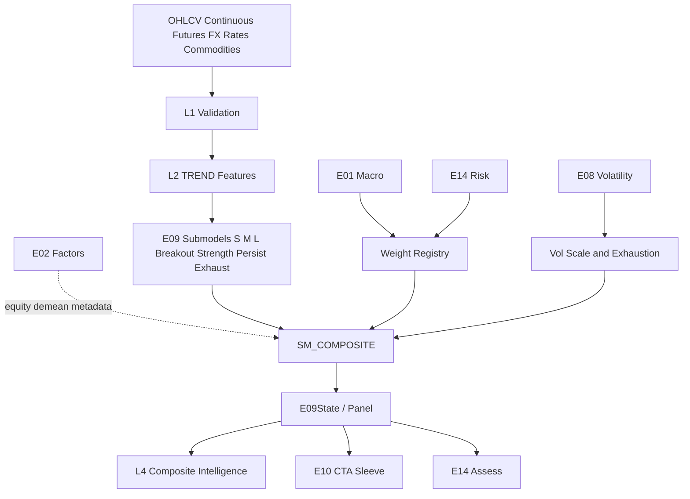

# E09 — CTA / Trend Engine  
## Engineering Implementation Specification (AGI Investment Office)

**Document ID:** `E09`  
**Architecture compliance:** **E00 Constitution — Architecture v1.0** (binding)  
**Status:** Implementation-ready Candidate-track specification  
**Version:** 1.0.0  
**Owner:** Head of Quantitative Research / Managed Futures Research Lead  
**Lifecycle (E00 §18):** **Experimental → Research → Candidate → Production** via §16 gates

### E00 supremacy

Subordinate to `E00_AGI_INVESTMENT_OFFICE_CONSTITUTION.md`. On conflict, **E00 wins**.  
Every implementing PR **must cite E00 section IDs** (E00 Annex A).

### Boundary vs E03 (critical)

| | **E03 Cross-Sectional Quant** | **E09 CTA / Trend** |
|--|-------------------------------|---------------------|
| Object | Stock vs stock **cross-section** | Instrument **time-series** trend |
| Horizon | Days–weeks (tech + XS mom) | Medium–long (weeks–months) |
| Legacy AGI technical score | **Lives in E03 `SM_AGI_TECH`** | **Not used as E09 alpha** |
| Diversification | Equity universe ranks | **Cross-asset** futures-style book research |
| Vol scaling | Secondary | **First-class** (CTA identity) |

E09 is **additive**. E03 formulas and UI paths must not regress (E00 §20.4, §16 herein).

### Relationship to current AGIB stack

| Existing asset | Role for E09 |
|----------------|--------------|
| `nifty500_research_engine.py` / E03 tech | **Out of scope** for E09 signals; optional demean metadata only |
| Index/FX/commodity series via market + macro stacks | L0 price inputs |
| E01 / E02 / E08 / E14 specs | Upstream contracts (E00 §3) |
| `/api/intelligence/*` | Host `/e09/*` (E00 §14) |

**Net-new:** multi-horizon TSMOM, breakout/channel engines, vol targeting per instrument, cross-asset trend panel, CTA-style composite, benchmark comparison harness, Bloomberg trend UI.

### Hard rules (E00-aligned)

1. Research only — never BUY/SELL/EXECUTE (E00 §1.5).  
2. Evidence contributor to L4 Composite Intelligence — not sole CIO author (E00 §2.5, §10).  
3. `E09State` obeys EngineState envelope (E00 §5).  
4. Scores 0–100 with declared polarity (E00 §8).  
5. Confidence = **conf-1.0** (E00 §9).  
6. Evidence pack mandatory (E00 §10).  
7. Dynamic weights via Weight Registry (E00 §12) — no silent Production hardcodes for horizon blends.  
8. E14 gate on promotion; E01 crisis can override fragile trend aggression (E00 §11).  
9. Features registered under `TECH_` (generic) and engine-scoped `TREND_` via Meta/`TECH_` policy — **canonical prefix: `TREND_`** added under E00 §6 expansion process; until registry service live, treat `TREND_*` as E09 domain IDs pending E00 §6 amendment note in Annex.

**Prefix note:** E00 §6 lists `TECH_`, `MACRO_`, … For CTA-specific features AGI standardises **`TREND_`** as an E09 domain prefix. PRs adding `TREND_` must amend E00 §6 in the same Architecture minor (v1.1) or register as `TECH_TREND_*` temporarily. **This spec uses `TREND_*` as normative target IDs** and dual-lists `TECH_TREND_*` aliases for v1.0 compatibility.

---

# 1. Purpose

## 1.1 Investment questions answered

1. **Is there a persistent time-series trend** in each instrument across short/medium/long horizons?  
2. **How strong and persistent** is that trend after volatility normalisation?  
3. **Are we in breakout vs channel vs exhaustion** conditions?  
4. **How should cross-asset trends combine** into diversified CTA-style research evidence?  
5. **Given E01/E08/E14**, should trend aggression be raised or cut?  
6. **What falsifies** the trend call (vol shock, gap, regime break)?

## 1.2 Mission under E00

E09 is the official **CTA / Trend** engine in the E00 §3 registry (order key ~44). It supplies **managed-futures-style trend evidence** to Composite Intelligence and E10 sleeves — without portfolio optimisation (E10) or risk law (E14).

## 1.3 Non-goals

| Non-goal | Owner |
|----------|-------|
| XS stock ranking / legacy tech score | E03 |
| Dealer/GEX / IV surface primary | E08 |
| Macro regime invention | E01 |
| Factor loadings | E02 |
| Portfolio weights / vol-target book solve | E10 (E09 only supplies signals + suggested vol-scale metadata) |
| Execution of futures rolls | Future Execution Constitution |

---

# 2. Institutional Philosophy

## 2.1 Trend persistence

Markets exhibit **autocorrelation in returns at intermediate horizons** (time-series momentum). E09 harvests this as **research signal**, not a promise of continuation.

## 2.2 Time-series momentum (TSMOM)

Canonical Moskowitz–Ooi–Pedersen style: sign of past return × vol-scaled position research weight. Multi-horizon blends reduce whipsaw.

## 2.3 Cross-asset diversification

CTA efficacy historically comes from **many weakly correlated trends** (equity indices, bonds, FX, commodities). E09 is instrument-panel native, not single-stock first.

## 2.4 Volatility scaling

Position research intensity \(\propto 1/\hat\sigma\) toward a target vol — identity of managed futures (AHL/Winton/AQR MF literature). E09 emits **vol-scaled trend scores** and `suggested_vol_scale`; E10/E14 apply portfolio law.

## 2.5 Managed futures literature anchors

| Theme | Use in E09 |
|-------|------------|
| TSMOM / trend following | Core |
| Breakout / Donchian / channel | Submodels |
| Vol targeting | Per-instrument scaling |
| Crisis alpha narrative | Validation vs 2008/2020 fixtures with E01 |
| SG CTA Index methodologies | Benchmark comparison (research), not replication claim |

Inspirations: Man AHL, Winton, Aspect, Dunn, Transtrend, Campbell, AQR Managed Futures, Systematica — adapted to AGI research-only constraints (E00 §1.5).

---

# 3. Trend Taxonomy

```
E09 Trend Taxonomy
├── Time-Series Momentum (TSMOM)
├── Cross-Asset Trend (panel aggregation)
├── Trend Strength
├── Trend Persistence
├── Breakout
│   ├── Channel Breakout
│   └── Donchian Trend
├── Moving Average Trend (SMA/EMA alignment)
├── ADX Trend (strength filter)
├── SuperTrend (ATR channel research)
├── Volatility-Adjusted Trend
├── Multi-Horizon Trend (S/M/L blend)
├── Trend Exhaustion / Acceleration
└── Composite Trend Intelligence
```

### Dictionary (condensed)

| Concept | Definition |
|---------|------------|
| **TSMOM** | Sign/magnitude of trailing returns at horizon h, vol-scaled |
| **Cross-Asset Trend** | Diversified panel of instrument trends → sleeve evidence |
| **Trend Strength** | Intensity (ADX, \|slope\|/σ, MA separation) |
| **Trend Persistence** | Duration since signal flip; autocorrelation of sign |
| **Breakout** | Price leaving Donchian/channel bands |
| **MA Trend** | Ordered MAs / EMA stacks |
| **ADX Trend** | Directional movement strength filter |
| **Vol-Adjusted Trend** | Signal / σ or risk-parity style instrument score |
| **Multi-Horizon** | Blend of S/M/L with Weight Registry + E01 |

---

# 4. Sub Models

Package: `intelligence-engine/app/engines/e09/submodels/` (E00 §19).

### Common interface

```python
class E09SubModelResult(TypedDict):
    model_id: str
    signal_ids: list[str]
    instrument_id: str
    asset_class: str                 # equity|index|rates|fx|commodity|vol_fut
    score_0_100: float               # higher = stronger bullish trend research
    signed_view: float               # [-1, +1] direction intensity
    horizon_days: int
    confidence: float                # conf-1.0
    features: dict[str, float]
    evidence: dict                   # E00 §10
    explanation: dict
    warnings: list[str]
    as_of: str
    stale: bool
    model_version: str
```

---

### 4.1 Short Trend Model (`SM_TREND_S`)
| | |
|--|--|
| **Purpose** | Horizons ~10–21d TSMOM + fast EMA |
| **Inputs** | Returns, EMA 8/21, RV |
| **Outputs** | Short trend score / signed_view |
| **Dependencies** | E08 vol for scaling |
| **Confidence** | Medium (higher turnover class) |

### 4.2 Medium Trend Model (`SM_TREND_M`)
| | |
|--|--|
| **Purpose** | Core CTA horizon ~63–126d |
| **Inputs** | ret_63, ret_126, SMA 50/100, ADX |
| **Outputs** | Medium trend score |
| **Dependencies** | None |
| **Confidence** | High with ≥252 bars |

### 4.3 Long Trend Model (`SM_TREND_L`)
| | |
|--|--|
| **Purpose** | ~189–252d TSMOM / SMA 100/200 |
| **Inputs** | Long returns, slow MAs |
| **Outputs** | Long trend score |
| **Dependencies** | None |
| **Confidence** | High; slow decay |

### 4.4 Breakout Model (`SM_BREAKOUT`)
| | |
|--|--|
| **Purpose** | Donchian / channel breakouts |
| **Inputs** | N-day high/low (20/55/100), ATR |
| **Outputs** | Breakout score, side |
| **Dependencies** | SM_STRENGTH filter |
| **Confidence** | Medium |

### 4.5 Persistence Model (`SM_PERSIST`)
| | |
|--|--|
| **Purpose** | Days since flip; sign autocorrelation |
| **Inputs** | Historical signed_view series |
| **Outputs** | Persistence score |
| **Dependencies** | Trend history store |
| **Confidence** | Medium–High |

### 4.6 Trend Strength Model (`SM_STRENGTH`)
| | |
|--|--|
| **Purpose** | ADX, \|β_slope\|/σ, MA gap/ATR |
| **Inputs** | ADX14, regression slope, ATR |
| **Outputs** | Strength score (filter, not direction alone) |
| **Dependencies** | None |
| **Confidence** | High |

### 4.7 Trend Exhaustion Model (`SM_EXHAUST`)
| | |
|--|--|
| **Purpose** | Detect stretched trends / deceleration |
| **Inputs** | Acceleration of returns, RSI extremes on futures, IV/RV from E08 |
| **Outputs** | Exhaustion risk score (`higher_is_more_risk`) |
| **Dependencies** | E08 optional |
| **Confidence** | Medium |

### 4.8 Trend Confirmation Model (`SM_CONFIRM`)
| | |
|--|--|
| **Purpose** | Multi-signal agreement across S/M/L + breakout |
| **Inputs** | Submodel scores |
| **Outputs** | Confirmation multiplier for confidence |
| **Dependencies** | S/M/L/Breakout |
| **Confidence** | Derived |

### 4.9 Composite Trend Model (`SM_COMPOSITE`)
| | |
|--|--|
| **Purpose** | Instrument + panel composite for L4/E10 |
| **Inputs** | All submodels + E01/E08/E14 weight conditions |
| **Outputs** | §9 outputs |
| **Dependencies** | Weight Registry (E00 §12) |
| **Confidence** | conf-1.0 |

---

# 5. Inputs

## 5.1 Market data
OHLCV for: equity indices, liquid single-name research subset (optional), continuous futures (rates, equity index, commodity), spot/NDF FX, benchmark rates proxies, vol futures (roadmap).

## 5.2 Continuations
Back-adjusted continuous contracts (Panama/ratio) with `contract_calendar_id`; roll metadata stored (E00 §2.1–2.2).

## 5.3 Upstream engines

| Engine | Consumption |
|--------|-------------|
| **E01** | Regime weight conditions; crisis → cut short-horizon aggression |
| **E02** | Demean equity-leg trends vs momentum factor leakage metadata |
| **E08** | RV/IV regime for vol scaling & exhaustion |
| **E14** | Playbook size_mult metadata; promotion gates; crowding on crowded futures themes |

## 5.4 Input registry

| input_id | Description |
|----------|-------------|
| `OHLCV_1D` | Daily bars |
| `CONT_FUT` | Continuous futures series |
| `FX_SPOT` | Currency pairs |
| `RATES_FUT` / `RATES_PROXY` | Bond/rate futures or yield proxies |
| `CMDTY_FUT` | Commodity futures |
| `VOL_FUT` | Vol futures (P3+) |
| `E01_STATE` / `E02_EXPOSURE` / `E08_STATE` / `E14_STATE` | Upstream |
| `INSTRUMENT_MASTER` | Asset class, multiplier, tick, session |
| `ROLL_CALENDAR` | Futures rolls |

## 5.5 APIs & refresh

| Family | Primary | Refresh | Fallback |
|--------|---------|---------|----------|
| India indices / Nifty futures | Groww / NSE | 1d | Cached research OHLC |
| Global futures / FX | Licensed vendor (P1+) / existing FX mashups | 1d | Delayed research feeds |
| Rates proxies | FRED yields → proxy trend if futures absent | 1d | Mark `proxy=true` warning |
| Commodities | AV/FRED + futures vendor | 1d | Proxy series flagged |
| E01/E08/E14 | Internal | Job-ordered | Degrade weights / scales |

---

# 6. Feature Engineering

Canonical IDs (target `TREND_*`; v1.0 alias `TECH_TREND_*`):

| feature_id | Definition |
|------------|------------|
| `TREND_RET_21` / `_63` / `_126` / `_252` | Trailing returns |
| `TREND_TSMOM_SIGN_63` | sign(ret_63) |
| `TREND_TSMOM_Z_63` | ret_63 / (σ√h) |
| `TREND_EMA_8_21_ALIGN` | Ordered EMA score |
| `TREND_SMA_50_100_200` | SMA alignment 0–6 |
| `TREND_ADX_14` | ADX |
| `TREND_PLUSDI_MINUSDI` | DI spread |
| `TREND_DONCHIAN_POS_55` | (C−L)/(H−L) over 55d |
| `TREND_DONCHIAN_BREAK_55` | +1/−1/0 breakout flag |
| `TREND_ATR_14` | ATR |
| `TREND_SUPER_DIR` | SuperTrend direction research |
| `TREND_REG_SLOPE_63` | OLS slope of log price |
| `TREND_REG_SLOPE_Z` | slope / σ_resid |
| `TREND_MA_GAP_ATR` | (SMA50−SMA200)/ATR |
| `TREND_PERSIST_DAYS` | Days since signed_view flip |
| `TREND_ACCEL` | ret_21 − ret_21[t−21] |
| `TREND_BREAK_DIST_ATR` | Distance beyond band / ATR |
| `TREND_VOL_SCALE` | σ_tgt / σ_hat |
| `TREND_EXHAUST_Z` | Exhaustion composite |
| `TREND_PANEL_BREADTH` | % instruments with signed_view>0 |

**Normalisation (E00 §6):** winsor + z within asset class; scores via rank or logistic maps declared per feature.

---

# 7. Mathematical Models

## 7.1 TSMOM core

For horizon \(h\) trading days:  
\[
r_{t,h}=\frac{P_t}{P_{t-h}}-1,\quad
z_{t,h}=\frac{r_{t,h}}{\hat\sigma_t \sqrt{h/252}+\varepsilon}
\]
\[
s_{t,h}=\mathrm{sign}(r_{t,h})\cdot \mathrm{clip}(|z_{t,h}|/z_{\mathrm{cap}},0,1)
\]
Map to 0–100: \(S=50+50\cdot s\) (bullish high).  
Default \(z_{\mathrm{cap}}=2.0\).

**Vol estimate:** EWMA λ=0.94 or RV20 from E08 when scope overlaps.

## 7.2 Vol scaling metadata

\[
\mathrm{vol\_scale}=\mathrm{clip}\big(\sigma_{\mathrm{tgt}}/\hat\sigma_t,\,0.25,\,2.0\big)
\]
Default \(\sigma_{\mathrm{tgt}}=0.10\) ann. per instrument research unit.  
Final aggression for L4/E10:  
\[
\mathrm{scale}_{final}=\mathrm{vol\_scale}\cdot \mathrm{size\_mult}_{E01}\cdot \mathrm{size\_mult}_{E14}\cdot w_{\mathrm{horizon}}
\]
(E09 emits scales; E10 owns book constraints — E00 §2.6.)

## 7.3 MA / EMA alignment

Count satisfied inequalities among EMA8>EMA21>EMA55 and SMA50>SMA100>SMA200; score `100 * k/kmax`.

## 7.4 Donchian / breakout

55d (and 20/100 variants):  
\[
\mathrm{pos}=\frac{C-L_{N}}{H_{N}-L_{N}+\varepsilon}
\]
Breakout long if C ≥ H_N (prior), short if C ≤ L_N.  
Breakout score: map pos and break_dist/ATR to 0–100 with sign via signed_view.

## 7.5 ADX filter

If ADX < 15: strength low → haircut trend confidence (`C_agree`↓).  
If ADX > 25: strength confirms.

## 7.6 SuperTrend (research)

ATR-based bands; direction ±1; used as confirmation feature, not sole Production driver until validated.

## 7.7 Multi-horizon blend (Weight Registry)

Base (untimed) weights example registered as `e09_horizon_v1`:

| Horizon | Base w |
|---------|--------|
| Short (21d) | 0.20 |
| Medium (63–126d) | 0.50 |
| Long (252d) | 0.30 |

**E01 conditions (E00 §12):**

| E01 / E14 | Short w | Medium | Long |
|-----------|---------|--------|------|
| crisis / hard_derisk | ×0.40 | ×0.80 | ×1.10 |
| high_vol / elevated | ×0.70 | ×1.00 | ×1.10 |
| low_vol + risk_on | ×1.20 | ×1.00 | ×0.90 |
| sideways chop (ADX breadth weak) | ×0.60 | ×0.90 | ×1.00 |

## 7.8 Exhaustion

\[
x = z(\mathrm{accel}) + z(\mathrm{IVP}_{E08}) - z(\mathrm{persist\_days})
\]
Map to `trend_exhaustion_risk` 0–100 (`higher_is_more_risk`). High exhaustion → confidence haircut on composite.

## 7.9 Expected behaviour & validation

| Environment | Expected |
|-------------|----------|
| Persistent directional macro | Medium/long TSMOM strong |
| Whipsaw / range | Short horizon hurts — E01 chop weights |
| Crisis | Long bonds / USD / some commodities trends; equity trends often flip — panel diversification matters |
| Vol shock | vol_scale↓; E08/E14 confirm |

**Validation:** unit tests for TSMOM sign maps; walk-forward panel Sharpes net of cost model; crisis replay (E00 §16).

---

# 8. Machine Learning

E00 §17 governed.

| Technique | Use |
|-----------|-----|
| Trend persistence prediction | P(sign persists 21d) from ADX, z, E01, E08 |
| Regime-aware trend weighting | Challenger to rule Weight Registry (shadow) |
| Feature selection | Drop low-IC horizons per asset class quarterly |
| SHAP / analytic drivers | Mandatory on promote |
| Online learning | Shadow only until champion–challenger pass |

ML **cannot** override E14/E01 crisis cuts (E00 §11).

---

# 9. Outputs

## 9.1 Instrument `E09State` (E00 §5 envelope + body)

```json
{
  "engine": "E09",
  "version": "1.0.0",
  "model_version": "e09-1.0.0",
  "as_of": "2026-07-25",
  "universe_id": "CTA_PANEL_IN_GLOBAL_V1",
  "symbol": null,
  "instrument_id": "NIFTY_IDX",
  "asset_class": "index",
  "score": {
    "raw": null,
    "normalized_0_100": 68.0,
    "normalized_signed": 36.0,
    "unit": "score"
  },
  "confidence": {
    "value": 0.74,
    "components": {
      "C_data": 0.95,
      "C_agree": 0.8,
      "C_hist": 0.7,
      "C_regime": 0.85,
      "C_stable": 0.75,
      "C_n": 1.0,
      "C_complete": 0.9,
      "C_recency": 0.95
    },
    "method_version": "conf-1.0"
  },
  "reliability": {
    "sample_size": 756,
    "historical_accuracy": 0.56,
    "stability": 0.75
  },
  "trend_score": 68.0,
  "trend_strength": 72.0,
  "trend_persistence": 65.0,
  "trend_confidence": 0.74,
  "breakout_score": 60.0,
  "exhaustion_risk_score": 38.0,
  "composite_trend_score": 67.0,
  "signed_view": 0.42,
  "horizon_scores": {"21d": 55.0, "63d": 70.0, "126d": 72.0, "252d": 66.0},
  "suggested_vol_scale": 0.92,
  "turnover_class": "medium",
  "signals": {
    "SIG_E09_TREND": 68.0,
    "SIG_E09_STRENGTH": 72.0,
    "SIG_E09_PERSIST": 65.0,
    "SIG_E09_BREAKOUT": 60.0,
    "SIG_E09_COMPOSITE": 67.0,
    "SIG_E09_EXHAUST_RISK": 38.0
  },
  "polarity": {
    "trend_score": "higher_is_bullish_trend",
    "exhaustion_risk_score": "higher_is_more_risk"
  },
  "metadata": {
    "e01_ref": {},
    "e02_ref": {},
    "e08_ref": {},
    "e14_ref": {},
    "proxy_series": false
  },
  "evidence": {
    "positive": [],
    "negative": [],
    "contradictions": [],
    "unknowns": [],
    "risks": [],
    "missing_data": []
  },
  "explanation": {
    "summary": "Medium/long TSMOM aligned; ADX supportive; exhaustion contained.",
    "top_drivers": [],
    "falsifiers": ["ADX collapse <15", "E01 crisis with sign flip"]
  },
  "warnings": [],
  "stale_inputs": [],
  "input_hash": "sha256:...",
  "hash": "sha256:...",
  "timestamp_generated": "2026-07-25T17:10:00+05:30"
}
```

## 9.2 Panel snapshot `E09PanelState`

```json
{
  "engine": "E09",
  "as_of": "2026-07-25",
  "universe_id": "CTA_PANEL_IN_GLOBAL_V1",
  "n_instruments": 48,
  "breadth_long": 0.58,
  "asset_class_scores": {"index": 64, "rates": 55, "fx": 48, "commodity": 61},
  "composite_panel_score": 60.0,
  "weight_set_id": "e09_horizon_v1",
  "model_version": "e09-1.0.0",
  "hash": "sha256:..."
}
```

## 9.3 Signal registry (E00 §7)

| signal_id | Type | Range | Consumers |
|-----------|------|-------|-----------|
| `SIG_E09_TREND` | score | 0–100 | L4, E10 |
| `SIG_E09_STRENGTH` | score | 0–100 | L4 |
| `SIG_E09_PERSIST` | score | 0–100 | L4 |
| `SIG_E09_BREAKOUT` | score | 0–100 | L4 |
| `SIG_E09_COMPOSITE` | score | 0–100 | L4, E10 |
| `SIG_E09_EXHAUST_RISK` | score | 0–100 | E14, L4 |
| `SIG_E09_PANEL` | score | 0–100 | E10 sleeves |

---

# 10. Downstream Consumers

E00 §11: E09 haircuts/evidence; E14/E01 override.

| Consumer | Interaction |
|----------|-------------|
| **E03** | Orthogonal; optional demean equity trends vs XS mom to reduce double-count in L4; **no writes** into E03 scores |
| **E04** | Trend strength high → caution on mean-rev pairs in same underlier |
| **E08** | Bidirectional: E09 consumes vol; E08 may cite trend + vol expansion conflicts |
| **E10** | CTA sleeve views + `suggested_vol_scale`; E10 optimises |
| **E11** | Sentiment vs trend divergence flags |
| **E13** | Equity-leg fundamental vs index trend conflict → L4 |
| **E14** | Exhaustion + crowded unidirectional futures themes; size_mult on CTA sleeve |
| **Composite Intelligence** | Primary consumer of panel + instrument trend evidence |

---

# 11. Database Design

E00 §13 compliant.

```sql
CREATE TABLE e09_instrument_master (
  instrument_id text PRIMARY KEY,
  asset_class text NOT NULL,
  symbol_ref text,
  currency text,
  multiplier double precision DEFAULT 1,
  session text,
  proxy_series boolean DEFAULT false,
  active boolean DEFAULT true,
  meta jsonb DEFAULT '{}'
);

CREATE TABLE e09_price_pit (
  as_of date NOT NULL,
  instrument_id text NOT NULL REFERENCES e09_instrument_master(instrument_id),
  open double precision,
  high double precision,
  low double precision,
  close double precision,
  volume double precision,
  continuous_flag boolean DEFAULT true,
  vendor text NOT NULL,
  PRIMARY KEY (as_of, instrument_id, vendor)
);

CREATE TABLE e09_feature_snapshot (
  as_of date NOT NULL,
  instrument_id text NOT NULL,
  feature_id text NOT NULL,
  value double precision,
  z_value double precision,
  meta jsonb DEFAULT '{}',
  PRIMARY KEY (as_of, instrument_id, feature_id)
);

CREATE TABLE e09_state (
  id uuid PRIMARY KEY DEFAULT gen_random_uuid(),
  as_of date NOT NULL,
  instrument_id text NOT NULL,
  payload jsonb NOT NULL,
  composite_trend_score double precision NOT NULL,
  signed_view double precision NOT NULL,
  confidence double precision NOT NULL,
  model_version text NOT NULL,
  weight_set_id text NOT NULL,
  input_hash text NOT NULL,
  created_at timestamptz DEFAULT now(),
  UNIQUE (as_of, instrument_id, model_version)
);
CREATE INDEX e09_state_score_idx ON e09_state (as_of, composite_trend_score DESC);

CREATE TABLE e09_state_current (
  instrument_id text PRIMARY KEY,
  as_of date NOT NULL,
  payload jsonb NOT NULL,
  updated_at timestamptz NOT NULL DEFAULT now()
);

CREATE TABLE e09_panel_state (
  as_of date NOT NULL,
  universe_id text NOT NULL,
  payload jsonb NOT NULL,
  model_version text NOT NULL,
  PRIMARY KEY (as_of, universe_id)
);

CREATE TABLE e09_panel_state_current (
  universe_id text PRIMARY KEY,
  as_of date NOT NULL,
  payload jsonb NOT NULL,
  updated_at timestamptz NOT NULL DEFAULT now()
);

CREATE TABLE e09_validation_runs (
  id uuid PRIMARY KEY DEFAULT gen_random_uuid(),
  started_at timestamptz,
  finished_at timestamptz,
  method text,
  metrics jsonb,
  model_version text
);

CREATE TABLE e09_migration_flags (
  key text PRIMARY KEY,
  enabled boolean NOT NULL DEFAULT false,
  updated_at timestamptz DEFAULT now()
);
```

Caching: current 120–300s (E00 §14.6). RLS: service write; research read (E00 §13.6).

---

# 12. Backend Services

```
intelligence-engine/app/engines/e09/
  __init__.py
  config.py
  pipeline.py
  schema.py
  universe/
    panel.py
    instrument_master.py
  features/
    registry_sync.py
    builder.py
    transforms.py
  submodels/
    short_trend.py
    medium_trend.py
    long_trend.py
    breakout.py
    persistence.py
    strength.py
    exhaustion.py
    confirmation.py
    composite.py
  models/
    tsmom.py
    vol_scale.py
    persistence_ml.py
  adapters/
    e01.py
    e02.py
    e08.py
    e14.py
    prices.py
    futures_cont.py
  explain.py
  persistence.py
  validation/
    walk_forward.py
    cta_benchmark.py
    crisis_replay.py
```

Node: `server/services/e09TrendService.js`.

## 12.1 Pipeline (E00 §4 specialised stage)

1. Load panel master + OHLCV/continuations (L0)  
2. Validate gaps/rolls (L1)  
3. Features (L2)  
4. Submodels S/M/L/breakout/strength/persist/exhaust  
5. E01/E08/E14 → Weight Registry + vol_scale  
6. Composite + evidence + conf-1.0  
7. Panel aggregate  
8. Persist + metrics (latency, breadth, stale_ratio)

## 12.2 Cron (IST)

| Job | Schedule | Action |
|-----|----------|--------|
| `e09_eod` | 17:50 IST weekdays | Full panel rebuild after prices |
| `e09_after_e01_e08` | post upstream | Reweight / rescale |
| `e09_weekly_panel` | Sunday 17:45 | Breadth + IC seal |
| `e09_monthly_validate` | 2nd 21:30 | Walk-forward + CTA bench |
| `e09_crisis_fixtures` | Quarterly | Replay pack |

## 12.3 SLOs

| SLO | Target |
|-----|--------|
| Panel ≤100 instruments EOD | p95 < 90s |
| Warm GET instrument state | < 300ms |
| Proxy series | warning always on |

---

# 13. API Contracts

E00 §14.

### 13.1 `GET /api/intelligence/e09/state/{instrument_id}`
### 13.2 `GET /api/intelligence/e09/panel?universe_id=`
### 13.3 `GET /api/intelligence/e09/matrix?universe_id=`
Multi-horizon scores matrix.
### 13.4 `GET /api/intelligence/e09/heatmap?by=asset_class`
### 13.5 `GET /api/intelligence/e09/history/{instrument_id}?limit=`
### 13.6 `POST /api/intelligence/e09/run` (service-role)
### 13.7 `GET /api/intelligence/e09/taxonomy`
### 13.8 Errors
`E09_INSTRUMENT`, `E09_HISTORY`, `E09_PROXY`, `E09_STALE`, `E09_INTERNAL`.

---

# 14. Frontend (Bloomberg-style)

E00 §15: Overview, Evidence, Timeline, Confidence, Risk, Attribution.

Route: `/beta/e09-trend` (flagged). Watermark until Production.

## Widgets

1. **Trend Hero** — panel score, breadth, E01 badge, confidence  
2. **Multi-Timeframe Trend Matrix** — instruments × horizons  
3. **Cross-Asset Heatmap** — asset class / region  
4. **Trend Decomposition** — S/M/L + breakout + strength waterfall  
5. **Persistence & Exhaustion** — dual gauges  
6. **Vol Scale Monitor** — suggested_vol_scale vs E08/E14  
7. **Historical Timeline** — signed_view ribbon vs price  
8. **Evidence / Conflicts** — vs E03/E13/E08  
9. **Risk strip** — E14 projection  
10. **Benchmark Panel** — research vs SG CTA-like proxy returns (disclaimer)

No BUY/SELL; no formula dump as primary UX (E00 §15.2).

---

# 15. Validation

E00 §16.

| Test | Detail |
|------|--------|
| Walk-forward | Horizon blends; embargo; OOS IC / panel util |
| Trend decay | Horizon IC curves; half-life by asset class |
| CTA benchmark comparison | Correlate panel long-short vol-targeted research series vs public CTA index returns (**research comparison, not tracking product**) |
| TCA robustness | 5/10/20 bps futures-style costs; short horizon must survive or weight→0 |
| Crisis performance | 2008/2020 fixtures: panel diversification & vol_scale engage; E01 crisis weights applied |
| Cross-validation | Purged CV for ML persistence model |
| Surviorship | Point-in-time instrument master |

**Targets:**

| Metric | Target |
|--------|--------|
| Net-of-cost medium horizon panel | Document; review if persistently ≤0 after costs |
| Short horizon net IC | Non-negative or Weight Registry disables |
| Envelope compliance | 100% |
| E03 regression suite | 100% green on every E09 merge |

---

# 16. Migration

## 16.1 Principle

**Current AGI technical engine remains inside E03.**  
E09 is a **new cross-asset CTA evidence engine**. Additive only.

```
E03 technical / XS  ----------------→ unchanged Production path
E09 CTA panel trend (new) ----------→ flagged Beta / L4 evidence
```

## 16.2 Guarantees

- Zero edits to `score_research` / `SM_AGI_TECH` required for E09.  
- No replacement of Nifty research UI by CTA UI.  
- Feature flags default off.  
- No `/api/market/*` regressions.

## 16.3 Flags

```json
{
  "e09_api_enabled": false,
  "e09_ui_tab": false,
  "e09_l4_evidence": false,
  "e09_e10_sleeve": false,
  "e09_cio_brief_block": false,
  "e09_global_futures": false,
  "e09_vol_futures": false
}
```

## 16.4 P0–P4 rollout (E00 §18)

| Phase | Scope | Exit criteria |
|-------|-------|---------------|
| **P0** | India index + INR proxies; TSMOM S/M/L; vol_scale; `E09State` envelope | Schema + conf-1.0 + evidence; E03 regression green |
| **P1** | Breakout/ADX/persistence; panel heatmap API; Weight Registry horizon set | Daily panel for IN indices/FX proxies |
| **P2** | Global futures/FX/commodities (licensed); Beta UI; `e09_l4_evidence` | Cross-asset heatmap live |
| **P3** | Exhaustion+E08; E10 CTA sleeve flag; E14 crowding themes; crisis validation | Sleeve hook + fixtures pass |
| **P4** | ML persistence shadow; CTA benchmark monitor; Production vote | E00 §17 gates + CIO/Risk approval |

## 16.5 Rollback

Disable flags → no user impact; E03 path untouched.

---

# 17. Implementation phases (checklist)

| Phase | Deliverables |
|-------|--------------|
| P0 | instrument master (IN), tsmom.py, vol_scale, schema, APIs stub, tests |
| P1 | breakout/strength/persist, panel state, weights |
| P2 | global panel adapters, UI |
| P3 | E08/E10/E14 adapters, validation pack |
| P4 | ML shadow, benchmark, Production review |

---

# 18. Non-functional requirements

- Deterministic given prices + weight_set_id + model_version  
- Audit hashes (E00 §5/§13)  
- Proxy series always warned  
- Secrets server-side only (E00 §19.6)  
- Research disclaimers on panel/benchmark widgets  

---

# 19. Acceptance tests (sample)

1. Monotonic uptrend fixture → medium/long scores > 65, signed_view > 0.  
2. Pure whipsaw fixture → short score unstable; confirmation low; confidence < 0.55.  
3. E01 crisis weight set → short horizon weight↓ vs long.  
4. E14 hard_derisk → suggested_vol_scale reduced via size_mult metadata path.  
5. E09 merge does not change E03 golden `score_research` vectors.  
6. Envelope schema validates conf-1.0 + evidence buckets.  
7. Flags off → no UI regression.  
8. Warm GET < 300ms cached.

---

# 20. Dependency graph



---

# 21. E00 compliance matrix

| E00 | E09 |
|-----|-----|
| §1 | Research-only; no execution |
| §2 | L3 specialised engine → L4/L5/L7 |
| §3 | Registry CTA/Trend; deps E01/E02/E08/E14 |
| §4 | Specialised alpha stage after core features |
| §5–§10 | Envelope, TREND features/signals, scores, conf-1.0, evidence |
| §11 | Haircut/evidence; E01/E14 override |
| §12 | Horizon weights in Weight Registry |
| §13–§15 | DB/API/UI standards |
| §16–§18 | Validation, ML gates, lifecycle |
| §19–§20 | Package layout; additive migration; TREND_ prefix amendment note |

---

# ANNEX — E00 §6 prefix amendment request

**Request for Architecture v1.1:** add domain prefix `TREND_` to E00 §6 table for CTA/time-series trend features.  
Until merged, implementers dual-write aliases `TECH_TREND_*` = `TREND_*` for registry compatibility.

---

*End of E09 CTA / Trend Engine Specification v1.0 — governed by E00 Architecture v1.0*
