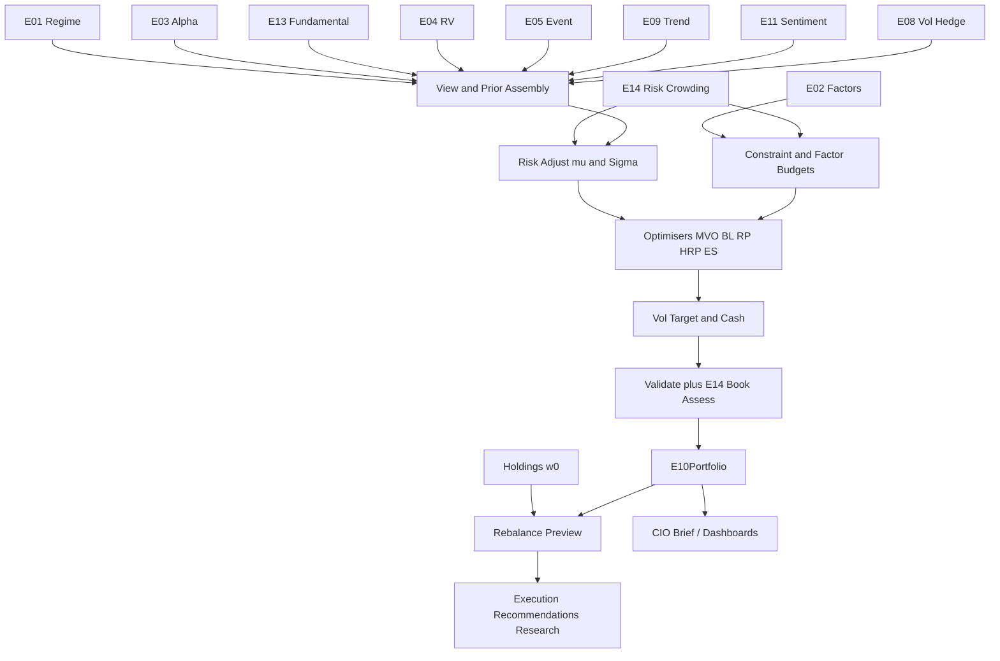

# E10 — Portfolio Construction & Capital Allocation Engine  
## Engineering Implementation Specification (AGI Investment Office)

**Owner:** CIO / Head of Portfolio Construction / Head of Quantitative Research  
**Pipeline position:** **Downstream allocator.** Runs after alpha engines (E03–E05, E08–E09, E11, E13) and after **E01 / E02 / E14** priors and constraints are available. Converts research views into **portfolio recommendations**. Never invents alpha.  
**Nature:** Institutional portfolio construction research — weights, risk budgets, constraints, rebalance previews, capacity & turnover analytics. **Never** emits broker orders or BUY/SELL tickets. Execution is a separate future layer that may consume E10 recommendations.  
**Version:** 1.0  
**Status:** Implementation-ready specification  
**Architectural peers:** `E01_MACRO_REGIME_ENGINE_SPEC.md`, `E02_FACTOR_STYLE_ENGINE_SPEC.md`, `E03_CROSS_SECTIONAL_QUANT_ENGINE_SPEC.md`, `E14_RISK_CROWDING_OVERLAY_SPEC.md`

### Relationship to current AGIB stack (reuse)

| Existing asset | Path | E10 role |
|----------------|------|----------|
| NSE / Nifty research scores | `nifty500_stock_research`, E03 compat | **Views / alpha inputs only** — not portfolio weights |
| E01 / E02 / E03 / E14 specs | `intelligence-engine/E0*.md` | Mandatory contracts: regime, loadings, alpha, risk gates |
| Market vol / breadth helpers | `marketIntelligenceEngine.js` | Covariance / vol targeting features |
| Holdings staging (E14 spec) | `e14_research_holdings` | Current book input / output staging |
| Intelligence routes | `server/routes/intelligence.js` | Add `/api/intelligence/e10/*` |
| Risk Manager / CIO agents | intelligence-engine agents | Consume `E10Portfolio` for briefs |

**Net-new:** optimiser suite (MVO, BL, RP, HRP, ERC, vol targeting, ES), mandate/constraint engine, rebalance engine, capacity & TCA models, Aladdin-style portfolio UI, walk-forward + cost simulation harness.

**Hard rules**
1. E10 **never** creates alpha — only transforms upstream scores/views under constraints.  
2. E03 (and other alpha engines) logic is **not modified** by E10.  
3. Every published portfolio recommendation requires `E14Assessment` on the book (fail closed for CIO/client paths).  
4. Production remains **signal-first** until migration phases explicitly promote portfolio UI (§16).  
5. Research language only — “target weight”, “rebalance preview”, “execution recommendation”; no order routing.

---

# 1. Purpose

## 1.1 Investment questions answered

1. **Given alpha views and risk**, what portfolio weights maximise research utility under mandate constraints?  
2. **How large should each position be** after volatility targeting, liquidity, crowding, and factor budgets?  
3. **What risk budget** does each sleeve / factor / sector consume?  
4. **How should capital allocate across engines** (E03 XS, E09 trend, E05 event, …) in the current E01 regime?  
5. **What rebalance** is justified after costs, turnover caps, and tax/lot constraints (research)?  
6. **What is expected return, vol, drawdown, and tracking error** of the recommended book?  
7. **Where does the book breach** concentration, factor, liquidity, or stress limits?

## 1.2 Investment philosophy

Alpha without construction is an unsorted list. Construction without alpha is risk theatre. E10 sits between them:

\[
\text{Views (E03…E13)} + \text{Risk (E14)} + \text{Regime (E01)} + \text{Styles (E02)}
\;\rightarrow\;
\text{Feasible portfolio (E10)}
\]

Principles:

1. **Risk is the scarce resource** — allocate risk budgets, not just capital.  
2. **Constraints are first-class** — mandate feasibility before optimality.  
3. **Costs and capacity are alpha killers** — net of TCA and ADV limits.  
4. **Regime-aware allocation** — same views, different books under E01/E14 playbooks.  
5. **Explainability** — every weight change has a driver (view, risk, constraint).  
6. **Research ≠ execution** — E10 proposes; humans / future EMS dispose.

## 1.3 Institutional background

| Firm / platform | Relevance |
|-----------------|-----------|
| BlackRock Aladdin | Enterprise portfolio construction, constraints, risk, what-if |
| Bridgewater | Risk parity / balanced risk budgeting; macro-conditioned allocation |
| AQR | Factor-aware construction, transaction-cost-aware optimisers |
| MSCI Barra | Factor risk models feeding covariance / attribution |
| Goldman Sachs | Multi-asset portfolio analytics & constraint engines |
| Two Sigma / Citadel / Millennium | Pod risk budgets, hard limits, rapid re-optimisation |
| Ray Dalio risk parity | Equalising risk contributions across uncorrelated sleeves |

## 1.4 Portfolio construction principles (AGI canonical)

| Principle | Implementation |
|-----------|----------------|
| Separate alpha & risk | µ from engines; Σ / limits from E02+E14+estimators |
| Shrink extremes | Bayesian / BL equilibrium prior; winsorise views |
| Enforce investability | ADV, borrow, lot size, universe eligibility |
| Dual risk lens | Statistical σ and stress/ES from E14 scenarios |
| Turnover discipline | Penalty in objective + hard turnover cap |
| Sleeve modularity | Optimise within sleeves then aggregate, or joint with budgets |
| Auditability | Full `input_hash`, solver status, binding constraints |

---

# 2. Portfolio Taxonomy

Each portfolio type is a **mandate template** (`mandate_id`) with asset universe, objective, constraints, and default optimiser.

## 2.1 Hierarchy

```
E10 Portfolio Taxonomy
├── Equity Directional
│   ├── P_LONG_ONLY
│   ├── P_LONG_SHORT
│   ├── P_130_30
│   └── P_SECTOR_ROTATION
├── Market-Neutral / Relative
│   ├── P_MARKET_NEUTRAL
│   └── P_FACTOR_PORTFOLIO
├── Risk-Based
│   ├── P_RISK_PARITY
│   ├── P_ERC
│   ├── P_MIN_VAR
│   ├── P_MAX_DIVERSIFICATION
│   └── P_VOL_TARGET (overlay on any book)
├── Utility / Bayesian
│   ├── P_MEAN_VARIANCE
│   ├── P_BLACK_LITTERMAN
│   └── P_ES_OPT (Expected Shortfall)
├── Thematic Institutional
│   ├── P_INCOME
│   ├── P_MACRO
│   ├── P_CTA
│   └── P_CUSTOM_AGI
└── Meta
    └── P_MULTI_SLEEVE (engine capital allocation)
```

## 2.2 Portfolio type dictionary

### Long Only (`P_LONG_ONLY`)
- **Definition:** \(w_i \ge 0\), \(\sum w_i \le 1\), cash residual.  
- **Use:** Core India equity research books from E03/E13.  
- **Default optimiser:** BL or MVO with TE constraints vs Nifty benchmark.  
- **Failure modes:** Concentration in crowded winners; mitigated by E14 caps.

### Long Short (`P_LONG_SHORT`)
- **Definition:** Long and short books; gross/net bands; borrow required on shorts.  
- **Use:** E13 + E03 residual alpha.  
- **Default:** MVO/BL with net exposure band from E01/E14.  
- **Failure modes:** Short squeeze — E14 DTC/borrow gates.

### Market Neutral (`P_MARKET_NEUTRAL`)
- **Definition:** Net ≈ 0, beta ≈ 0, often sector-neutral.  
- **Use:** E04-informed + residual E03.  
- **Default:** Min residual variance subject to view tilts.  
- **Failure modes:** Residual factor leaks — E02 constraints mandatory.

### 130/30 (`P_130_30`)
- **Definition:** 130% long / 30% short (configurable); net ~100%.  
- **Use:** Enhanced index research.  
- **Default:** BL vs benchmark with asymmetric long/short budgets.

### Factor Portfolio (`P_FACTOR_PORTFOLIO`)
- **Definition:** Target active loadings on E02 factors (smart beta research).  
- **Use:** Harvest ARP sleeves.  
- **Default:** Factor-mimicking / risk-budgeted tilts.  
- **Failure modes:** Factor crowding — E14 + E02 timing.

### Risk Parity (`P_RISK_PARITY`)
- **Definition:** Equalise risk contribution across assets or sleeves.  
- **Use:** Multi-asset / multi-sleeve macro books (Bridgewater-like).  
- **Default:** Inverse-vol seed → RP solver.  
- **Failure modes:** Corr→1 in crisis — E14 stress blend on Σ.

### Equal Risk Contribution (`P_ERC`)
- **Definition:** Strict ERC optimisation (convex risk budgets).  
- **Use:** Sleeve diversification inside AGI multi-strat research.

### Black–Litterman (`P_BLACK_LITTERMAN`)
- **Definition:** Equilibrium prior + investor views → posterior µ.  
- **Use:** Primary equity book when benchmark exists.  
- **Default AGI path** for `P_LONG_ONLY` institutional core.

### Mean Variance (`P_MEAN_VARIANCE`)
- **Definition:** Classic Markowitz utility \(\mu - \frac{\lambda}{2} w^\top\Sigma w\).  
- **Use:** Teaching + unconstrained research; always with shrink Σ.

### Minimum Variance (`P_MIN_VAR`)
- **Definition:** Min \(w^\top\Sigma w\) with constraints.  
- **Use:** Defensive sleeves under E01 risk-off.

### Maximum Diversification (`P_MAX_DIV`)
- **Definition:** Max \(\frac{w^\top\sigma}{\sqrt{w^\top\Sigma w}}\).  
- **Use:** Diversification research books.

### Sector Rotation (`P_SECTOR_ROTATION`)
- **Definition:** Allocate to sector ETFs/indices or sector baskets via E03 sector aggregates + E01.  
- **Use:** Tactical sector research.

### Income Portfolio (`P_INCOME`)
- **Definition:** Tilt to E02 Dividend/Quality/Carry with drawdown caps.  
- **Use:** Income narrative CIO sleeves.

### Macro Portfolio (`P_MACRO`)
- **Definition:** Cross-asset weights conditioned on E01 regime boxes.  
- **Use:** CIO macro allocation research (equity/duration/commodity/FX proxies).

### CTA Portfolio (`P_CTA`)
- **Definition:** Vol-targeted trend sleeve from E09 signals.  
- **Use:** Diversifier; overlay vol targeting mandatory.

### Custom AGI Portfolio (`P_CUSTOM_AGI`)
- **Definition:** Mandate JSON fully specified by CIO desk.  
- **Use:** Client-like research mandates, experiments.

### Multi-Sleeve (`P_MULTI_SLEEVE`)
- **Definition:** Capital/risk allocation across engine sleeves then nested construction.  
- **Use:** Firm-level AGI research book aggregation.

---

# 3. Allocation Models

Package: `intelligence-engine/app/engines/e10/models/`.

### Common result interface

```python
class AllocationModelResult(TypedDict):
    model_id: str
    mandate_id: str
    weights: dict[str, float]          # symbol -> weight (signed)
    cash_weight: float
    status: str                        # optimal|optimal_inaccurate|infeasible|error
    objective_value: float
    expected_return: float
    expected_volatility: float
    expected_es_95: float
    tracking_error: float | None
    risk_contributions: dict[str, float]
    binding_constraints: list[str]
    solver_meta: dict
    as_of: str
    model_version: str
```

---

### 3.1 Mean Variance Optimiser (`AM_MVO`)
| | |
|--|--|
| **Purpose** | Max \(w^\top\mu - \frac{\lambda}{2} w^\top\Sigma w - \kappa\cdot\mathrm{TC}(w)\) |
| **Inputs** | µ vector, Σ, λ risk aversion, cost model |
| **Outputs** | weights, util, risk |
| **Dependencies** | Covariance estimator; views pipeline |
| **Failure modes** | Corner solutions if Σ ill-conditioned — require Ledoit–Wolf + weight caps |

---

### 3.2 Black–Litterman (`AM_BL`)
| | |
|--|--|
| **Purpose** | Posterior returns from equilibrium + views |
| **Inputs** | Benchmark weights \(w_{mkt}\), Σ, risk aversion δ, views \(P, Q, \Omega\), τ |
| **Outputs** | \(\mu_{BL}\), then MVO/analytic weights |
| **Dependencies** | E03 ranks → views; E02 for factor views optional |
| **Defaults (v1)** | \(\tau=0.05\), \(\delta = \frac{E[r_m]-r_f}{\sigma_m^2}\), \(\Omega\) diagonal from view confidence |

**View construction from E03:**  
For top/bottom quantiles, set absolute or relative views:  
\(Q_j = c \cdot \sigma_i \cdot z(\mathrm{score}_i)\) with \(c\) calibrated (default 0.5).  
\(P\) picks identity rows or pairwise relative views within sector.

---

### 3.3 Risk Parity (`AM_RP`)
| | |
|--|--|
| **Purpose** | Equalise risk contributions \(w_i (\Sigma w)_i = w_j (\Sigma w)_j\) |
| **Inputs** | Σ (assets or sleeves) |
| **Outputs** | RP weights |
| **Dependencies** | Stress-blend Σ from E14 when playbook elevated |
| **Failure modes** | Negative weights not allowed in plain RP — use long-only RP |

---

### 3.4 Hierarchical Risk Parity (`AM_HRP`)
| | |
|--|--|
| **Purpose** | Lopez de Prado HRP — cluster covariance, recursive bisection |
| **Inputs** | Correlation/cov, distance matrix |
| **Outputs** | HRP weights (long-only) |
| **Dependencies** | None beyond returns history |
| **Strengths** | Stable when N large vs MVO inversion |

---

### 3.5 Equal Risk Contribution (`AM_ERC`)
| | |
|--|--|
| **Purpose** | Solve ERC with optional risk budget vector \(b\) (\(\sum b=1\)) |
| **Inputs** | Σ, budgets \(b\) from CIO / E01 sleeve policy |
| **Outputs** | ERC weights |
| **Dependencies** | Sleeve map for multi-sleeve |

---

### 3.6 Kelly / Fractional Kelly (`AM_KELLY`)
| | |
|--|--|
| **Purpose** | Growth-optimal sizing research (educational + sleeve level) |
| **Inputs** | Edge estimates, odds/vol proxies |
| **Outputs** | \(f^*\) then **fractional** \(f=\eta f^*\) with \(\eta\le 0.25\) institutional default |
| **Hard rule** | Never full Kelly in production recommendations; E14 DD caps override |

---

### 3.7 Inverse Volatility (`AM_INVVOL`)
| | |
|--|--|
| **Purpose** | \(w_i \propto 1/\sigma_i\) then normalise |
| **Inputs** | Asset vols |
| **Outputs** | Simple risk-balanced seed / baseline |
| **Use** | Fallback when optimiser infeasible; CTA sleeve seed |

---

### 3.8 Volatility Targeting (`AM_VOLTARGET`)
| | |
|--|--|
| **Purpose** | Scale gross/net to hit \(\sigma_{\mathrm{target}}\) |
| **Inputs** | Current book σ, E01 `vol_target`, E14 `vol_target_suggested` |
| **Outputs** | `scale`, scaled weights, cash |
| **Formula** | \(w' = w \cdot \min\big(1, \sigma_{\mathrm{tgt}} / \hat\sigma_p\big) \cdot \mathrm{size\_mult}_{E01}\cdot \mathrm{size\_mult}_{E14}\) |

---

### 3.9 Expected Shortfall Optimisation (`AM_ES`)
| | |
|--|--|
| **Purpose** | Min ES_α or max return s.t. ES ≤ budget (Rockafellar–Uryasev) |
| **Inputs** | Scenario / historical return matrix, α=0.95 |
| **Outputs** | ES-aware weights |
| **Dependencies** | E14 scenario library + historical paths |
| **Use** | Elevated/crisis playbooks preferred over plain MVO |

---

### 3.10 Risk Budgeting (`AM_RISK_BUDGET`)
| | |
|--|--|
| **Purpose** | Allocate to meet RC targets by sector/factor/sleeve |
| **Inputs** | Σ, factor loadings X, budget dictionary |
| **Outputs** | Weights respecting RC ≤ budgets (penalty or hard) |

---

### 3.11 Dynamic Cash Allocation (`AM_CASH`)
| | |
|--|--|
| **Purpose** | Raise cash when E01/E14 playbooks demand de-risk |
| **Inputs** | playbook, stress score, opportunity score (median \|alpha\|) |
| **Outputs** | `cash_floor`, applied after optimiser |

| Playbook | Cash floor (research default) |
|----------|-------------------------------|
| `normal` | 0–5% |
| `elevated` | 10–20% |
| `hard_derisk` | 30–50% (or hedge sleeve) |

---

### 3.12 Capacity Model (`AM_CAPACITY`)
| | |
|--|--|
| **Purpose** | Cap weights by ADV, participation, days-to-exit |
| **Inputs** | ADV, proposed notional, E14 DTE stress, book AUM assumption |
| **Outputs** | `w_i^{cap}`, rejected names list |
| **Formula** | Align with E14: \(w_i^{\max} = \min(w^{\mathrm{policy}}, p\cdot\mathrm{ADV}\cdot\mathrm{DTE}_{\max}/\mathrm{AUM})\) |

---

### 3.13 Turnover / Rebalance Model (`AM_REBAL`)
| | |
|--|--|
| **Purpose** | From current \(w_0\) to target \(w^*\) with no-trade band & cost penalty |
| **Inputs** | Current holdings, target, TC_bps, turnover cap |
| **Outputs** | `w_{\mathrm{exec}}`, trades list, expected cost |
| **No-trade band** | Skip trade if \(\|w^*_i - w_{0,i}\| < band_i\) (default 20% of target or 30 bps absolute) |

---

# 4. Inputs

## 4.1 Upstream engines

| Engine | Fields consumed |
|--------|-----------------|
| **E01** | regime, `size_multiplier`, `vol_target`, `weight_adjustments` for sleeves |
| **E02** | loadings \(X\), scores for factor budgets / smart beta |
| **E03** | `composite_alpha_score`, probabilities, ranks, horizons → views |
| **E04** | pair/basket residual z, suggested relative weights |
| **E05** | event scores, deal spreads, binary risk flags |
| **E08** | vol surface, hedge sleeve recommendations |
| **E09** | trend signals / sleeve scores |
| **E11** | sentiment soft views (optional) |
| **E13** | fundamental conviction scores / side |
| **E14** | risk_score, size_mult, max_allocation, playbook, stress Σ blend, gates |

## 4.2 Market & book

Benchmark weights, sector/country/currency map, liquidity (ADV, spread), transaction cost schedule, borrow availability/fees, current holdings, lot sizes, mandate constraints JSON, research AUM assumption.

## 4.3 Input registry

| input_id | Description |
|----------|-------------|
| `E01_STATE` | Regime object |
| `E02_LOADINGS` | Factor matrix |
| `E03_ALPHA` | Alpha scores vector |
| `E04_RV` | RV signals |
| `E05_EVENT` | Event views |
| `E08_VOL` | Vol/hedge inputs |
| `E09_TREND` | Trend scores |
| `E11_SENT` | Sentiment |
| `E13_FUND` | Fundamental views |
| `E14_STATE` / `E14_ASSESS` | Risk constraints |
| `BENCH_W` | Benchmark weights |
| `HOLDINGS_W0` | Current weights |
| `ADV_20D` | Liquidity |
| `TC_BPS` | Cost schedule |
| `BORROW_OK` | Short availability |
| `MANDATE` | Constraint pack |
| `AUM_RESEARCH` | Assumed notional INR |
| `RETURNS_HIST` | For Σ / ES |
| `FX_RATES` | Currency conversion |

## 4.4 APIs & refresh

| Family | Primary | Refresh | Notes |
|--------|---------|---------|-------|
| Engine states | Internal E01–E14 APIs | Per job order | Fail closed if E14 missing on publish |
| Prices/returns | Groww / research caches | 1d | Σ lookback 252–756d |
| Benchmark | Index constituents CMS / NSE | 1d–1w | Nifty 50 default |
| Borrow | Licensed PB feed | 1d | Optional; block shorts if unknown in L/S mandates |
| Costs | Internal TCA table | Quarterly calibrate | Bucket by ADV/mcap |

---

# 5. Feature Engineering

| feature_id | Definition |
|------------|------------|
| `mu_raw_i` | Mapped from engine views (E03 score → return prior) |
| `mu_bl_i` | Black–Litterman posterior |
| `mu_adj_i` | After E14 haircut & costs |
| `sigma_i` | Asset vol (EWMA/RV) |
| `Sigma` | Shrinkage covariance |
| `Sigma_stress` | E14 blended cov |
| `Corr` | Correlation matrix |
| `beta_i` | vs benchmark |
| `RC_i` | Risk contribution \(w_i(\Sigma w)_i / \sigma_p\) |
| `MRC_i` | Marginal risk |
| `factor_exposure_k` | \(X^\top w\) |
| `sector_exposure_s` | Sum weights by sector |
| `country_exposure` | Sum by country |
| `fx_exposure` | Currency net |
| `liquidity_score_i` | From E14/E02 |
| `turnover_cost_bps` | Estimated one-way |
| `capacity_wmax_i` | Capacity cap |
| `tracking_error` | \(\sqrt{(w-w_b)^\top\Sigma(w-w_b)}\) |
| `active_risk` | Same; alias for TE |
| `gross` / `net` | \(\sum\|w\|\), \(\sum w\) |
| `name_hhi` / `sector_hhi` | Concentration |
| `view_confidence_i` | From E03 confidence / BL Ω |
| `sleeve_score_e` | Engine-level aggregate score |
| `cash_floor` | From AM_CASH |
| `size_mult_final` | E01×E14 product |

**View map (E03 → µ)** default:  
\[
\mu_i^{\mathrm{raw}} = r_f + \beta_i(\mu_m-r_f) + a\cdot\sigma_i\cdot \Phi^{-1}(S_i/100)
\]
with \(a=0.35\) (research), \(S_i\) = composite alpha score; then BL shrinks.

---

# 6. Mathematical Models

## 6.1 Covariance estimation

1. Compute sample cov on trailing \(L=252\) (min) to \(756\) daily log returns.  
2. Ledoit–Wolf shrinkage to constant correlation target.  
3. Optional EWMA cov (λ=0.94) blend 50/50 for vol targeting responsiveness.  
4. E14 stress blend: \(\Sigma \leftarrow (1-\alpha)\Sigma + \alpha\Sigma_{\mathrm{stress}}\) with α from E14 playbook (0 / 0.3 / 0.6).  
5. Eigen floor: clip eigenvalues ≥ \(10^{-8}\); ensure PSD.

## 6.2 Black–Litterman posterior

Equilibrium: \(\pi = \delta \Sigma w_{mkt}\)  
Posterior:  
\[
\mu_{BL} = \big[(\tau\Sigma)^{-1} + P^\top\Omega^{-1}P\big]^{-1}
\big[(\tau\Sigma)^{-1}\pi + P^\top\Omega^{-1}Q\big]
\]

## 6.3 MVO with costs

\[
\max_w \; w^\top\mu - \frac{\lambda}{2} w^\top\Sigma w - \mathbf{1}^\top \mathrm{TC}(|w-w_0|)
\]

\(\mathrm{TC}_i = c_i^{\mathrm{bps}}\cdot |w_i-w_{0,i}|\cdot\mathrm{AUM}\) converted to return units.

## 6.4 Risk contribution / ERC

\[
\mathrm{RC}_i = w_i \frac{(\Sigma w)_i}{\sqrt{w^\top\Sigma w}}
\]
ERC: \(\mathrm{RC}_i = b_i \sigma_p\) with \(\sum b_i=1\).

## 6.5 HRP (summary)

1. Correlation distance \(d_{ij}=\sqrt{(1-\rho_{ij})/2}\)  
2. Hierarchical clustering  
3. Quasi-diagonalisation  
4. Recursive variance allocation  

## 6.6 Vol targeting

\[
\sigma_p=\sqrt{w^\top\Sigma w},\quad
s=\mathrm{clip}\big(\sigma_{\mathrm{tgt}}/\sigma_p,\, s_{\min},\, s_{\max}\big)
\]
Defaults: \(s_{\min}=0.25\), \(s_{\max}=1.25\); then apply E01×E14 size_mult.

## 6.7 ES (Rockafellar–Uryasev)

For scenario losses \(\ell_s = -w^\top r_s\):  
\[
\min_{w,z,u_s}\; z + \frac{1}{\alpha S}\sum_s u_s
\quad u_s \ge \ell_s - z,\; u_s\ge 0
\]
plus linear mandate constraints.

## 6.8 Constraint catalogue (canonical)

| ID | Constraint | Default research |
|----|------------|------------------|
| `C_SUM` | \(\sum w + w_{\mathrm{cash}} = 1\) | yes |
| `C_LONG_ONLY` | \(w_i \ge 0\) | mandate |
| `C_NET` | \(n_{\min} \le \sum w \le n_{\max}\) | from E01/E14 |
| `C_GROSS` | \(\sum \|w\| \le G_{\max}\) | 1.0 LO; 1.6–2.0 L/S |
| `C_NAME` | \|w_i\| ≤ min(policy, E14 max, capacity) | 8% |
| `C_SECTOR` | \|∑_{i∈s} w_i\| ≤ 30% | yes |
| `C_TOP5` | sum top5 ≤ 35% | yes |
| `C_BETA` | \|β_p − β^*\| ≤ ε | MN: β≈0 |
| `C_FACTOR` | \|X^\top w\|_k ≤ F_k | from E02/E14 |
| `C_TE` | TE ≤ TE_max | 5–8% ann LO |
| `C_TURNOVER` | \(\frac12\sum\|w-w_0\| ≤ TO_{max}\) | 15–25%/rebalance |
| `C_SHORT` | shorts only if `BORROW_OK` | L/S |
| `C_LIQ` | DTE stress ≤ 5 | E14 |
| `C_CASH` | cash ≥ cash_floor | AM_CASH |
| `C_UNIVERSE` | w_i=0 if not eligible | yes |

## 6.9 Expected behaviour & failure modes

| Model | Expected behaviour | Failure mode | Mitigation |
|-------|--------------------|--------------|------------|
| MVO | Concentrates in high µ/σ | Fragile corners | Caps, shrink Σ, BL |
| BL | Stable vs benchmark | Weak views → near bench | Raise view confidence only with IC evidence |
| RP/ERC | Diversified RC | Crisis corr spike | Stress Σ + cash floor |
| HRP | Stable large-N | Ignores α | Use as risk sleeve or blend |
| ES | Tail-aware | Scenario poverty | E14 library + history |
| Kelly | Aggressive | Ruin risk | Fractional + E14 hard caps |
| Vol target | Stable realised vol | Lagged σ underestimates jump | E14 crisis override scale≤0.35 |

## 6.10 Solver & numerics

- Primary: `cvxpy` with OSQP / CLARABEL / ECOS; QP/SOCP formulations.  
- HRP: custom numpy.  
- Always return `status`; on infeasible → hierarchical relax (turnover → TE → sector → name) with audit log — **never** silently drop E14 hard caps (`C_NAME` from E14, `C_LIQ`, crisis gross).

---

# 7. Optimisation Pipeline

Complete workflow (every `pipeline.run_e10`):

```
1. Raw alpha / views
      ← E03 ranks/scores, E13 conviction, E04/E05/E09/E11 optional
      → mu_raw, P, Q, Ω, sleeve_scores

2. Risk adjustment
      ← E14 haircuts, crowding ψ, conf_adj, stress Σ
      ← E01 size_mult, vol_target
      → mu_adj, Sigma_stress, size_mult_final, cash_floor

3. Constraint filtering
      ← Mandate + E14 max_allocation + capacity + borrow + universe
      → feasible set; drop/zero ineligible names (logged)

4. Optimisation
      ← Select AM_* from mandate (BL→MVO default for LO)
      → w_star, solver status, binding constraints

5. Position sizing
      ← Vol targeting + cash floor + fractional gross scale
      → w_sized, cash

6. Portfolio validation
      ← Recompute risk, factors, sectors, E14 book assess
      → pass/fail; if fail, constrained repair loop (max 3)

7. Execution recommendations (research)
      ← AM_REBAL vs holdings w0
      → trade list, est cost, turnover, no-trade bands
      → E10Portfolio + E10RebalancePreview
```

**Repair loop priority:** reduce gross → raise cash → cut highest RC names → cut lowest liquidity → (last) shrink views magnitude — never violate E14 `hard_derisk` gross ceilings.

---

# 8. Machine Learning

| Technique | Use | Notes |
|-----------|-----|-------|
| Expected return calibration | Map scores→µ via isotonic/Emp Bayes on IC | Recalibrate monthly |
| Covariance estimation | LW, EWMA, optional DCC | Regime-aware blend |
| Regime-aware optimisation | Switch objective (MVO↔ES) & λ by E01/E14 | Rule layer v1; ML assist P2 |
| Bayesian portfolio updating | BL is Bayesian core; sequential view updates | Intraday optional |
| RL roadmap | Learn rebalance policy under TC + DD constraints | P4 shadow only |
| Explainability | Decomposition: view vs risk vs constraint attribution for Δw | Mandatory CIO |

**Explainability pack:** for each top-10 absolute weight: contribution of µ, Σ, each binding constraint, E14 cap, capacity cap.

---

# 9. Outputs

## 9.1 Canonical `E10Portfolio`

```json
{
  "engine": "E10",
  "version": "1.0.0",
  "as_of": "2026-07-25T17:45:00+05:30",
  "mandate_id": "AGI_CORE_LO_BL",
  "portfolio_type": "P_LONG_ONLY",
  "book_id": "research_core",
  "benchmark_id": "NIFTY50",
  "weights": {"TCS": 0.045, "RELIANCE": 0.038},
  "cash_allocation": 0.12,
  "target_positions": [
    {
      "symbol": "TCS",
      "side": "long",
      "weight": 0.045,
      "notional_inr": 11250000,
      "sector_id": "IT",
      "alpha_score": 67.0,
      "cap_source": ["C_NAME", "capacity"]
    }
  ],
  "expected_return": 0.11,
  "expected_volatility": 0.14,
  "expected_drawdown": {"p50": 0.08, "p95": 0.18},
  "expected_es_95_1d": 0.018,
  "tracking_error": 0.055,
  "factor_attribution": {"F_MOMENTUM": 0.22, "F_QUALITY": 0.31, "F_VALUE": -0.05},
  "risk_attribution": {"TCS": 0.07, "RELIANCE": 0.06},
  "sector_allocation": {"IT": 0.18, "FINANCIALS": 0.28},
  "country_allocation": {"IN": 1.0},
  "gross": 0.88,
  "net": 0.88,
  "turnover_vs_prior": 0.14,
  "portfolio_confidence": 0.68,
  "solver": {"model_id": "AM_BL", "status": "optimal", "binding_constraints": ["C_SECTOR:FINANCIALS", "C_CASH"]},
  "e01_ref": {},
  "e14_ref": {"playbook": "elevated", "gate": "allow_with_haircut"},
  "upstream_refs": {"e03_hash": "sha256:...", "e02_hash": "sha256:..."},
  "model_version": "e10-1.0.0",
  "input_hash": "sha256:...",
  "hash": "sha256:..."
}
```

## 9.2 `E10RebalancePreview`

```json
{
  "book_id": "research_core",
  "as_of": "2026-07-25T17:45:00+05:30",
  "trades": [
    {
      "symbol": "TCS",
      "delta_weight": 0.01,
      "delta_notional_inr": 2500000,
      "est_cost_bps": 12,
      "adv_participation": 0.015,
      "action": "increase"
    }
  ],
  "skipped_no_trade_band": [],
  "est_total_cost_bps": 18,
  "turnover": 0.14,
  "notes": ["Cash raised to 12% per elevated playbook"]
}
```

## 9.3 `E10SleeveAllocation` (multi-sleeve)

```json
{
  "as_of": "2026-07-25",
  "risk_budgets": {"E03": 0.40, "E13": 0.25, "E09": 0.15, "E05": 0.10, "E08_TAIL": 0.10},
  "capital_weights": {"E03": 0.45, "E13": 0.25, "E09": 0.10, "E05": 0.10, "E08_TAIL": 0.05, "CASH": 0.05},
  "e01_primary_regime": "expansion_risk_on",
  "playbook": "normal"
}
```

## 9.4 Compatibility with signal-first UI

| Signal-first UI | E10 addition |
|-----------------|--------------|
| Ranked stock list (E03) | Unchanged |
| Portfolio tab (new) | Shows `E10Portfolio` when mandate run |
| CIO brief | Optional “illustrative book” block behind flag |

---

# 10. Downstream Consumers

| Consumer | How E10 is used |
|----------|-----------------|
| **Execution layer (future)** | Reads `E10RebalancePreview` trades as **recommendations only**; EMS owns routing |
| **CIO reports / briefs** | Portfolio snapshot: weights, TE, vol, cash, binding constraints, sleeve budgets |
| **Portfolio dashboards** | Primary UI binding (§14) |
| **Risk monitoring (E14)** | Book holdings from E10 feed continuous E14 assess; breaches raise playbooks |
| **Performance attribution** | Ex-post Brinson / factor attribution vs E10 intended exposures |
| **Publishing** | Research notes may attach illustrative allocation with disclaimer |
| **E12** | Uses realised vs target weights as RL/optimisation labels in sandbox |

E10 does not feed back into E03 scoring. Optional feedback: realised TE/IC for **view calibration** jobs only.

---

# 11. Database Design

```sql
CREATE TABLE e10_mandate (
  mandate_id text PRIMARY KEY,
  name text NOT NULL,
  portfolio_type text NOT NULL,
  benchmark_id text,
  objective jsonb NOT NULL,          -- model_id, lambda, te_max, etc.
  constraints jsonb NOT NULL,
  universe_id text NOT NULL,
  aum_research_inr double precision NOT NULL DEFAULT 250000000,
  active boolean DEFAULT true,
  created_at timestamptz DEFAULT now()
);

CREATE TABLE e10_holdings_snapshot (
  as_of timestamptz NOT NULL,
  book_id text NOT NULL,
  symbol text NOT NULL,
  side text NOT NULL CHECK (side IN ('long','short','cash')),
  weight double precision NOT NULL,
  notional_inr double precision,
  source text,                       -- e10|manual|import
  PRIMARY KEY (as_of, book_id, symbol, side)
);
CREATE INDEX e10_holdings_book_idx ON e10_holdings_snapshot (book_id, as_of DESC);

CREATE TABLE e10_portfolio_state (
  id uuid PRIMARY KEY DEFAULT gen_random_uuid(),
  as_of timestamptz NOT NULL,
  book_id text NOT NULL,
  mandate_id text NOT NULL REFERENCES e10_mandate(mandate_id),
  payload jsonb NOT NULL,            -- full E10Portfolio
  model_version text NOT NULL,
  input_hash text NOT NULL,
  solver_status text NOT NULL,
  created_at timestamptz DEFAULT now(),
  UNIQUE (as_of, book_id, mandate_id)
);
CREATE INDEX e10_port_book_idx ON e10_portfolio_state (book_id, as_of DESC);

CREATE TABLE e10_portfolio_current (
  book_id text NOT NULL,
  mandate_id text NOT NULL,
  state_id uuid REFERENCES e10_portfolio_state(id),
  payload jsonb NOT NULL,
  updated_at timestamptz NOT NULL DEFAULT now(),
  PRIMARY KEY (book_id, mandate_id)
);

CREATE TABLE e10_rebalance_preview (
  id uuid PRIMARY KEY DEFAULT gen_random_uuid(),
  as_of timestamptz NOT NULL,
  book_id text NOT NULL,
  mandate_id text NOT NULL,
  payload jsonb NOT NULL,
  created_at timestamptz DEFAULT now()
);

CREATE TABLE e10_sleeve_allocation (
  as_of date NOT NULL,
  book_id text NOT NULL,
  payload jsonb NOT NULL,
  model_version text NOT NULL,
  PRIMARY KEY (as_of, book_id)
);

CREATE TABLE e10_cov_snapshot (
  as_of date NOT NULL,
  universe_id text NOT NULL,
  method text NOT NULL,
  meta jsonb NOT NULL,               -- eigenvalues summary, alpha stress
  -- store factorised form / object storage pointer for large N:
  store_uri text,
  PRIMARY KEY (as_of, universe_id, method)
);

CREATE TABLE e10_constraint_breach_log (
  id uuid PRIMARY KEY DEFAULT gen_random_uuid(),
  as_of timestamptz NOT NULL,
  book_id text NOT NULL,
  constraint_id text NOT NULL,
  severity text NOT NULL,
  details jsonb NOT NULL
);

CREATE TABLE e10_model_weights (
  version text PRIMARY KEY,
  weights jsonb NOT NULL,
  notes text,
  created_at timestamptz DEFAULT now(),
  is_active boolean DEFAULT false
);

CREATE TABLE e10_validation_runs (
  id uuid PRIMARY KEY DEFAULT gen_random_uuid(),
  started_at timestamptz,
  finished_at timestamptz,
  method text,
  metrics jsonb,
  model_version text
);

CREATE TABLE e10_migration_flags (
  key text PRIMARY KEY,              -- e.g. ui_portfolio_tab
  enabled boolean NOT NULL DEFAULT false,
  updated_at timestamptz DEFAULT now()
);
```

**Caching:** current portfolio 60–120s; cov snapshots daily; Redis `e10:port:{book}:{mandate}`.  
**RLS:** authenticated research read; service write; no anon write.

---

# 12. Backend Services

## 12.1 Package layout

```
intelligence-engine/app/engines/e10/
  __init__.py
  config.py
  pipeline.py
  schema.py
  mandates/
    registry.py
    templates.py                 # P_* defaults
  views/
    from_e03.py
    from_e13.py
    from_multi.py
    black_litterman.py
  risk/
    covariance.py
    stress_blend.py
    contributions.py
  constraints/
    builder.py
    relax.py
  models/
    mvo.py
    black_litterman_opt.py
    risk_parity.py
    hrp.py
    erc.py
    kelly.py
    inv_vol.py
    vol_target.py
    es_opt.py
    risk_budget.py
    cash.py
    capacity.py
    rebalance.py
  adapters/
    e01.py
    e02.py
    e03.py
    e04.py
    e05.py
    e08.py
    e09.py
    e11.py
    e13.py
    e14.py
    holdings.py
    benchmark.py
  explain.py
  persistence.py
  validation/
    walk_forward.py
    tca_sim.py
    monte_carlo.py
```

Node gateway: `server/services/e10PortfolioService.js`.

## 12.2 Jobs / cron (IST)

| Job | Schedule | Action |
|-----|----------|--------|
| `e10_after_e03` | 18:00 IST weekdays | Build core LO BL book from fresh E03 |
| `e10_sleeve_alloc` | 18:20 IST | Multi-sleeve risk budgets from E01/E14 |
| `e10_vol_target_refresh` | 12:45 IST | Intraday scale if playbook changes |
| `e10_cov_daily` | 17:50 IST | Persist Σ snapshot |
| `e10_rebalance_preview` | 18:30 IST | Preview vs last holdings |
| `e10_monthly_validate` | 2nd 22:00 IST | Walk-forward + TCA sims |
| `e10_stress_sunday` | Sunday 19:00 IST | ES/crisis repair drills |

**Ordering:** E01 → E02 → E03 (and other alphas) → E14 firm state → **E10** → E14 book assess on `E10Portfolio` holdings.

## 12.3 SLOs

| SLO | Target |
|-----|--------|
| Core LO optimise N≤500 | p95 < 30s |
| HRP N≤2000 | p95 < 60s |
| Infeasible rate | < 5% before relax; 0% silent hard-cap breach |
| E14 gate on publish | 100% |
| API warm current portfolio | < 300ms |

---

# 13. API Contracts

### 13.1 `GET /api/intelligence/e10/portfolio/{book_id}?mandate_id=`
Current `E10Portfolio`.

### 13.2 `GET /api/intelligence/e10/rebalance/{book_id}?mandate_id=`
Latest `E10RebalancePreview`.

### 13.3 `POST /api/intelligence/e10/run`
```json
{
  "book_id": "research_core",
  "mandate_id": "AGI_CORE_LO_BL",
  "reason": "cron|manual|what_if",
  "overrides": {
    "cash_floor": 0.15,
    "te_max": 0.06
  }
}
```

### 13.4 `POST /api/intelligence/e10/what_if`
Same as run but **does not** persist current pointer; returns ephemeral portfolio + constraint deltas.

### 13.5 `GET /api/intelligence/e10/mandates`
List active mandates/templates.

### 13.6 `GET /api/intelligence/e10/sleeves/{book_id}`
`E10SleeveAllocation`.

### 13.7 `GET /api/intelligence/e10/frontier?mandate_id=&book_id=`
Efficient frontier sample points (λ grid) for UI — research only.

### 13.8 `GET /api/intelligence/e10/attribution/{book_id}?type=risk|factor|sector`

### 13.9 `GET /api/intelligence/e10/constraints/{book_id}`
Constraint monitor: limits vs utilisation.

### 13.10 `POST /api/intelligence/e10/holdings/import`
Stage `w0` holdings for rebalance.

### 13.11 Errors
`E10_INFEASIBLE`, `E10_E14_BLOCK`, `E10_E03_STALE`, `E10_MANDATE`, `E10_SOLVER`, `E10_INTERNAL`.

---

# 14. Frontend (Bloomberg / Aladdin style)

Route: `/beta/e10-portfolio` (feature-flagged). Signal lists remain default home.

**Visual language:** Aladdin density — AGI navy `#0A1E38`, allocate teal `#0F766E`, risk red `#B42318`, cash slate `#475467`. Tables + attribution bars; frontier chart secondary.

## 14.1 Widgets

1. **Portfolio Hero** — book, mandate, expected ret/vol/TE, cash, gross/net, confidence, E14 playbook  
2. **Weights Table** — searchable, sector tags, alpha score, RC%, cap source  
3. **Efficient Frontier** — λ grid with current book marker  
4. **Risk Contribution Chart** — RC bars / treemap  
5. **Factor Attribution** — active E02 exposures vs budgets  
6. **Sector / Country Allocation** — stacked vs benchmark  
7. **Performance Attribution** — ex-post when returns joined  
8. **Constraint Monitor** — utilisation gauges; binding highlighted  
9. **Rebalance Preview** — trade list, cost, turnover, no-trade skips  
10. **Sleeve Budget Panel** — multi-sleeve capital/risk  
11. **What-If Drawer** — override cash/TE/name cap and re-run ephemeral  
12. **Solver Log** — status, relaxations, input hashes  

## 14.2 CIO integration
Brief block: “Illustrative research book — not advice; not an order.” Show top 10 weights + cash + TE + playbook.

---

# 15. Validation

## 15.1 Walk-forward
Monthly re-optimise with point-in-time views; record OOS realised util, TE, turnover, costs.

## 15.2 Transaction cost simulation
Apply square-root impact + spread schedule; report net performance vs gross.

## 15.3 Monte Carlo
Forward paths under t-copula / multivariate t; distribution of DD and ES vs predictions.

## 15.4 Stress testing
Apply E14 scenario shocks to `E10Portfolio`; assert cash/gross repair triggers in crisis fixtures.

## 15.5 Capacity testing
Scale AUM assumption ×2/×5/×10; measure fraction of names hitting capacity caps and IC degradation of feasible set.

## 15.6 Turnover analysis
Histogram of turnover; ensure no-trade band reduces churn ≥20% vs always-trade baseline without large util loss.

## 15.7 Constraint validation
Property tests: random mandates → solver output satisfies all hard constraints (tolerance 1e-6).

## 15.8 Historical replay
Replay 2020/2022: vol targeting + cash floors engage; TE stays under relaxed crisis policy.

## 15.9 Targets

| Metric | Target |
|--------|--------|
| Hard constraint satisfaction | 100% |
| Infeasible before relax | < 5% |
| Crisis gross ≤ policy | 100% on fixtures |
| Net-of-cost util vs equal-weight α top-Q | Track; review quarterly |
| Rebalance cost estimate error | Calibrate; revisit buckets quarterly |

---

# 16. Migration Strategy

## 16.1 Principle

AGI today is **signal-first** (E03 / `agi_research_score` lists). E10 is a **new downstream consumer**. It must **not** change E03 formulas, labels, or publishing of stock research scores.

```
[Existing] Universe → E03 signals → Research UI / notes
                         ↘
                          E10 (new) → Optional portfolio recommendations
                         ↗
                 E01 + E02 + E14 (+ other engines)
```

## 16.2 What stays unchanged

| Asset | Guarantee |
|-------|-----------|
| `score_research` / `SM_AGI_TECH` / E03 composite | Untouched by E10 |
| `nifty500_stock_research` schema meaning | Signal fields remain signal fields |
| CIO stock narratives | No forced portfolio language |
| No order routing | Continues |

## 16.3 What is added

| Addition | Role |
|----------|------|
| Mandates + optimisers | Construction |
| `E10Portfolio` APIs/UI | Illustrative books |
| Sleeve capital allocation | Engine-level budgeting |
| Rebalance preview | Research implementation path |
| Feature flags | Safe rollout |

## 16.4 Phased rollout (P0–P4)

| Phase | Scope | Backward compatibility | Exit criteria |
|-------|-------|------------------------|---------------|
| **P0 — Foundations** | Cov estimator, inv-vol + vol targeting, name/sector caps from E14, ingest E03 top-N equal-risk book as **baseline** (not full BL) | Signals UI 100% unchanged; E10 API internal only | Baseline book generates with constraints satisfied |
| **P1 — Core LO BL** | Black–Litterman from E03 views + benchmark; cash floors from E14; `/e10/portfolio` + constraint monitor | UI flag `e10_portfolio_tab=false` by default | BL book TE within mandate on fixtures |
| **P2 — Rebalance & Beta UI** | Holdings import, rebalance preview, Beta dashboard behind flag for research users | Signal pages default; portfolio optional tab | Users can compare signal list vs illustrative book |
| **P3 — Multi-model & sleeves** | RP/HRP/ERC/ES; multi-sleeve allocation; E09/E05/E13 views join; what-if | E03 still independent | Sleeve budgets respond to E01 crisis fixtures |
| **P4 — Institutional hardening** | Walk-forward/TCA automation, capacity stress, RL shadow rebalance, publishing attach | Compat shims remain for signal APIs | CIO may enable portfolio block in briefs by policy |

## 16.5 Dual-read / flags

```json
{
  "e10_api_enabled": true,
  "e10_portfolio_tab": false,
  "e10_cio_brief_block": false,
  "e10_default_mandate": "AGI_CORE_LO_BL",
  "e10_publish_attach": false
}
```

Stored in `e10_migration_flags` + env mirrors.

## 16.6 Evolution narrative (product)

1. **Today:** analysts see ranked relative alphas.  
2. **P1–P2:** same alphas feed an illustrative risk-aware book.  
3. **P3:** capital allocated across sleeves by regime.  
4. **P4:** portfolio recommendations become a standard CIO artifact — still not execution.

## 16.7 Rollback

Disable flags → UI returns to pure signals; E10 jobs can pause without affecting E03 workers. Portfolio tables retained for audit.

---

# 17. Implementation phases (engineering detail)

| Phase | Deliverables |
|-------|--------------|
| P0 | `covariance.py`, `inv_vol`, `vol_target`, `capacity`, constraint builder, E03 top-N → capped weights, tests |
| P1 | BL views from E03, MVO/BL solver, mandates registry, persistence, APIs |
| P2 | Rebalance model, Beta UI, what-if, E14 book assess hook |
| P3 | HRP/ERC/RP/ES, sleeves, multi-engine views |
| P4 | Validation harness automation, publishing attach, RL shadow |

---

# 18. Non-functional requirements

- Deterministic given inputs + `model_version` + mandate + solver settings seed  
- Full audit trail: hashes, binding constraints, relaxations  
- Secrets in env only  
- Fail closed on E14 `block_promotion` / `hard_derisk` when publishing  
- India-primary liquidity & cost buckets; USD books optional  
- Research disclaimers on every portfolio payload  

---

# 19. Acceptance tests (sample)

1. Mandate LO + name cap 8% → no weight > 0.08.  
2. E14 `hard_derisk` fixture → cash ≥ 30% OR gross ≤ crisis policy; size scale ≤ 0.40.  
3. BL with flat views → weights near benchmark (L2 distance below threshold).  
4. Infeasible tiny TE + huge active views → relax TE with log; never drop E14 name caps.  
5. Rebalance no-trade band skips sub-band deltas.  
6. Turning off E03 feed → `E10_E03_STALE` (or degraded equal-weight risk book in P0 only).  
7. Feature flag `e10_portfolio_tab=false` → UI regression shows signal pages only.  
8. Property test: 50 random feasible mandates → all hard constraints hold.

---

# 20. Dependency graph (runtime)



---

# 21. Mapping to institutional strategy architecture

| Architecture L3 | E10 portfolio / model |
|-----------------|----------------------|
| Mean-Variance Optimisation | `P_MEAN_VARIANCE` / `AM_MVO` |
| Black–Litterman | `P_BLACK_LITTERMAN` / `AM_BL` |
| Hierarchical Risk Parity | `AM_HRP` |
| Equal Risk Contribution | `P_ERC` / `AM_ERC` |
| Risk Parity | `P_RISK_PARITY` / `AM_RP` |
| Volatility Targeting | `AM_VOLTARGET` overlay |
| Kelly / Fractional Kelly | `AM_KELLY` (fractional only) |
| Adaptive Asset Allocation | Sleeve budgets + E01 timing |
| Dynamic Risk Budgeting / DD overlays | E14 playbooks + AM_CASH + ES |

E10 is the **construction home** for L1-H Portfolio Construction & Risk strategies that are about **weights**, while E14 remains the **risk overlay** and E01 the **regime prior**.

---

*End of E10 Portfolio Construction & Capital Allocation Engine Specification v1.0*
