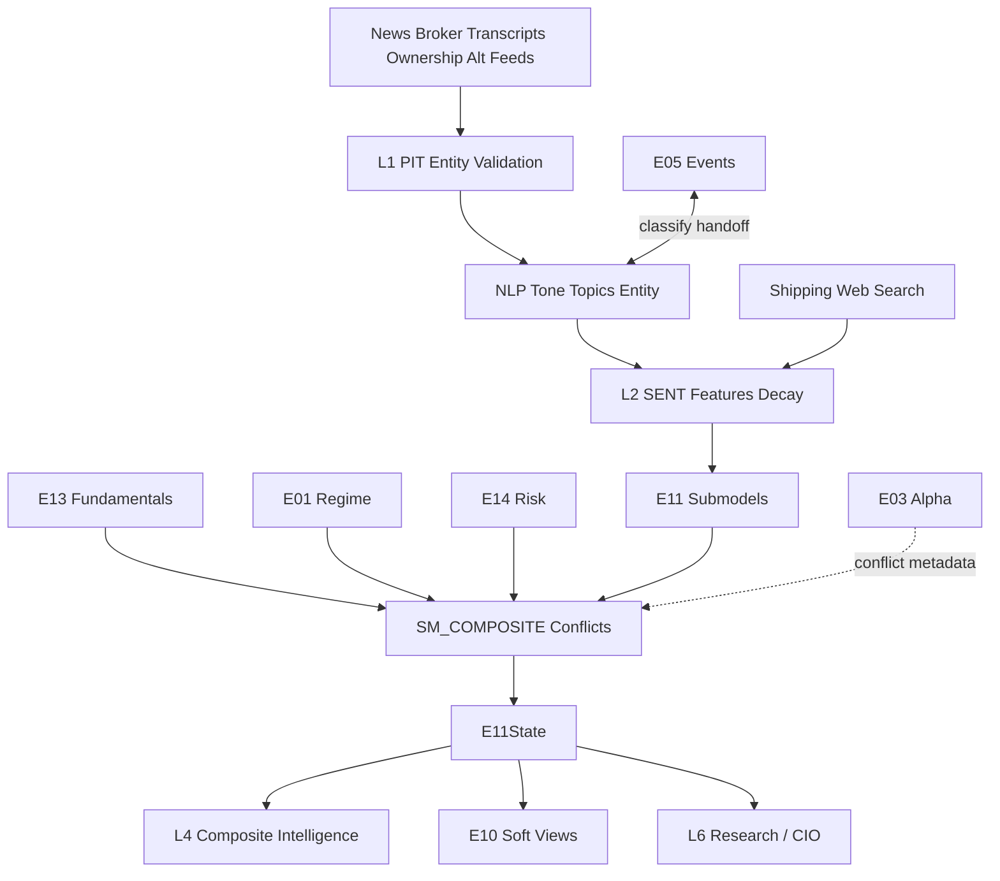

# E11 — Sentiment & Alternative Data Engine  
## Engineering Implementation Specification (AGI Investment Office)

**Document ID:** `E11`  
**Architecture compliance:** **E00 Constitution — Architecture v1.0** (binding)  
**Status:** Implementation-ready Candidate-track specification  
**Version:** 1.0.0  
**Owner:** Alt-Data / NLP Lead / Head of Quantitative Research  
**Lifecycle (E00 §18):** **Experimental → Research → Candidate → Production** via §16 gates

### E00 supremacy

Subordinate to `E00_AGI_INVESTMENT_OFFICE_CONSTITUTION.md`. On conflict, **E00 wins**.  
Implementing PRs **must cite E00 section IDs** (E00 Annex A).

### Boundary vs peer engines (critical)

| Engine | Role | E11 relationship |
|--------|------|------------------|
| **E03** | XS / technical alpha | Soft confirmation/conflict only — **never rewrites E03** |
| **E13** | Fundamentals | Tone/ownership alt overlays; E13 owns accounting quality |
| **E05** | Structured corporate events | E11 may **classify/enrich** unstructured text; E05 owns event objects & deal maths |
| **E01** | Macro | Macro-news sentiment feeds E01 narratives, not regimes |
| **E14** | Risk | Crowding/soft fragility from herding sentiment; gates on promote |
| **E10** | Portfolio | Optional soft views; E11 does **not** optimise |
| **E12** | ML Lab | Consumes E11 features; promotions still E00 §17 |

E11 is **additive unstructured / alt-data evidence**. No regressions to E03 or E13 (E00 §20.4).

### Relationship to current AGIB stack (reuse)

| Existing asset | E11 role |
|----------------|----------|
| `server/services/newsHeadlinesService.js` | L0 news adapter |
| `intelligence-engine/.../news_analyst.py` | Migrate to consume `E11State`, not ad-hoc scrapes |
| Market/pre-market briefing NLP snippets | Weak priors → structured `SENT_` features |
| E05 filings/calendar / E13 ownership | Shared raw inputs; distinct outputs |
| Intelligence routes | `/api/intelligence/e11/*` (E00 §14) |

**Net-new:** sentiment feature store, multi-source fusion, transcript tone, ownership-flow scores, alt-data adapters (shipping/web/search first; satellite later), decay/reliability engine, Bloomberg-style sentiment UI, PIT validation.

### Hard rules (E00-aligned)

1. Research only — never BUY/SELL/EXECUTE (E00 §1.5).  
2. No portfolio optimisation (E00 §2.6 → E10).  
3. **LLM/NLP may score text but cannot sole-author Production conclusions without evidence pack** (E00 §2.7, §10).  
4. Outputs obey **EngineState** envelope (E00 §5).  
5. Scores **0–100** with polarity; social optional and **confidence-capped** (E00 §8).  
6. Confidence = **conf-1.0** (E00 §9).  
7. Features under **`SENT_`** prefix (E00 §6); alt physical series may also use `META_` / future `ALT_` — see Annex.  
8. Weights via **Weight Registry** (E00 §12).  
9. Point-in-time documents only — no look-ahead (E00 §16).  
10. E14 gate on promotion; social never overrides E14/E01 (E00 §11).

---

# 1. Purpose

## 1.1 Investment questions answered

1. **What is the net information tone** on a name/sector/macro topic from news and communications?  
2. **Are brokers and estimates confirming or contradicting** price/fundamental views?  
3. **Is management language confident, cautious, or evasive** on calls/presentations?  
4. **Are ownership flows (insider/promoter/institution) aligning** with the narrative?  
5. **Do alternative activity proxies** (shipping, web, search, app, satellite roadmap) support demand/supply theses?  
6. **How fresh and reliable** is each source, and what conflicts exist?

## 1.2 Institutional philosophy

Prices and filings are incomplete. **Unstructured and alternative data** capture attention, narrative shifts, and real-economy activity before or beside traditional prints. E11 converts these into **auditable, decayed, reliability-weighted evidence** for Composite Intelligence — in the spirit of Point72 / Coatue / Two Sigma / BlackRock Systematic / Millennium / Citadel / GS & JPM data science / RavenPack- & Bloomberg News Analytics-class methodologies — under AGI research-only law (E00 §1.5).

## 1.3 Why alternative data matters

| Gap in traditional data | Alt / sentiment role |
|-------------------------|----------------------|
| Lagged fundamentals | Nowcasts of activity |
| Sparse India mid/small estimates | News + ownership proxies |
| Binary events without tone | Transcript / press tone |
| Crowding invisibility | Attention & social herding (capped) |
| Supply-chain shocks | Shipping/port/satellite proxies |

## 1.4 Expected alpha sources

| Source | Horizon |
|--------|---------|
| News tone shocks | Hours–10 sessions |
| Broker/target/estimate narrative | 5–40 sessions |
| Transcript tone shifts | 5–21 sessions post call |
| Ownership flow confirmation | 10–60 sessions |
| Web/search/app demand proxies | 10–63 sessions |
| Shipping/port/satellite | 20–126 sessions (sector-specific) |

## 1.5 Holding periods (research labels)

Soft sentiment: **1–15d** primary.  
Ownership/alt activity: **15–90d**.  
Structural satellite/supply-chain: **1–2 quarters** when licensed.

## 1.6 Capacity considerations

- News alpha capacity limited by attention crowding — E14 haircut when herding extreme.  
- Satellite/shipping often sector-concentrated — capacity via E10/E14, not E11.  
- Social data: **retail-noise risk**; Production weight capped (default ≤5% of composite).  
- Vendor latency/licensing gates modules via feature flags (§16).

---

# 2. Sentiment & Alternative Data Taxonomy

```
E11 Taxonomy
├── News Analytics
│   ├── Company News
│   ├── Sector News
│   ├── Macro News
│   └── Regulatory News
├── Research Signals
│   ├── Broker Upgrades / Downgrades
│   ├── Target Price Changes
│   └── Estimate Revisions (narrative + numeric join E13/E05)
├── Corporate Communication
│   ├── Earnings Calls / Transcripts
│   ├── Investor Presentations
│   ├── Press Releases
│   └── Management Commentary
├── Ownership Signals
│   ├── Insider Buying / Selling
│   ├── Promoter Changes
│   └── Institutional Holding Changes
├── Alternative Data
│   ├── Satellite Imagery (roadmap)
│   ├── Port Activity / Shipping / Freight
│   ├── Weather
│   ├── Supply Chain
│   ├── Mobility
│   ├── Energy Consumption
│   ├── Web Traffic
│   ├── App Rankings
│   └── Search Trends
├── Social (optional, capped)
│   ├── X / Twitter
│   ├── Reddit
│   ├── StockTwits
│   └── LinkedIn
└── Meta
    └── Composite Sentiment Intelligence
```

**Canonical `source_class` IDs:**  
`news_co`, `news_sector`, `news_macro`, `news_reg`, `broker_rating`, `broker_target`, `estimate_rev`, `transcript`, `presentation`, `press`, `mgmt_comment`, `insider`, `promoter`, `inst_own`, `satellite`, `port`, `shipping`, `weather`, `supply_chain`, `mobility`, `energy`, `web`, `app`, `search`, `social_x`, `social_reddit`, `social_stocktwits`, `social_linkedin`.

---

# 3. Sub Models

Package: `intelligence-engine/app/engines/e11/submodels/` (E00 §19).

### Common interface

```python
class E11SubModelResult(TypedDict):
    model_id: str
    source_class: str
    symbol: str | None              # None for macro/sector scope
    scope: str                      # symbol|sector|macro
    scope_id: str
    score_0_100: float
    polarity: str
    confidence: float               # conf-1.0
    freshness_hours: float
    decay_weight: float
    reliability: float              # source reliability 0..1
    features: dict[str, float]
    evidence: dict                  # E00 §10
    explanation: dict
    warnings: list[str]
    as_of: str
    doc_time: str                   # PIT document timestamp
    stale: bool
    model_version: str
```

---

### 3.1 News Sentiment Model (`SM_NEWS`)
| | |
|--|--|
| **Purpose** | Company/sector/macro/reg news tone & novelty |
| **Inputs** | Headlines/articles, entity links, timestamps |
| **Outputs** | News sentiment scores by scope |
| **Dependencies** | Entity resolution table |
| **Confidence** | Medium; vendor-dependent |

### 3.2 Research Consensus Model (`SM_RESEARCH`)
| | |
|--|--|
| **Purpose** | Broker upgrades/downgrades, target changes |
| **Inputs** | Rating/target feeds |
| **Outputs** | Research consensus score |
| **Dependencies** | Vendor coverage |
| **Confidence** | Medium–High when ≥3 brokers |

### 3.3 Management Tone Model (`SM_TONE`)
| | |
|--|--|
| **Purpose** | Transcript/presentation/press tone & uncertainty |
| **Inputs** | Transcripts, decks text, press releases |
| **Outputs** | Management tone / confidence scores |
| **Dependencies** | NLP pipeline; human spot-checks for Production |
| **Confidence** | Medium |

### 3.4 Analyst Revision Model (`SM_REV_SENT`)
| | |
|--|--|
| **Purpose** | Narrative+numeric revision momentum (joins E13/E05) |
| **Inputs** | Estimate revisions, note headlines |
| **Outputs** | Revision momentum sentiment |
| **Dependencies** | Estimates PIT |
| **Confidence** | Coverage-scaled |

### 3.5 Ownership Flow Model (`SM_OWN_FLOW`)
| | |
|--|--|
| **Purpose** | Insider/promoter/institutional flow sentiment |
| **Inputs** | Shareholding & insider filings (shared with E05/E13) |
| **Outputs** | Ownership score |
| **Dependencies** | PIT ownership |
| **Confidence** | Medium–High |

### 3.6 Alternative Data Model (`SM_ALT`)
| | |
|--|--|
| **Purpose** | Generic activity nowcast from web/search/app/mobility/energy |
| **Inputs** | Licensed alt series mapped to symbols/sectors |
| **Outputs** | Alternative activity score |
| **Dependencies** | Mapping tables |
| **Confidence** | Medium; sector-specific |

### 3.7 Satellite Intelligence Model (`SM_SAT`) — roadmap
| | |
|--|--|
| **Purpose** | Plant/parking/night-lights proxies |
| **Inputs** | Satellite vendor features |
| **Outputs** | Satellite activity index |
| **Dependencies** | License; mapping |
| **Confidence** | Research until calibrated |
| **Flag** | `e11_satellite` default off |

### 3.8 Supply Chain Model (`SM_SUPPLY`)
| | |
|--|--|
| **Purpose** | Supplier/customer disruption proxies |
| **Inputs** | Graph tags, news supply topics, delay indices |
| **Outputs** | Supply-chain stress/opportunity scores |
| **Dependencies** | SM_NEWS topics |
| **Confidence** | Medium–Low early |

### 3.9 Shipping Intelligence Model (`SM_SHIP`)
| | |
|--|--|
| **Purpose** | Port congestion, freight, Baltic/proxy shipping |
| **Inputs** | Freight indices, port metrics (when licensed) |
| **Outputs** | Shipping index features → sector scores |
| **Dependencies** | Macro commodity sectors |
| **Confidence** | Medium |

### 3.10 Composite Sentiment Model (`SM_COMPOSITE`)
| | |
|--|--|
| **Purpose** | Reliability- and freshness-weighted fusion |
| **Inputs** | All submodels + Weight Registry + E01/E14 conditions |
| **Outputs** | §9 outputs |
| **Dependencies** | E00 §12 weights |
| **Confidence** | conf-1.0 |

---

# 4. Inputs

## 4.1 Primary
News feeds, exchange announcements, research/broker feeds, earnings transcripts, investor presentations, shareholding/insider data, alt datasets (web/search/app/shipping/weather/mobility/energy), satellite observations (roadmap).

## 4.2 Upstream engines

| Engine | Use |
|--------|-----|
| **E01** | Macro-news routing; risk-off haircuts on fragile soft signals |
| **E13** | Fundamental contradiction detection |
| **E14** | Promotion gates; herding/crowding from attention |
| **E05** | Event object linkage (`event_id` when classified) |
| **E03** | Conflict metadata only |

## 4.3 Input registry

| input_id | Description |
|----------|-------------|
| `NEWS_DOC` | Article/headline PIT |
| `BROKER_ACTION` | Upgrade/downgrade/target |
| `TRANSCRIPT_DOC` | Call transcript |
| `PRESENTATION_DOC` | IR deck text |
| `PRESS_DOC` | Press release |
| `INSIDER_TRADE` / `OWN_PIT` | Ownership |
| `WEB_TRAFFIC` / `SEARCH_TREND` / `APP_RANK` | Digital alt |
| `SHIP_IDX` / `PORT_CONGESTION` | Shipping |
| `WEATHER_IDX` | Weather anomaly |
| `SAT_FEATURE` | Satellite (roadmap) |
| `SOCIAL_DOC` | Social posts (optional) |
| `E01_STATE` / `E13_FUNDAMENTAL` / `E14_STATE` / `E05_EVENT` | Upstream |

## 4.4 APIs & refresh

| Family | Primary | Refresh | Fallback |
|--------|---------|---------|----------|
| News | Existing `newsHeadlinesService` + licensed NLP vendor | 5m–1h | Headlines-only lexicon |
| Transcripts | Vendor / exchange AV | Event | Skip tone |
| Broker actions | Finnhub/FMP research | 1d | Disable SM_RESEARCH |
| Ownership | NSE disclosures | Event–weekly | E13/E05 shared |
| Search/web/app | Licensed (P2) | 1d | Module off |
| Shipping/freight | FRED/BDI proxy + vendor | 1d–1w | Macro commodity only |
| Satellite | Licensed (P3+) | 1w | Off |
| Social | Optional licensed (P3) | 1h | Off; never required |

---

# 5. Feature Engineering

E00 §6 **`SENT_`** primary; physical alt dual-write `SENT_ALT_*` until `ALT_` prefix amendment.

| feature_id | Definition |
|------------|------------|
| `SENT_NEWS_Z` | Winsorised news tone z (symbol) |
| `SENT_NEWS_SECTOR_Z` | Sector news tone |
| `SENT_NEWS_MACRO_Z` | Macro news tone |
| `SENT_NEWS_VOL` | Article count novelty |
| `SENT_TONE_MGMT` | Transcript tone score 0–100 |
| `SENT_UNCERTAINTY` | Uncertainty language intensity |
| `SENT_BROKER_NET` | Upgrades − downgrades score |
| `SENT_TARGET_DELTA` | Mean target revision % |
| `SENT_REV_MOM` | Estimate revision momentum join |
| `SENT_OWN_TREND` | Institutional+promoter flow z |
| `SENT_INSIDER_NET` | Insider net score |
| `SENT_MGMT_CONF` | Management confidence composite |
| `SENT_ALT_ACTIVITY` | Digital activity z |
| `SENT_SHIP_IDX` | Shipping/freight z |
| `SENT_PORT_CONGEST` | Port congestion z |
| `SENT_SAT_ACTIVITY` | Satellite index (roadmap) |
| `SENT_DEMAND_PROXY` | Blend web/search/app |
| `SENT_SOCIAL_Z` | Social tone (capped path) |
| `SENT_FRESHNESS_H` | Hours since newest doc |
| `SENT_DECAY_W` | Aggregate decay weight |
| `SENT_RELIABILITY` | Blended source reliability |
| `SENT_CONFLICT_FLAG` | 1 if sources disagree |

**Normalisation:** within sector for company news; macro separate; winsor 2.5/97.5; decay applied before composite.

---

# 6. Mathematical Models

## 6.1 Document sentiment

For document \(d\) with embedding/classifier score \(u_d\in[-1,1]\):  
\[
s_d=100\cdot\frac{u_d+1}{2}
\]
Entity-link confidence \(e_d\in[0,1]\) gates inclusion (\(e_d\ge0.6\) Production default).

## 6.2 Source aggregation

\[
S_{src}=\frac{\sum_d w_d^{\mathrm{decay}}\cdot r_{src}\cdot e_d\cdot s_d}{\sum_d w_d^{\mathrm{decay}}\cdot r_{src}\cdot e_d+\varepsilon}
\]
\(r_{src}\) = registered reliability (news 0.7, broker 0.75, transcript 0.7, ownership 0.8, web 0.55, social 0.35, satellite 0.6 research).

## 6.3 Decay

\[
w_d=\exp\big(-\lambda_{src}\cdot \mathrm{age\_hours}/24\big),\quad
\lambda=\frac{\ln 2}{\mathrm{HL}_{days}}
\]

| Source class | Default HL (days) |
|--------------|-------------------|
| news_* | 3 |
| broker_* | 10 |
| transcript/press | 15 |
| ownership | 30 |
| web/search/app | 14 |
| shipping/port | 21 |
| satellite | 45 |
| social_* | 1.5 |

## 6.4 Cross-source reconciliation

If \(|S_i-S_j|>25\) for material sources: set `SENT_CONFLICT_FLAG=1`, add contradiction evidence, multiply composite confidence by ≤0.85 (E00 §11).

## 6.5 Composite sentiment

\[
S_{\mathrm{comp}}=\sum_{src} \tilde\omega_{src} S_{src},\quad
\tilde\omega_{src}\propto \omega_{src}\cdot r_{src}\cdot \bar w^{decay}_{src}\cdot \mathbf{1}_{enabled}
\]
Base \(\omega\) from Weight Registry `e11_composite_v1` (E00 §12), conditioned on E01 (risk_off → ↑ ownership/quality tone, ↓ social).

**Social cap:** \(\tilde\omega_{social}\le0.05\) in Production.

## 6.6 Thresholds & behaviour

| Signal | Supportive | Caution |
|--------|------------|---------|
| News z | >+0.8 | <−0.8 |
| Broker net | Upgrades cluster | Downgrade cluster |
| Tone uncertainty | Low | High before cuts |
| Own trend | Inflows | Promoter↓ / insider dumps |
| Alt activity | +z with E13 growth | −z vs bullish price |

**Validation:** IC of S_comp vs forward residual returns; source ablation; PIT doc_time audits.

---

# 7. Composite Framework

## 7.1 Source weighting

Registry dimensions: source_class × scope × E01 regime × liquidity tier (E00 §12).  
Missing sources → renormalise; never impute bullish zeros.

## 7.2 Conflict handling (E00 §11)

| Conflict | Resolution |
|----------|------------|
| Bullish news vs bearish E13 BS | Haircut; contradictions; E14 risk↑ |
| Bullish social vs bearish ownership | Social ignored if ownership reliability higher |
| E05 hard negative event vs bullish tone | E05 event intensity dominates soft tone |
| E14 hard_derisk | Soft sentiment weight↓ |

**Authority:** E14/E01 override; E05 hard events override soft tone; E11 never overrides E03/E13 scores.

## 7.3 Freshness decay

Per §6.3; symbol composite exposes `freshness_hours` = min age of material docs.

## 7.4 Reliability scoring

Static priors × live quality (entity-link rate, duplicate ratio, vendor SLA).  
`C_data` in conf-1.0 uses reliability blend (E00 §9).

## 7.5 Cross-validation

Leave-source-out IC; if removing news collapses all edge, flag overfit to one vendor.

---

# 8. Machine Learning

E00 §17.

| Technique | Use |
|-----------|-----|
| NLP classifiers | Tone, uncertainty, credit/legal risk language |
| Entity extraction | Company/sector linking |
| Topic modelling | Macro/sector theme tags |
| Event classification | Handoff labels to E05 |
| Embedding similarity | Peer news / theme baskets |
| Multimodal roadmap | Satellite + text fusion (P4) |
| SHAP / rationale spans | Explainability mandatory on promote |
| Online learning | Shadow recalibration of source weights |

**Promotion:** offline+shadow+E14+human approval; LLM narrative cannot clear gates alone (E00 §17).

---

# 9. Outputs

## 9.1 `E11State` (E00 §5 + body)

```json
{
  "engine": "E11",
  "version": "1.0.0",
  "model_version": "e11-1.0.0",
  "as_of": "2026-07-25T16:30:00+05:30",
  "universe_id": "SENT_NSE_V1",
  "symbol": "TCS",
  "scope": "symbol",
  "scope_id": "TCS",
  "score": {
    "raw": null,
    "normalized_0_100": 61.0,
    "normalized_signed": 22.0,
    "unit": "score"
  },
  "confidence": {
    "value": 0.68,
    "components": {
      "C_data": 0.8,
      "C_agree": 0.7,
      "C_hist": 0.6,
      "C_regime": 0.85,
      "C_stable": 0.75,
      "C_n": 0.8,
      "C_complete": 0.7,
      "C_recency": 0.9
    },
    "method_version": "conf-1.0"
  },
  "reliability": {
    "sample_size": 42,
    "historical_accuracy": 0.54,
    "stability": 0.75
  },
  "sentiment_score": 61.0,
  "alternative_data_score": 55.0,
  "management_tone_score": 64.0,
  "ownership_score": 58.0,
  "composite_sentiment_score": 60.0,
  "freshness_hours": 6.0,
  "decay_weight": 0.72,
  "source_scores": {
    "news_co": 63.0,
    "transcript": 64.0,
    "broker_rating": 57.0,
    "inst_own": 58.0,
    "web": 55.0
  },
  "signals": {
    "SIG_E11_SENTIMENT": 61.0,
    "SIG_E11_ALT": 55.0,
    "SIG_E11_TONE": 64.0,
    "SIG_E11_OWN": 58.0,
    "SIG_E11_COMPOSITE": 60.0
  },
  "polarity": {
    "sentiment_score": "higher_is_more_bullish_sentiment",
    "alternative_data_score": "higher_is_stronger_activity"
  },
  "metadata": {
    "e01_ref": {},
    "e05_ref": {},
    "e13_ref": {},
    "e14_ref": {},
    "social_enabled": false,
    "weight_set_id": "e11_composite_v1"
  },
  "evidence": {
    "positive": [],
    "negative": [],
    "contradictions": [],
    "unknowns": [],
    "risks": [],
    "missing_data": []
  },
  "explanation": {
    "summary": "Mildly constructive news/tone; ownership neutral; alt activity mixed.",
    "top_drivers": [],
    "falsifiers": ["Downgrade cluster", "Insider dump", "E14 hard_derisk"]
  },
  "warnings": [],
  "stale_inputs": [],
  "input_hash": "sha256:...",
  "hash": "sha256:...",
  "timestamp_generated": "2026-07-25T16:35:00+05:30"
}
```

## 9.2 Signal registry (E00 §7)

| signal_id | Type | Range | Consumers |
|-----------|------|-------|-----------|
| `SIG_E11_SENTIMENT` | score | 0–100 | L4, E10 |
| `SIG_E11_ALT` | score | 0–100 | L4, E13 conflict |
| `SIG_E11_TONE` | score | 0–100 | L4, E05 |
| `SIG_E11_OWN` | score | 0–100 | L4, E14 |
| `SIG_E11_COMPOSITE` | score | 0–100 | L4, CIO |
| `SIG_E11_SOCIAL` | score | 0–100 | L4 optional capped |

---

# 10. Downstream Consumers

| Consumer | Influence |
|----------|-----------|
| **E03** | Agreement/conflict evidence; confidence haircut when strongly opposed — **no score writes** |
| **E05** | NLP classify/enrich → event_type suggestions; tone on guidance |
| **E10** | Optional soft views with low BL confidence |
| **E13** | Narrative vs quality divergence flags |
| **E14** | Attention herding → crowding soft signal; gates |
| **Composite Intelligence** | Primary consumer of sentiment/alt evidence |
| **Research Generator** | Cite sources with links/snippets in evidence |
| **CIO Reports** | Sentiment strip + contradictions (flagged until Production) |

---

# 11. Database Design

E00 §13.

```sql
CREATE TABLE e11_document (
  doc_id text PRIMARY KEY,
  source_class text NOT NULL,
  doc_time timestamptz NOT NULL,
  pit_available_at timestamptz NOT NULL,
  symbol text,
  sector_id text,
  title text,
  url text,
  vendor text NOT NULL,
  raw_ref text,
  entity_confidence double precision,
  meta jsonb DEFAULT '{}'
);
CREATE INDEX e11_doc_symbol_time_idx ON e11_document (symbol, doc_time DESC);
CREATE INDEX e11_doc_class_time_idx ON e11_document (source_class, doc_time DESC);

CREATE TABLE e11_doc_score (
  doc_id text NOT NULL REFERENCES e11_document(doc_id),
  model_version text NOT NULL,
  sentiment_u double precision NOT NULL,
  uncertainty double precision,
  topics jsonb DEFAULT '[]',
  explanation jsonb DEFAULT '{}',
  PRIMARY KEY (doc_id, model_version)
);

CREATE TABLE e11_alt_series_pit (
  as_of date NOT NULL,
  series_id text NOT NULL,
  scope text NOT NULL,
  scope_id text NOT NULL,
  value double precision NOT NULL,
  vendor text NOT NULL,
  PRIMARY KEY (as_of, series_id, scope, scope_id, vendor)
);

CREATE TABLE e11_feature_snapshot (
  as_of timestamptz NOT NULL,
  scope text NOT NULL,
  scope_id text NOT NULL,
  feature_id text NOT NULL,
  value double precision,
  meta jsonb DEFAULT '{}',
  PRIMARY KEY (as_of, scope, scope_id, feature_id)
);

CREATE TABLE e11_state (
  id uuid PRIMARY KEY DEFAULT gen_random_uuid(),
  as_of timestamptz NOT NULL,
  scope text NOT NULL,
  scope_id text NOT NULL,
  payload jsonb NOT NULL,
  composite_sentiment_score double precision NOT NULL,
  confidence double precision NOT NULL,
  model_version text NOT NULL,
  weight_set_id text NOT NULL,
  input_hash text NOT NULL,
  created_at timestamptz DEFAULT now(),
  UNIQUE (as_of, scope, scope_id, model_version)
);

CREATE TABLE e11_state_current (
  scope text NOT NULL,
  scope_id text NOT NULL,
  as_of timestamptz NOT NULL,
  payload jsonb NOT NULL,
  updated_at timestamptz NOT NULL DEFAULT now(),
  PRIMARY KEY (scope, scope_id)
);

CREATE TABLE e11_source_reliability (
  source_class text PRIMARY KEY,
  reliability double precision NOT NULL,
  half_life_days double precision NOT NULL,
  updated_at timestamptz DEFAULT now()
);

CREATE TABLE e11_validation_runs (
  id uuid PRIMARY KEY DEFAULT gen_random_uuid(),
  started_at timestamptz,
  finished_at timestamptz,
  method text,
  metrics jsonb,
  model_version text
);

CREATE TABLE e11_migration_flags (
  key text PRIMARY KEY,
  enabled boolean NOT NULL DEFAULT false,
  updated_at timestamptz DEFAULT now()
);
```

PIT: `pit_available_at` ≤ `as_of`. RLS: service write; research read.

---

# 12. Backend Services

```
intelligence-engine/app/engines/e11/
  __init__.py
  config.py
  pipeline.py
  schema.py
  ingest/
    news_agib.py
    broker.py
    transcripts.py
    ownership.py
    alt_digital.py
    shipping.py
    social.py
    satellite.py
  nlp/
    entity.py
    tone.py
    topics.py
    classify_to_e05.py
  features/
    registry_sync.py
    builder.py
    decay.py
  submodels/
    news.py
    research.py
    tone.py
    revisions.py
    ownership.py
    alt.py
    satellite.py
    supply.py
    shipping.py
    composite.py
  adapters/
    e01.py
    e03.py
    e05.py
    e13.py
    e14.py
  explain.py
  persistence.py
  validation/
    pit_audit.py
    ablation.py
    walk_forward.py
```

Node: `server/services/e11SentimentService.js`; bridge `newsHeadlinesService` → document ingest.

## 12.1 Pipeline (E00 §4 order ~45)

1. Ingest docs/series (L0)  
2. PIT + entity validation (L1)  
3. NLP scores + features (L2)  
4. Submodels  
5. Weight Registry fusion + conflicts vs E13/E05  
6. Persist `E11State`; notify L4  
7. Metrics: docs/hour, entity-link rate, conflict rate, stale_ratio

## 12.2 Cron (IST)

| Job | Schedule | Action |
|-----|----------|--------|
| `e11_news_poll` | every 10–15m market hours | News ingest+score |
| `e11_eod` | 18:25 IST | Full symbol composite |
| `e11_transcript_event` | on calendar | Tone jobs |
| `e11_ownership_sync` | Tue/Fri 07:30 | Own flows |
| `e11_alt_daily` | 06:50 IST | Digital/shipping |
| `e11_weekly_ablation` | Sunday 19:30 | Source reliability |
| `e11_monthly_validate` | 5th 21:00 | Walk-forward |

## 12.3 SLOs

| SLO | Target |
|-----|--------|
| News doc→feature | p95 < 5m |
| Warm GET state | < 300ms |
| Entity-link precision (sample audit) | ≥ 0.85 Production news |
| PIT violations | 0 |

---

# 13. API Contracts

E00 §14.

### 13.1 `GET /api/intelligence/e11/state/{symbol}`
### 13.2 `GET /api/intelligence/e11/sector/{sector_id}`
### 13.3 `GET /api/intelligence/e11/macro`
### 13.4 `GET /api/intelligence/e11/documents?symbol=&limit=`
### 13.5 `GET /api/intelligence/e11/timeline/{symbol}`
### 13.6 `GET /api/intelligence/e11/alt/{symbol}`
### 13.7 `POST /api/intelligence/e11/run` (service-role)
### 13.8 `GET /api/intelligence/e11/taxonomy`
### 13.9 Errors
`E11_SCOPE`, `E11_PIT`, `E11_NLP`, `E11_STALE`, `E11_INTERNAL`.

---

# 14. Frontend (Bloomberg-style)

E00 §15 required views.

Route: `/beta/e11-sentiment` (flagged). Watermark until Production.

## Widgets

1. **News Dashboard** — scored headlines with entity confidence  
2. **Sentiment Timeline** — composite + sources  
3. **Transcript Explorer** — tone/uncertainty highlights (rationale spans)  
4. **Ownership Monitor** — insider/promoter/inst flows  
5. **Alternative-Data Dashboard** — web/search/app/shipping panels  
6. **Satellite Activity** (flagged)  
7. **Shipping / Port Monitor**  
8. **Broker Actions Strip**  
9. **Evidence & Conflicts** — vs E03/E13/E05  
10. **Risk strip** — E14 / herding  

No BUY/SELL; social panel labeled **experimental/capped** (E00 §15.2).

---

# 15. Validation

E00 §16.

| Test | Detail |
|------|--------|
| Walk-forward | Source weights; embargo by doc_time |
| Historical replay | Known news shocks / crash weeks |
| Sentiment persistence | Autocorr of S_comp; half-life empirical vs config |
| False-positive analysis | High sentiment with null forward residual |
| Source reliability | Ablation IC by source_class |
| Look-ahead bias | Future docs excluded |
| Point-in-time validation | CI fixtures |

**Targets:**

| Metric | Target |
|--------|--------|
| PIT audit | 0 violations |
| Social weight | ≤5% Production composite |
| Entity precision sample | ≥0.85 |
| E03/E13 regression | 100% green on E11 merges |

---

# 16. Migration

## 16.1 Principle

Additive engine. News services become ingest adapters. E03/E13 unchanged.

```
E03 / E13 --------------------→ unchanged
newsHeadlinesService / news_analyst → E11 documents + E11State
```

## 16.2 Flags

```json
{
  "e11_api_enabled": false,
  "e11_ui_tab": false,
  "e11_l4_evidence": false,
  "e11_e10_views": false,
  "e11_cio_brief_block": false,
  "e11_transcripts": false,
  "e11_alt_digital": false,
  "e11_shipping": false,
  "e11_satellite": false,
  "e11_social": false,
  "e11_news_bridge": true
}
```

## 16.3 P0–P4 (E00 §18)

| Phase | Scope | Exit criteria |
|-------|-------|---------------|
| **P0** | News bridge→docs; lexicon/classifier tone; symbol `E11State`; decay | Envelope+PIT; E03/E13 regression green |
| **P1** | Ownership flows + broker actions; rankings; reliability table | Multi-source composite |
| **P2** | Transcripts; Beta UI; `e11_l4_evidence`; E05 classify handoff | Conflict tests pass |
| **P3** | Digital alt + shipping; E10/E14 hooks | Alt dashboard live |
| **P4** | Satellite/social capped; multimodal shadow; Production vote | E00 §17 + CIO/Risk approval |

## 16.4 Rollback

Disable flags → legacy news UI remains; E03/E13 untouched.

---

# 17. Implementation phases (checklist)

| Phase | Deliverables |
|-------|--------------|
| P0 | document schema, news ingest, tone, composite, APIs, PIT tests |
| P1 | ownership+broker submodels, reliability, weights |
| P2 | transcripts, UI, E05 handoff, L4 adapter |
| P3 | alt digital/shipping, E10/E14 adapters |
| P4 | satellite/social, ML weight shadow, Production pack |

---

# 18. Non-functional requirements

- Deterministic given doc set + model_version + weight_set_id (classifier seeded)  
- Store rationale spans for tone (explainability)  
- Secrets server-side only (E00 §19.6)  
- PII: strip user handles beyond research necessity; no private messages  
- Research disclaimers on sentiment UIs  

---

# 19. Acceptance tests (sample)

1. Doc with `pit_available_at` after `as_of` excluded.  
2. Bullish news + bearish ownership → conflict flag + confidence↓.  
3. Social enabled → weight ≤0.05 in Production weight set.  
4. Entity confidence <0.6 → doc excluded from Production composite.  
5. E11 merge does not change E03/E13 golden fixtures.  
6. Envelope validates conf-1.0 + evidence with source snippets.  
7. Flags off → no regression on technical/fundamental pages.  
8. Warm GET < 300ms cached.

---

# 20. Dependency graph



---

# 21. E00 compliance matrix

| E00 | E11 |
|-----|-----|
| §1 | Research-only sentiment/alt evidence |
| §2–§4 | L3 specialised; order ~45 |
| §5–§10 | Envelope, SENT_ features/signals, scores, conf-1.0, evidence |
| §11 | Soft haircuts; E14/E01/E05 hard authority |
| §12 | Source weights in Weight Registry; social capped |
| §13–§15 | DB/API/UI standards |
| §16–§18 | PIT validation, ML gates, lifecycle |
| §19–§20 | Package layout; additive migration |

---

# ANNEX — E00 §6 prefix note

`SENT_` is already normative in E00 §6.  
**Optional v1.1:** add `ALT_` for physical alternative series (`ALT_SHIP_IDX`, `ALT_SAT_ACTIVITY`) distinct from NLP sentiment; until then use `SENT_ALT_*` / `SENT_SHIP_*`.

---

*End of E11 Sentiment & Alternative Data Engine Specification v1.0 — governed by E00 Architecture v1.0*
