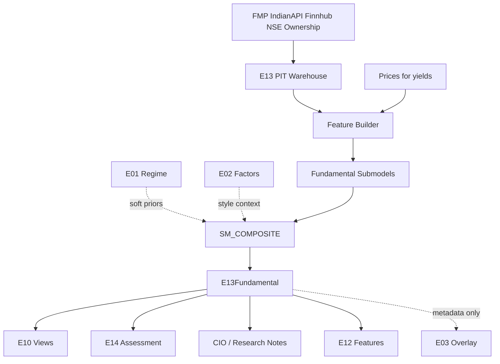

# E13 — Equity Fundamental Long/Short Engine  
## Engineering Implementation Specification (AGI Investment Office)

**Owner:** CIO / Head of Equity Research / Head of Quantamental Research  
**Pipeline position:** Fundamental / quantamental research engine. Runs on point-in-time fundamentals after **E01** (context only) and alongside **E02** (style map — not a substitute). Produces fundamental attractiveness scores and long/short research views for every eligible listed company. Consumed by **E03** (overlay), **E10** (views), **E12** (features/labels), **E14** (mandatory gate), CIO briefs, and research notes.  
**Nature:** Institutional discretionary + quantamental research intelligence — evaluates **business quality and fundamental attractiveness**, not price action. **Never** performs portfolio optimisation (E10), macro regime classification (E01), or risk management (E14). **Never** emits BUY / SELL / EXECUTE.  
**Version:** 1.0  
**Status:** Implementation-ready specification  
**Architectural peers:** `E01_MACRO_REGIME_ENGINE_SPEC.md`, `E02_FACTOR_STYLE_ENGINE_SPEC.md`, `E03_CROSS_SECTIONAL_QUANT_ENGINE_SPEC.md`, `E10_PORTFOLIO_CONSTRUCTION_ENGINE_SPEC.md`, `E14_RISK_CROWDING_OVERLAY_SPEC.md`

### Relationship to current AGIB stack (reuse)

| Existing asset | Path | E13 role |
|----------------|------|----------|
| Production technical / XS research | `nifty500_research_engine.py`, E03 | **Orthogonal** — price/relative alpha only; E13 adds fundamental layer |
| E02 Factor & Style | `E02_*` contracts | Shared raw metrics possible; E02 = systematic **exposures**; E13 = **business thesis scores** + L/S attractiveness |
| Fundamentals vendors (planned) | `FMP_API_KEY`, `INDIANAPI_KEY`, Finnhub estimates | Primary statement / estimate feeds |
| Earnings calendar | `preMarketContextService.js` (Finnhub) | Event proximity context for revisions |
| Intelligence routes | `server/routes/intelligence.js` | Add `/api/intelligence/e13/*` |
| Universe | `NIFTYstocks.csv` / NSE investable | Coverage universe |
| E01 / E14 | state APIs | Context priors / promotion gates only |

**Net-new:** PIT fundamental warehouse, quantamental taxonomy & submodels, composite fundamental score, peer/percentile engine, revision & ownership features, Bloomberg-style fundamental UI, validation (look-ahead / restatement), phased greenfield rollout (no legacy fundamental engine to preserve).

**Hard rules**
1. E13 never optimises portfolios, sets regimes, or sizes risk.  
2. Point-in-time only — **no look-ahead** on filings, estimates, or shareholding.  
3. Sector-aware scoring; bank/insurance/NBFC accounting variants mandatory.  
4. Long/short **research labels** are relative attractiveness, not orders.  
5. CIO/client promotion requires **E14Assessment**.  
6. E02 scores may be cited for style context; E13 must not simply rename E02 outputs.

### Separation from E02 (critical)

| Dimension | E02 Factor & Style | E13 Fundamental L/S |
|-----------|--------------------|---------------------|
| Question | What systematic style is this? | How attractive is the business / setup fundamentally? |
| Output | Factor loadings & style scores | Quality/growth/valuation/BS/CF/mgmt composite + L/S view |
| Horizon | Premia / style map | Thesis horizon 2–8 quarters typical |
| Moat / governance / promoter | Out of scope (mostly) | First-class |
| Use in E10 | Factor budgets | Conviction views µ |
| Use in E14 | Factor RC | Name fundamental fragility flags (secondary) |

---

# 1. Purpose

## 1.1 Investment questions answered

1. **Is this a high-quality business** on capital efficiency, earnings quality, and balance-sheet resilience?  
2. **Is growth durable or cyclical**, and is it translating into cash?  
3. **Is valuation attractive relative to quality and growth** (not merely “cheap”)?  
4. **Is management allocating capital well**, and is governance / promoter alignment acceptable?  
5. **Are estimates and ownership confirming or contradicting** the fundamental picture?  
6. **What is the relative long vs short fundamental attractiveness** within sector peers?  
7. **What would falsify the thesis** (margin break, leverage spike, revision collapse, governance event)?

## 1.2 Institutional philosophy

E13 embodies **quantamental** research: structured financial evidence first, narrative second.

- Prefer **cash earnings** over cosmetic EPS.  
- Prefer **ROIC / incremental returns** over vanity growth.  
- Prefer **clean balance sheets** when cyclicality is high.  
- Treat **valuation as a residual** after quality and growth — deep value without quality is a short candidate, not a long.  
- Use **peer-relative** and history-relative lenses together.  
- Keep **price technicals out** of the fundamental score (those belong to E03); optional “setup alignment” is metadata only.

## 1.3 Research workflow (institutional)

```
1. Universe eligibility (listing, reporting currency, coverage)
2. Ingest PIT statements + estimates + ownership
3. Engineer metrics (levels, deltas, TTM, NTM)
4. Sector-normalise + historical percentiles
5. Run submodels → pillar scores
6. Composite Fundamental Score + L/S research label
7. Attach falsifiers, evidence, confidence
8. E14 assess before CIO / publish
9. Feed E10 views / E03 overlay / research note stubs
```

Analyst override path (P3+): human can attach `thesis_note` and `override_score` with audit; model score always retained.

## 1.4 Hedge-fund / sell-side analogues

| Firm / desk | Relevance |
|-------------|-----------|
| Viking, Lone Pine, Coatue, Tiger | High-quality growth / compounder frameworks |
| Egerton, TCI, Pershing Square | Concentrated fundamental L/S & activism-aware governance |
| Citadel GE / Point72 | Quantamental pods: structured scores + PM judgment |
| GS / MS / UBS / JPM Research | Estimate frameworks, sector templates, revision culture |

---

# 2. Fundamental Taxonomy

## 2.1 Hierarchy

```
E13 Fundamental Taxonomy
├── Business Quality
│   ├── FQ_PROFITABILITY
│   ├── FQ_CAPITAL_EFFICIENCY
│   ├── FQ_EARNINGS_QUALITY
│   ├── FQ_CASH_FLOW
│   └── FQ_BALANCE_SHEET
├── Growth
│   ├── FG_REVENUE
│   ├── FG_EARNINGS
│   └── FG_MARGIN_EXPANSION
├── Valuation
│   └── FV_COMPOSITE
├── Franchise / Soft
│   ├── FM_MANAGEMENT
│   ├── FM_GOVERNANCE
│   ├── FM_MOAT
│   └── FM_INDUSTRY_STRUCTURE
├── Market Information
│   ├── FA_ANALYST_REVISIONS
│   └── FA_OWNERSHIP
├── Overlay (optional)
│   └── FESG_OVERLAY
└── Meta
    ├── FC_COMPOSITE          Composite Fundamental Score
    └── FL_LS_VIEW            Long/Short research view
```

Each node emits `score_0_100`, `z_sector`, `percentile_5y`, `confidence`, `evidence[]`.

**Sign convention:** Higher score = more fundamentally attractive for a **long research bias** on that pillar. Short research bias uses low composite / inverted pillars with explicit `side_hint`.

---

## 2.2 Pillar dictionary

### Business Quality (`FQ_*`)
- **Definition:** Durability of economics — margins, returns on capital, earnings/cash fidelity, balance-sheet resilience.  
- **Intuition:** Compounders survive cycles; junk does not.  
- **Horizon:** Multi-year characteristic with quarterly updates.

### Growth (`FG_*`)
- **Definition:** Trajectory of revenue, earnings, and margin expansion (realized + near-term expected).  
- **Intuition:** Growth is valuable only if incremental capital earns above WACC.  
- **Horizon:** 2–8 quarters primary; 3y CAGR secondary.

### Profitability & Capital Efficiency
- Covered via ROE/ROIC/ROCE, margins, asset turnover — see submodels.

### Valuation (`FV_COMPOSITE`)
- **Definition:** Cheapness vs peers **conditional on quality/growth** (GARP-aware), not raw value-trap yield.  
- **Intuition:** Pay a fair price for excellence; demand a discount for mediocrity.

### Balance Sheet / Cash Flow
- Solvency, leverage, liquidity, FCF conversion, working-capital discipline.

### Capital Allocation & Management Quality
- Reinvestment vs distributions, dilution, ROIC trend vs capex, buybacks/dividends consistency, guidance credibility.

### Governance
- Promoter pledge, related-party intensity proxies, audit flags, board independence proxies (as data allows).

### Competitive Advantage / Moat
- Stability of margins/ROIC, share stability, switching-cost / scale proxies, industry structure (concentration).

### Industry Structure
- Rivalry, cyclicality class, regulatory intensity (sector taxonomy tags).

### Earnings Quality
- Accruals, cash conversion, reserve/one-off flags, revenue recognition stress heuristics.

### Analyst Revisions
- Direction and breadth of EPS/Sales revisions; surprise history.

### ESG (optional overlay)
- Does **not** drive core composite unless mandate enables `FESG_OVERLAY` weight > 0.

### Composite Fundamental Score (`FC_COMPOSITE`)
- Weighted blend of pillars with conflict resolution (§7).

---

# 3. Sub Models

Package: `intelligence-engine/app/engines/e13/submodels/`.

### Common interface

```python
class FundamentalSubModelResult(TypedDict):
    model_id: str
    pillar_ids: list[str]
    score_0_100: float
    z_sector: float
    percentile_5y: float
    confidence: float
    metrics: dict[str, float]
    contributions: list[dict]
    falsifiers: list[str]
    as_of: str
    symbol: str
    sector_id: str
    stale: bool
    evidence: list[str]
```

---

### 3.1 Revenue Growth Model (`SM_REV_G`)
| | |
|--|--|
| **Purpose** | `FG_REVENUE` |
| **Inputs** | Sales YoY, 3y CAGR, NTM sales growth consensus |
| **Outputs** | Revenue growth score |
| **Dependencies** | Sector cyclicality tags |
| **Confidence** | High with ≥8 reported quarters |

---

### 3.2 Earnings Growth Model (`SM_EPS_G`)
| | |
|--|--|
| **Purpose** | `FG_EARNINGS` |
| **Inputs** | EPS YoY/CAGR, NTM EPS growth, excluding obvious one-offs when flagged |
| **Outputs** | Earnings growth score |
| **Dependencies** | Earnings quality (down-weight if EQ low) |
| **Confidence** | Medium–High |

---

### 3.3 Margin Expansion Model (`SM_MARGIN`)
| | |
|--|--|
| **Purpose** | `FG_MARGIN_EXPANSION` |
| **Inputs** | Δ Gross / EBITDA / EBIT / PAT margins (1y, 3y) |
| **Outputs** | Margin trajectory score |
| **Dependencies** | Industry structure (commodity vs branded) |
| **Confidence** | Medium |

---

### 3.4 ROE Model (`SM_ROE`)
| | |
|--|--|
| **Purpose** | Profitability via ROE (+ DuPont components) |
| **Inputs** | NI/Equity, NPM, asset turnover, leverage |
| **Outputs** | ROE contribution to quality |
| **Dependencies** | Sector rules (banks: ROTA / CET1 proxies when available) |
| **Confidence** | High |

---

### 3.5 ROIC Model (`SM_ROIC`)
| | |
|--|--|
| **Purpose** | Core capital efficiency |
| **Inputs** | NOPAT / invested capital; WACC proxy optional |
| **Outputs** | ROIC score; `roic_minus_wacc` if WACC present |
| **Dependencies** | Careful IC definition for financials (often N/A → suppress) |
| **Confidence** | High non-financials |

---

### 3.6 ROCE Model (`SM_ROCE`)
| | |
|--|--|
| **Purpose** | EBIT / capital employed — India-research common lens |
| **Inputs** | EBIT, equity + debt − cash equivalents |
| **Outputs** | ROCE score |
| **Dependencies** | Consistent capital employed definition |
| **Confidence** | High |

---

### 3.7 Cash Flow Quality Model (`SM_CF_QUAL`)
| | |
|--|--|
| **Purpose** | `FQ_EARNINGS_QUALITY` + cash fidelity |
| **Inputs** | CFO/NI, accruals, WC deltas |
| **Outputs** | EQ / CF quality score |
| **Dependencies** | None |
| **Confidence** | High when CFO present |

---

### 3.8 Free Cash Flow Model (`SM_FCF`)
| | |
|--|--|
| **Purpose** | `FQ_CASH_FLOW` |
| **Inputs** | FCF, FCF margin, FCF yield, FCF/NI |
| **Outputs** | FCF score |
| **Dependencies** | Capex cycle tags (infra vs software) |
| **Confidence** | Medium–High |

---

### 3.9 Debt / Balance Sheet Model (`SM_DEBT`)
| | |
|--|--|
| **Purpose** | `FQ_BALANCE_SHEET` |
| **Inputs** | D/E, net debt/EBITDA, interest coverage, current ratio, cash runway proxies |
| **Outputs** | BS strength score (high = safer) |
| **Dependencies** | Sector leverage norms |
| **Confidence** | High |

---

### 3.10 Valuation Model (`SM_VAL`)
| | |
|--|--|
| **Purpose** | `FV_COMPOSITE` |
| **Inputs** | Forward/Trailing P/E, EV/EBITDA, EV/Sales, P/B, PEG, FCF yield |
| **Outputs** | Valuation attractiveness (high = cheaper **after** quality gate metadata) |
| **Dependencies** | Quality/Growth scores for GARP triangle (see §7) |
| **Confidence** | Medium (estimate-dependent) |

**Banks:** P/B + earnings yield primary; suppress EV/EBITDA.

---

### 3.11 Quality Model (`SM_QUALITY`)
| | |
|--|--|
| **Purpose** | Aggregate `FQ_*` business quality |
| **Inputs** | ROIC/ROE/ROCE, margins levels, EQ, BS |
| **Outputs** | `quality_score` |
| **Dependencies** | Submodels above |
| **Confidence** | Mean of components |

---

### 3.12 Management / Capital Allocation Model (`SM_MGMT`)
| | |
|--|--|
| **Purpose** | `FM_MANAGEMENT` |
| **Inputs** | ROIC trend vs reinvestment, dilution (Δ shares), dividend/FCF policy consistency, buyback flags, guidance vs delivery (when available) |
| **Outputs** | Management score |
| **Dependencies** | Multi-year history |
| **Confidence** | Medium |

---

### 3.13 Governance Model (`SM_GOV`)
| | |
|--|--|
| **Purpose** | `FM_GOVERNANCE` |
| **Inputs** | Promoter holding level/Δ, pledge %, institutional holding Δ, related-party proxies, auditor change flags |
| **Outputs** | Governance score |
| **Dependencies** | Shareholding feeds |
| **Confidence** | Medium (India-specific richness) |

---

### 3.14 Analyst Revision Model (`SM_REV`)
| | |
|--|--|
| **Purpose** | `FA_ANALYST_REVISIONS` |
| **Inputs** | EPS/Sales FY1/FY2 revision 1m/3m, surprise history, #analysts |
| **Outputs** | Revision score; `expected_revision_direction` |
| **Dependencies** | Consensus vendor |
| **Confidence** | Coverage-scaled |

---

### 3.15 Economic Moat Model (`SM_MOAT`)
| | |
|--|--|
| **Purpose** | `FM_MOAT` |
| **Inputs** | Stability of ROIC/margins (σ↓ better), gross margin persistence, operating leverage pattern, industry concentration tag |
| **Outputs** | Moat score |
| **Dependencies** | Industry structure tags |
| **Confidence** | Medium — heuristic until alt-data |

---

### 3.16 Industry Structure Model (`SM_INDUSTRY`)
| | |
|--|--|
| **Purpose** | `FM_INDUSTRY_STRUCTURE` |
| **Inputs** | Sector cyclicality, regulatory flag, commodity exposure, competitive intensity class (internal taxonomy) |
| **Outputs** | Industry tailwind/headwind score |
| **Dependencies** | Static taxonomy + E01 optional overlay |
| **Confidence** | Medium |

---

### 3.17 Ownership Model (`SM_OWN`)
| | |
|--|--|
| **Purpose** | `FA_OWNERSHIP` |
| **Inputs** | Promoter %, FII/DII trends, insider trade flags |
| **Outputs** | Ownership alignment score |
| **Dependencies** | Exchange shareholding disclosures |
| **Confidence** | Medium |

---

### 3.18 ESG Overlay (`SM_ESG`) — optional
| | |
|--|--|
| **Purpose** | `FESG_OVERLAY` |
| **Inputs** | Vendor ESG scores when licensed |
| **Outputs** | Overlay score |
| **Default weight** | 0.0 until mandate enables |

---

### 3.19 Composite Fundamental Model (`SM_COMPOSITE`)
| | |
|--|--|
| **Purpose** | `FC_COMPOSITE`, `FL_LS_VIEW`, expected earnings/revision direction |
| **Inputs** | All pillar scores + E01 soft priors + E14 fragility metadata |
| **Outputs** | Composite, side_hint, confidences, falsifiers |
| **Dependencies** | §7 weighting |
| **Confidence** | Ensemble agreement |

---

# 4. Inputs

## 4.1 Financial statements
Income statement, balance sheet, cash flow — quarterly + annual + TTM. Revenue, gross profit, EBITDA, EBIT, PAT, EPS, CFO, capex, FCF, assets, equity, debt, cash, interest, WC components, shares.

## 4.2 Estimates & results
Consensus EPS/Sales FY1/FY2, LT growth, revisions, surprises, report dates, guidance text flags (P2 NLP).

## 4.3 Ownership & corporate actions
Promoter holding/pledge, FII/DII, insider trades, splits/bonuses/buybacks, dilutions, ratings changes.

## 4.4 Classification
Sector, industry, market cap bucket, reporting standard tags (Ind-AS), financials subtype (bank/insurance/NBFC).

## 4.5 Upstream engines
| Source | Use |
|--------|-----|
| **E01** | Soft prior on cyclicality / inflation sensitivity — **does not set scores alone** |
| **E02** | Style context; residual check that E13 longs are not unexplained pure momentum |
| **E14** | Gate + leverage/liquidity haircuts on conviction for CIO path |

## 4.6 Input registry

| input_id | Description |
|----------|-------------|
| `IS_*` / `BS_*` / `CF_*` | Statement fields PIT |
| `EPS_FY1` / `SALES_FY1` | Consensus |
| `EPS_REV_1M` / `EPS_REV_3M` | Revisions |
| `EPS_SURPRISE_LAST` | Last surprise % |
| `REPORT_DATE` | Filing availability date |
| `PROMOTER_PCT` / `PLEDGE_PCT` | Ownership |
| `FII_PCT` / `DII_PCT` | Institutional |
| `INSIDER_NET_90D` | Insider net |
| `SECTOR_ID` / `INDUSTRY_ID` | Classification |
| `SHARES_DILUTED` | Share count |
| `E01_STATE` / `E02_EXPOSURE` / `E14_STATE` | Engine refs |
| `UNIVERSE_ID` | Coverage set |

## 4.7 APIs & refresh

| Family | Primary API | Refresh | Cost | Reliability | Fallback |
|--------|-------------|---------|------|-------------|----------|
| India fundamentals | FMP / IndianAPI | Event + 1d | Paid | Medium | Manual PIT CMS tables |
| US overlay (optional) | FMP / AV | 1d | Paid | High | Off in v1 India-primary |
| Estimates | Finnhub / FMP analyst | 1d | Paid | Medium | Disable revision pillar |
| Shareholding | NSE shareholding patterns / vendor | Weekly–quarterly | Low–Med | Medium | Governance pillar ↓ confidence |
| Prices (for yields) | Groww / research cache | 1d | Existing | High | — |
| E01/E02/E14 | Internal | Job-ordered | Internal | High | Soft degrade |

**Env:** `FMP_API_KEY`, `INDIANAPI_KEY`, `FINNHUB_API_KEY`, Supabase keys, engine URLs.

---

# 5. Feature Engineering

Feature store: `e13_feature_snapshot` (PIT).

| feature_id | Definition |
|------------|------------|
| `pe_ttm` | Price / EPS_TTM |
| `forward_pe` | Price / EPS_FY1 |
| `ev_ebitda` | EV / EBITDA_TTM |
| `ev_sales` | EV / Sales_TTM |
| `pb` | Price / Book |
| `peg` | Forward PE / NTM EPS growth (guard div0) |
| `fcf_yield` | FCF_TTM / Mcap |
| `earn_yield` | EPS_TTM / Price |
| `rev_yoy` | Revenue YoY |
| `rev_cagr_3y` | 3y sales CAGR |
| `eps_yoy` / `eps_cagr_3y` | EPS growth |
| `gross_margin` / `ebitda_margin` / `oper_margin` / `net_margin` | Levels |
| `delta_ebitda_margin_1y` | Margin expansion |
| `roe` / `roa` / `roic` / `roce` | Returns |
| `dupont_npm` / `dupont_at` / `dupont_em` | DuPont |
| `cfo_ni` | CFO / NI |
| `accruals` | (NI − CFO) / Assets |
| `fcf_margin` / `fcf_ni` | FCF quality |
| `de_ratio` | Debt / Equity |
| `net_debt_ebitda` | Net debt / EBITDA |
| `interest_coverage` | EBIT / Interest |
| `current_ratio` | CA / CL |
| `asset_turnover` | Sales / Assets |
| `wc_to_sales` | WC / Sales |
| `capex_sales` | Capex / Sales |
| `share_growth_1y` | Dilution |
| `roic_trend_3y` | Slope of ROIC |
| `eps_rev_1m` / `eps_rev_3m` | Revisions |
| `rev_breadth` | % estimates up (if available) |
| `surprise_last` | Last EPS surprise |
| `promoter_pct` / `delta_promoter_1y` | Ownership |
| `pledge_pct` | Pledge |
| `inst_own_trend` | Δ (FII+DII) |
| `insider_net_90d` | Insider |
| `margin_stability` | −σ(margins 5y) |
| `roic_stability` | −σ(ROIC 5y) |
| `quality_raw` | Pre-score quality z-basket |
| `growth_raw` | Growth z-basket |
| `value_raw` | Cheapness z-basket |
| `hist_pct_*` | 5y historical percentile of metric for the name |
| `sector_z_*` | Cross-sectional sector z at as_of |

**Cleaning:** Neg equity / meaningless ratios → `NaN`; winsorise XS 2.5/97.5 within sector; financials use variant feature set.

---

# 6. Mathematical Models

## 6.1 Core transforms

**TTM sum** of quarterly flows; **PIT rule:** metric available only if `report_date ≤ as_of`.  
**Sector z:** \(z^{sec}=(x^w-\mu_s)/\sigma_s\)  
**Historical percentile:** rank of current metric within name’s trailing 5y valid observations (min 12 quarters).  
**Pillar score:**  
\[
S_{\mathrm{pillar}} = 100\cdot\Big(0.60\cdot\mathrm{pctile\_rank}_{XS}(z^{sec}) + 0.40\cdot\mathrm{hist\_pct}\Big)
\]
when hist available; else 100% XS.

## 6.2 Metric formulas, thresholds, behaviour

| Metric | Formula | Norm | Attractive | Unattractive | Conf. | Validation |
|--------|---------|------|------------|--------------|-------|------------|
| `roic` | NOPAT/IC | sec-z + hist | High z / pct | Low | +0.08 | Non-fin only |
| `roe` | NI/Equity | sec-z + hist | High | Low / neg | +0.06 | Leverage-aware |
| `roce` | EBIT/CE | sec-z + hist | High | Low | +0.06 | India lens |
| `gross_margin` | GP/Sales | sec-z + hist | High/stable | Compressing | +0.05 | Sector critical |
| `cfo_ni` | CFO/NI | sec-z | >1 preferred | <<1 | +0.07 | EQ core |
| `accruals` | (NI−CFO)/A | sec-z invert | Low accruals | High | +0.07 | Anomaly feed |
| `fcf_yield` | FCF/Mcap | sec-z | High w/ quality | High w/o quality = trap flag | +0.05 | Pair with EQ |
| `net_debt_ebitda` | ND/EBITDA | sec-z invert | Low | High | +0.07 | Cyclicals |
| `interest_coverage` | EBIT/Int | sec-z | High | <2 flag | +0.06 | Hard falsifier |
| `forward_pe` | P/EPS1 | sec-z invert | Low vs quality | Low & junk | +0.04 | Estimates |
| `ev_ebitda` | EV/EBITDA | sec-z invert | Low | High | +0.04 | Non-fin |
| `pb` | P/B | sec-z invert | Low (banks primary) | High | +0.04 | Banks |
| `peg` | PE/g | sec-z invert | ~1 GARP | ≫2 | +0.03 | Guard g≤0 |
| `rev_cagr_3y` | CAGR | sec-z + hist | High sustainable | High + WC blowout | +0.05 | WC check |
| `delta_ebitda_margin_1y` | Δ margin | sec-z | Positive | Negative | +0.05 | |
| `eps_rev_1m` | % chg | sec-z | Positive | Negative | +0.06 | Coverage |
| `pledge_pct` | % | raw invert | ~0 | High | +0.05 | Gov |
| `delta_promoter_1y` | Δ pp | raw | Stable/↑ | Sharp ↓ | +0.04 | Gov |
| `share_growth_1y` | % | invert | Low dilution | High | +0.04 | Mgmt |
| `margin_stability` | −σ | sec-z | High stability | Volatile | +0.05 | Moat |

**Expected behaviour:** Quality/ROIC persistent; revisions shorter half-life (~1–2 months); valuation mean-reverting; leverage asymmetric in stress (E01 risk-off → raise BS weight via §7).

**Hard falsifiers (score caps):**  
- `interest_coverage < 1.5` → BS score ≤ 25, composite cap 45  
- `pledge_pct > 50` → governance ≤ 30, composite cap 55  
- `cfo_ni < 0` for 3 consecutive years → EQ ≤ 25  

## 6.3 Sector variant matrix (v1)

| Sector class | Primary valuation | Primary quality | Suppressed |
|--------------|-------------------|-----------------|------------|
| Non-financial | EV/EBITDA, FCF yield, ROIC | ROIC, margins, EQ | — |
| Bank | P/B, earnings yield | ROTA/ROE, asset quality proxies when present | EV/EBITDA, classic ROIC |
| NBFC | P/B, ROA | Leverage, NIM proxies if present | EV/EBITDA |
| Insurance | P/B, growth of surplus proxies | Solvency proxies when present | EV/EBITDA |
| Infra/capex heavy | EV/EBITDA, ROCE | FCF carefully (cycle) | Naive FCF yield alone |

---

# 7. Composite Fundamental Score

## 7.1 Pillar weights (default, sum=1)

| Pillar | Weight | Notes |
|--------|--------|-------|
| Quality (`SM_QUALITY`) | 0.28 | Profitability + EQ + stability |
| Growth (`FG_*` blend) | 0.18 | Rev/EPS/margin |
| Cash Flow (`SM_FCF` + CF qual) | 0.12 | |
| Balance Sheet (`SM_DEBT`) | 0.12 | ↑ under E01 risk_off / E14 elevated |
| Valuation (`SM_VAL`) | 0.12 | GARP-adjusted (§7.3) |
| Management (`SM_MGMT`) | 0.07 | |
| Governance (`SM_GOV`) | 0.05 | |
| Moat (`SM_MOAT`) | 0.04 | |
| Revisions (`SM_REV`) | 0.02 | Small; informational |
| Ownership (`SM_OWN`) | 0.00–0.02 | Absorbed into gov if sparse |
| ESG | 0.00 | Optional |

Missing pillars → renormalise remaining; `confidence *= coverage`.

## 7.2 Normalisation

1. Each pillar → 0–100 via §6.1.  
2. Composite raw: \(C^{raw}=\sum w_p S_p\).  
3. Optional final XS percentile within sector for peer-relative composite display: `composite_peer_pct`.  
4. Store both `composite_fundamental_score` (= \(C^{raw}\) clipped [0,100]) and `composite_peer_rank`.

## 7.3 Quality / growth / valuation adjustments

**Quality adjustment:** if `quality_score < 40`, valuation attractiveness contribution is multiplied by 0.5 (avoid value traps).  
**Growth adjustment:** if `growth_score > 70` and `quality_score > 60`, valuation penalty for rich multiples softened (GARP band).  
**Valuation adjustment (triangle):** map valuation pillar through:

\[
S_V' = S_V \cdot \big(0.5 + 0.5\cdot \mathrm{clip}(S_Q/100,0,1)\big)
\]

before entering composite (quality-weighted cheapness).

## 7.4 Conflict resolution

| Conflict | Resolution |
|----------|------------|
| High growth + weak FCF / WC blowout | Cap growth contribution at 50% weight; flag `growth_quality_conflict` |
| Cheap + poor EQ / high leverage | Valuation weight↓; side_hint → short/avoid |
| Strong quality + negative revisions | Keep quality; lower confidence; `expected_revision_direction=down` |
| Moat high + ROIC falling 3y | Moat score haircut 20 points; falsifier emitted |
| E02 Momentum very high + E13 composite low | Metadata `style_vs_fundamental_divergence` for CIO — scores unchanged |

## 7.5 Confidence

\[
c = c_{\mathrm{coverage}}\cdot c_{\mathrm{freshness}}\cdot c_{\mathrm{estimate}}\cdot c_{\mathrm{agreement}}\cdot c_{\mathrm{accounting}}
\]

- coverage: fraction pillars present  
- freshness: 1.0 if last report ≤ 120d else decay to 0.55 at 365d  
- estimate: 1.0 if ≥3 analysts else 0.75 (revision pillar)  
- agreement: fraction of pillars on same side of 50 as composite  
- accounting: 0.7 if restatement flag / auditor change recent  

Map `fundamental_confidence` ∈ [0.35, 0.95].

## 7.6 Long/Short research view (`FL_LS_VIEW`)

| Composite | Peer rank (sector pct) | `side_hint` |
|-----------|------------------------|-------------|
| ≥ 65 | ≥ 0.70 | `long_candidate` |
| ≤ 35 | ≤ 0.30 | `short_candidate` |
| else | — | `neutral` / `watchlist` |

Requires `capacity`/borrow checks only at E14/E10 — E13 may still emit `short_candidate` with `borrow_unknown=true`.

## 7.7 Expected earnings / revision direction

- `expected_earnings_direction`: sign of blended earnings growth + margin + revision scores vs 50.  
- `expected_revision_direction`: sign of `SM_REV` vs 50 (up/down/flat).

---

# 8. Machine Learning

| Technique | Use | Library | Notes |
|-----------|-----|---------|-------|
| Revision prediction | Next-1m revision sign/mag | LightGBM | Features = E13 store |
| Earnings surprise model | P(beat/miss) | LightGBM | Calendar-aware |
| Accounting anomaly detection | Isolation Forest / autoencoder on EQ features | sklearn / torch | Flag → EQ haircut |
| Fraud detection roadmap | Beneish-like M-score features + anomalies | P3+ | Human review mandatory |
| SHAP | Explain composite & surprise models | shap | CIO mandatory |
| Online learning | Monthly refit surprise/revision models | Shadow first | P3 |
| NLP guidance (P3) | Guidance tone vs delivery | LLM assist | Cannot set scores alone |

**Promotion:** ML outputs may adjust `SM_REV` confidence or add anomaly flags; they **do not** silently overwrite accounting metrics.

---

# 9. Outputs

## 9.1 Canonical `E13Fundamental`

```json
{
  "engine": "E13",
  "version": "1.0.0",
  "as_of": "2026-07-25",
  "universe_id": "NSE_INVESTABLE_L1",
  "symbol": "TCS",
  "sector_id": "IT",
  "industry_id": "IT_SERVICES",
  "fundamental_score": 72.0,
  "growth_score": 68.0,
  "quality_score": 81.0,
  "valuation_score": 48.0,
  "balance_sheet_score": 85.0,
  "cash_flow_score": 78.0,
  "management_score": 74.0,
  "governance_score": 70.0,
  "moat_score": 76.0,
  "revision_score": 55.0,
  "composite_fundamental_score": 74.0,
  "composite_peer_rank": 0.82,
  "side_hint": "long_candidate",
  "fundamental_confidence": 0.79,
  "expected_earnings_direction": "up",
  "expected_revision_direction": "flat",
  "pillar_scores": {},
  "top_metrics": [
    {"metric": "roic", "value": 0.31, "sector_z": 1.4, "hist_pct": 0.88}
  ],
  "falsifiers": ["NTM growth consensus falls below 8%", "Operating margin < 20%"],
  "conflicts": [],
  "e01_ref": {},
  "e02_ref": {"dominant_factor": "F_QUALITY"},
  "e14_projection": {"gate": "allow", "confidence_adjustment": 1.0},
  "stale_inputs": [],
  "model_version": "e13-1.0.0",
  "input_hash": "sha256:...",
  "hash": "sha256:..."
}
```

## 9.2 Universe snapshot `E13UniverseSnapshot`

```json
{
  "engine": "E13",
  "as_of": "2026-07-25",
  "universe_id": "NSE_INVESTABLE_L1",
  "n_scored": 640,
  "n_missing_fundamentals": 180,
  "label_counts": {"long_candidate": 90, "short_candidate": 70, "neutral": 480},
  "coverage_by_sector": {},
  "model_version": "e13-1.0.0"
}
```

## 9.3 Research note stub fields
`thesis_bullets[]`, `risk_bullets[]`, `peer_set[]` — generated deterministically from evidence for publishing templates.

---

# 10. Downstream Consumers

| Consumer | Interaction |
|----------|-------------|
| **E03** | Optional fundamental overlay / conflict metadata; **does not alter** `SM_AGI_TECH` math; may feed `A_QUAL_MOM`-like qual gates already via E02 — E13 adds richer quality |
| **E10** | Primary **fundamental views** for BL/MVO (conviction → Q); L/S mandates use `side_hint` |
| **E11** | Sentiment vs fundamental divergence flags |
| **E12** | Features + labels (forward ROIC/earnings surprises); anomaly models |
| **E14** | Mandatory assessment; leverage/governance flags amplify BS/gov risk taxonomy |
| **CIO reports** | Fundamental scorecard + falsifiers |
| **Portfolio construction** | Same as E10 — views only |
| **Research notes / publishing** | Score strip + peer chart + thesis stub |

E01 is an **input prior**, not a downstream consumer.

---

# 11. Database Design

```sql
CREATE TABLE e13_fundamentals_pit (
  symbol text NOT NULL,
  as_of date NOT NULL,
  report_date date NOT NULL,
  period text NOT NULL,                 -- Q1..Q4|TTM|FY
  statement jsonb NOT NULL,             -- IS/BS/CF normalised
  vendor text NOT NULL,
  restatement_flag boolean DEFAULT false,
  quality_flag text DEFAULT 'ok',
  PRIMARY KEY (symbol, as_of, period, vendor)
);
CREATE INDEX e13_fund_report_idx ON e13_fundamentals_pit (symbol, report_date DESC);

CREATE TABLE e13_estimates_pit (
  symbol text NOT NULL,
  as_of date NOT NULL,
  metrics jsonb NOT NULL,               -- EPS_FY1, revs, etc.
  n_analysts int,
  vendor text NOT NULL,
  PRIMARY KEY (symbol, as_of, vendor)
);

CREATE TABLE e13_ownership_pit (
  symbol text NOT NULL,
  as_of date NOT NULL,
  promoter_pct double precision,
  pledge_pct double precision,
  fii_pct double precision,
  dii_pct double precision,
  insider_net_90d double precision,
  meta jsonb DEFAULT '{}',
  PRIMARY KEY (symbol, as_of)
);

CREATE TABLE e13_feature_snapshot (
  as_of date NOT NULL,
  universe_id text NOT NULL,
  symbol text NOT NULL,
  feature_id text NOT NULL,
  value double precision,
  z_sector double precision,
  hist_pct double precision,
  meta jsonb DEFAULT '{}',
  PRIMARY KEY (as_of, universe_id, symbol, feature_id)
);

CREATE TABLE e13_fundamental_scores (
  as_of date NOT NULL,
  universe_id text NOT NULL,
  symbol text NOT NULL,
  payload jsonb NOT NULL,               -- full E13Fundamental
  composite_fundamental_score double precision NOT NULL,
  quality_score double precision,
  growth_score double precision,
  valuation_score double precision,
  side_hint text NOT NULL,
  fundamental_confidence double precision NOT NULL,
  model_version text NOT NULL,
  input_hash text NOT NULL,
  PRIMARY KEY (as_of, universe_id, symbol)
);
CREATE INDEX e13_comp_idx ON e13_fundamental_scores (as_of, universe_id, composite_fundamental_score DESC);
CREATE INDEX e13_side_idx ON e13_fundamental_scores (as_of, side_hint);

CREATE TABLE e13_fundamental_current (
  universe_id text NOT NULL,
  symbol text NOT NULL,
  as_of date NOT NULL,
  payload jsonb NOT NULL,
  updated_at timestamptz NOT NULL DEFAULT now(),
  PRIMARY KEY (universe_id, symbol)
);

CREATE TABLE e13_universe_state_current (
  universe_id text PRIMARY KEY,
  as_of date NOT NULL,
  state jsonb NOT NULL,
  updated_at timestamptz NOT NULL DEFAULT now()
);

CREATE TABLE e13_peer_sets (
  symbol text NOT NULL,
  as_of date NOT NULL,
  peers text[] NOT NULL,
  method text NOT NULL,                 -- industry|manual
  PRIMARY KEY (symbol, as_of, method)
);

CREATE TABLE e13_model_weights (
  version text PRIMARY KEY,
  weights jsonb NOT NULL,
  notes text,
  created_at timestamptz DEFAULT now(),
  is_active boolean DEFAULT false
);

CREATE TABLE e13_validation_runs (
  id uuid PRIMARY KEY DEFAULT gen_random_uuid(),
  started_at timestamptz,
  finished_at timestamptz,
  method text,
  metrics jsonb,
  model_version text
);

CREATE TABLE e13_migration_flags (
  key text PRIMARY KEY,
  enabled boolean NOT NULL DEFAULT false,
  updated_at timestamptz DEFAULT now()
);

CREATE TABLE e13_analyst_overrides (
  id uuid PRIMARY KEY DEFAULT gen_random_uuid(),
  symbol text NOT NULL,
  as_of date NOT NULL,
  override_score double precision,
  thesis_note text,
  analyst_id text NOT NULL,
  created_at timestamptz DEFAULT now()
);
```

**Caching:** current scores 300s; PIT fundamentals append-only; Redis `e13:fund:{u}:{s}`.  
**RLS:** research auth read; service write.

---

# 12. Backend Services

## 12.1 Package layout

```
intelligence-engine/app/engines/e13/
  __init__.py
  config.py
  pipeline.py
  schema.py
  universe.py
  fundamentals/
    pit.py
    vendors_fmp.py
    vendors_indianapi.py
    restatements.py
    sector_rules.py
  estimates/
    pit.py
    vendors_finnhub.py
  ownership/
    pit.py
  features/
    registry.py
    transforms.py
    builder.py
    percentiles.py
  submodels/
    revenue_growth.py
    earnings_growth.py
    margins.py
    roe.py
    roic.py
    roce.py
    cf_quality.py
    fcf.py
    debt.py
    valuation.py
    quality.py
    management.py
    governance.py
    revisions.py
    moat.py
    industry.py
    ownership.py
    esg.py
    composite.py
  models/
    anomaly.py
    surprise.py
  adapters/
    e01.py
    e02.py
    e14.py
    prices.py
  explain.py
  persistence.py
  validation/
    pit_audit.py
    walk_forward.py
```

Node: `server/services/e13FundamentalService.js`.

## 12.2 Pipeline (`pipeline.run_e13`)

1. Resolve universe eligibility & sector class  
2. Pull PIT fundamentals / estimates / ownership (mark stale)  
3. Build features → sector z → hist percentiles  
4. Run submodels  
5. Composite + side_hint + directions + falsifiers  
6. Attach E01/E02 refs; E14 projection if available  
7. Persist scores + current pointers  
8. Emit coverage metrics  

## 12.3 Jobs / cron (IST)

| Job | Schedule | Action |
|-----|----------|--------|
| `e13_fundamentals_ingest` | 06:45 & 14:00 IST | Vendor pull / PIT update |
| `e13_ownership_ingest` | Tue 07:00 IST | Shareholding refresh |
| `e13_daily_scores` | 17:40 IST weekdays | Score rebuild (after prices for yields) |
| `e13_estimates_refresh` | 08:30 & 16:00 IST | Revisions |
| `e13_anomaly_weekly` | Sunday 16:30 IST | Accounting anomaly pass |
| `e13_monthly_validate` | 3rd 21:00 IST | PIT / walk-forward harness |

**Ordering:** fundamentals ingest → E02 (shared metrics OK in parallel) → **E13 scores** → E10 views consume → E14 assess.

## 12.4 SLOs

| SLO | Target |
|-----|--------|
| Daily scores Nifty 500 coverage with Quality+Valuation | ≥ 80% |
| Single-symbol API warm | < 300ms |
| PIT audit failures | 0 in CI |
| Stale reports > 180d | confidence penalty applied |
| Full score job ≤3000 names | p95 < 25 min |

---

# 13. API Contracts

### 13.1 `GET /api/intelligence/e13/fundamental/{symbol}?universe_id=`
`E13Fundamental` current.

### 13.2 `GET /api/intelligence/e13/universe?universe_id=`
`E13UniverseSnapshot`.

### 13.3 `GET /api/intelligence/e13/peers/{symbol}`
Peer set + relative pillar table.

### 13.4 `GET /api/intelligence/e13/rankings?pillar=quality&sector=&limit=100`

### 13.5 `GET /api/intelligence/e13/history/{symbol}?limit=20`
Quarterly composite / pillar history.

### 13.6 `GET /api/intelligence/e13/financials/{symbol}?as_of=`
Normalised PIT statements for charts.

### 13.7 `GET /api/intelligence/e13/revisions/{symbol}`

### 13.8 `POST /api/intelligence/e13/run`
Service-role: `{ "universe_id", "reason", "symbols": [] }`.

### 13.9 `POST /api/intelligence/e13/override` (P3)
Analyst override with audit.

### 13.10 `GET /api/intelligence/e13/taxonomy`

### 13.11 Errors
`E13_SYMBOL`, `E13_NO_FUNDAMENTALS`, `E13_PIT_VIOLATION`, `E13_INTERNAL`.

---

# 14. Frontend (Bloomberg-quality)

Route: `/beta/e13-fundamentals` (feature-flagged). Stock pages gain a **Fundamentals** tab when enabled.

**Visual language:** Research terminal — AGI navy `#0A1E38`, quality green `#0F7A4A`, valuation blue `#1D4ED8`, warning amber `#B54708`, risk red `#B42318`. Charts over screenshots of filings; no retail “tips”.

## 14.1 Widgets

1. **Fundamental Hero** — composite, side_hint, confidence, as-of, sector peer rank  
2. **Pillar Radar / Bars** — quality, growth, valuation, BS, CF, mgmt, gov, moat  
3. **Financial Trends** — revenue, EPS, FCF multi-year  
4. **Margin Charts** — gross/EBITDA/EBIT/PAT stacked sparklines  
5. **Valuation Dashboard** — PE/EV/EBITDA/P/B/FCF yield vs 5y hist band + sector median  
6. **Revision Dashboard** — FY1/FY2 revision trails + surprise dots  
7. **Peer Comparison** — table of pillar scores vs industry peers  
8. **Historical Percentiles** — metric needle charts  
9. **Balance Sheet Monitor** — leverage, coverage, pledge  
10. **Ownership Panel** — promoter/FII/DII trends  
11. **Falsifiers & Conflicts** — checklist  
12. **Data Coverage** — missing statements / estimate coverage  

## 14.2 Integration
NSE technical research page remains default; Fundamentals tab behind `e13_ui_tab`. CIO brief may attach fundamental strip when `e13_cio_brief_block` enabled.

---

# 15. Validation

## 15.1 Historical robustness
Quintile spreads of composite vs forward 6–12m residual returns (after E02 neutralize); document IC.

## 15.2 Walk-forward
Annual weight re-estimation with shrinkage to v1 priors; embargo through report dates.

## 15.3 Accounting restatement handling
When `restatement_flag`, freeze pre-restatement PIT rows; restate new vendor version as new `as_of` chain; never mutate old PIT.

## 15.4 Point-in-time testing
CI fixtures ensure metrics with `report_date > as_of` are absent. Random as_of audits.

## 15.5 Look-ahead bias prevention
Estimates snapshots stamped daily; revisions use `as_of` not “latest”.

## 15.6 Revision accuracy
Brier / AUC for `expected_revision_direction` vs next 21d revision sign.

## 15.7 Factor attribution
Ensure E13 composite edge not 100% explainable as E02 Value/Momentum — report residual α after E02.

## 15.8 Targets

| Metric | Target |
|--------|--------|
| PIT audit | 0 violations |
| Nifty 500 quality+valuation coverage | ≥ 0.80 |
| Revision direction AUC | Track ≥ 0.55 aspirational |
| Restatement integrity tests | 100% pass |
| Residual IC after E02 | Document; review if ≈0 persistently |

---

# 16. Migration Strategy

## 16.1 Starting point

**Current production has no institutional fundamental engine.** Technical/XS scores (E03) remain the public research spine. E13 is **greenfield** and additive.

```
[Existing] Technical / E03 signal pages  --------------------→ unchanged
[New]      Fundamentals ingest → E13 scores → flagged UI/API
```

## 16.2 Compatibility guarantees

| Guarantee | Detail |
|-----------|--------|
| No breaking changes | No alteration of `agi_research_score` or E03 APIs |
| Feature flags | UI/API off by default until P1+ |
| Vendor absence | Engine degrades gracefully; symbols without fundamentals omitted from E13 universe counts, not from E03 |
| Publishing | Fundamental blocks opt-in |

## 16.3 Feature flags

```json
{
  "e13_api_enabled": false,
  "e13_ui_tab": false,
  "e13_cio_brief_block": false,
  "e13_e10_views": false,
  "e13_publish_attach": false,
  "e13_analyst_override": false
}
```

Stored in `e13_migration_flags` + env.

## 16.4 Phased rollout (P0–P4)

| Phase | Scope | User impact | Exit criteria |
|-------|-------|-------------|---------------|
| **P0 — Data foundation** | PIT fundamentals schema, FMP/IndianAPI ingest for Nifty 500, feature builder, sector rules for non-fin + banks | None (API internal) | ≥80% Nifty 500 TTM fields present |
| **P1 — Core scores** | Quality, Growth, Valuation, BS, CF submodels; composite; `/e13/fundamental/{symbol}` | API on for research; UI flag off | Composite schema-valid; PIT audits green |
| **P2 — Quantamental complete** | Revisions, ownership, governance, moat; peer UI tab behind flag; E14 projection hook | Beta Fundamentals tab opt-in | Peer comparison live; side_hint distribution sane |
| **P3 — Workflow** | Management model, anomaly detection, analyst overrides, CIO brief strip flag, E10 views flag | Optional CIO fundamental strip | Overrides audited; E10 can consume views |
| **P4 — Institutional hardening** | Surprise/revision ML, ESG overlay optional, publishing attach, walk-forward automation | Policy-gated publish | Validation dashboard live |

## 16.5 Rollback

Disable flags → zero user-facing change; E03 path untouched; E13 tables retained for audit.

## 16.6 Non-goals during migration

- Replacing technical research pages  
- Auto-trading on `side_hint`  
- Merging E13 composite into `agi_research_score`  

---

# 17. Implementation phases (engineering checklist)

| Phase | Deliverables |
|-------|--------------|
| P0 | `e13_fundamentals_pit`, vendors, `sector_rules.py`, feature registry, coverage job |
| P1 | Core submodels, composite §7, scores tables, GET APIs, explain top metrics |
| P2 | Rev/own/gov/moat, peers, Beta UI, E14 hook |
| P3 | Anomaly, overrides, E10 view adapter, CIO flag |
| P4 | ML revision/surprise, validation automation, publish attach |

---

# 18. Non-functional requirements

- Deterministic given PIT inputs + `model_version` + weights version  
- Full audit: `input_hash`, `report_date`, vendor, restatement flags  
- Secrets in env only  
- Fail closed for publish without E14; fail open for raw research API if E14 stale (mark projection missing)  
- India-primary; Ind-AS aware field maps  
- Research disclaimers on all payloads  

---

# 19. Acceptance tests (sample)

1. PIT fixture: metric from report_date `2026-08-01` absent at as_of `2026-07-25`.  
2. Two peers identical except ROIC → higher ROIC higher `quality_score`.  
3. Bank symbol uses P/B path; `ev_ebitda` not required for valuation confidence.  
4. `interest_coverage < 1.5` → composite capped per §6.2.  
5. High FCF yield + low EQ → valuation contribution reduced; conflict flagged.  
6. Flag `e13_ui_tab=false` → no UI regression on technical pages.  
7. Warm GET fundamental < 300ms schema-valid when cached.  
8. Restatement vendor row does not mutate prior PIT primary key row.

---

# 20. Dependency graph (runtime)



---

# 21. Mapping to institutional strategy architecture

| Architecture theme | E13 home |
|--------------------|----------|
| Equity L/S, long/short bias | `FL_LS_VIEW` + pillar scores |
| Quality / compounders | `SM_QUALITY`, `SM_MOAT`, `SM_ROIC` |
| GARP / growth | `SM_REV_G`, `SM_EPS_G`, GARP valuation |
| Deep value / value traps filter | `SM_VAL` + quality adjustment |
| Activist / governance watch | `SM_GOV`, `SM_OWN` |
| Earnings drift companion | `SM_REV` (E05 remains event primary) |

E13 owns **fundamental attractiveness**; E02 owns **style exposures**; E03 owns **relative price alpha**; E10 owns **weights**; E14 owns **risk**.

---

*End of E13 Equity Fundamental Long/Short Engine Specification v1.0*
