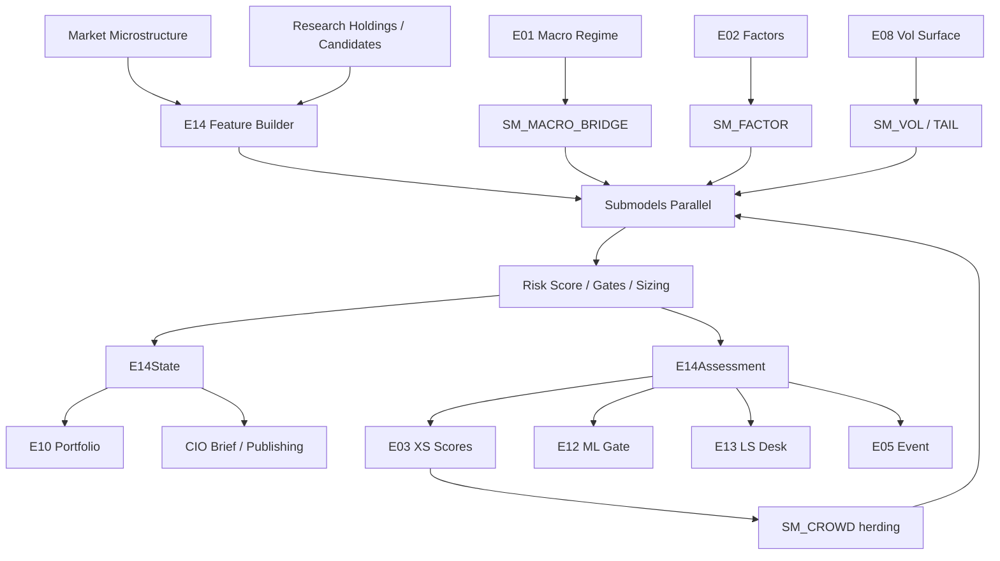

# E14 — Risk & Crowding Overlay  
## Engineering Implementation Specification (AGI Investment Office)

**Owner:** CIO / Head of Quantitative Research / Head of Risk  
**Pipeline position:** **Mandatory cross-cutting overlay.** Runs after alpha engines produce candidate research objects; **before** CIO brief, Portfolio Engine finalisation, and any client-facing note.  
**Nature:** Institutional risk intelligence only — **never** emits BUY / SELL / EXECUTE. Modifies confidence, sizing, expected-return haircuts, and downstream engine weights.  
**Version:** 1.0  
**Status:** Implementation-ready specification  
**Architectural peer:** Same documentation standard as `E01_MACRO_REGIME_ENGINE_SPEC.md`

### Relationship to current AGIB stack (reuse)

| Existing asset | Path | E14 role |
|----------------|------|----------|
| Risk Manager agent | `intelligence-engine/app/agents/cio_desk/risk_manager.py` | Replace narrative-only cache scrape with structured `E14State` consumer |
| Market vol helpers | `server/services/marketIntelligenceEngine.js` (`computeVolatility`, breadth) | L7 feature adapters (ATR%, VIX, breadth) |
| Indicators | `server/lib/indicators.js` (ATR, ADX approx) | Symbol-level realised risk inputs |
| NSE / Nifty research scores | `server/scripts/nifty500_research_engine.py`, `nifty500_research` tables | Position/universe crowding & liquidity features |
| Macro / E01 state | `macroContextService`, future `E01State` | Macro risk axis + size_mult prior |
| Market session facts | `server/services/marketSessionFactsService.js` | India VIX, index levels |
| Intelligence routes | `server/routes/intelligence.js` | Add `/api/intelligence/e14/*` proxy |
| Supabase | existing research + macro migrations | Extend; add E14 risk schema |

**Net-new:** multi-model risk taxonomy, crowding & liquidity indices, factor/Barra-style exposure engine, stress & Monte Carlo harness, portfolio risk aggregation, Aladdin-style risk dashboard, validation crisis replay, hard gates for E12 promotion.

**Hard rule:** No research object reaches CIO brief or publishing without an attached `E14Assessment` (or explicit `e14_waived` with CIO audit reason — default **deny**).

---

# 1. Engine Purpose

## 1.1 Investment questions answered

1. **How much risk is embedded** in a single name, sleeve, book, or research recommendation?  
2. **Is the idea crowded**, and what is the unwind / gap risk if consensus reverses?  
3. **Can the position be liquidated** under stress without destroying the thesis economics?  
4. **What factor, sector, beta, and currency exposures** accumulate across AGI research books?  
5. **What tail / crisis scenarios** invalidate or amplify the recommendation?  
6. **How should confidence, size, and expected return be adjusted** before any human or portfolio engine acts?  
7. **Which engines should be down-weighted or gated** given current systemic fragility?  
8. **What hedges are research-appropriate** (not executable orders) given the risk map?

## 1.2 Why it exists

Alpha without risk is fiction. Institutional failure modes are rarely “wrong factor” alone — they are **crowding + liquidity vacuum + correlation spike + leverage**. Without a shared risk object:

- Engines overstate confidence in the same crowded beta  
- Portfolio construction double-counts correlated ideas  
- CIO briefs mix high-conviction narratives with unpriced tails  
- ML (E12) promotes unstable signals into client research  

E14 is the **single mandatory risk truth layer** for AGI Investment Office. It does not invent alpha; it **prices fragility**.

## 1.3 What E14 is not

| Not this | Because |
|----------|---------|
| Trading strategy | No directional alpha mandate |
| Order management / EMS | No routing, no broker tickets |
| Compliance / KYC engine | Separate control function |
| VaR-only dashboard | VaR is one submodel, not the product |
| Retail stop-loss logic | Institutional multi-factor risk, not chart stops |

## 1.4 Hedge-fund / institutional analogues

| Firm / platform | How risk / crowding is used |
|-----------------|----------------------------|
| BlackRock Aladdin | Central risk: exposures, scenarios, liquidity, factor map across portfolios |
| MSCI Barra | Fundamental / statistical factor risk decomposition |
| Goldman Sachs risk / SecDB tradition | Scenario & greek aggregation; desk risk vs firm risk |
| JPM Quant Research | Crowding, liquidity, factor timing risk literature |
| AQR | Style crowding, drawdown control, risk budgeting |
| Bridgewater | Macro risk environments + risk-parity style budgeting |
| Two Sigma / DE Shaw | Statistical crowding, anomaly & correlation regimes |
| Citadel / Millennium | Pod-level risk budgets, crowding & liquidity cutters, hard stops on gross/net |
| Prime brokerage research | Positioning / short interest as crowding proxies |

---

# 2. Institutional Philosophy

## 2.1 First principles

1. **Risk is multi-dimensional.** A single scalar VaR is necessary but insufficient. E14 always emits a **vector** of risk states plus a fused `risk_score`.  
2. **Crowding is a first-class risk.** Consensus + leverage + thin liquidity creates non-linear unwind risk that linear vol models miss.  
3. **Liquidity is path-dependent.** ADV and spreads in calm markets are not stress liquidity. E14 uses **stressed liquidation assumptions**.  
4. **Correlations go to one in crises.** Diversification benefits are regime-conditional; E14 stress-correlations override sample correlations when `R_STRESS` (E01) elevates.  
5. **Explainability is mandatory.** Every haircut must ship top drivers; black-box risk cannot gate CIO research alone.  
6. **Research ≠ execution.** Multipliers and hedges are **research controls**. Humans / E10 interpret; nothing auto-trades.  
7. **Conservative under uncertainty.** Missing data → lower confidence and tighter size, never assumed “safe.”  
8. **E01 is prior, E14 is posterior risk.** Macro regime sets environment; E14 prices position/book fragility **conditional on** that environment.

## 2.2 Risk budget hierarchy

```
Firm research risk budget (CIO)
  └── Engine sleeve budgets (E02…E13)
        └── Strategy / desk budgets
              └── Name / theme budgets
                    └── E14 hard caps (concentration, liquidity, crowding, stress)
```

E14 may **never increase** firm risk budget; it may only **preserve or reduce** effective risk via multipliers ∈ (0, 1] (except documented educational Kelly paths which still pass through E14 caps).

## 2.3 Decision rights

| Actor | May do | May not do |
|-------|--------|------------|
| E14 | Haircut confidence, size_mult, expected return; flag; suggest hedges; gate E12 | Emit buy/sell; waive itself without audit |
| Engine owners | Request override with evidence | Ship to CIO without E14Assessment |
| CIO | Accept / override with written reason | Silent override |
| Publishing | Attach risk flags to notes | Strip E14 block from client research |

## 2.4 Interaction with E01 sizing

\[
\mathrm{size\_mult}_{\mathrm{final}} =
\mathrm{clip}\big(
  \mathrm{size\_mult}_{E01} \times \mathrm{size\_mult}_{E14}
  ,\, 0.10,\, 1.25\big)
\]

E14 `size_mult` default band **[0.25, 1.00]** (research). Values > 1.00 only when **all** of: low crowding, high liquidity, low tail, E01 non-crisis — and still capped by firm policy at 1.00 in production v1 (optional 1.10 in v1.1).

**v1 production default:** `size_mult_e14 ∈ [0.25, 1.00]`.

---

# 3. Risk Taxonomy

AGI uses a **canonical risk taxonomy**. Every flag maps to one or more taxonomy IDs. Downstream UIs and CIO briefs use these IDs, not free text alone.

## 3.1 Taxonomy catalogue

| ID | Name | Definition | Typical characteristics | Typical behaviour | Historical examples | Expected asset / book impact |
|----|------|------------|-------------------------|-------------------|---------------------|------------------------------|
| `RK_MARKET` | Market Risk | Sensitivity to broad equity/beta moves | High beta, high gross | Systematic drawdowns | 2022 bear, Mar-2020 | Equity beta books suffer; hedges bid |
| `RK_LIQUIDITY` | Liquidity Risk | Cost / ability to exit under stress | Wide spreads, low ADV, gap risk | Bid vanishes; slippage >> model | Mar-2020 small/mid; 2008 credit | Illiquids gap; liquid quality preferred |
| `RK_CREDIT` | Credit Risk | Spread / default / funding stress | HY OAS ↑, CDS ↑ | Deleveraging, equity-credit linkage | GFC, 2011 EU, 2020 HY shock | High-yield / financials / leveraged themes |
| `RK_VOL` | Volatility Risk | Realised/implied vol regime | VIX/MOVE/ATR elevated | Size cuts; option convexity valuable | Volmageddon 2018; COVID | Short-vol research penalised |
| `RK_CORR` | Correlation Risk | Diversification failure / corr spike | Pairwise corr → 1 | “Hedges” fail together | 2008; 2020 | Multi-strategy books look like one bet |
| `RK_TAIL` | Tail Risk | Extreme left-tail / kurtosis | Fat tails, skew | Gap down, nonlinear loss | Black Monday; COVID open | Need convex hedges; linear size insufficient |
| `RK_GAP` | Gap Risk | Overnight / event discontinuous moves | Earnings, macro prints, holidays | Limit orders miss; stops gap | Gaps on RBI/Fed; results | Event sleeves need wider buffers |
| `RK_FACTOR` | Factor Risk | Style / Barra-like factor concentration | Value/Mom/Size/Quality pile-up | Factor crashes | 2007 quant quake; 2020 value crush | Factor-timed books need residualisation |
| `RK_CROWD` | Crowding Risk | Positioning / consensus concentration | High short interest OR one-way ETF flows | Violent mean-reversion / squeeze | Archegos; meme squeezes; crowded growth 2021 | Crowded longs gap; crowded shorts squeeze |
| `RK_EXEC` | Execution Risk | Implementation shortfall / impact | Large % ADV, urgency | Slippage eats edge | Large-cap India vs microcap | Edge after cost may be ≤ 0 |
| `RK_MACRO` | Macro Risk | Regime / policy / growth-inflation | E01 stress, rates, FX | Regime break invalidates factors | Taper 2013; 2022 inflation | EM / duration / beta recalibrate |
| `RK_EVENT` | Event Risk | Discrete catalysts | Earnings, M&A, votes | Binary outcomes | Deal breaks; guidance shocks | Event engines need break probs ↑ |
| `RK_GEO` | Geopolitical Risk | Conflict / sanctions / trade | Energy spikes, FX vol | Risk-off, supply shocks | Ukraine 2022; trade wars | Energy, defense, FX books |
| `RK_FX` | Currency Risk | FX translation / local vs USD | USDINR, DXY moves | EM equity drag | Taper tantrum INR | Unhedged EM research haircut |
| `RK_REG` | Regulatory Risk | Policy / SEBI / tax / sector rules | Sudden rule changes | Multiple compression | India tax/reg surprises; ADRs | Sector sleeves need reg flags |
| `RK_CONC` | Concentration Risk | Name / sector / theme weight | High HHI | Idiosyncratic dominates | Single-stock portfolio blowups | Caps on name/sector |
| `RK_DD` | Drawdown Risk | Path risk vs peak | Deep underwater paths | De-risk forced; behaviour risk | Any prolonged bear | Kill-switches on research sizing |
| `RK_SYSTEMIC` | Systemic Risk | Cross-market plumbing failure | Funding, clearing, bank stress | Contagion | GFC; SVB 2023 | Hard de-risk playbook |

## 3.2 Severity bands (all taxonomy IDs)

| Band | Score band (0–100 risk) | CIO language |
|------|-------------------------|--------------|
| `S0` | 0–24 | Benign |
| `S1` | 25–49 | Elevated watch |
| `S2` | 50–74 | Material — haircuts required |
| `S3` | 75–89 | Severe — hard size caps |
| `S4` | 90–100 | Critical — gate / hedge-only research |

## 3.3 Aggregation rule

\[
\mathrm{RiskScore} = \mathrm{clip}\Big(
  100 \cdot \Phi\big(
    0.18\,z_{\mathrm{mkt}}
    + 0.14\,z_{\mathrm{crowd}}
    + 0.14\,z_{\mathrm{liq}}
    + 0.12\,z_{\mathrm{tail}}
    + 0.10\,z_{\mathrm{corr}}
    + 0.10\,z_{\mathrm{factor}}
    + 0.08\,z_{\mathrm{dd}}
    + 0.08\,z_{\mathrm{macro}}
    + 0.06\,z_{\mathrm{event}}
  \big)
,\, 0,\, 100\Big)
\]

Where \(z_\cdot\) are submodel standardised risk impulses (higher = more risk), \(\Phi\) maps a weighted sum via logistic:

\[
\Phi(x) = \frac{1}{1+e^{-x}}
\]

after \(x\) is scaled so typical benign books ≈ 0.25–0.40 and crisis ≈ 0.85–0.98 (calibration in §15).

**Hard override:** if any taxonomy ID is `S4` **or** E01 `R_STRESS=crisis`, then  
`RiskScore = max(RiskScore, 90)` and `gate = research_hedge_only`.

---

# 4. Sub Models

Each submodel is a Python package under `intelligence-engine/app/engines/e14/submodels/`.

### Common interface

```python
class RiskSubModelResult(TypedDict):
    model_id: str
    taxonomy_ids: list[str]      # e.g. ["RK_CROWD", "RK_LIQUIDITY"]
    score: float                 # [0, 100] risk intensity (higher = worse)
    state: str                   # model-specific enum
    confidence: float            # [0, 1]
    features: dict[str, float]
    evidence: list[str]
    recommendations: list[str]   # research controls, not orders
    as_of: str
    stale: bool
```

---

### 4.1 Volatility Model (`SM_VOL`)
| | |
|--|--|
| **Purpose** | Classify vol regime at market + name level; feed size and options research |
| **Inputs** | VIX, India VIX, MOVE (or proxy), ATR%, realised vol 10/20/60d, IV if available |
| **Outputs** | `vol_regime`, `vol_risk_score`, `name_rv`, `iv_rv_gap` |
| **Dependencies** | E01 `R_VOL`; market candles |
| **Confidence** | High when IV + RV agree; medium when only RV |

**States:** `low_vol`, `normal_vol`, `high_vol`, `crisis_vol`

---

### 4.2 Correlation Model (`SM_CORR`)
| | |
|--|--|
| **Purpose** | Detect diversification failure and correlation regimes |
| **Inputs** | Rolling pairwise/cross-asset corr, sector corr matrix, average pairwise corr, corr dispersion |
| **Outputs** | `corr_regime`, `corr_spike_flag`, `diversification_ratio` |
| **Dependencies** | Volatility Model (corr unstable in high vol) |
| **Confidence** | Medium (estimation noise); higher with longer windows + shrinkage |

**States:** `dispersed`, `normal`, `elevated`, `crisis_unity`

---

### 4.3 Liquidity Model (`SM_LIQ`)
| | |
|--|--|
| **Purpose** | Price exit capacity in calm and stress |
| **Inputs** | ADV 20/60d, market cap, bid-ask (when available), Amihud illiquidity, free float, impact model params |
| **Outputs** | `liquidity_score` (0–100, **higher = better liquidity**), `days_to_exit_stress`, `impact_bps_est` |
| **Dependencies** | Concentration Model for book-level exit |
| **Confidence** | High for large-cap NSE; low for SM/illiquids without spread data |

**Note:** UI may show Liquidity Score as “health”; internal fusion inverts to risk: `liq_risk = 100 - liquidity_score`.

---

### 4.4 Crowding Model (`SM_CROWD`)
| | |
|--|--|
| **Purpose** | Measure positioning / consensus concentration risk |
| **Inputs** | Short interest / days-to-cover (when licensed), ETF flows, options OI concentration, research score herding (AGI internal), sector ownership HHI proxy, borrow fee proxy |
| **Outputs** | `crowding_score` (0–100, higher = more crowded), `crowd_side` (`long`/`short`/`both`/`unknown`), `unwind_severity` |
| **Dependencies** | Liquidity (crowding × illiquidity nonlinear) |
| **Confidence** | Medium without prime-broker feeds; use internal herding proxies |

**States:** `uncrowded`, `moderate`, `crowded`, `extreme_crowd`

---

### 4.5 Tail Risk Model (`SM_TAIL`)
| | |
|--|--|
| **Purpose** | Estimate left-tail severity beyond Gaussian VaR |
| **Inputs** | Return skew/kurtosis, max DD windows, VIX term/skew proxy, stress residuals, E01 stress |
| **Outputs** | `tail_risk_score`, `expected_shortfall_c`, `gap_risk_flag` |
| **Dependencies** | Volatility, Systemic |
| **Confidence** | Medium; rises with options surface data |

---

### 4.6 Portfolio Exposure Model (`SM_PORT`)
| | |
|--|--|
| **Purpose** | Aggregate research-book exposures: beta, net/gross, sector, geography |
| **Inputs** | Holdings / candidate sleeves, betas, weights, currency, sector map |
| **Outputs** | `portfolio_beta`, `gross`, `net`, `sector_hhi`, `name_hhi`, `fx_exposure` |
| **Dependencies** | Factor Exposure, Concentration |
| **Confidence** | High when holdings complete; low on partial books |

---

### 4.7 Factor Exposure Model (`SM_FACTOR`)
| | |
|--|--|
| **Purpose** | Barra-style (simplified) factor loadings & specific risk |
| **Inputs** | Factor returns / scores from E02, residual returns, size/value/mom/quality/lowvol loadings |
| **Outputs** | `factor_loadings`, `factor_risk_contrib`, `specific_risk`, `factor_concentration` |
| **Dependencies** | E02 Factor Engine |
| **Confidence** | High when E02 live; medium with statistical PCA fallback |

**v1 factor set (India + global overlay):**  
`BETA`, `SIZE`, `VALUE`, `MOMENTUM`, `QUALITY`, `LOWVOL`, `GROWTH`, `LEVERAGE`, `LIQUIDITY_FACTOR`, `INR_SENS`.

---

### 4.8 Stress Test Model (`SM_STRESS`)
| | |
|--|--|
| **Purpose** | Apply historical & hypothetical scenarios to books/names |
| **Inputs** | Scenario shock library, holdings betas/factors, corr overlays |
| **Outputs** | `scenario_pnl_vector`, `worst_scenario_id`, `stress_score` |
| **Dependencies** | Factor, Correlation, Macro (E01) |
| **Confidence** | High for historical replay; medium for hypothetical |

**Canonical scenarios (v1):**  
`GFC_2008`, `TAPER_2013`, `COVID_2020_Q1`, `INFLATION_2022`, `SVB_2023`, `INDIA_REG_SHOCK`, `USDINR_SHOCK_8PCT`, `OIL_SHOCK_P30`, `FACTOR_MOM_CRASH`.

---

### 4.9 Drawdown Model (`SM_DD`)
| | |
|--|--|
| **Purpose** | Path risk: current and expected drawdowns under vol targeting |
| **Inputs** | Equity curves / proxy returns, peak dates, vol, size_mult history |
| **Outputs** | `current_dd`, `expected_dd_3m`, `dd_risk_score`, `time_to_recover_est` |
| **Dependencies** | Volatility, Portfolio Exposure |
| **Confidence** | Medium (path dependent)

---

### 4.10 Concentration Model (`SM_CONC`)
| | |
|--|--|
| **Purpose** | Name, sector, theme, factor concentration limits |
| **Inputs** | Weights, sector map, theme tags, factor loadings |
| **Outputs** | `name_cap_breach`, `sector_cap_breach`, `hhi`, `conc_score` |
| **Dependencies** | Portfolio Exposure |
| **Confidence** | High |

**Default research caps (v1, configurable):**  
- Single name research weight ≤ 8% of sleeve  
- Single sector ≤ 30%  
- Top-5 names ≤ 35%  
- Single factor absolute active loading |f| ≤ 2.0σ policy band  

---

### 4.11 Systemic Risk Model (`SM_SYS`)
| | |
|--|--|
| **Purpose** | Cross-asset plumbing / contagion detector |
| **Inputs** | E01 stress/risk axes, credit spreads, MOVE/VIX, bank/financial relative performance, funding proxies |
| **Outputs** | `systemic_score`, `contagion_flag`, `playbook` (`normal`/`elevated`/`hard_derisk`) |
| **Dependencies** | E01, Credit inputs, Volatility |
| **Confidence** | High when E01+credit live |

---

### 4.12 Event / Gap Risk Model (`SM_EVENT`)
| | |
|--|--|
| **Purpose** | Price discrete event and overnight gap risk |
| **Inputs** | Earnings calendar, macro calendar, India holidays, options implied move (if any), historical gap dist |
| **Outputs** | `event_risk_score`, `next_event`, `implied_move`, `gap_buffer_mult` |
| **Dependencies** | E05 when event sleeve; Volatility |
| **Confidence** | High near known events; low for unknown unknowns |

---

### 4.13 Macro Risk Bridge (`SM_MACRO_BRIDGE`)
| | |
|--|--|
| **Purpose** | Translate `E01State` into E14 macro-risk contribution |
| **Inputs** | Full `E01State` |
| **Outputs** | `macro_risk_score`, `e01_size_prior`, `regime_gates` |
| **Dependencies** | **E01 mandatory** |
| **Confidence** | = E01 confidence × (1 − stale_penalty) |

---

### 4.14 Execution Risk Model (`SM_EXEC`)
| | |
|--|--|
| **Purpose** | Estimate implementation shortfall vs stated research edge |
| **Inputs** | Order size proxy (research proposed weight × AUM assumption), ADV, volatility, spread |
| **Outputs** | `exec_risk_score`, `impact_bps`, `edge_after_cost_flag` |
| **Dependencies** | Liquidity |
| **Confidence** | Medium |

**AUM assumption for research impact:** configurable `research_notional_inr` (default ₹25cr sleeve unit) — **not** live AUM.

---

# 5. Inputs

## 5.1 Market data
VIX, India VIX, MOVE (or US rates vol proxy), ATR / ATR%, historical & realised vol (10/20/60/120d), index levels (Nifty, Bank Nifty, SPX), sector indices, USDINR, DXY proxy, credit spreads (HY OAS), CDS proxies (when available), oil/gold for stress betas.

## 5.2 Liquidity & microstructure
ADV 20/60d, market cap, free float, bid-ask spread (when available), Amihud illiquidity, turnover, delivery % (NSE), impact model params.

## 5.3 Crowding / positioning
Short interest, days-to-cover, borrow fee / utilisation (licensed), ETF flows (India/global), options OI & put-call, AGI internal score herding (fraction of universe with same bullish/bearish label), Trendlyne/institution ownership proxies (research-only, licensed).

## 5.4 Portfolio / holdings
Candidate weights from E10 / research sleeves, sector & industry map, currency, long/short side, strategy tags, proposed notional.

## 5.5 Upstream engine outputs
| Engine | Fields consumed |
|--------|-----------------|
| **E01** | `primary_regime`, axes, `risk_level`, `size_multiplier`, `vol_target`, `stress` |
| **E02** | Factor scores / loadings per name |
| **E03** | Technical / XS momentum scores, ranks |
| **E04** | Pair residual z, half-life (fragility) |
| **E05** | Event type, break probability priors |
| **E08** | IV, skew, term structure research features |
| **E09** | Trend strength / duration |
| **E10** | Proposed weights, vol target, risk budgets |
| **E11** | Sentiment extremes (crowding soft signal) |
| **E12** | Model confidence, feature stability (gate) |
| **E13** | Fundamental L/S net/gross proposals |

## 5.6 Macro / credit / rates
Fed funds, US10Y/2Y, India G-Sec, RBI repo, HY OAS, financial conditions proxies (from E01 feature store).

## 5.7 Alternative / optional
Prime-broker aggregate positioning, satellite supply-chain disruption indices, news geopol risk scores, SEBI/reg NLP flags.

## 5.8 Input registry (canonical IDs)

| input_id | Description | Unit |
|----------|-------------|------|
| `VIX` | CBOE VIX | points |
| `INDIA_VIX` | India VIX | points |
| `MOVE_PROXY` | Rates vol proxy | index |
| `RV_NIFTY_20D` | Nifty 20d realised vol | ann. % |
| `RV_SPX_20D` | SPX 20d realised vol | ann. % |
| `ATR_PCT` | Name ATR% | % |
| `ADV_20D` | Avg daily value traded | INR / USD |
| `ADV_60D` | ADV 60d | INR / USD |
| `MKT_CAP` | Free-float / full mcap | INR |
| `SPREAD_BPS` | Bid-ask mid spread | bps |
| `AMIHUD` | Amihud illiquidity | ratio |
| `SHORT_INTEREST` | Short interest | % float |
| `DTC` | Days to cover | days |
| `BORROW_FEE` | Borrow fee | % ann. |
| `ETF_FLOW_5D` | Net ETF flow | currency |
| `OPT_OI_CONC` | Options OI concentration | 0–1 |
| `HY_OAS` | High yield OAS | bps |
| `CDS_IG_PROXY` | IG CDS proxy | bps |
| `CORR_AVG_60D` | Avg pairwise corr | −1…1 |
| `BREADTH_AD` | Advance/decline | ratio |
| `BETA_NIFTY_60D` | Name beta | β |
| `HOLDINGS_W` | Weight vector | % |
| `E01_STATE` | Full E01 JSON | object |
| `E02_LOADINGS` | Factor loadings | vector |
| `E03_SCORE` | Technical / XS score | 0–100 |
| `SECTOR_ID` | GICS/ICB-like | enum |
| `EARN_DATE` | Next results | date |
| `RESEARCH_NOTIONAL` | Assumed sleeve notional | INR |

---

# 6. Feature Engineering

Feature store: `e14_feature_snapshot` + in-memory `RiskFeatureVector`.

| feature_id | Definition | Sources |
|------------|------------|---------|
| `vol_regime_idx` | Map VIX/India VIX pctile → {0,1,2,3} | VIX |
| `vix_pctile_5y` | Percentile rank 5y | VIX |
| `india_vix_pctile_5y` | Percentile rank | India VIX |
| `rv_20d` | Realised vol 20d | prices |
| `rv_60d` | Realised vol 60d | prices |
| `rv_ratio_20_60` | `rv_20 / rv_60` | RV |
| `atr_pct` | ATR / price | ATR |
| `iv_rv_gap` | IV − RV (if IV) | E08 |
| `corr_avg_60d` | Mean pairwise corr | returns |
| `corr_avg_20d` | Short-window corr | returns |
| `corr_spike` | `corr_20 - corr_60` | corr |
| `corr_breakdown` | Abs residual vs DCC/EWMA forecast | corr |
| `diversification_ratio` | \(\sum w\sigma / \sigma_p\) | port |
| `amihud_z` | z(Amihud) | liq |
| `adv_value_20d` | ADV value | liq |
| `pct_adv_proposed` | `notional / ADV_20` | liq, holdings |
| `days_to_exit_calm` | Participation 10% ADV | liq |
| `days_to_exit_stress` | Participation 2% ADV + spread widen ×3 | liq |
| `liquidity_index` | Composite 0–100 (higher better) | liq |
| `crowding_index` | Composite 0–100 (higher worse) | crowd |
| `short_interest_z` | z(SI) | crowd |
| `dtc_z` | z(DTC) | crowd |
| `etf_flow_impulse` | z(5d flows) | crowd |
| `herding_agib` | % names same label in sleeve/universe | E03 |
| `options_crowd` | OI conc + skew extreme | E08 |
| `tail_score_raw` | From ES / kurtosis | tail |
| `skew_60d` | Return skew | returns |
| `kurt_60d` | Excess kurtosis | returns |
| `max_dd_1y` | Max drawdown 1y | returns |
| `expected_dd_3m` | From vol target path model | dd |
| `portfolio_beta` | \(\sum w_i \beta_i\) | port |
| `gross_exposure` | \(\sum |w_i|\) | port |
| `net_exposure` | \(\sum w_i\) | port |
| `name_hhi` | \(\sum w_i^2\) | conc |
| `sector_hhi` | Sector HHI | conc |
| `factor_risk_share` | Factor var / total var | factor |
| `specific_risk_share` | 1 − factor_risk_share | factor |
| `active_factor_max` | \(\max |f_k|\) | factor |
| `stress_worst_pnl` | Min scenario PnL % | stress |
| `stress_score` | Mapped 0–100 | stress |
| `macro_risk_bridge` | From E01 | E01 |
| `fragility_index` | Crowd × illiquidity × corr_spike | composite |
| `market_fragility_index` | Breadth weak + vol ↑ + credit ↑ | composite |
| `event_proximity` | Days to next material event | event |
| `gap_buffer_mult` | Size buffer near events | event |
| `exec_impact_bps` | Square-root impact est. | exec |
| `edge_after_cost` | Research edge − impact − spread | exec |
| `fx_beta_usdinr` | Regression β to USDINR | fx |
| `credit_stress_z` | z(HY OAS) | credit |
| `systemic_composite` | E01 stress + credit + vol | sys |

**Normalisation standard:** rolling 5y winsorize 1–99%, z-score; scores mapped to 0–100 via calibrated logistic or percentile; binary flags `{0,1}`.

**Nonlinear crowding-liquidity interaction (mandatory):**  
\[
\mathrm{fragility\_index} =
100\cdot\Phi\big(
  0.45\,z(\mathrm{crowding\_index})
  + 0.35\,z(100-\mathrm{liquidity\_index})
  + 0.20\,z(\mathrm{corr\_spike})
\big)
\]

---

# 7. Mathematical Models

## 7.1 Core transforms

**Log return**  
\( r_{t,n} = \ln(P_t / P_{t-n}) \)

**Realised volatility (annualised)**  
\[
\sigma_{t,n} = \sqrt{\frac{252}{n}\sum_{i=0}^{n-1} r_{t-i,1}^2}
\]

**EWMA variance** (λ = 0.94 daily equity default)  
\[
\sigma^2_t = \lambda \sigma^2_{t-1} + (1-\lambda) r_t^2
\]

**Z-score**  
\( z_t = (x_t - \mu_{t,w}) / \sigma_{t,w} \), \( w = 252\times 5 \) when available.

**Percentile rank**  
\( pct_t = \mathrm{rank}(x_t)/N \)

**Ledoit-Wolf shrinkage covariance** for portfolio σ (v1 required when N > 30 names).

## 7.2 Liquidity formulas

**Amihud illiquidity**  
\[
\mathrm{Amihud}_t = \frac{1}{n}\sum_{i=1}^{n} \frac{|r_i|}{\mathrm{ValueTraded}_i}
\]

**Square-root impact (research)**  
\[
\mathrm{Impact\_bps} \approx c \cdot \sigma_{\mathrm{daily}} \cdot \sqrt{\frac{Q}{\mathrm{ADV}}} \cdot 10^4
\]
Default \( c = 0.5 \) (configurable; calibrate on India large-cap vs mid-cap buckets).

**Days to exit**  
\[
\mathrm{DTE}(p) = \frac{Q}{p \cdot \mathrm{ADV}}
\]
Calm: \( p=0.10 \); Stress: \( p=0.02 \).

**Liquidity Index (0–100, higher = better)**  
\[
L = 100\cdot\Phi\big(
  -0.40\,z(\mathrm{Amihud})
  -0.30\,z(\mathrm{pct\_adv\_proposed})
  -0.20\,z(\mathrm{spread\_bps})
  +0.10\,z(\ln\mathrm{MKT\_CAP})
\big)
\]

## 7.3 Crowding formulas

**Crowding Index (0–100, higher = worse)**  
\[
C = 100\cdot\Phi\big(
  0.25\,z(\mathrm{SI})
  + 0.20\,z(\mathrm{DTC})
  + 0.15\,z(\mathrm{borrow\_fee})
  + 0.15\,z(|\mathrm{etf\_flow\_impulse}|)
  + 0.15\,z(\mathrm{herding\_agib})
  + 0.10\,z(\mathrm{options\_crowd})
\big)
\]

If SI/DTC/borrow missing: redistribute weights to available features; set `confidence *= 0.7` and `stale_inputs += positioning`.

**Unwind severity**  
\[
U = \mathrm{clip}\big(0.5\cdot C/100 + 0.5\cdot (1-L/100),\, 0,\, 1\big)
\]

## 7.4 Portfolio risk

**Portfolio variance**  
\[
\sigma_p^2 = w^\top \Sigma w
\]
\(\Sigma\) = shrinkage cov; under E01 crisis, blend:  
\[
\Sigma_{\mathrm{stress}} = (1-\alpha)\Sigma + \alpha \Sigma_{\mathrm{crisis}}
\]
with \(\alpha = 0.6\) if `R_STRESS=crisis`, else \(0.3\) if `high_vol`, else \(0\).  
\(\Sigma_{\mathrm{crisis}}\) uses pairwise corr floor at \(0.85\) for equities within book (research default).

**Marginal risk contribution**  
\[
\mathrm{MRC}_i = w_i \cdot \frac{(\Sigma w)_i}{\sigma_p}
\]

**Parametric VaR / ES (Gaussian baseline)**  
\[
\mathrm{VaR}_{p} = -(\mu_p + \sigma_p z_p),\quad
\mathrm{ES}_{p} = -(\mu_p - \sigma_p \frac{\phi(z_p)}{p})
\]
Report **historical ES** as primary; Gaussian as reference only.

## 7.5 Factor risk (simplified Barra)

\[
r = X f + \varepsilon,\quad
\sigma^2_{\mathrm{factor}} = w^\top X F X^\top w,\quad
\sigma^2_{\mathrm{spec}} = w^\top \Delta w
\]
\(F\) = factor cov; \(\Delta\) = diagonal specific variance.

**Factor concentration score**  
\[
\mathrm{FC} = 100\cdot\Phi\big(z(\max_k |\mathrm{RC}_k^{\mathrm{factor}}|)\big)
\]

## 7.6 Tail & drawdown

**Expected shortfall (historical, p=0.05)** from empirical loss distribution (1y daily; stress overlay).  

**Expected drawdown (3m research)** under vol targeting:  
simulate \( N=5000 \) paths (daily) with  
\[
r_t \sim t_{\nu}(0, \sigma_{\mathrm{tgt}}/\sqrt{252})
\]
\(\nu=5\) default; report median and 95th percentile path DD.

## 7.7 Feature → score map (thresholds)

| Feature / score | Norm | Range | Benign | Material risk | Conf. weight |
|-----------------|------|-------|--------|---------------|--------------|
| `vix_pctile_5y` | 0–1 | 0–1 | <0.40 | >0.80 | 0.08 |
| `india_vix_pctile_5y` | 0–1 | 0–1 | <0.40 | >0.75 | 0.08 |
| `rv_ratio_20_60` | raw | 0.5–2.5 | <1.1 | >1.5 | 0.05 |
| `corr_avg_20d` | raw | 0–1 | <0.35 | >0.65 | 0.08 |
| `corr_spike` | raw | −0.3–0.5 | <0.05 | >0.20 | 0.07 |
| `liquidity_index` | 0–100 | 0–100 | >70 | <40 | 0.10 |
| `days_to_exit_stress` | days | 0–60 | <3 | >10 | 0.08 |
| `crowding_index` | 0–100 | 0–100 | <35 | >65 | 0.12 |
| `fragility_index` | 0–100 | 0–100 | <40 | >70 | 0.12 |
| `tail_risk_score` | 0–100 | 0–100 | <35 | >70 | 0.10 |
| `name_hhi` | raw | 0–1 | <0.05 | >0.12 | 0.06 |
| `portfolio_beta` | β | −0.5–1.8 | 0.6–1.1 | >1.4 | 0.05 |
| `stress_worst_pnl` | % | −40–5 | >−8% | <−20% | 0.10 |
| `macro_risk_bridge` | 0–100 | 0–100 | <40 | >70 | 0.08 |
| `exec_impact_bps` | bps | 0–200 | <15 | >50 | 0.05 |
| `expected_dd_3m_p95` | % | 0–40 | <8 | >18 | 0.08 |

## 7.8 Position size multiplier & confidence adjustment

```
# size_mult_e14 in [0.25, 1.00] for v1
base = 1.00
if systemic.playbook == hard_derisk or risk_score >= 90:
    base = 0.25
elif risk_score >= 75 or crowding_index >= 80 or days_to_exit_stress > 15:
    base = 0.40
elif risk_score >= 60 or fragility_index >= 70:
    base = 0.55
elif risk_score >= 45:
    base = 0.75
elif liquidity_index >= 75 and crowding_index <= 30 and risk_score < 30:
    base = 1.00
else:
    base = 0.90

# Event buffer
base *= gap_buffer_mult   # e.g. 0.70 within 2 sessions of earnings for concentrated names

# Confidence adjustment (multiplicative on upstream confidence)
conf_adj = 1.0
if crowding_index >= 70: conf_adj *= 0.85
if liquidity_index <= 40: conf_adj *= 0.80
if tail_risk_score >= 70: conf_adj *= 0.80
if e01.risk_level == critical: conf_adj *= 0.70
if stale_ratio > 0.40: conf_adj *= 0.75
conf_adj = clip(conf_adj, 0.40, 1.00)
```

**Expected return haircut (research):**  
\[
\mu_{\mathrm{adj}} = \mu_{\mathrm{raw}} \cdot \mathrm{conf\_adj} \cdot (1 - 0.5\cdot U) - \frac{\mathrm{Impact\_bps}}{10^4}
\]

## 7.9 Maximum allocation

\[
w^{\max}_i = \min\big(
  w^{\mathrm{policy}}_{\mathrm{name}},
  w^{\mathrm{liq}}_i,
  w^{\mathrm{crowd}}_i,
  w^{\mathrm{conc}}_i
\big)
\]

\[
w^{\mathrm{liq}}_i = \frac{p_{\mathrm{stress}}\cdot\mathrm{ADV}_i\cdot \mathrm{DTE}_{\max}}{\mathrm{Notional}}
\]
Defaults: `DTE_max=5` sessions; `p_stress=0.02`; `w_policy_name=0.08`.

\[
w^{\mathrm{crowd}}_i =
\begin{cases}
0.5\cdot w^{\mathrm{policy}} & C_i \ge 80 \\
0.75\cdot w^{\mathrm{policy}} & 65 \le C_i < 80 \\
w^{\mathrm{policy}} & \text{else}
\end{cases}
\]

## 7.10 Suggested hedging (research-only)

Heuristic library (not orders):

| Condition | Suggested hedge research |
|-----------|--------------------------|
| High beta + elevated vol | Index put / collars narrative; reduce net |
| Crowded long growth factor | Factor-neutral overlay; quality long / growth underweight research |
| Event proximity S2+ | Straddle cost as insurance budget; cut size |
| Corr spike + systemic | Increase cash/hedge sleeve in E10 research allocation |
| FX β high | USDINR hedge research note |
| Short crowded (DTC high) | Squeeze buffer; hard cap short weight |

---

# 8. Machine Learning

| Technique | Use | Library | Notes |
|-----------|-----|---------|-------|
| Isolation Forest | Anomaly names/days in feature space | `sklearn` | Crowding/liq outliers |
| Autoencoder | Nonlinear residual stress / anomaly | `PyTorch` light | Optional P2; needs history |
| Gaussian HMM | Vol / corr / fragility regimes | `hmmlearn` | Aligns with E01 HMM philosophy |
| Bayesian updating | Posterior risk given E01 + new prints | custom conjugacy / particle | Intraday risk refresh |
| Gradient boosting classifier | Predict forward DD breach / stress week | `lightgbm` | Supervised on labeled stress |
| DCC-GARCH / EWMA | Corr dynamics | `arch` / custom | Corr spike features |
| SHAP | Explain risk_score drivers | `shap` | Mandatory for CIO |
| PCA / statistical factors | Fallback if E02 missing | `sklearn` | Temporary only |

**Regime-aware risk:** all thresholds scale with E01 axes:  
e.g. crowding threshold for `S2` lowers from 65 → 55 when `R_VOL=high_vol`.

**Explainability requirements**
- Every `E14State` / `E14Assessment` ships `top_risk_drivers[5]` with signed contributions.  
- LLM may narrate risk; **cannot** set `risk_score` or clear gates alone.  
- Feature importance job weekly → `e14_feature_importance`.

**Promotion gate for E12:**  
`E12` output requires `e14.gate in {allow, allow_with_haircut}` AND `explainability_score ≥ 0.6` AND `risk_score < 75`.

---

# 9. Outputs

## 9.1 Book / firm-level contract `E14State`

```json
{
  "engine": "E14",
  "version": "1.0.0",
  "as_of": "2026-07-25T16:30:00+05:30",
  "risk_score": 58.2,
  "risk_level": "elevated",
  "crowding_score": 62.0,
  "liquidity_score": 71.5,
  "tail_risk_score": 54.0,
  "portfolio_risk": {
    "sigma_ann": 0.18,
    "var_95_1d": 0.019,
    "es_95_1d": 0.027,
    "portfolio_beta": 1.12,
    "gross": 1.40,
    "net": 0.55,
    "name_hhi": 0.07,
    "sector_hhi": 0.22,
    "factor_risk_share": 0.61
  },
  "size_multiplier": 0.75,
  "confidence_adjustment": 0.85,
  "vol_target_suggested": 0.09,
  "max_allocation_defaults": {
    "name": 0.08,
    "sector": 0.30,
    "top5": 0.35
  },
  "expected_drawdown": {
    "current": 0.06,
    "expected_3m_median": 0.08,
    "expected_3m_p95": 0.16
  },
  "suggested_hedging": [
    {
      "taxonomy_id": "RK_MARKET",
      "action": "research_index_put_overlay",
      "urgency": "medium",
      "rationale": "Portfolio beta 1.12 with elevated corr_spike"
    }
  ],
  "risk_flags": [
    {
      "taxonomy_id": "RK_CROWD",
      "severity": "S2",
      "message": "Crowding index 62 with herding in momentum sleeve"
    }
  ],
  "taxonomy_scores": {
    "RK_MARKET": 55,
    "RK_LIQUIDITY": 35,
    "RK_CREDIT": 40,
    "RK_VOL": 58,
    "RK_CORR": 60,
    "RK_TAIL": 54,
    "RK_GAP": 42,
    "RK_FACTOR": 57,
    "RK_CROWD": 62,
    "RK_EXEC": 30,
    "RK_MACRO": 48,
    "RK_EVENT": 35,
    "RK_GEO": 20,
    "RK_FX": 33,
    "RK_REG": 25,
    "RK_CONC": 50,
    "RK_DD": 45,
    "RK_SYSTEMIC": 40
  },
  "engine_weight_adjustments": {
    "E01": 1.00,
    "E02": 0.95,
    "E03": 0.85,
    "E04": 0.80,
    "E05": 0.90,
    "E08": 1.10,
    "E09": 0.85,
    "E10": 1.00,
    "E11": 0.90,
    "E12": 0.70,
    "E13": 0.85
  },
  "gate": "allow_with_haircut",
  "playbook": "elevated",
  "e01_ref": {"as_of": "...", "primary_regime": "slowdown", "hash": "sha256:..."},
  "submodels": {},
  "top_risk_drivers": [],
  "stale_inputs": [],
  "model_version": "e14-1.0.0",
  "hash": "sha256:..."
}
```

`gate` ∈ `allow` | `allow_with_haircut` | `research_hedge_only` | `block_promotion`  
`playbook` ∈ `normal` | `elevated` | `hard_derisk`  
`risk_level` ∈ `low` | `moderate` | `elevated` | `severe` | `critical`

## 9.2 Per-object assessment `E14Assessment`

Attached to every signal, portfolio proposal, and research note:

```json
{
  "assessment_id": "uuid",
  "target_type": "signal|portfolio|note|sleeve",
  "target_id": "string",
  "as_of": "...",
  "risk_score": 66.0,
  "crowding_score": 72.0,
  "liquidity_score": 48.0,
  "tail_risk_score": 61.0,
  "size_multiplier": 0.55,
  "confidence_adjustment": 0.78,
  "expected_return_haircut": 0.35,
  "max_allocation": 0.04,
  "suggested_hedging": [],
  "expected_drawdown_3m_p95": 0.19,
  "risk_flags": [],
  "taxonomy_ids": ["RK_CROWD", "RK_LIQUIDITY", "RK_EXEC"],
  "gate": "allow_with_haircut",
  "explain": {
    "top_risk_drivers": [
      {"feature": "crowding_index", "contribution": +0.22},
      {"feature": "days_to_exit_stress", "contribution": +0.18}
    ],
    "narrative_points": [
      "Crowded momentum name with >8 stress days-to-exit"
    ]
  },
  "e14_state_hash": "sha256:...",
  "model_version": "e14-1.0.0"
}
```

## 9.3 Compatibility with Risk Manager agent

Map into agent findings:

| Agent field | E14 source |
|-------------|------------|
| findings[] | `risk_flags` + top scenario from `SM_STRESS` |
| confidence.score | `round(100 * confidence_adjustment * (1 - risk_score/200))` |
| invalidators | falsifiers from flags + E01 falsifiers |
| challenges | `suggested_hedging` rationales |

---

# 10. Downstream Consumers

E14 **modifies** other engines; it does not replace their alpha. All consumers must multiply:

\[
w^{\mathrm{eff}} = w^{\mathrm{engine}} \times w^{E01} \times w^{E14}
\]

\[
\mathrm{conf}^{\mathrm{eff}} = \mathrm{conf}^{\mathrm{engine}} \times \mathrm{confidence\_adjustment}_{E14}
\]

| Engine | How E14 modifies behaviour |
|--------|----------------------------|
| **E01 Macro & Regime** | E14 does **not** rewrite regime labels. Feeds back **stress confirmation** (`SM_SYS`) into CIO narrative; may raise `risk_level` display when portfolio fragility high even if E01 calm. Consumes E01 as prior. Weight adj on E01 usually `1.0`; used as dependency health check. |
| **E02 Factor & Style** | Haircut factor-timing confidence when `RK_FACTOR` / crowding in that style is `S2+`. Cap active factor loadings via `max_allocation` on factor sleeves. Raise quality/low-vol research weight when `playbook=elevated`. |
| **E03 Cross-Sectional Quant** | Cut momentum sleeve weight when `crowding_index` high or `herding_agib` extreme. Increase reversal weight only if liquidity OK and corr not in crisis_unity. Apply per-name `E14Assessment` before ranks become CIO ideas. |
| **E04 Stat-Arb & RV** | **Widen** entry z or **disable** pairs when `corr_breakdown` or `R_STRESS` crisis; cut size by `size_multiplier`. Penalise pairs with overlapping liquidity pools. |
| **E05 Event & Special Sits** | Raise deal-break / event severity when `RK_EVENT`/`RK_GAP` elevated; force `gap_buffer_mult`; max allocation on binary events tighter (`≤ 3–5%` research). |
| **E08 Vol & Options** | When `tail_risk`/`vol` high: **up-weight** tail-hedge research, **down-weight** short-vol / VRP harvest research via `engine_weight_adjustments.E08` split flags (`E08_tail` vs `E08_short_vol` subkeys). |
| **E09 CTA / Trend** | Reduce trend sleeve in `high_vol`+crowded unidirectional futures themes; require longer confirmation when `fragility_index` high; apply vol targeting floor from E14 `vol_target_suggested`. |
| **E10 Portfolio Construction** | **Hard constraints:** name/sector caps, `max_allocation`, gross/net ceilings from playbook, stress scenario constraints (`worst_scenario_pnl ≥ −X`). Objective uses \(\mu_{\mathrm{adj}}\). Vol target = `min(E01.vol_target, E14.vol_target_suggested)`. |
| **E11 Sentiment & Alt-Data** | Treat extreme sentiment as crowding soft signal; haircut when sentiment and positioning align one-way. |
| **E12 ML Alpha Lab** | **Promotion gate.** Block if `gate=block_promotion` or `risk_score≥75` or missing explainability. Always attach `E14Assessment`. |
| **E13 Equity L/S Desk** | Net/gross research bands compressed under elevated playbook; short sleeve checked for squeeze (`DTC`, borrow); residualise via E02+E14 factor caps. |

### Playbook → engine weight defaults (v1)

| Playbook | E03 | E04 | E08_short_vol | E08_tail | E09 | E12 | E13 net band |
|----------|-----|-----|---------------|----------|-----|-----|--------------|
| `normal` | 1.00 | 1.00 | 1.00 | 1.00 | 1.00 | 1.00 | baseline |
| `elevated` | 0.85 | 0.90 | 0.70 | 1.15 | 0.85 | 0.70 | −20% |
| `hard_derisk` | 0.50 | 0.40 | 0.20 | 1.40 | 0.45 | 0.00 (block) | near flat |

**Contract:** Engines may add local microstructure filters but **may not** bypass E14 gates for CIO/publishing paths.

---

# 11. Database Design

## 11.1 Reuse
- `macro_*` / future `e01_*` — macro & regime priors  
- `nifty500_research*` — universe scores, candles-derived features  
- Intelligence memory tables — attach assessments to notes  

## 11.2 New tables

```sql
-- Point-in-time risk features
CREATE TABLE e14_feature_snapshot (
  id uuid PRIMARY KEY DEFAULT gen_random_uuid(),
  as_of timestamptz NOT NULL,
  scope text NOT NULL,              -- firm|sleeve|symbol
  scope_id text NOT NULL DEFAULT 'FIRM',
  feature_id text NOT NULL,
  value double precision,
  z_value double precision,
  meta jsonb DEFAULT '{}',
  UNIQUE (as_of, scope, scope_id, feature_id)
);
CREATE INDEX e14_feature_asof_idx ON e14_feature_snapshot (as_of DESC);
CREATE INDEX e14_feature_scope_idx ON e14_feature_snapshot (scope, scope_id, as_of DESC);

-- Firm / book level state history
CREATE TABLE e14_risk_state (
  id uuid PRIMARY KEY DEFAULT gen_random_uuid(),
  as_of timestamptz NOT NULL UNIQUE,
  risk_score double precision NOT NULL,
  risk_level text NOT NULL,
  crowding_score double precision NOT NULL,
  liquidity_score double precision NOT NULL,
  tail_risk_score double precision NOT NULL,
  portfolio_risk jsonb NOT NULL,
  size_multiplier double precision NOT NULL,
  confidence_adjustment double precision NOT NULL,
  vol_target_suggested double precision NOT NULL,
  expected_drawdown jsonb NOT NULL,
  suggested_hedging jsonb NOT NULL DEFAULT '[]',
  risk_flags jsonb NOT NULL DEFAULT '[]',
  taxonomy_scores jsonb NOT NULL,
  engine_weight_adjustments jsonb NOT NULL,
  gate text NOT NULL,
  playbook text NOT NULL,
  e01_ref jsonb NOT NULL DEFAULT '{}',
  submodels jsonb NOT NULL DEFAULT '{}',
  top_risk_drivers jsonb NOT NULL DEFAULT '[]',
  stale_inputs jsonb NOT NULL DEFAULT '[]',
  model_version text NOT NULL,
  input_hash text NOT NULL,
  created_at timestamptz DEFAULT now()
);
CREATE INDEX e14_risk_level_idx ON e14_risk_state (risk_level, as_of DESC);
CREATE INDEX e14_playbook_idx ON e14_risk_state (playbook, as_of DESC);

CREATE TABLE e14_risk_current (
  id text PRIMARY KEY DEFAULT 'current',
  state_id uuid REFERENCES e14_risk_state(id),
  state jsonb NOT NULL,
  updated_at timestamptz NOT NULL DEFAULT now()
);

-- Per signal / note / portfolio assessment
CREATE TABLE e14_assessment (
  id uuid PRIMARY KEY DEFAULT gen_random_uuid(),
  as_of timestamptz NOT NULL,
  target_type text NOT NULL,
  target_id text NOT NULL,
  risk_score double precision NOT NULL,
  crowding_score double precision,
  liquidity_score double precision,
  tail_risk_score double precision,
  size_multiplier double precision NOT NULL,
  confidence_adjustment double precision NOT NULL,
  expected_return_haircut double precision,
  max_allocation double precision,
  suggested_hedging jsonb NOT NULL DEFAULT '[]',
  expected_drawdown_3m_p95 double precision,
  risk_flags jsonb NOT NULL DEFAULT '[]',
  taxonomy_ids text[] NOT NULL DEFAULT '{}',
  gate text NOT NULL,
  explain jsonb NOT NULL DEFAULT '{}',
  e14_state_hash text,
  model_version text NOT NULL,
  created_at timestamptz DEFAULT now()
);
CREATE INDEX e14_assessment_target_idx ON e14_assessment (target_type, target_id, as_of DESC);
CREATE INDEX e14_assessment_gate_idx ON e14_assessment (gate, as_of DESC);

-- Scenario library + results
CREATE TABLE e14_scenario_library (
  scenario_id text PRIMARY KEY,
  name text NOT NULL,
  shocks jsonb NOT NULL,           -- factor/market shocks
  description text,
  active boolean DEFAULT true
);

CREATE TABLE e14_stress_results (
  id uuid PRIMARY KEY DEFAULT gen_random_uuid(),
  as_of timestamptz NOT NULL,
  scope text NOT NULL,
  scope_id text NOT NULL,
  scenario_id text REFERENCES e14_scenario_library(scenario_id),
  pnl_pct double precision NOT NULL,
  details jsonb NOT NULL DEFAULT '{}',
  UNIQUE (as_of, scope, scope_id, scenario_id)
);

-- Calibration / weights
CREATE TABLE e14_model_weights (
  version text PRIMARY KEY,
  weights jsonb NOT NULL,
  notes text,
  created_at timestamptz DEFAULT now(),
  is_active boolean DEFAULT false
);

CREATE TABLE e14_feature_importance (
  as_of date NOT NULL,
  feature_id text NOT NULL,
  importance double precision NOT NULL,
  method text NOT NULL,
  PRIMARY KEY (as_of, feature_id, method)
);

CREATE TABLE e14_validation_runs (
  id uuid PRIMARY KEY DEFAULT gen_random_uuid(),
  started_at timestamptz,
  finished_at timestamptz,
  method text,
  metrics jsonb,
  model_version text
);

-- Optional holdings staging for research books
CREATE TABLE e14_research_holdings (
  as_of timestamptz NOT NULL,
  book_id text NOT NULL,
  symbol text NOT NULL,
  side text NOT NULL CHECK (side IN ('long','short')),
  weight double precision NOT NULL,
  sector_id text,
  currency text DEFAULT 'INR',
  source_engine text,
  meta jsonb DEFAULT '{}',
  PRIMARY KEY (as_of, book_id, symbol, side)
);
CREATE INDEX e14_holdings_book_idx ON e14_research_holdings (book_id, as_of DESC);
```

**RLS:** authenticated research users read `e14_risk_current` + latest assessments for published objects; service role write; no public anon write.

## 11.3 Caching strategy

| Layer | TTL / policy |
|-------|----------------|
| Raw market inputs | Reuse market/macro repository TTLs |
| Feature snapshot | Persist every E14 run |
| `e14_risk_current` | Overwrite each run; API `Cache-Control: max-age=60` |
| Assessment by target | Invalidate on new E14 run or target change |
| Redis (optional) | `e14:state:current` 60s; `e14:assess:{type}:{id}` 120s |
| Stress library | In-process memory + DB; reload on version bump |

---

# 12. Backend Services

## 12.1 Package layout

```
intelligence-engine/app/engines/e14/
  __init__.py
  config.py
  pipeline.py              # orchestrator
  schema.py                # pydantic E14State, E14Assessment
  features/
    registry.py
    transforms.py
    builder.py
    fragility.py
  submodels/
    volatility.py
    correlation.py
    liquidity.py
    crowding.py
    tail.py
    portfolio_exposure.py
    factor_exposure.py
    stress.py
    drawdown.py
    concentration.py
    systemic.py
    event_gap.py
    macro_bridge.py
    execution.py
  models/
    risk_score.py
    sizing.py
    hedges.py
    gates.py
    hmm_fragility.py
    anomaly.py
  adapters/
    e01.py
    e02.py
    market_agib.py
    holdings.py
    positioning.py         # licensed feeds when available
  scenarios/
    library.json
    engine.py
  persistence.py
  explain.py
  gates_e12.py
```

Node services (gateway):

```
server/services/e14RiskService.js     # proxy + cache
server/routes/intelligence.js         # mount routes
```

Workers:
- `e14_intraday_worker` — FastAPI job  
- `e14_assessment_worker` — on-demand assessment queue (Redis/RQ or asyncio)  
- Existing `RiskManager` agent reads `E14State` only  

## 12.2 Pipeline steps (`pipeline.run_e14`)

1. Load `E01State` (fail closed → `degraded`, `confidence_adjustment≤0.7`)  
2. Load holdings / candidate sleeves + market inputs  
3. Build features (firm + per-symbol top exposures)  
4. Run submodels parallel (`asyncio.gather`)  
5. Stress scenarios  
6. Fuse `risk_score`, taxonomy, playbook, gate  
7. Compute size_mult, conf_adj, hedges, engine_weight_adjustments  
8. Explain top drivers (SHAP or analytic contributions)  
9. Persist `e14_risk_state` + `e14_risk_current`  
10. Reassess open CIO candidates asynchronously  
11. Emit metrics (latency, stale_ratio, gate counts)

## 12.3 Assessment pipeline (`pipeline.assess_target`)

1. Fetch target payload (signal/note/portfolio)  
2. Merge firm `E14State` priors  
3. Name/sleeve features + submodels subset  
4. Produce `E14Assessment`  
5. Persist + return  

## 12.4 Jobs / cron (IST)

| Job | Schedule | Action |
|-----|----------|--------|
| `e14_preopen` | 08:50 IST weekdays | Full firm run after E01 preopen |
| `e14_midday` | 12:45 IST weekdays | Refresh vol/corr/crowd |
| `e14_close` | 16:40 IST weekdays | Full run + seal history |
| `e14_stress_sunday` | Sunday 18:30 IST | Scenario pack + Monte Carlo refresh |
| `e14_monthly_validate` | 1st 20:00 IST | Validation harness |
| `e14_weekly_importance` | Friday 19:30 IST | SHAP/importance |

**Ordering constraint:** `e01_*` jobs complete (or stale < 6h) before `e14_*` full runs.

## 12.5 SLOs

| SLO | Target |
|-----|--------|
| Firm run latency p95 | < 60s |
| Assessment latency p95 | < 5s (cached features) |
| Output freshness | < 6h weekdays |
| E01 dependency | If E01 missing > 6h → degraded mode |
| Stale inputs > 40% | `confidence_adjustment *= 0.75`, `degraded=true` |

---

# 13. API Contracts

Base path via Node gateway → Intelligence Engine.

### 13.1 `GET /api/intelligence/e14/state`
Returns current `E14State`.  
**Cache:** 60s. **Auth:** research session / service.

### 13.2 `GET /api/intelligence/e14/history?limit=90`
Array of historical firm states (compact).

### 13.3 `POST /api/intelligence/e14/run`
Service-role trigger for full pipeline.  
Body: `{ "reason": "manual|cron", "book_id": "optional" }`

### 13.4 `POST /api/intelligence/e14/assess`
```json
{
  "target_type": "signal",
  "target_id": "NSE:TCS:E03:2026-07-25",
  "payload": {
    "symbol": "TCS",
    "side": "long",
    "proposed_weight": 0.06,
    "expected_return": 0.12,
    "confidence": 0.72,
    "source_engine": "E03",
    "factors": {"MOMENTUM": 1.4, "QUALITY": 0.3},
    "notional_inr": 250000000
  }
}
```
Response: `E14Assessment`.

### 13.5 `GET /api/intelligence/e14/assessment/{target_type}/{target_id}`
Latest assessment for target.

### 13.6 `GET /api/intelligence/e14/taxonomy`
Static taxonomy catalogue + severity bands.

### 13.7 `GET /api/intelligence/e14/scenarios`
Scenario library + latest PnL vector for current book.

### 13.8 `GET /api/intelligence/e14/features?scope=firm`
Latest feature vector.

### 13.9 Error contract
```json
{
  "error": {
    "code": "E14_E01_STALE" | "E14_SCHEMA" | "E14_INTERNAL",
    "message": "...",
    "degraded": true
  }
}
```

### 13.10 Schema versioning
- Pydantic models in `schema.py`; OpenAPI published by FastAPI.  
- `model_version` required on all writes.  
- Breaking changes bump `E14.version` major; dual-read shim for one release.

---

# 14. Frontend Dashboard

Route: `/beta/e14-risk` (primary) + widgets embedded in Macro, Portfolio, CIO brief, Story Beta risk strip.

**Visual language:** Aladdin / Bloomberg risk — AGI navy `#0A1E38`, alert amber `#B54708`, critical `#B42318`, OK `#0F7A4A`, neutral `#667085`. No retail candles as hero. Every widget footnotes `as_of` + `model_version`.

## 14.1 Widgets

1. **Risk Hero** — `risk_score` gauge 0–100, `risk_level`, `playbook`, `gate`, firm `size_multiplier`, `confidence_adjustment`, as-of  
2. **Taxonomy Heatmap** — all `RK_*` scores as colour matrix; click → drill evidence  
3. **Crowding Monitor** — crowding score, herding, ETF flow impulse, top crowded names table  
4. **Liquidity Board** — liquidity score, DTE calm/stress, impact bps, ADV coverage heatmap by sector  
5. **Correlation & Fragility** — corr ribbon, corr spike, fragility index, diversification ratio  
6. **Factor Risk Decomposition** — stacked RC bars (Barra-style), specific vs factor risk  
7. **Exposure Map** — net/gross, beta, sector weights, name HHI, FX exposure  
8. **Stress Scenario Panel** — tornado/bar of scenario PnLs; worst scenario callout  
9. **Tail & Drawdown** — ES, expected DD fan chart (median/p95), max DD  
10. **Vol Regime Strip** — VIX / India VIX pctiles, RV ratio, MOVE proxy  
11. **Engine Impact Table** — `engine_weight_adjustments` vs E01 adjustments (side-by-side)  
12. **Risk Flags Timeline** — S2+ flags over 90d  
13. **Assessment Inspector** — paste/select signal → show `E14Assessment` explain waterfall  
14. **Data Health** — stale inputs, E01 freshness, positioning feed status  

## 14.2 CIO brief integration
Compact strip: `Risk {level} · Crowd {n} · Liq {n} · Size ×{mult} · Gate {gate}` with link to full dashboard.  
Publishing templates **must** include risk strip JSON → rendered block.

## 14.3 API bindings
```ts
getE14State(): Promise<E14State>
getE14History(limit: number)
assessE14(target: AssessRequest): Promise<E14Assessment>
getE14Scenarios(): Promise<ScenarioPack>
```

---

# 15. Validation

## 15.1 Backtesting
- Rebuild daily/weekly `E14State` proxies over ≥10y global / max India history.  
- Metrics: do high `risk_score` periods precede higher forward DD / vol?  
- Crowding index vs subsequent factor reversals (momentum crashes, short squeezes where data exists).

## 15.2 Walk-forward
- Expanding window calibration of fusion weights; annual refit; 1-month embargo.  
- Report out-of-sample AUC for “forward 20d DD > 10%” classification.

## 15.3 Stress testing
- Replay canonical scenarios; assert `playbook=hard_derisk` or `risk_score≥75` within 10 sessions of labeled crisis onset for firm beta book.  
- Holdings fixtures for GFC/COVID synthetic India books.

## 15.4 Monte Carlo
- 5k–20k paths for expected DD calibration; compare predicted p95 DD vs realised OOS.  
- Calibration target: predicted p95 DD ≥ realised DD in ≥80% of OOS quarters (conservative bias OK).

## 15.5 Historical crisis replay (acceptance)

| Crisis | Required E14 behaviour |
|--------|------------------------|
| GFC 2008 | Systemic/tail S3–S4; size_mult ≤ 0.40 |
| Taper 2013 | FX + macro risk ↑ for India beta; liq stress on EM |
| COVID 2020-Q1 | Corr unity + liq crash; hard_derisk |
| 2022 inflation | Factor/macro risk; vol elevated |
| SVB 2023 | Credit/systemic spike; financials conc flags |

## 15.6 Scenario analysis governance
- Scenario library versioned; changes require risk owner approval.  
- Monthly CIO review of worst-5 scenarios vs narrative risks.

## 15.7 Expected calibration targets

| Metric | Target |
|--------|--------|
| Crisis playbook recall | ≥ 0.85 |
| False hard_derisk rate (non-crisis weeks) | ≤ 0.08 |
| Liquidity score monotonicity vs subsequent impact | Spearman ≥ 0.4 on large-cap bucket |
| Crowding vs subsequent 20d reversal (top quintile) | Documented edge; review quarterly |
| Assessment schema validation | 100% in CI |
| Explainability present | 100% of assessments |

Store in `e14_validation_runs`.

---

# 16. Future Enhancements

| Enhancement | Description | Priority |
|-------------|-------------|----------|
| Prime broker positioning | Aggregate long/short, utilisation, stock loan | P1 when licensed |
| Cross-fund crowding | Multi-book AGI + external consensus mashup | P2 |
| Full Barra / commercial risk model | Licensed factor cov matrices | P2 |
| Options surface complete | Skew/term for tail & gap | P1 |
| Satellite / supply-chain risk | Plant activity, freight chokepoints → `RK_GEO`/`RK_EVENT` | P3 |
| LLM risk reasoning | Debate flags & hedges; cannot clear gates alone | P1 |
| RL risk budget policy | Learn size_mult under DD constraints | P3 |
| Intraday risk streaming | WebSocket flags to Beta | P2 |
| Regulatory NLP (SEBI/RBI) | Auto `RK_REG` | P2 |
| Cross-asset credit CDS panel | Sharper `RK_CREDIT` | P2 |
| Agent-based unwind simulator | Crowding cascade scenarios | P3 |

---

# 17. Implementation phases (engineering)

| Phase | Scope | Exit criteria |
|-------|-------|---------------|
| **P0** | Feature builder from market + research scores + E01 bridge; firm `risk_score`; size/conf multipliers; `/e14/state`; Risk Manager agent consumes E14 | Live risk strip on Beta/CIO |
| **P1** | All core submodels (vol, corr, liq, crowd proxy, conc, stress library, DD); `E14Assessment` on E03/E13 candidates; E12 gate | No CIO note without assessment |
| **P2** | Factor exposure (E02), HMM fragility, anomaly detection, Aladdin-style dashboard, validation harness | Crisis recall measured |
| **P3** | PB positioning, options surface, LLM narration, Monte Carlo fan charts in UI | Confidence uplift + crowding accuracy |

---

# 18. Non-functional requirements

- Deterministic given inputs + `model_version` + scenario library version  
- Full audit: `input_hash`, model_version, timestamps, assessor id (service)  
- Secrets only in server/engine env  
- Fail **closed** on missing E01 for promotion paths  
- India-first microstructure + US global overlay on every firm run  
- Research-only language in all user-facing strings (no trade tickets)  
- PII: none in risk tables  

---

# 19. Acceptance tests (sample)

1. Fixture `fixtures/e14/covid_2020_03_book.json` → `playbook=hard_derisk` OR `risk_score ≥ 85`, `size_multiplier ≤ 0.40`.  
2. Name with `pct_adv_proposed > 2.0` and low mcap → `liquidity_score < 40`, `max_allocation` cut, flag `RK_LIQUIDITY`.  
3. High `herding_agib` + elevated short-window corr → `crowding_score ≥ 65` or `fragility_index ≥ 70`.  
4. `POST /e14/assess` without E01 → degraded assessment, `gate != allow` for E12 promotion.  
5. E12 candidate with `risk_score=80` → `gate=block_promotion`.  
6. Warm `GET /e14/state` schema-valid < 300ms.  
7. Risk Manager agent findings nonempty when `risk_flags` present.  
8. Scenario `TAPER_2013` produces negative PnL for high-beta INR book fixture.

---

# 20. Dependency graph (runtime)



---

*End of E14 Risk & Crowding Overlay Specification v1.0*
