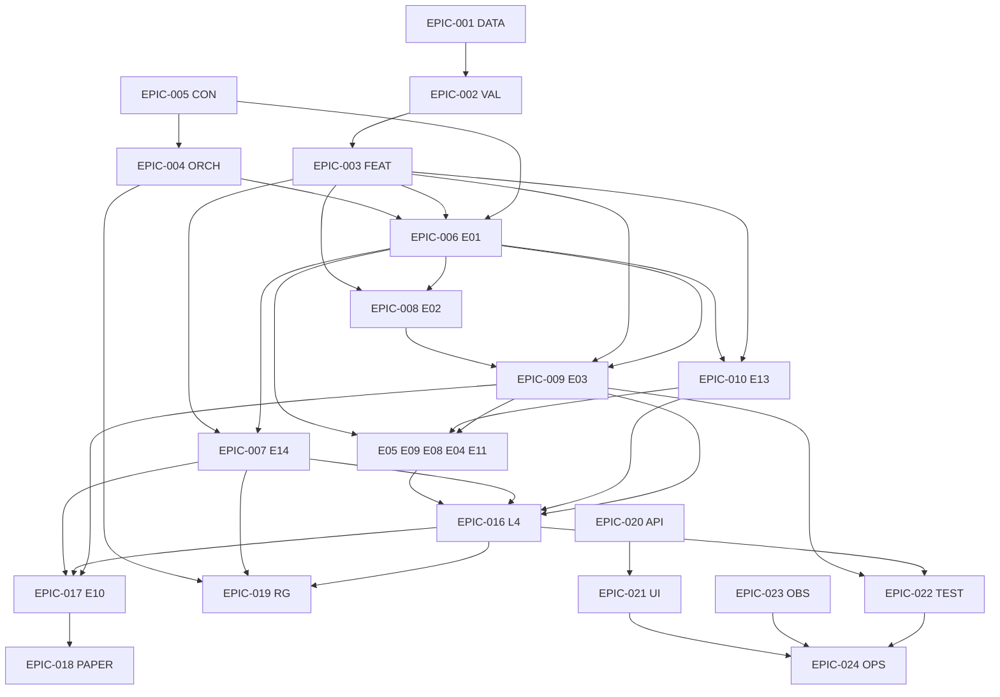

# ENGINEERING WORK BREAKDOWN STRUCTURE  
## Executable Implementation Plan — AGI Investment Office (12 Months)

**Document ID:** `WBS-V1`  
**Filename:** `ENGINEERING_WORK_BREAKDOWN_STRUCTURE.md`  
**Architecture baseline:** **Architecture v1.0.1 LOCKED**  
**Governing corpus (frozen):** E00, ORCH, L4, IMP-V1, PRR-V1, all engine specs, STAB-1.0.1 (complete)  
**Status:** Single engineering execution plan  
**Version:** 1.0.0  
**Horizon:** **12 months** wall-clock (≈26 × 2-week sprints)  
**Owner:** Head of Research Engineering  
**Nature:** **Executable engineering only** — no redesign, no new architecture, no new engines

### Programme law

1. Implements Architecture **v1.0.1** only.  
2. Task IDs in this WBS are the **unique work units** for tickets/PRs.  
3. Every PR cites: WBS task ID(s) + frozen spec section IDs + PRR gate if promoting.  
4. E03 remains Production primary until L4 PRR §5 superiority pack.  
5. Default portfolio views: `e10_views_source=e03` (M0); M3 only after PRR.  
6. E14 fail-closed on promote paths — non-negotiable.

### Effort legend

| Field | Scale |
|-------|--------|
| **Complexity** | S / M / L / XL |
| **Estimated LOC** | Net-new production code (excl. fixtures/docs); ±40% |
| **Testing effort** | Eng-days for unit/integration/contract/replay |
| **Sprint** | 2-week engineering sprint index S01–S26 |

---

# 0. Epic Index

| Epic | Name | Prefix | Phase band |
|------|------|--------|------------|
| **EPIC-001** | Market Data Platform (L0) | `DATA-` | S01–S04 |
| **EPIC-002** | Data Validation (L1) | `VAL-` | S02–S05 |
| **EPIC-003** | Feature Registry (L2) | `FEAT-` | S03–S07 |
| **EPIC-004** | ORCH Control Plane | `ORCH-` | S01–S08, S20–S22 |
| **EPIC-005** | Shared Contracts & Weight Registry | `CON-` | S01–S06 |
| **EPIC-006** | E01 Macro & Regime | `E01-` | S05–S09 |
| **EPIC-007** | E14 Risk & Crowding | `E14-` | S06–S11, S18 |
| **EPIC-008** | E02 Factor & Style | `E02-` | S07–S11 |
| **EPIC-009** | E03 Cross-Sectional Quant | `E03-` | S06–S12 |
| **EPIC-010** | E13 Equity Fundamental | `E13-` | S08–S12 |
| **EPIC-011** | E05 Event Driven | `E05-` | S09–S13 |
| **EPIC-012** | E09 CTA Trend | `E09-` | S10–S13 |
| **EPIC-013** | E08 Vol & Options | `E08-` | S10–S14 |
| **EPIC-014** | E04 Stat Arb / RV | `E04-` | S11–S14 |
| **EPIC-015** | E11 Sentiment & Alt-Data | `E11-` | S11–S15 |
| **EPIC-016** | L4 Composite Intelligence | `L4-` | S12–S18 |
| **EPIC-017** | E10 Portfolio Construction | `E10-` | S14–S19 |
| **EPIC-018** | Paper Trading | `PAPER-` | S16–S20 |
| **EPIC-019** | Research Generation (L6) | `RG-` | S17–S21 |
| **EPIC-020** | API Gateway & Platform APIs | `API-` | S04–S22 |
| **EPIC-021** | Frontend Platform | `UI-` | S08–S24 |
| **EPIC-022** | Backtesting & Validation Harness | `TEST-` | S13–S21 |
| **EPIC-023** | Monitoring & Observability (L8) | `OBS-` | S05–S24 |
| **EPIC-024** | Production Operations | `OPS-` | S15–S26 |

---

# 1. Epics (detailed)

---

## EPIC-001 — Market Data Platform (L0)

| Field | Content |
|-------|---------|
| **Objective** | Reliable multi-vendor ingest with staging, rate limits, cache, retries |
| **Deliverables** | Provider interface; OHLCV + macro + calendar adapters; staging tables; pull stamps |
| **Dependencies** | None (starts programme) |
| **Estimated LOC** | 6,500 |
| **Complexity** | L |
| **Testing effort** | 12 eng-days |
| **Acceptance** | Critical datasets pull with `source/pulled_at/vendor_as_of`; retries honor 429; no secrets in logs |
| **Required specs** | E00 §2.1; ORCH L0 |
| **Required APIs** | Internal only initially; admin ingest status |
| **DB tables** | `l0_raw_stage`, `l0_pull_log`, `l0_dataset_registry` |
| **Frontend** | Ops ingest status widget (later UI-OPS) |
| **Performance** | Macro pull p95 <120s; OHLCV batch <15m |
| **Risks** | Vendor flakiness; license gaps |

### Tasks
| ID | Task | Sprint | Deps | Pri |
|----|------|--------|------|-----|
| DATA-001 | Provider abstraction interface | S01 | — | P0 |
| DATA-002 | Rate limiter (token bucket per vendor) | S01 | DATA-001 | P0 |
| DATA-003 | Response cache + TTL policy | S01 | DATA-001 | P0 |
| DATA-004 | Retry with backoff + jitter | S01 | DATA-002 | P0 |
| DATA-005 | Pull stamping (`source`, `pulled_at`, `vendor_as_of`) | S01 | DATA-001 | P0 |
| DATA-006 | OHLCV adapter (Groww/research path) | S02 | DATA-001..005 | P0 |
| DATA-007 | Macro prints adapter (FRED/AV/WB subset) | S02 | DATA-001..005 | P0 |
| DATA-008 | Calendar adapter (earnings/macro) | S02 | DATA-001 | P0 |
| DATA-009 | Staging persist + `l0_pull_log` | S02 | DATA-005 | P0 |
| DATA-010 | Dataset registry + credentials env wiring | S03 | DATA-001 | P0 |
| DATA-011 | Quarantine path for poison payloads | S03 | DATA-009 | P1 |
| DATA-012 | Intraday refresh hooks for ORCH | S04 | DATA-006, ORCH-010 | P1 |

---

## EPIC-002 — Data Validation (L1)

| Field | Content |
|-------|---------|
| **Objective** | Admit/reject staged data; fail closed on critical |
| **Deliverables** | Validator framework; `ValidationReport`; critical/non-critical policies |
| **Dependencies** | EPIC-001 |
| **Estimated LOC** | 3,500 |
| **Complexity** | M |
| **Testing effort** | 8 eng-days |
| **Acceptance** | Critical fail blocks L2 for dataset; report hash stored |
| **Required specs** | E00 §2.2; ORCH L1 |
| **Required APIs** | `GET /api/intelligence/validation/reports` (internal) |
| **DB tables** | `l1_validation_reports`, `l1_quarantine_rows` |
| **Frontend** | Validation fail panel (ops) |
| **Performance** | p95 <60s / dataset |
| **Risks** | Over-blocking vs under-validation |

### Tasks
| ID | Task | Sprint | Deps | Pri |
|----|------|--------|------|-----|
| VAL-001 | Schema/type/range validators | S02 | DATA-009 | P0 |
| VAL-002 | Duplicate key + monotonic timestamp checks | S02 | VAL-001 | P0 |
| VAL-003 | Universe membership checks | S03 | VAL-001, FEAT-002 | P0 |
| VAL-004 | Corporate-action consistency hooks | S04 | VAL-001 | P1 |
| VAL-005 | `ValidationReport` writer + hash | S02 | VAL-001 | P0 |
| VAL-006 | Critical vs warning policy matrix | S03 | VAL-005 | P0 |
| VAL-007 | Block signal to Feature builds | S03 | VAL-006, FEAT-001 | P0 |
| VAL-008 | Contract tests for fail-closed | S03 | VAL-007 | P0 |

---

## EPIC-003 — Feature Registry (L2)

| Field | Content |
|-------|---------|
| **Objective** | Registered PIT features; online vectors; unregistered ban in Production |
| **Deliverables** | Registry service; builders; PIT store; online cache keys |
| **Dependencies** | EPIC-002 |
| **Estimated LOC** | 8,000 |
| **Complexity** | XL |
| **Testing effort** | 14 eng-days |
| **Acceptance** | Unregistered feature blocked; PIT `available_at≤as_of` enforced |
| **Required specs** | E00 §2.3,§6; ORCH §4; STAB contracts |
| **Required APIs** | `GET /api/intelligence/features/{id}`; admin register |
| **DB tables** | `feature_registry`, `feature_pit`, `feature_online_keys` |
| **Frontend** | Registry browser (internal) |
| **Performance** | Online vector <2s; full univ build <10m |
| **Risks** | Dual PIT (E02/E13) — enforce shared FUND_ builders |

### Tasks
| ID | Task | Sprint | Deps | Pri |
|----|------|--------|------|-----|
| FEAT-001 | Registry tables + registration API | S03 | VAL-005 | P0 |
| FEAT-002 | Universe membership features | S03 | DATA-006 | P0 |
| FEAT-003 | OHLCV feature builders (tech set) | S04 | DATA-006, VAL-007 | P0 |
| FEAT-004 | Macro feature builders | S04 | DATA-007 | P0 |
| FEAT-005 | Shared FUND_ PIT builders (E02/E13) | S05 | DATA-009 | P0 |
| FEAT-006 | Online store + cache keys | S05 | FEAT-001 | P0 |
| FEAT-007 | PIT join library (`as_of`, `available_at`) | S05 | FEAT-001 | P0 |
| FEAT-008 | Production unregistered-feature guard | S05 | FEAT-001 | P0 |
| FEAT-009 | Options/IV feature stubs (flagged) | S10 | DATA-010 | P1 |
| FEAT-010 | Sentiment/doc feature stubs (flagged) | S11 | DATA-010 | P1 |
| FEAT-011 | Feature impact analysis vs ORCH | S07 | ORCH-020 | P2 |

---

## EPIC-004 — ORCH Control Plane

| Field | Content |
|-------|---------|
| **Objective** | Schedule DAG, run ledger, barriers, flags, snapshots |
| **Deliverables** | `OrchScheduler/Executor`; DAG JSON; cron entrypoints; status API |
| **Dependencies** | EPIC-005 (flags/contracts); feeds all engines |
| **Estimated LOC** | 7,500 |
| **Complexity** | XL |
| **Testing effort** | 16 eng-days |
| **Acceptance** | EOD dry-run ledger; lock prevents double seal; snapshot hashes |
| **Required specs** | ORCH all; E00 §3.2,§4 |
| **Required APIs** | `/api/v1/orch/status\|runs\|snapshots\|flags\|invalidate` |
| **DB tables** | `orch_runs`, `orch_run_nodes`, `orch_snapshots`, `orch_dag_*`, `orch_feature_flags` |
| **Frontend** | Pipeline board |
| **Performance** | Status GET <300ms; seal ≤19:30 IST path ready |
| **Risks** | Cron host limits; monolith creep |

### Tasks
| ID | Task | Sprint | Deps | Pri |
|----|------|--------|------|-----|
| ORCH-001 | Run ledger migrations | S01 | CON-001 | P0 |
| ORCH-002 | DAG JSON `orch-1.0.0` load | S01 | ORCH-001 | P0 |
| ORCH-003 | Scheduler.trigger + idempotency keys | S02 | ORCH-002 | P0 |
| ORCH-004 | Distributed lock (EOD) | S02 | ORCH-003 | P0 |
| ORCH-005 | Executor + retry/timeouts | S03 | ORCH-003 | P0 |
| ORCH-006 | Barriers (pre-L4, pre-seal) | S04 | ORCH-005 | P0 |
| ORCH-007 | Feature flags service + audit | S02 | ORCH-001 | P0 |
| ORCH-008 | Status/ready/health APIs | S03 | ORCH-003 | P0 |
| ORCH-009 | Snapshot writer | S06 | ORCH-006, E01-020, E03-030, E14-020 | P0 |
| ORCH-010 | Cron entrypoints (IST map) | S04 | ORCH-003 | P0 |
| ORCH-011 | Invalidate + recompute enqueue | S07 | ORCH-005 | P1 |
| ORCH-012 | Canary percent router | S21 | ORCH-007 | P1 |
| ORCH-013 | Chaos tests (deps down) | S08 | ORCH-005 | P0 |
| ORCH-014 | Critical-path shed policy | S08 | ORCH-006 | P1 |
| ORCH-020 | Wire E01→E14→E02→E03∥E13→SPEC→L4→E10→E14b | S12 | engine P0s | P0 |

---

## EPIC-005 — Shared Contracts & Weight Registry

| Field | Content |
|-------|---------|
| **Objective** | Enforce EngineState SSOT, shims, Weight Registry runtime |
| **Deliverables** | `contracts/v1/*`; validators; weight_set loader; lint ban hardcodes |
| **Dependencies** | Architecture v1.0.1 artifacts |
| **Estimated LOC** | 4,000 |
| **Complexity** | M |
| **Testing effort** | 10 eng-days |
| **Acceptance** | CI `contracts` required; Production blends load `weight_set_id` |
| **Required specs** | E00 §5,§9,§10,§12; STAB B2/B4 |
| **Required APIs** | `GET /api/intelligence/weights/{weight_set_id}` |
| **DB tables** | `weight_registry`, `weight_registry_audit`, `signal_registry` |
| **Frontend** | Internal weight viewer |
| **Performance** | Weight resolve <50ms cached |
| **Risks** | Condition explosion |

### Tasks
| ID | Task | Sprint | Deps | Pri |
|----|------|--------|------|-----|
| CON-001 | EngineState schema CI gate | S01 | — | P0 |
| CON-002 | Fixtures E01/E03/E14/L4/E10 | S01 | CON-001 | P0 |
| CON-003 | conf-1.0 + evidence shim library | S02 | CON-001 | P0 |
| CON-004 | Signal registry tables | S03 | CON-001 | P0 |
| CON-005 | Weight Registry CRUD + activate | S04 | CON-001 | P0 |
| CON-006 | Seed sets `l4_voters_v1`, E03 combiner seeds | S05 | CON-005 | P0 |
| CON-007 | Lint: ban silent Production weight literals | S05 | CON-005 | P0 |
| CON-008 | Remaining engine fixtures | S06 | CON-002 | P1 |
| CON-009 | Compatibility matrix table | S06 | CON-001 | P2 |

---

## EPIC-006 — E01 Macro & Regime

| Field | Content |
|-------|---------|
| **Objective** | Schema-valid `E01State`; axes; size/vol priors; API |
| **Deliverables** | Submodels P0→full; persist; ORCH node; UI widgets |
| **Dependencies** | FEAT macro; ORCH; CON |
| **Estimated LOC** | 9,000 |
| **Complexity** | L |
| **Testing effort** | 12 eng-days |
| **Acceptance** | Warm GET <300ms; stale>6h degraded; no invented regime |
| **Required specs** | E01; E00 §3 |
| **Required APIs** | `GET /api/intelligence/e01/state` |
| **DB tables** | `e01_regime_current`, `e01_regime_history`, `e01_axis_scores` |
| **Frontend** | Macro desk widgets |
| **Performance** | Job p95 <45s |
| **Risks** | Print latency |

### Tasks
| ID | Task | Sprint | Deps | Pri |
|----|------|--------|------|-----|
| E01-001 | State model + persistence | S05 | FEAT-004, CON-003 | P0 |
| E01-002 | Core axes subset (growth/inflation/liquidity/risk) | S05 | E01-001 | P0 |
| E01-003 | `primary_regime` fusion P0 | S06 | E01-002 | P0 |
| E01-004 | size_multiplier / vol_target | S06 | E01-003 | P0 |
| E01-005 | weight_adjustments hints | S07 | E01-004, CON-006 | P0 |
| E01-006 | Remaining submodels to E01 spec | S08 | E01-002 | P1 |
| E01-007 | ORCH node `E01_MACRO` | S06 | ORCH-005, E01-003 | P0 |
| E01-008 | API + cache 60s | S06 | E01-003 | P0 |
| E01-009 | Stale/degraded policy tests | S07 | E01-008 | P0 |
| E01-010 | History + UI data endpoints | S08 | E01-008 | P1 |
| E01-020 | Snapshot hash contribution | S08 | ORCH-009 | P0 |

---

## EPIC-007 — E14 Risk & Crowding

| Field | Content |
|-------|---------|
| **Objective** | Firm prior + object/book assess; promote fail-closed |
| **Deliverables** | `E14State`, `E14Assessment`, gates, midday job |
| **Dependencies** | E01; FEAT micro; E02 optional |
| **Estimated LOC** | 10,000 |
| **Complexity** | XL |
| **Testing effort** | 14 eng-days |
| **Acceptance** | Promote without assess → `ORCH_E14_REQUIRED`; hard derisk fixtures |
| **Required specs** | E14; E00 §11; PRR E-G1 |
| **Required APIs** | `GET/POST .../e14/state`, `.../e14/assess` |
| **DB tables** | `e14_risk_current`, `e14_assessments`, `e14_gate_events` |
| **Frontend** | Risk banner, gates panel |
| **Performance** | Firm <60s; assess <5s |
| **Risks** | False positive blocks |

### Tasks
| ID | Task | Sprint | Deps | Pri |
|----|------|--------|------|-----|
| E14-001 | Firm prior model skeleton | S06 | E01-003 | P0 |
| E14-002 | Vol/corr/liquidity subset | S07 | E14-001, FEAT-003 | P0 |
| E14-003 | Crowding subset | S08 | E14-002 | P0 |
| E14-004 | Playbooks + size_mult / conf_adj | S08 | E14-001 | P0 |
| E14-005 | Assess API + object_hash | S07 | E14-001 | P0 |
| E14-006 | Promote middleware fail-closed | S07 | E14-005, ORCH-007 | P0 |
| E14-007 | ORCH nodes prior + assess | S08 | ORCH-020 partial | P0 |
| E14-008 | Midday + Sunday stress jobs | S10 | E14-002 | P1 |
| E14-009 | Book assess for E10/paper | S16 | E10-010 | P0 |
| E14-010 | Gate metrics + alerts hooks | S09 | OBS-003 | P0 |
| E14-020 | Snapshot hash contribution | S08 | ORCH-009 | P0 |

---

## EPIC-008 — E02 Factor & Style

| Field | Content |
|-------|---------|
| **Objective** | Factor exposures + style scores (not DCF) |
| **Deliverables** | Core factors; `E02Exposure`; API |
| **Dependencies** | E01; FEAT FUND_/prices |
| **Estimated LOC** | 8,500 |
| **Complexity** | L |
| **Testing effort** | 11 eng-days |
| **Acceptance** | Schema-valid; residualisation optional for E03 |
| **Required specs** | E02 |
| **Required APIs** | `GET .../e02/exposures` |
| **DB tables** | `e02_exposures`, `e02_factor_returns` |
| **Frontend** | Factor bars / heatmap |
| **Performance** | Univ job <8m |
| **Risks** | PIT fundamental gaps |

### Tasks
| ID | Task | Sprint | Deps | Pri |
|----|------|--------|------|-----|
| E02-001 | Exposure model + tables | S07 | FEAT-005, E01-003 | P0 |
| E02-002 | Market/size/value/mom core | S08 | E02-001 | P0 |
| E02-003 | Quality/lowvol subset | S09 | E02-002 | P1 |
| E02-004 | Factor timing consumer (E01) | S09 | E02-002, E01-005 | P1 |
| E02-005 | API + ORCH node | S08 | E02-002, ORCH-005 | P0 |
| E02-006 | Feed E03 residual hook | S09 | E02-005, E03-010 | P0 |
| E02-007 | UI endpoints | S11 | E02-005 | P2 |

---

## EPIC-009 — E03 Cross-Sectional Quant

| Field | Content |
|-------|---------|
| **Objective** | Primary alpha + dual-write `SM_AGI_TECH` parity |
| **Deliverables** | EngineState scores; rankings; legacy shim; combiner |
| **Dependencies** | E01; FEAT OHLCV; E02 optional |
| **Estimated LOC** | 12,000 |
| **Complexity** | XL |
| **Testing effort** | 18 eng-days |
| **Acceptance** | Parity fixtures vs legacy; UI unchanged; warm GET <300ms |
| **Required specs** | E03; E00 migration |
| **Required APIs** | `GET .../e03/alpha`, legacy shim fields |
| **DB tables** | `e03_alpha_current`, `e03_alpha_history`, dual-write targets |
| **Frontend** | Existing research lists + beta XS desk |
| **Performance** | Job <20m Nifty500-class |
| **Risks** | Dual-write drift |

### Tasks
| ID | Task | Sprint | Deps | Pri |
|----|------|--------|------|-----|
| E03-001 | Envelope + tables | S06 | FEAT-003, CON-003 | P0 |
| E03-002 | Dual-write adapter from `score_research` | S06 | E03-001 | P0 |
| E03-003 | Parity test battery | S07 | E03-002 | P0 |
| E03-004 | Momentum/reversal families P0 | S08 | E03-001 | P1 |
| E03-005 | Technical family beyond legacy | S09 | E03-004 | P1 |
| E03-006 | Macro/factor consumers | S09 | E01-005, E02-006 | P1 |
| E03-007 | Combiner + Weight Registry | S10 | E03-004, CON-006 | P0 |
| E03-008 | Rankings + sector relative | S10 | E03-007 | P0 |
| E03-009 | API + cache | S07 | E03-002 | P0 |
| E03-010 | Residualisation hook (E02) | S09 | E02-005 | P1 |
| E03-011 | ORCH node `E03_XS` | S08 | ORCH-005, E03-002 | P0 |
| E03-012 | Trend-persistence vs E09 exclude rule | S12 | E09-005, L4-010 | P0 |
| E03-030 | Snapshot hash contribution | S08 | ORCH-009 | P0 |

---

## EPIC-010 — E13 Equity Fundamental

| Field | Content |
|-------|---------|
| **Objective** | Fundamental attractiveness `E13Fundamental` |
| **Deliverables** | Quality/value/growth subset; API; flag default off UI |
| **Dependencies** | FEAT FUND_; E01 soft; E02 context |
| **Estimated LOC** | 9,000 |
| **Complexity** | L |
| **Testing effort** | 11 eng-days |
| **Acceptance** | PIT joins; schema-valid; UI flagged |
| **Required specs** | E13 |
| **Required APIs** | `GET .../e13/fundamental` |
| **DB tables** | `e13_fundamental_current`, `e13_fundamental_history` |
| **Frontend** | Fundamental desk (beta) |
| **Performance** | Job <15m |
| **Risks** | Estimate coverage |

### Tasks
| ID | Task | Sprint | Deps | Pri |
|----|------|--------|------|-----|
| E13-001 | Model + tables | S08 | FEAT-005 | P0 |
| E13-002 | Quality/value P0 scores | S09 | E13-001 | P0 |
| E13-003 | Growth/revisions subset | S10 | E13-002 | P1 |
| E13-004 | Composite + side_hint | S10 | E13-002 | P0 |
| E13-005 | API + ORCH node | S10 | E13-004, ORCH-005 | P0 |
| E13-006 | Estimates refresh jobs | S11 | E13-003 | P1 |
| E13-007 | L4 voter adapter | S13 | L4-002 | P0 |

---

## EPIC-011 — E05 Event Driven

| Field | Content |
|-------|---------|
| **Objective** | Calendar + earnings/event assessments |
| **Deliverables** | `E05State`; crons; decay |
| **Dependencies** | DATA calendar; E01/E13/E14 refs |
| **Estimated LOC** | 7,000 |
| **Complexity** | L |
| **Testing effort** | 10 eng-days |
| **Acceptance** | PIT event dates; no look-ahead |
| **Required specs** | E05 |
| **Required APIs** | `GET .../e05/events`, `.../e05/symbol/{sym}` |
| **DB tables** | `e05_events`, `e05_symbol_state` |
| **Frontend** | Event calendar panel |
| **Performance** | Assess <5s cached |
| **Risks** | Calendar quality |

### Tasks
| ID | Task | Sprint | Deps | Pri |
|----|------|--------|------|-----|
| E05-001 | Calendar persist + refresh jobs | S09 | DATA-008, VAL-005 | P0 |
| E05-002 | Earnings window scorer P0 | S10 | E05-001 | P0 |
| E05-003 | Event state envelope | S10 | E05-002, CON-003 | P0 |
| E05-004 | Decay job | S11 | E05-003 | P1 |
| E05-005 | API + ORCH node | S11 | E05-003 | P0 |
| E05-006 | L4 voter adapter | S13 | L4-002 | P0 |

---

## EPIC-012 — E09 CTA Trend

| Field | Content |
|-------|---------|
| **Objective** | TSMOM/panel trend ≠ E03 technicals |
| **Deliverables** | `E09State`; panel + instrument |
| **Dependencies** | FEAT prices; E01; E08 vol optional |
| **Estimated LOC** | 6,500 |
| **Complexity** | M |
| **Testing effort** | 9 eng-days |
| **Acceptance** | Distinct from E03; watermark Experimental |
| **Required specs** | E09 |
| **Required APIs** | `GET .../e09/trend` |
| **DB tables** | `e09_trend_current`, `e09_panel` |
| **Frontend** | Trend beta page |
| **Performance** | Job <10m |
| **Risks** | Confusion with E03 |

### Tasks
| ID | Task | Sprint | Deps | Pri |
|----|------|--------|------|-----|
| E09-001 | Model + tables | S10 | FEAT-003, E01-003 | P0 |
| E09-002 | S/M/L trend + breakout P0 | S11 | E09-001 | P0 |
| E09-003 | Vol scaling hook (E08 optional) | S12 | E08-003 | P1 |
| E09-004 | API + ORCH node | S11 | E09-002 | P0 |
| E09-005 | Demean vs E03 overlap contract | S12 | E03-012 | P0 |
| E09-006 | L4 voter adapter | S13 | L4-002 | P0 |

---

## EPIC-013 — E08 Vol & Options

| Field | Content |
|-------|---------|
| **Objective** | Vol regime / IV intel; no silent GEX |
| **Deliverables** | `E08State`; assumption_set; flagged modules |
| **Dependencies** | FEAT prices/chains; E01 vol |
| **Estimated LOC** | 8,000 |
| **Complexity** | L |
| **Testing effort** | 11 eng-days |
| **Acceptance** | Missing chain → module off |
| **Required specs** | E08 |
| **Required APIs** | `GET .../e08/state` |
| **DB tables** | `e08_state_current`, `e08_assumption_sets` |
| **Frontend** | Vol desk (flagged) |
| **Performance** | Chain job <8m when licensed |
| **Risks** | Licensing |

### Tasks
| ID | Task | Sprint | Deps | Pri |
|----|------|--------|------|-----|
| E08-001 | Assumption registry | S10 | CON-001 | P0 |
| E08-002 | RV/IV features P0 | S11 | FEAT-003, FEAT-009 | P0 |
| E08-003 | Vol regime state | S11 | E08-002, E01-002 | P0 |
| E08-004 | GEX module (licensed flag) | S13 | E08-001 | P2 |
| E08-005 | API + ORCH node | S12 | E08-003 | P0 |
| E08-006 | L4 voter adapter | S14 | L4-002 | P1 |

---

## EPIC-014 — E04 Stat Arb / RV

| Field | Content |
|-------|---------|
| **Objective** | Pairs/basket residual research |
| **Deliverables** | Pair graph; `E04State`; crisis disable |
| **Dependencies** | E01; prices; E02/E03 residuals |
| **Estimated LOC** | 7,500 |
| **Complexity** | L |
| **Testing effort** | 10 eng-days |
| **Acceptance** | Crisis fixture disables MR |
| **Required specs** | E04 |
| **Required APIs** | `GET .../e04/pairs` |
| **DB tables** | `e04_pair_graph`, `e04_state_current` |
| **Frontend** | Stat-arb beta |
| **Performance** | Job <12m; weekly graph |
| **Risks** | Multiple testing |

### Tasks
| ID | Task | Sprint | Deps | Pri |
|----|------|--------|------|-----|
| E04-001 | Pair graph job | S11 | FEAT-003 | P0 |
| E04-002 | Spread/zscore/coint P0 | S12 | E04-001 | P0 |
| E04-003 | E01 crisis disable | S12 | E01-003, E04-002 | P0 |
| E04-004 | API + ORCH node | S13 | E04-002 | P0 |
| E04-005 | L4 voter adapter | S14 | L4-002 | P1 |

---

## EPIC-015 — E11 Sentiment & Alt-Data

| Field | Content |
|-------|---------|
| **Objective** | Soft voter; social ≤5% Production weight rule |
| **Deliverables** | `E11State`; entity map; NLP batch flagged |
| **Dependencies** | DATA news; FEAT stubs |
| **Estimated LOC** | 7,500 |
| **Complexity** | L |
| **Testing effort** | 10 eng-days |
| **Acceptance** | Absent voter → L4 weight 0 |
| **Required specs** | E11 |
| **Required APIs** | `GET .../e11/sentiment` |
| **DB tables** | `e11_state_current`, `e11_entity_map` |
| **Frontend** | Sentiment beta |
| **Performance** | Batch <15m |
| **Risks** | NLP cost |

### Tasks
| ID | Task | Sprint | Deps | Pri |
|----|------|--------|------|-----|
| E11-001 | Entity resolution table | S11 | FEAT-010 | P0 |
| E11-002 | News sentiment P0 | S12 | E11-001 | P0 |
| E11-003 | Soft state envelope + caps | S13 | E11-002, CON-006 | P0 |
| E11-004 | API + ORCH node | S13 | E11-003 | P0 |
| E11-005 | Chaos: kill voter → L4 continues | S15 | L4-020 | P0 |

---

## EPIC-016 — L4 Composite Intelligence

| Field | Content |
|-------|---------|
| **Objective** | Fuse EngineStates → `L4Opinion` shadow→candidate |
| **Deliverables** | Gates; Weight Registry voters; explanation; shadow compare |
| **Dependencies** | E01/E03/E13/E14 minimum; specialised optional |
| **Estimated LOC** | 11,000 |
| **Complexity** | XL |
| **Testing effort** | 16 eng-days |
| **Acceptance** | Shadow writes; E03 UI unchanged; E14 missing blocks promote |
| **Required specs** | L4; E00 §11–§12; PRR §5 |
| **Required APIs** | `GET .../l4/opinion`, agreement matrix, explanation |
| **DB tables** | `l4_opinion_current`, `l4_shadow_comparison`, `l4_conflict_ledger` |
| **Frontend** | Gauges, evidence tree, matrix |
| **Performance** | Fusion/symbol <2s warm; GET <300ms |
| **Risks** | Premature primary flip |

### Tasks
| ID | Task | Sprint | Deps | Pri |
|----|------|--------|------|-----|
| L4-001 | Opinion schema + tables | S12 | CON-002 | P0 |
| L4-002 | Ingest adapters E01/E03/E13/E14 | S12 | E01-008, E03-009, E13-005, E14-005 | P0 |
| L4-003 | Hierarchy gates P0 | S13 | L4-002, E14-006 | P0 |
| L4-004 | Naive weighted vote | S13 | L4-003, CON-006 | P0 |
| L4-005 | Explanation tree | S14 | L4-004 | P0 |
| L4-006 | Shadow write + compare job | S14 | L4-004, E03-009 | P0 |
| L4-007 | Specialised voters wiring | S15 | E05-006, E09-006, E08-006, E04-005, E11-004 | P1 |
| L4-008 | Agreement matrix API | S15 | L4-007 | P1 |
| L4-009 | Bayes + calibration hook | S16 | L4-004, TEST-010 | P1 |
| L4-010 | E03∩E09 overlap enforcement | S14 | E03-012, E09-005 | P0 |
| L4-011 | ORCH node + barrier | S14 | ORCH-020 | P0 |
| L4-012 | Flags per L4 §15 (defaults safe) | S14 | ORCH-007 | P0 |
| L4-020 | Chaos + promote tests | S15 | L4-006, E14-006 | P0 |

---

## EPIC-017 — E10 Portfolio Construction

| Field | Content |
|-------|---------|
| **Objective** | Illustrative portfolios from views; no alpha creation |
| **Deliverables** | Optimiser subset; constraints; `e10_views_source` switch |
| **Dependencies** | E03/L4 views; E14 assess |
| **Estimated LOC** | 9,500 |
| **Complexity** | XL |
| **Testing effort** | 14 eng-days |
| **Acceptance** | Default views `e03`; repair≤3; never drop E14 caps |
| **Required specs** | E10; portfolio state machine M0–M3 |
| **Required APIs** | `GET/POST .../e10/portfolio`, rebalance preview |
| **DB tables** | `e10_portfolios`, `e10_rebalance_previews` |
| **Frontend** | Portfolio pages (flagged) |
| **Performance** | Optimiser <120s / book |
| **Risks** | Misread as brokerage |

### Tasks
| ID | Task | Sprint | Deps | Pri |
|----|------|--------|------|-----|
| E10-001 | Views adapter (`e03` default) | S14 | E03-008, ORCH-007 | P0 |
| E10-002 | Constraint engine + E14 caps | S15 | E10-001, E14-005 | P0 |
| E10-003 | Mean-variance / risk-parity subset | S15 | E10-002 | P0 |
| E10-004 | Repair loop ≤3 | S16 | E10-003 | P0 |
| E10-005 | Rebalance preview | S16 | E10-004 | P0 |
| E10-006 | `e10_views_source` L4 modes (M2/M3 gated) | S17 | L4-006, TEST-020 | P1 |
| E10-007 | API + ORCH node | S16 | E10-005 | P0 |
| E10-008 | UI flag off by default | S17 | UI-040 | P0 |
| E10-010 | Book payload for E14 assess | S16 | E10-005 | P0 |

---

## EPIC-018 — Paper Trading

| Field | Content |
|-------|---------|
| **Objective** | Simulated books from E10; research-only; no broker |
| **Deliverables** | Ledger; TCA; E14 loop; benchmark pack |
| **Dependencies** | E10; E14 |
| **Estimated LOC** | 5,500 |
| **Complexity** | M |
| **Testing effort** | 9 eng-days |
| **Acceptance** | No broker APIs; disclaimers; net vs gross |
| **Required specs** | IMP Phase 4; PRR paper gates |
| **Required APIs** | `GET .../paper/books`, fills, pnl |
| **DB tables** | `paper_books`, `paper_fills`, `paper_pnl` |
| **Frontend** | Paper dashboard |
| **Performance** | Daily mark <2m |
| **Risks** | Confused with live trading |

### Tasks
| ID | Task | Sprint | Deps | Pri |
|----|------|--------|------|-----|
| PAPER-001 | Book + fill ledger | S16 | E10-007 | P0 |
| PAPER-002 | Fill rules (next open/close) | S17 | PAPER-001 | P0 |
| PAPER-003 | TCA cost engine | S17 | PAPER-002 | P0 |
| PAPER-004 | E14 continuous assess | S18 | PAPER-001, E14-009 | P0 |
| PAPER-005 | Benchmark comparison job | S18 | PAPER-003 | P1 |
| PAPER-006 | APIs + UI watermark | S18 | PAPER-003, UI-050 | P0 |

---

## EPIC-019 — Research Generation (L6)

| Field | Content |
|-------|---------|
| **Objective** | CIO brief from snapshots; claim-bound; LLM optional off |
| **Deliverables** | Brief JSON/MD; assembler; promote workflow hooks |
| **Dependencies** | Snapshots; L4 explanations; E14 |
| **Estimated LOC** | 4,500 |
| **Complexity** | M |
| **Testing effort** | 8 eng-days |
| **Acceptance** | Brief blocked if E14 seal missing; LLM default off |
| **Required specs** | E00 §2.7; L4 explanation |
| **Required APIs** | `GET .../research/cio-brief` |
| **DB tables** | `rg_cio_briefs` |
| **Frontend** | Brief reader |
| **Performance** | Assemble <120s |
| **Risks** | Narrative drift |

### Tasks
| ID | Task | Sprint | Deps | Pri |
|----|------|--------|------|-----|
| RG-001 | Brief schema + assembler | S17 | ORCH-009, L4-005, E14-005 | P0 |
| RG-002 | Claim binder (evidence ids only) | S18 | RG-001 | P0 |
| RG-003 | LLM polish adapter (flag off) | S19 | RG-002 | P2 |
| RG-004 | Promote request workflow | S19 | E14-006, ORCH-007 | P0 |
| RG-005 | API + internal UI | S18 | RG-001, UI-060 | P0 |

---

## EPIC-020 — API Gateway & Platform APIs

| Field | Content |
|-------|---------|
| **Objective** | Uniform auth, errors, cache, rate limits |
| **Deliverables** | Node/Python gateway patterns; OpenAPI skeleton |
| **Dependencies** | All engine APIs |
| **Estimated LOC** | 5,000 |
| **Complexity** | M |
| **Testing effort** | 10 eng-days |
| **Acceptance** | E00 §14 envelope; warm GET p95 <300ms core |
| **Required specs** | E00 §14; ORCH §15; PRR §7–§8 |
| **Required APIs** | All `/api/intelligence/*`, `/api/v1/orch/*` |
| **DB tables** | n/a (uses engine tables) |
| **Frontend** | Consumes gateway |
| **Performance** | As § targets |
| **Risks** | Gateway/engine drift |

### Tasks
| ID | Task | Sprint | Deps | Pri |
|----|------|--------|------|-----|
| API-001 | Error envelope middleware | S04 | CON-001 | P0 |
| API-002 | AuthZ roles (public/beta/internal/admin) | S04 | ORCH-007 | P0 |
| API-003 | Cache-Control policies | S05 | API-001 | P0 |
| API-004 | Rate limits | S08 | API-002 | P0 |
| API-005 | OpenAPI skeleton | S09 | API-001 | P1 |
| API-006 | Engine route registration standard | S07 | API-001 | P0 |
| API-007 | Promote API dual-control | S19 | RG-004 | P0 |
| API-008 | Load test core GETs | S22 | API-003 | P0 |

---

## EPIC-021 — Frontend Platform

| Field | Content |
|-------|---------|
| **Objective** | Ops, internal CIO, beta, production research surfaces |
| **Deliverables** | Widgets; pages; watermarks; disclaimers |
| **Dependencies** | APIs; flags |
| **Estimated LOC** | 14,000 |
| **Complexity** | XL |
| **Testing effort** | 16 eng-days |
| **Acceptance** | No BUY/SELL; Experimental never unmarked public |
| **Required specs** | E00 §15; engine UI sections; L4 UI |
| **Required APIs** | Consumes API-* |
| **DB tables** | n/a |
| **Frontend** | (this epic) |
| **Performance** | LCP budgets per page class |
| **Risks** | Advice misread |

### Tasks
| ID | Task | Sprint | Deps | Pri |
|----|------|--------|------|-----|
| UI-001 | Design tokens + disclaimer/watermark kit | S08 | — | P0 |
| UI-002 | ORCH pipeline board | S09 | ORCH-008 | P0 |
| UI-010 | E01 macro widgets | S09 | E01-008 | P0 |
| UI-011 | E14 risk banner/gates | S10 | E14-005 | P0 |
| UI-012 | E03 research list compatibility | S08 | E03-009 | P0 |
| UI-020 | L4 gauges + evidence tree | S15 | L4-005 | P0 |
| UI-021 | Agreement matrix | S16 | L4-008 | P1 |
| UI-030 | E02/E13 beta pages | S14 | E02-005, E13-005 | P1 |
| UI-031 | E05/E09/E08/E04/E11 beta shells | S15–S16 | specialised APIs | P2 |
| UI-040 | E10 portfolio pages (flagged) | S17 | E10-007 | P0 |
| UI-050 | Paper trading pages | S18 | PAPER-006 | P0 |
| UI-060 | CIO brief reader | S18 | RG-005 | P0 |
| UI-070 | Beta shell `/beta` + noindex | S19 | UI-001, API-002 | P0 |
| UI-080 | Validation/calibration admin | S20 | TEST-012 | P1 |
| UI-090 | Flag console (audited) | S12 | ORCH-007 | P0 |
| UI-100 | Production hypercare UX polish | S24 | UI-070 | P1 |

---

## EPIC-022 — Backtesting & Validation Harness

| Field | Content |
|-------|---------|
| **Objective** | Replay, WF, IC/Brier, calibration, gate artifacts |
| **Deliverables** | Harness; reports; PRR gate pack writer |
| **Dependencies** | PIT features; engine histories; L4 shadow |
| **Estimated LOC** | 8,500 |
| **Complexity** | XL |
| **Testing effort** | 14 eng-days |
| **Acceptance** | PIT violation fails closed; gate_report_id produced |
| **Required specs** | E00 §16; L4 §14–§15; PRR §4–§5,§10 |
| **Required APIs** | `GET .../validation/reports` |
| **DB tables** | `validation_reports`, `calibration_artifacts`, `wf_reports` |
| **Frontend** | Admin charts |
| **Performance** | Nightly WF windowed jobs |
| **Risks** | Short sample / overfit |

### Tasks
| ID | Task | Sprint | Deps | Pri |
|----|------|--------|------|-----|
| TEST-001 | Replay runner `run_kind=replay` | S13 | ORCH-005, FEAT-007 | P0 |
| TEST-002 | PIT violation fixtures | S13 | TEST-001 | P0 |
| TEST-003 | Label builder (forward residual) | S14 | FEAT-003 | P0 |
| TEST-004 | Rank IC service | S14 | TEST-003 | P0 |
| TEST-005 | Brier + reliability | S15 | TEST-003, L4-006 | P0 |
| TEST-006 | Walk-forward + embargo | S16 | TEST-001 | P0 |
| TEST-010 | Calibration fit → `calibration_id` | S16 | TEST-005 | P1 |
| TEST-011 | L4 vs E03 superiority pack writer | S17 | TEST-004, TEST-005 | P0 |
| TEST-012 | Gate artifact → flag flip guard | S18 | TEST-011, ORCH-007 | P0 |
| TEST-013 | TCA in research BT | S17 | PAPER-003 | P1 |
| TEST-020 | Pre-registered KPI sheet enforcement | S14 | L4-012 | P0 |

---

## EPIC-023 — Monitoring & Observability

| Field | Content |
|-------|---------|
| **Objective** | Metrics, traces, logs, SLO boards, alerts |
| **Deliverables** | Metric emitters; dashboards; alert rules |
| **Dependencies** | ORCH; engines |
| **Estimated LOC** | 3,500 |
| **Complexity** | M |
| **Testing effort** | 7 eng-days |
| **Acceptance** | Required ORCH metrics live; Sev-1 on missed seal |
| **Required specs** | ORCH §11; PRR §6 |
| **Required APIs** | health/ready/status |
| **DB tables** | optional metric rollups |
| **Frontend** | SLO burn panel |
| **Performance** | Low cardinality |
| **Risks** | Alert noise |

### Tasks
| ID | Task | Sprint | Deps | Pri |
|----|------|--------|------|-----|
| OBS-001 | Structured logging standard | S05 | ORCH-003 | P0 |
| OBS-002 | Trace propagation | S06 | API-001 | P1 |
| OBS-003 | Core metrics (latency/stale/gates) | S05 | ORCH-003 | P0 |
| OBS-004 | Pipeline dashboard data API | S09 | OBS-003 | P0 |
| OBS-005 | Alert rules (seal/E14/API p95) | S11 | OBS-003 | P0 |
| OBS-006 | Shadow divergence metric | S15 | L4-006 | P0 |
| OBS-007 | SLO burn board | S22 | OBS-005 | P0 |

---

## EPIC-024 — Production Operations

| Field | Content |
|-------|---------|
| **Objective** | Runbooks, drills, canary, hypercare, promotions |
| **Deliverables** | Runbooks; rollback drills; release checklists |
| **Dependencies** | All production-bound epics |
| **Estimated LOC** | 2,000 (ops-as-code) + docs |
| **Complexity** | M |
| **Testing effort** | 10 eng-days (drills) |
| **Acceptance** | Flag rollback ≤15m drill Pass; PRR Production pack |
| **Required specs** | PRR; ORCH §13; IMP Phases 5–7 |
| **Required APIs** | admin flag/promote |
| **DB tables** | flag audit (exists) |
| **Frontend** | Flag console |
| **Performance** | RTO ≤15m |
| **Risks** | Premature GO |

### Tasks
| ID | Task | Sprint | Deps | Pri |
|----|------|--------|------|-----|
| OPS-001 | Runbook: EOD seal failure | S15 | ORCH-009, OBS-005 | P0 |
| OPS-002 | Runbook: vendor outage | S15 | DATA-011 | P0 |
| OPS-003 | Runbook: E14 block surge | S16 | E14-010 | P0 |
| OPS-004 | Rollback drill (E03 primary) | S21 | ORCH-012, L4-012 | P0 |
| OPS-005 | Canary enablement | S21 | ORCH-012 | P0 |
| OPS-006 | Internal CIO soak (20 seals) | S20 | RG-005, ORCH-009 | P0 |
| OPS-007 | Beta readiness pack | S21 | UI-070, API-008 | P0 |
| OPS-008 | Production GO pack (PRR §15) | S23 | TEST-012, OPS-004 | P0 |
| OPS-009 | Hypercare + postmortems | S24–S26 | OPS-008 | P0 |
| OPS-010 | Institutional readiness backlog only | S26 | OPS-009 | P2 |

---

# 2. Dependency Graph (epic level)



---

# 3. Critical Path

```
CON-001 → ORCH-001..005 → DATA/VAL/FEAT P0
  → E01 P0 → E14 P0 → E03 dual-write P0
  → ORCH-020 wiring → L4 P0 shadow
  → TEST superiority harness → RG/Internal CIO
  → UI beta → OPS rollback drill → OPS Production GO
```

**Critical path task spine (P0):**  
`CON-001 → ORCH-003 → DATA-006 → VAL-007 → FEAT-003 → E01-003 → E14-006 → E03-002 → E03-003 → ORCH-020 → L4-002 → L4-006 → TEST-011 → RG-001 → OPS-006 → OPS-004 → OPS-008`

Anything off-spine (specialised engines, rich UI) is **parallel**, not allowed to gate E03 Production stability.

---

# 4. Parallel Workstreams

| Stream | Epics | Notes |
|--------|-------|-------|
| **A Platform** | 001–005, 020, 023 | Unblocks all |
| **B Core Alpha/Risk** | 006,007,009 | Critical path |
| **C Context Engines** | 008,010 | Parallel after E01 |
| **D Specialised** | 011–015 | Parallel; L4 optional voters |
| **E Composite/Portfolio** | 016–018 | After core |
| **F Product Surfaces** | 019,021 | After APIs |
| **G Validation/Ops** | 022,024 | Gates promotions |

**Staffing suggestion (3 FTE):** A+B owned by Eng lead; C/D Quant eng; E/F full-stack; G shared.

---

# 5. Sprint Allocation (S01–S26)

| Sprint | Focus | Exit highlight |
|--------|-------|----------------|
| S01 | CON+ORCH+DATA skeleton | Schema CI; provider+ledger |
| S02 | DATA/VAL/ORCH flags | Validation reports; retries |
| S03 | FEAT registry + VAL guards | Unregistered ban |
| S04 | FEAT builders + API middleware | OHLCV/macro features |
| S05 | FEAT PIT/online + OBS + E01 start | PIT library |
| S06 | E01 P0 + E14 start + E03 dual-write | E01 API; E03 shim |
| S07 | E14 fail-closed + E03 parity + E02 start | Promote blocked w/o E14 |
| S08 | E02/E03 nodes + ORCH shed + UI kit | Snapshot hashes |
| S09 | E03 consumers + E13/E05 start + UI E01/E14 | Core desk usable internal |
| S10 | E03 combiner + E13/E09/E08/E05 P0 | Combiner live |
| S11 | Specialised APIs + E11 start + alerts | SPEC_PARALLEL jobs |
| S12 | L4 ingest/gates + ORCH-020 + E04 + overlap | L4 skeleton |
| S13 | L4 vote + E05/E09 adapters + replay | Shadow-capable |
| S14 | L4 shadow/explain + E10 views e03 + TEST labels | Shadow writes |
| S15 | L4 voters+chaos + E10 constraints + OBS divergence | Full voter optional |
| S16 | L4 calib hook + E10 optimise + PAPER ledger + WF | Paper starts |
| S17 | E10 L4 modes gated + PAPER TCA + RG brief + KPI | Internal brief |
| S18 | PAPER E14 + UI paper/CIO + gate artifacts | Paper loop |
| S19 | Beta shell + promote dual-control + LLM flag off | `/beta` |
| S20 | Internal soak 20 seals + UI admin | Soak evidence |
| S21 | Canary + rollback drill + beta pack | RTO≤15m |
| S22 | Load tests + SLO board | Perf evidence |
| S23 | PRR Production GO pack | GO/NO-GO |
| S24 | Hypercare + UX polish | Stable v1 |
| S25 | Residual debt / specialised promotions | Candidate packs |
| S26 | Institutional backlog grooming only | No redesign |

---

# 6. Milestone Acceptance Criteria

| Milestone | Sprint | Must Pass |
|-----------|--------|-----------|
| **M1 Platform Ready** | S05 | CON CI; ORCH trigger; FEAT PIT; DATA/VAL path |
| **M2 Core Engines P0** | S08 | E01/E14/E03 EngineState; E14 fail-closed; snapshots |
| **M3 Shadow Ready** | S14 | L4 shadow daily; E03 UI unchanged; overlap rule |
| **M4 Validation Ready** | S18 | Replay/WF/IC/Brier; gate_report_id; paper loop |
| **M5 Internal CIO** | S20 | Brief+desk; 20 seals; promote workflow |
| **M6 Public Beta** | S21 | `/beta` watermarks; rollback drill |
| **M7 Production v1** | S23–S24 | PRR §15 GO; hypercare; E03 primary unless L4 vote |
| **M8 Programme Close** | S26 | WBS complete/deferred logged; no open P0 tasks without waiver |

---

# 7. Implementation Dashboard

Status values: `Not Started` · `In Progress` · `Blocked` · `Done` · `Deferred`.  
Owners: `Eng` · `Quant` · `Fullstack` · `Ops` · `Risk` · `Portfolio`.

> Living dashboard: copy into issue tracker; WBS IDs are primary keys.

| Task | Owner | Status | Priority | Dependencies | Sprint | Acceptance | Risk |
|------|-------|--------|----------|--------------|--------|------------|------|
| DATA-001 | Eng | Not Started | P0 | — | S01 | Provider interface merged | Low |
| DATA-002 | Eng | Not Started | P0 | DATA-001 | S01 | Rate limiter unit tests | Med |
| DATA-003 | Eng | Not Started | P0 | DATA-001 | S01 | TTL cache hits | Low |
| DATA-004 | Eng | Not Started | P0 | DATA-002 | S01 | Backoff on 429 | Med |
| DATA-005 | Eng | Not Started | P0 | DATA-001 | S01 | Stamps persisted | Low |
| DATA-006 | Eng | Not Started | P0 | DATA-001..005 | S02 | OHLCV stage rows | Med |
| DATA-007 | Eng | Not Started | P0 | DATA-001..005 | S02 | Macro stage rows | Med |
| DATA-008 | Eng | Not Started | P0 | DATA-001 | S02 | Calendar stage | Med |
| DATA-009 | Eng | Not Started | P0 | DATA-005 | S02 | pull_log complete | Low |
| DATA-010 | Eng | Not Started | P0 | DATA-001 | S03 | Registry+env | Med |
| DATA-011 | Eng | Not Started | P1 | DATA-009 | S03 | Quarantine works | Low |
| DATA-012 | Eng | Not Started | P1 | DATA-006, ORCH-010 | S04 | Intraday hook | Med |
| VAL-001 | Eng | Not Started | P0 | DATA-009 | S02 | Validators pass fixtures | Low |
| VAL-002 | Eng | Not Started | P0 | VAL-001 | S02 | Dup/mono checks | Low |
| VAL-003 | Eng | Not Started | P0 | VAL-001, FEAT-002 | S03 | Universe filter | Med |
| VAL-004 | Eng | Not Started | P1 | VAL-001 | S04 | CA hooks | Med |
| VAL-005 | Eng | Not Started | P0 | VAL-001 | S02 | Report hash | Low |
| VAL-006 | Eng | Not Started | P0 | VAL-005 | S03 | Policy matrix | Med |
| VAL-007 | Eng | Not Started | P0 | VAL-006, FEAT-001 | S03 | Blocks L2 | High |
| VAL-008 | Eng | Not Started | P0 | VAL-007 | S03 | Fail-closed tests | Low |
| FEAT-001 | Eng | Not Started | P0 | VAL-005 | S03 | Registry API | Med |
| FEAT-002 | Eng | Not Started | P0 | DATA-006 | S03 | Universe features | Low |
| FEAT-003 | Eng | Not Started | P0 | DATA-006, VAL-007 | S04 | OHLCV features | Med |
| FEAT-004 | Eng | Not Started | P0 | DATA-007 | S04 | Macro features | Med |
| FEAT-005 | Quant | Not Started | P0 | DATA-009 | S05 | Shared FUND_ PIT | High |
| FEAT-006 | Eng | Not Started | P0 | FEAT-001 | S05 | Online store | Med |
| FEAT-007 | Eng | Not Started | P0 | FEAT-001 | S05 | PIT joins | High |
| FEAT-008 | Eng | Not Started | P0 | FEAT-001 | S05 | Unregistered ban | High |
| FEAT-009 | Eng | Not Started | P1 | DATA-010 | S10 | Options stubs | High |
| FEAT-010 | Eng | Not Started | P1 | DATA-010 | S11 | Sentiment stubs | Med |
| FEAT-011 | Eng | Not Started | P2 | ORCH-020 | S07 | Impact tool | Low |
| ORCH-001 | Eng | Not Started | P0 | CON-001 | S01 | Migrations | Low |
| ORCH-002 | Eng | Not Started | P0 | ORCH-001 | S01 | DAG loads | Low |
| ORCH-003 | Eng | Not Started | P0 | ORCH-002 | S02 | Trigger+idempotency | Med |
| ORCH-004 | Eng | Not Started | P0 | ORCH-003 | S02 | Lock works | Med |
| ORCH-005 | Eng | Not Started | P0 | ORCH-003 | S03 | Retry/timeouts | Med |
| ORCH-006 | Eng | Not Started | P0 | ORCH-005 | S04 | Barriers | Med |
| ORCH-007 | Eng | Not Started | P0 | ORCH-001 | S02 | Flags+audit | High |
| ORCH-008 | Eng | Not Started | P0 | ORCH-003 | S03 | Health APIs | Low |
| ORCH-009 | Eng | Not Started | P0 | ORCH-006, E01-020, E03-030, E14-020 | S06 | Snapshot seal | High |
| ORCH-010 | Eng | Not Started | P0 | ORCH-003 | S04 | Cron map | Med |
| ORCH-011 | Eng | Not Started | P1 | ORCH-005 | S07 | Invalidate | Med |
| ORCH-012 | Eng | Not Started | P1 | ORCH-007 | S21 | Canary | Med |
| ORCH-013 | Eng | Not Started | P0 | ORCH-005 | S08 | Chaos tests | Med |
| ORCH-014 | Eng | Not Started | P1 | ORCH-006 | S08 | Shed policy | Med |
| ORCH-020 | Eng | Not Started | P0 | engine P0s | S12 | Full DAG wire | High |
| CON-001 | Eng | Not Started | P0 | — | S01 | Schema CI | High |
| CON-002 | Eng | Not Started | P0 | CON-001 | S01 | Core fixtures | Med |
| CON-003 | Quant | Not Started | P0 | CON-001 | S02 | Shims | High |
| CON-004 | Eng | Not Started | P0 | CON-001 | S03 | Signal registry | Med |
| CON-005 | Eng | Not Started | P0 | CON-001 | S04 | Weight Registry | High |
| CON-006 | Quant | Not Started | P0 | CON-005 | S05 | Seeds | Med |
| CON-007 | Eng | Not Started | P0 | CON-005 | S05 | Lint ban | Med |
| CON-008 | Eng | Not Started | P1 | CON-002 | S06 | All fixtures | Med |
| CON-009 | Eng | Not Started | P2 | CON-001 | S06 | Compat matrix | Low |
| E01-001 | Quant | Not Started | P0 | FEAT-004, CON-003 | S05 | Persist state | Med |
| E01-002 | Quant | Not Started | P0 | E01-001 | S05 | Core axes | Med |
| E01-003 | Quant | Not Started | P0 | E01-002 | S06 | Regime fusion | High |
| E01-004 | Quant | Not Started | P0 | E01-003 | S06 | size/vol | Med |
| E01-005 | Quant | Not Started | P0 | E01-004, CON-006 | S07 | weight hints | Med |
| E01-006 | Quant | Not Started | P1 | E01-002 | S08 | Full submodels | Med |
| E01-007 | Eng | Not Started | P0 | ORCH-005, E01-003 | S06 | ORCH node | Low |
| E01-008 | Eng | Not Started | P0 | E01-003 | S06 | API <300ms | Med |
| E01-009 | Eng | Not Started | P0 | E01-008 | S07 | Stale tests | High |
| E01-010 | Fullstack | Not Started | P1 | E01-008 | S08 | History API | Low |
| E01-020 | Eng | Not Started | P0 | ORCH-009 | S08 | Snapshot hash | Low |
| E14-001 | Risk/Quant | Not Started | P0 | E01-003 | S06 | Firm prior | High |
| E14-002 | Quant | Not Started | P0 | E14-001, FEAT-003 | S07 | Vol/corr/liq | High |
| E14-003 | Quant | Not Started | P0 | E14-002 | S08 | Crowding | Med |
| E14-004 | Risk | Not Started | P0 | E14-001 | S08 | Playbooks | High |
| E14-005 | Eng | Not Started | P0 | E14-001 | S07 | Assess API | High |
| E14-006 | Eng | Not Started | P0 | E14-005, ORCH-007 | S07 | Fail-closed | **Crit** |
| E14-007 | Eng | Not Started | P0 | ORCH-020 | S08 | ORCH nodes | Med |
| E14-008 | Eng | Not Started | P1 | E14-002 | S10 | Midday/stress | Med |
| E14-009 | Eng | Not Started | P0 | E10-010 | S16 | Book assess | Med |
| E14-010 | Ops | Not Started | P0 | OBS-003 | S09 | Gate metrics | Med |
| E14-020 | Eng | Not Started | P0 | ORCH-009 | S08 | Snapshot hash | Low |
| E02-001 | Quant | Not Started | P0 | FEAT-005, E01-003 | S07 | Tables | Med |
| E02-002 | Quant | Not Started | P0 | E02-001 | S08 | Core factors | Med |
| E02-003 | Quant | Not Started | P1 | E02-002 | S09 | Quality/lowvol | Med |
| E02-004 | Quant | Not Started | P1 | E02-002, E01-005 | S09 | Timing | Med |
| E02-005 | Eng | Not Started | P0 | E02-002, ORCH-005 | S08 | API+node | Low |
| E02-006 | Quant | Not Started | P0 | E02-005, E03-010 | S09 | Residual hook | High |
| E02-007 | Fullstack | Not Started | P2 | E02-005 | S11 | UI endpoints | Low |
| E03-001 | Eng | Not Started | P0 | FEAT-003, CON-003 | S06 | Envelope | Med |
| E03-002 | Eng | Not Started | P0 | E03-001 | S06 | Dual-write | **Crit** |
| E03-003 | Quant | Not Started | P0 | E03-002 | S07 | Parity battery | **Crit** |
| E03-004 | Quant | Not Started | P1 | E03-001 | S08 | Mom/rev | Med |
| E03-005 | Quant | Not Started | P1 | E03-004 | S09 | Tech expand | Med |
| E03-006 | Quant | Not Started | P1 | E01-005, E02-006 | S09 | Consumers | Med |
| E03-007 | Quant | Not Started | P0 | E03-004, CON-006 | S10 | Combiner | High |
| E03-008 | Quant | Not Started | P0 | E03-007 | S10 | Rankings | Med |
| E03-009 | Eng | Not Started | P0 | E03-002 | S07 | API | Med |
| E03-010 | Quant | Not Started | P1 | E02-005 | S09 | Residual | Med |
| E03-011 | Eng | Not Started | P0 | ORCH-005, E03-002 | S08 | ORCH node | Low |
| E03-012 | Quant | Not Started | P0 | E09-005, L4-010 | S12 | Overlap rule | High |
| E03-030 | Eng | Not Started | P0 | ORCH-009 | S08 | Snapshot hash | Low |
| E13-001 | Quant | Not Started | P0 | FEAT-005 | S08 | Model | Med |
| E13-002 | Quant | Not Started | P0 | E13-001 | S09 | Q/V scores | Med |
| E13-003 | Quant | Not Started | P1 | E13-002 | S10 | Growth | Med |
| E13-004 | Quant | Not Started | P0 | E13-002 | S10 | Composite | Med |
| E13-005 | Eng | Not Started | P0 | E13-004, ORCH-005 | S10 | API+node | Low |
| E13-006 | Eng | Not Started | P1 | E13-003 | S11 | Estimates jobs | Med |
| E13-007 | Eng | Not Started | P0 | L4-002 | S13 | L4 adapter | Med |
| E05-001 | Eng | Not Started | P0 | DATA-008, VAL-005 | S09 | Calendar | Med |
| E05-002 | Quant | Not Started | P0 | E05-001 | S10 | Earnings score | Med |
| E05-003 | Eng | Not Started | P0 | E05-002, CON-003 | S10 | Envelope | Low |
| E05-004 | Eng | Not Started | P1 | E05-003 | S11 | Decay | Low |
| E05-005 | Eng | Not Started | P0 | E05-003 | S11 | API+node | Low |
| E05-006 | Eng | Not Started | P0 | L4-002 | S13 | L4 adapter | Low |
| E09-001 | Quant | Not Started | P0 | FEAT-003, E01-003 | S10 | Model | Med |
| E09-002 | Quant | Not Started | P0 | E09-001 | S11 | S/M/L | Med |
| E09-003 | Quant | Not Started | P1 | E08-003 | S12 | Vol scale | Med |
| E09-004 | Eng | Not Started | P0 | E09-002 | S11 | API+node | Low |
| E09-005 | Quant | Not Started | P0 | E03-012 | S12 | Demean contract | High |
| E09-006 | Eng | Not Started | P0 | L4-002 | S13 | L4 adapter | Low |
| E08-001 | Quant | Not Started | P0 | CON-001 | S10 | Assumptions | Med |
| E08-002 | Quant | Not Started | P0 | FEAT-003, FEAT-009 | S11 | RV/IV | High |
| E08-003 | Quant | Not Started | P0 | E08-002, E01-002 | S11 | Vol regime | Med |
| E08-004 | Quant | Not Started | P2 | E08-001 | S13 | GEX flagged | High |
| E08-005 | Eng | Not Started | P0 | E08-003 | S12 | API+node | Med |
| E08-006 | Eng | Not Started | P1 | L4-002 | S14 | L4 adapter | Low |
| E04-001 | Quant | Not Started | P0 | FEAT-003 | S11 | Pair graph | Med |
| E04-002 | Quant | Not Started | P0 | E04-001 | S12 | Z/coint | Med |
| E04-003 | Quant | Not Started | P0 | E01-003, E04-002 | S12 | Crisis disable | High |
| E04-004 | Eng | Not Started | P0 | E04-002 | S13 | API+node | Low |
| E04-005 | Eng | Not Started | P1 | L4-002 | S14 | L4 adapter | Low |
| E11-001 | Eng | Not Started | P0 | FEAT-010 | S11 | Entity map | Med |
| E11-002 | Quant | Not Started | P0 | E11-001 | S12 | News NLP P0 | High |
| E11-003 | Quant | Not Started | P0 | E11-002, CON-006 | S13 | Caps | Med |
| E11-004 | Eng | Not Started | P0 | E11-003 | S13 | API+node | Low |
| E11-005 | Eng | Not Started | P0 | L4-020 | S15 | Chaos test | Med |
| L4-001 | Eng | Not Started | P0 | CON-002 | S12 | Schema/tables | Med |
| L4-002 | Eng | Not Started | P0 | E01-008, E03-009, E13-005, E14-005 | S12 | Adapters | High |
| L4-003 | Quant | Not Started | P0 | L4-002, E14-006 | S13 | Gates | High |
| L4-004 | Quant | Not Started | P0 | L4-003, CON-006 | S13 | Vote | High |
| L4-005 | Eng | Not Started | P0 | L4-004 | S14 | Explanation | Med |
| L4-006 | Eng | Not Started | P0 | L4-004, E03-009 | S14 | Shadow | **Crit** |
| L4-007 | Eng | Not Started | P1 | specialised adapters | S15 | Voters | Med |
| L4-008 | Eng | Not Started | P1 | L4-007 | S15 | Matrix API | Low |
| L4-009 | Quant | Not Started | P1 | L4-004, TEST-010 | S16 | Calib | Med |
| L4-010 | Quant | Not Started | P0 | E03-012, E09-005 | S14 | Overlap | High |
| L4-011 | Eng | Not Started | P0 | ORCH-020 | S14 | ORCH node | Med |
| L4-012 | Eng | Not Started | P0 | ORCH-007 | S14 | Safe flags | **Crit** |
| L4-020 | Eng | Not Started | P0 | L4-006, E14-006 | S15 | Chaos/promote | High |
| E10-001 | Portfolio | Not Started | P0 | E03-008, ORCH-007 | S14 | Views e03 | High |
| E10-002 | Portfolio | Not Started | P0 | E10-001, E14-005 | S15 | Constraints | High |
| E10-003 | Portfolio | Not Started | P0 | E10-002 | S15 | Optimiser | High |
| E10-004 | Portfolio | Not Started | P0 | E10-003 | S16 | Repair≤3 | Med |
| E10-005 | Portfolio | Not Started | P0 | E10-004 | S16 | Rebalance | Med |
| E10-006 | Portfolio | Not Started | P1 | L4-006, TEST-020 | S17 | L4 modes gated | High |
| E10-007 | Eng | Not Started | P0 | E10-005 | S16 | API+node | Med |
| E10-008 | Fullstack | Not Started | P0 | UI-040 | S17 | UI flagged | Med |
| E10-010 | Eng | Not Started | P0 | E10-005 | S16 | Book payload | Med |
| PAPER-001 | Portfolio | Not Started | P0 | E10-007 | S16 | Ledger | Med |
| PAPER-002 | Portfolio | Not Started | P0 | PAPER-001 | S17 | Fill rules | Med |
| PAPER-003 | Portfolio | Not Started | P0 | PAPER-002 | S17 | TCA | Med |
| PAPER-004 | Risk | Not Started | P0 | PAPER-001, E14-009 | S18 | E14 loop | Med |
| PAPER-005 | Quant | Not Started | P1 | PAPER-003 | S18 | Benchmark | Low |
| PAPER-006 | Fullstack | Not Started | P0 | PAPER-003, UI-050 | S18 | API+UI | Med |
| RG-001 | Eng | Not Started | P0 | ORCH-009, L4-005, E14-005 | S17 | Assembler | Med |
| RG-002 | Eng | Not Started | P0 | RG-001 | S18 | Claim binder | High |
| RG-003 | Eng | Not Started | P2 | RG-002 | S19 | LLM off | High |
| RG-004 | Eng | Not Started | P0 | E14-006, ORCH-007 | S19 | Promote flow | High |
| RG-005 | Fullstack | Not Started | P0 | RG-001, UI-060 | S18 | Brief UI | Med |
| API-001 | Eng | Not Started | P0 | CON-001 | S04 | Errors | Low |
| API-002 | Eng | Not Started | P0 | ORCH-007 | S04 | AuthZ | High |
| API-003 | Eng | Not Started | P0 | API-001 | S05 | Cache | Low |
| API-004 | Eng | Not Started | P0 | API-002 | S08 | Rate limits | Med |
| API-005 | Eng | Not Started | P1 | API-001 | S09 | OpenAPI | Low |
| API-006 | Eng | Not Started | P0 | API-001 | S07 | Route standard | Med |
| API-007 | Eng | Not Started | P0 | RG-004 | S19 | Dual-control | High |
| API-008 | Ops | Not Started | P0 | API-003 | S22 | Load test | Med |
| UI-001 | Fullstack | Not Started | P0 | — | S08 | Watermark kit | Med |
| UI-002 | Fullstack | Not Started | P0 | ORCH-008 | S09 | Pipeline board | Low |
| UI-010 | Fullstack | Not Started | P0 | E01-008 | S09 | Macro UI | Low |
| UI-011 | Fullstack | Not Started | P0 | E14-005 | S10 | Risk UI | Med |
| UI-012 | Fullstack | Not Started | P0 | E03-009 | S08 | E03 compat | High |
| UI-020 | Fullstack | Not Started | P0 | L4-005 | S15 | L4 gauges | Med |
| UI-021 | Fullstack | Not Started | P1 | L4-008 | S16 | Matrix | Low |
| UI-030 | Fullstack | Not Started | P1 | E02-005, E13-005 | S14 | E02/E13 pages | Med |
| UI-031 | Fullstack | Not Started | P2 | specialised APIs | S15–S16 | Beta shells | Med |
| UI-040 | Fullstack | Not Started | P0 | E10-007 | S17 | Portfolio UI | High |
| UI-050 | Fullstack | Not Started | P0 | PAPER-006 | S18 | Paper UI | Med |
| UI-060 | Fullstack | Not Started | P0 | RG-005 | S18 | Brief reader | Med |
| UI-070 | Fullstack | Not Started | P0 | UI-001, API-002 | S19 | Beta shell | High |
| UI-080 | Fullstack | Not Started | P1 | TEST-012 | S20 | Validation admin | Low |
| UI-090 | Fullstack | Not Started | P0 | ORCH-007 | S12 | Flag console | High |
| UI-100 | Fullstack | Not Started | P1 | UI-070 | S24 | Polish | Low |
| TEST-001 | Eng | Not Started | P0 | ORCH-005, FEAT-007 | S13 | Replay | High |
| TEST-002 | Eng | Not Started | P0 | TEST-001 | S13 | PIT fixtures | **Crit** |
| TEST-003 | Quant | Not Started | P0 | FEAT-003 | S14 | Labels | Med |
| TEST-004 | Quant | Not Started | P0 | TEST-003 | S14 | IC | Med |
| TEST-005 | Quant | Not Started | P0 | TEST-003, L4-006 | S15 | Brier | High |
| TEST-006 | Quant | Not Started | P0 | TEST-001 | S16 | WF | High |
| TEST-010 | Quant | Not Started | P1 | TEST-005 | S16 | Calib | Med |
| TEST-011 | Quant | Not Started | P0 | TEST-004, TEST-005 | S17 | Superiority pack | **Crit** |
| TEST-012 | Eng | Not Started | P0 | TEST-011, ORCH-007 | S18 | Flag guard | High |
| TEST-013 | Quant | Not Started | P1 | PAPER-003 | S17 | TCA BT | Med |
| TEST-020 | Quant | Not Started | P0 | L4-012 | S14 | KPI sheet | High |
| OBS-001 | Eng | Not Started | P0 | ORCH-003 | S05 | Logging | Low |
| OBS-002 | Eng | Not Started | P1 | API-001 | S06 | Tracing | Low |
| OBS-003 | Eng | Not Started | P0 | ORCH-003 | S05 | Metrics | Med |
| OBS-004 | Eng | Not Started | P0 | OBS-003 | S09 | Dash API | Low |
| OBS-005 | Ops | Not Started | P0 | OBS-003 | S11 | Alerts | High |
| OBS-006 | Eng | Not Started | P0 | L4-006 | S15 | Divergence | Med |
| OBS-007 | Ops | Not Started | P0 | OBS-005 | S22 | SLO board | Med |
| OPS-001 | Ops | Not Started | P0 | ORCH-009, OBS-005 | S15 | Seal runbook | Med |
| OPS-002 | Ops | Not Started | P0 | DATA-011 | S15 | Vendor runbook | Med |
| OPS-003 | Ops | Not Started | P0 | E14-010 | S16 | E14 runbook | Med |
| OPS-004 | Ops | Not Started | P0 | ORCH-012, L4-012 | S21 | Rollback drill | **Crit** |
| OPS-005 | Ops | Not Started | P0 | ORCH-012 | S21 | Canary live | Med |
| OPS-006 | Ops | Not Started | P0 | RG-005, ORCH-009 | S20 | 20 seals soak | High |
| OPS-007 | Ops | Not Started | P0 | UI-070, API-008 | S21 | Beta pack | High |
| OPS-008 | Ops/Risk/CIO | Not Started | P0 | TEST-012, OPS-004 | S23 | PRR GO pack | **Crit** |
| OPS-009 | Ops | Not Started | P0 | OPS-008 | S24–S26 | Hypercare | Med |
| OPS-010 | Eng Mgmt | Not Started | P2 | OPS-009 | S26 | Institutional backlog only | Low |

---

# 8. Task ID Registry (complete index)

| Prefix | Count (this WBS) | Epic |
|--------|----------------:|------|
| DATA- | 12 | 001 |
| VAL- | 8 | 002 |
| FEAT- | 11 | 003 |
| ORCH- | 15 | 004 |
| CON- | 9 | 005 |
| E01- | 11 | 006 |
| E14- | 11 | 007 |
| E02- | 7 | 008 |
| E03- | 13 | 009 |
| E13- | 7 | 010 |
| E05- | 6 | 011 |
| E09- | 6 | 012 |
| E08- | 6 | 013 |
| E04- | 5 | 014 |
| E11- | 5 | 015 |
| L4- | 13 | 016 |
| E10- | 9 | 017 |
| PAPER- | 6 | 018 |
| RG- | 5 | 019 |
| API- | 8 | 020 |
| UI- | 16 | 021 |
| TEST- | 11 | 022 |
| OBS- | 7 | 023 |
| OPS- | 10 | 024 |
| **Total** | **~217** | — |

New work must mint the next free ID under the correct prefix (never reuse).

---

# 9. Mapping to IMP-V1 / PRR-V1

| IMP Phase | WBS milestones | PRR gate |
|-----------|----------------|----------|
| P0 Infrastructure | M1 (S05) | Development→Internal |
| P1 Engine P0s | M2 (S08) | Internal |
| P2 Shadow | M3 (S14) | Shadow |
| P3 Validation | M4 (S18) | Shadow/Beta packs |
| P4 Paper | PAPER-* in M4 | Paper |
| P5 Internal CIO | M5 (S20) | Internal |
| P6 Beta | M6 (S21) | Beta |
| P7 Production | M7 (S23–S24) | Production |
| P8 Institutional | OPS-010 backlog only | Institutional (future) |

---

# 10. Definition of Done (every task)

1. Code + migrations (if any) merged  
2. Unit/contract tests required by task acceptance  
3. Spec citations in PR (E00/ORCH/L4/E0X + WBS ID)  
4. Flags default safe  
5. Metrics/logs for new nodes  
6. No architecture redesign  
7. Dashboard row → `Done`

---

# 11. Change control

| Change | Allowed? |
|--------|----------|
| Split/merge tasks, re-estimate LOC | Yes (Eng lead) |
| Move sprint ±2 without breaking critical path | Yes |
| Add task under existing prefix for frozen scope | Yes |
| New engine / layer / philosophy change | **No** — E00 amendment required |
| Flip L4 primary / Production GO | PRR only, not WBS discretion |

---

# 12. Document control

| Version | Notes |
|---------|-------|
| 1.0.0 | Initial executable WBS under Architecture v1.0.1 LOCKED |

This WBS is the **single engineering execution plan** for the next 12 months. Architecture remains frozen; execution proceeds by Task ID.

---

*End of ENGINEERING WORK BREAKDOWN STRUCTURE — executable plan for AGI Investment Office*
