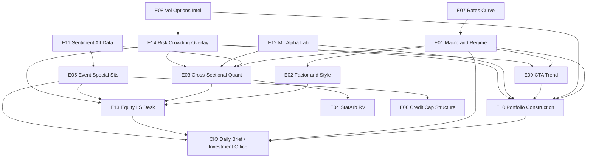
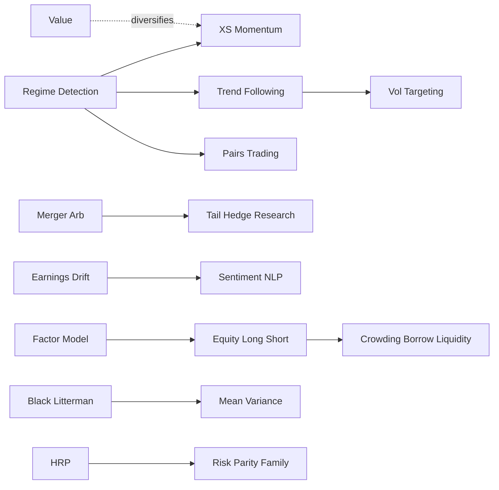

# AGI Investment Office — Institutional Strategy Architecture

**Role:** Chief Investment Officer framework for Agarwal Global Investments (AGI)  
**Purpose:** Map the full institutional strategy universe before building indicators.  
**Constraint:** AGI is a **research / intelligence** platform — not an order-routing or execution desk. Strategies are evaluated for *researchability*, explainability, and India + global coverage — not for automated trading.

> This document is architectural knowledge: it does not recommend buy/sell/execute actions and does not claim proprietary fund formulas.

---

## 0. Design principles (how leading firms think)

| Firm archetype | Primary edge | Implication for AGI |
|----------------|--------------|---------------------|
| Renaissance / Two Sigma / DE Shaw | Statistical edges, capacity-aware, research culture | Need feature stores, regime tags, capacity notes |
| Citadel / Millennium / Point72 | Multi-PM, multi-strategy, risk budgeting | Strategy engines must be modular + risk-comparable |
| Bridgewater | Macro regimes, risk parity, fundamental linkages | Macro transmission + regime engine is core |
| AQR / Man / Winton | Factors, ARP, CTA, transparent research | Factor + trend libraries with academic grounding |
| Jane Street / Citadel Sec / Optiver / IMC / Virtu / Jump / Susquehanna | Market microstructure, options, relative value | Dealer flow, vol surface, ETF/index arb as *research* |
| Brevan / Marshall Wace | Macro / equity L/S discretionary + quant overlay | Hybrid narrative + quant scorecards |

**Rule:** Identify strategy → define alpha source → define data → only then define signals/features.

---

## 1. Hierarchy template (LEVEL 1 → 8)

```
LEVEL 1  Investment Strategy Family
└── LEVEL 2  Strategy Category
    └── LEVEL 3  Individual Strategy
        └── LEVEL 4  Models
            └── LEVEL 5  Signals
                └── LEVEL 6  Features
                    └── LEVEL 7  Inputs
                        └── LEVEL 8  Expected Outputs
```

### Field schema (every Level-3 strategy)

| # | Field |
|---|--------|
| 1 | Strategy Name |
| 2 | Description |
| 3 | Alpha Source |
| 4 | Investment Philosophy |
| 5 | Holding Period |
| 6 | Asset Classes |
| 7 | Markets |
| 8 | Data Requirements |
| 9 | Indicators Used |
| 10 | Mathematical Models |
| 11 | Machine Learning Models |
| 12 | Typical Risk |
| 13 | Typical Return Profile |
| 14 | Regimes — Performs Well |
| 15 | Regimes — Performs Poorly |
| 16 | Similar Real-World Firms |
| 17 | Advantages |
| 18 | Limitations |
| 19 | Computational Complexity |
| 20 | Implementation Difficulty |
| 21 | Explainability Score (1–10) |
| 22 | Confidence Score (research maturity 1–10) |
| 23 | Institutional Relevance (1–10) |
| 24 | Suitable for AGI Investment Office? (Yes / Partial / No + why) |

**Scoring legend**
- Explainability 10 = fully verbalizable to a CIO committee  
- Confidence 10 = decades of published / industry practice  
- Institutional Relevance 10 = core book at top multi-strat / quant funds  
- AGI Suitable: **Yes** = research desk can produce decision-useful intelligence without execution stack; **Partial** = needs licensed data/infra AGI may not yet have; **No** = requires broker, inventory, or live market-making

---

## 2. Master taxonomy (complete L1 → L3)

### L1-A. Discretionary & Fundamental Equity
- **L2-A1 Long/Short Equity**
  - L3: Equity Long/Short, Equity Market Neutral, Long Bias, Short Bias, Sector Specialist L/S, Geographic L/S
- **L2-A2 Style / Factor Fundamental**
  - L3: Value, Growth, Quality, GARP, Dividend/Income, Low Volatility Fundamental, Size/SMID
- **L2-A3 Activist & Special Ownership**
  - L3: Activist Investing, Engagement / Stewardship Overlay

### L1-B. Quantitative Equity & Statistical Arbitrage
- **L2-B1 Cross-Sectional Quant**
  - L3: Cross-Sectional Momentum, Cross-Sectional Mean Reversion, Multi-Factor Equity, Smart Beta Replication, Alternative Risk Premia (equity)
- **L2-B2 Stat Arb / Relative Value Equity**
  - L3: Pairs Trading, Basket Arbitrage, Index Arbitrage (cash-futures), ETF Arbitrage, Sector Relative Value
- **L2-B3 Event Microstructure Equity**
  - L3: Earnings Drift (PEAD), Analyst Revision Drift, Insider / Form filings signals, Short Interest Squeeze Risk

### L1-C. Event Driven
- **L2-C1 Hard Catalyst**
  - L3: Merger Arbitrage, Special Situations, Spin-offs / Stub Trading
- **L2-C2 Credit Event / Distress**
  - L3: Distressed Debt, Stressed Credit, Capital Structure Arbitrage

### L1-D. Relative Value & Arbitrage (Multi-Asset)
- **L2-D1 Fixed Income RV**
  - L3: Fixed Income Arbitrage, Yield Curve Trading, Mortgage / Basis (TBA), Asset-Backed Arbitrage
- **L2-D2 Convertible / Hybrid**
  - L3: Convertible Arbitrage, Volatility of Convertibles
- **L2-D3 Volatility & Correlation**
  - L3: Volatility Arbitrage, Dispersion Trading, Correlation Trading, Variance Risk Premium Harvesting
- **L2-D4 Credit RV**
  - L3: Credit Relative Value, CDS-Bond Basis, Capital Structure Arb (listed)

### L1-E. Global Macro & CTA
- **L2-E1 Discretionary / Systematic Macro**
  - L3: Global Macro (discretionary), Systematic Macro, Theme / Narrative Macro
- **L2-E2 Managed Futures / CTA**
  - L3: Trend Following, CTA Momentum, CTA Carry, Time-Series Mean Reversion (futures)
- **L2-E3 FX Specialties**
  - L3: FX Carry, Currency Momentum, FX Value (PPP / FEER)

### L1-F. Commodities
- **L2-F1 Commodity Trading**
  - L3: Commodity Trend, Commodity Curve / Roll Yield, Commodity Fundamental (inventory/weather)

### L1-G. Options & Market Making Research
- **L2-G1 Options Risk Premia**
  - L3: Gamma Trading (research view), Vega Trading, Delta-Neutral Volatility Harvest, Tail Risk Hedging
- **L2-G2 Dealer / Flow**
  - L3: Dealer Flow Analysis, Options Positioning / GEX research, Volatility Surface Regime

### L1-H. Portfolio Construction & Risk
- **L2-H1 Allocation Frameworks**
  - L3: Mean-Variance Optimisation, Black-Litterman (+ extensions), Hierarchical Risk Parity, Equal Risk Contribution, Risk Parity, Volatility Targeting, Kelly / Fractional Kelly, Adaptive Asset Allocation, Bayesian Allocation
- **L2-H2 Regime & Meta**
  - L3: Regime Detection, Dynamic Risk Budgeting, Drawdown Control Overlays

### L1-I. Credit & Structured
- **L2-I1 Credit Strategies**
  - L3: Long/Short Credit, Credit Momentum, Credit Carry, Structured Credit Research

### L1-J. Alternative Data & ML Alpha
- **L2-J1 Modern Alpha**
  - L3: Sentiment Investing, ESG Quant, Satellite / Alt-Data Alpha, Machine Learning Alpha, Reinforcement Learning Allocation, Graph Neural Network Relationships, NLP Event Extraction

### L1-K. Sector / Thematic Rotation
- **L2-K1 Rotation**
  - L3: Sector Rotation, Factor Timing, Country Rotation, Industry Momentum

---

## 3. Strategy catalog (Level 3 cards)

Notation in cards: **Exp** = Explainability, **Conf** = Confidence, **IR** = Institutional Relevance, **AGI** = Suitable for AGI IO.

---

### 3.A Equity Long/Short Family

#### Equity Long/Short
| Field | Detail |
|-------|--------|
| 1 Name | Equity Long/Short |
| 2 Description | Simultaneously hold long and short equity books to express relative views while partially hedging beta |
| 3 Alpha Source | Security selection, industry timing, factor tilts, catalyst timing |
| 4 Philosophy | Absolute return via long alpha − short alpha − residual beta |
| 5 Holding | Days → quarters (PM-dependent) |
| 6 Assets | Equities, equity swaps, single-stock options overlay |
| 7 Markets | US, Europe, Asia, India (cash + F&O) |
| 8 Data | Prices, fundamentals, estimates, ownership, news, risk model |
| 9 Indicators | Factor exposures, residual returns, earnings revisions, valuation spreads |
| 10 Math | Barra/Axioma-style risk models, residualization, IC analysis |
| 11 ML | Ranking models, NLP on filings/news (optional) |
| 12 Risk | Idiosyncratic + residual beta + short squeeze + borrow |
| 13 Return | Target mid/high single-digit to mid-teens vol-scaled; high dispersion |
| 14 Good regimes | High dispersion, moderate vol, functioning borrow |
| 15 Bad regimes | Factor crashes, crowded shorts, liquidity droughts |
| 16 Firms | Millennium, Point72, Citadel equities, Marshall Wace, Tiger-style pods |
| 17 Advantages | Flexible, intuitive for research desks |
| 18 Limitations | Capacity, borrow, crowding |
| 19 Compute | Medium |
| 20 Difficulty | Medium–High (process + risk) |
| 21–23 | Exp 8 · Conf 9 · IR 10 |
| 24 AGI | **Yes** — core research product (scorecards, books of ideas, risk attribution) |

**L4–L8 sketch**
- L4 Models: residual alpha model, peer-relative valuation, earnings surprise
- L5 Signals: long rank↑ / short rank↓, revision momentum, quality-value composite
- L6 Features: residual return, EV/EBIT z, revision breadth, short interest
- L7 Inputs: OHLC, filings, estimates, float, borrow availability flags
- L8 Outputs: ranked long/short lists, book beta, factor exposures, thesis notes

#### Equity Market Neutral
Same schema; alpha from pure relative ranks; target ~0 beta; holding days–weeks; firms: market-neutral pods, AQR MN books; **AGI: Yes** (relative strength engines).

#### Long Bias / Short Bias
Directional skew on L/S book; long bias common in India cash; **AGI: Yes** as portfolio stance research.

#### Value / Growth / Quality / GARP
| | Value | Growth | Quality | GARP |
|--|-------|--------|---------|------|
| Alpha | Cheap vs intrinsic / peers | Underpriced growth | Persistence of ROE/margins/balance sheet | Growth at reasonable price |
| Philosophy | Mean reversion of multiples | Compounding / expectations | Avoid value traps via quality | Blend |
| Hold | Months–years | Months–years | Years | Months–years |
| Good | Recovery, rising rates for some value | Liquidity + risk-on | Late cycle / drawdowns | Most regimes mildly |
| Bad | Value traps, structural decline | Multiple compression | Quality bubbles | Neither extreme |
| Firms | AQR, many L/S | Growth pods | Quality factor books | Hybrid PMs |
| Exp/Conf/IR | 9/9/9 | 8/8/9 | 9/9/9 | 8/8/8 |
| AGI | Yes | Yes | Yes | Yes |

---

### 3.B Statistical Arbitrage & Relative Value Equity

#### Pairs Trading
| Field | Detail |
|-------|--------|
| Description | Trade spread between cointegrated / high-correlation pair |
| Alpha | Temporary dislocation of relative price |
| Philosophy | Mean-reverting residual of hedged pair |
| Holding | Hours → weeks |
| Data | High-quality prices, corporate actions, borrow |
| Models | Cointegration (Engle–Granger/Johansen), OU calibration, Kalman hedge ratio |
| ML | Regime-aware entry; optional RL for thresholds |
| Risk | Structural break, M&A, borrow |
| Firms | Stat-arb pods at Mill/Citadel/Two Sigma-style desks |
| Exp/Conf/IR | 7/8/8 |
| AGI | **Yes** — India sector pairs research (banks, IT, autos) |

#### Basket / Index / ETF Arbitrage
Alpha from cash–futures–ETF basis and creation/redemption frictions; holding minutes–days; needs microstructure + borrow + creation unit data; firms: Jane Street, Citadel Sec, Optiver, Virtu; **AGI: Partial** (basis & premium/discount research without market-making).

#### Cross-Sectional Momentum
Jegadeesh–Titman style; long winners / short losers; 1–12M formation, 1M hold; equity/futures; fails in sharp reversals; AQR, Man, CTAs (cross-asset); **AGI: Yes**.

#### Cross-Sectional Mean Reversion
Short-horizon reversal (weekly) or residual reversal; crowded; **AGI: Yes** with capacity warnings.

---

### 3.C Event Driven

#### Merger Arbitrage
| Field | Detail |
|-------|--------|
| Description | Long target / short acquirer (stock deals) capturing deal spread |
| Alpha | Deal completion probability mispriced vs spread |
| Holding | Deal timeline (weeks–months) |
| Data | Deal terms, regulatory filings, antitrust, break fees |
| Models | Probability-weighted spread, hazard models |
| Risk | Deal break, collars, material adverse change |
| Firms | Event pods, dedicated merger funds |
| Exp/Conf/IR | 8/8/8 |
| AGI | **Yes** as Deal Tracker intelligence (already AGI-adjacent) |

#### Special Situations / Spin-offs
Corporate actions, stubs, rights; **AGI: Yes** research.

#### Distressed Debt / Stressed Credit
Legal/recovery optionality; needs credit + legal data; **AGI: Partial** (India stressed assets research narrative).

#### Activist
Ownership + engagement; not a quant signal stack; **AGI: Partial** (watchlists of campaigns).

---

### 3.D Fixed Income, Credit, Convertible RV

#### Fixed Income Arbitrage / Yield Curve Trading
Alpha from curve shape, butterfly, swap spreads; models: Nelson–Siegel/Svensson, PCA on curve; firms: relative-value FI desks, Citadel FI, Brevan; **AGI: Partial** (India G-Sec / SDL curve research).

#### Convertible Arbitrage
Long convert / short equity delta; models: convertible pricing (Tsiveriotis–Fernandes etc.); **AGI: Partial**.

#### Capital Structure Arbitrage
Mispricing equity vs credit vs convert; **AGI: Partial**.

#### Credit Strategies (L/S, Carry, Momentum)
Alpha from spread changes and default risk premia; **AGI: Partial** until credit data depth improves.

#### Mortgage / ABS Arbitrage
Prepayment & basis; highly specialized; firms: dedicated structured desks; **AGI: No** near-term (data + expertise).

---

### 3.E Volatility, Dispersion, Correlation

#### Volatility Arbitrage / Variance Risk Premium
Short or long variance vs realized; models: BS, local/stochastic vol, VIX/India VIX futures curve; firms: vol desks, Optiver/IMC research cousins; **AGI: Yes** as vol regime research (not gamma scalping execution).

#### Dispersion Trading
Index vol vs weighted single-name vol; **AGI: Partial** (needs option surfaces).

#### Correlation Trading
Implied vs realized correlation; **AGI: Partial**.

#### Tail Risk Hedging
Long OTM puts / put spreads / vol as insurance; Bridgewater / dedicated tail funds; **AGI: Yes** as overlay research scenarios.

---

### 3.F Global Macro & CTA

#### Global Macro
Cross-asset thematic bets (rates, FX, equity indices, commodities); holding days–months; Bridgewater, Brevan, Caxton-style; **AGI: Yes** — Macro Intelligence + CIO desk.

#### Trend Following / Managed Futures / CTA Momentum
Time-series momentum on futures; models: breakout, MA cross, TSMOM (Moskowitz et al.); Man AHL, Winton, Aspect-style; good in persistent trends; bad in whipsaw; **AGI: Yes** (index/futures research for India + global).

#### CTA Carry / Curve
Roll yield + carry signals; **AGI: Yes** for commodities/FX research.

#### FX Carry / Currency Momentum / FX Value
Classic ARP set; **AGI: Yes** (USDINR + majors research).

---

### 3.G Commodities

#### Commodity Trend / Curve / Fundamental
Inventory, weather, seasonality, curve structure; firms: commodity CTAs, specialist pods; **AGI: Yes** (oil, metals, agri for India inflation transmission).

---

### 3.H Options & Dealer Flow (research view)

#### Gamma / Vega / Delta-Neutral Views
Interpret positioning and vol regimes; **AGI: Yes** as research narratives + risk scenarios; **No** as automated options MM.

#### Dealer Flow / GEX-style Analysis
Estimate dealer hedging pressure; **AGI: Partial** (needs options OI/chain feeds).

---

### 3.I Portfolio Construction & Risk Engines

| Strategy | Alpha/Role | Models | Firms / literature | Exp/Conf/IR | AGI |
|----------|------------|--------|--------------------|-------------|-----|
| Mean-Variance | Efficient frontier | Markowitz | Universal | 8/9/9 | Yes |
| Black-Litterman | Views + equilibrium | BL, Idzorek extensions | Asset managers | 7/8/9 | Yes |
| Risk Parity | Balance risk contributions | ERC, inverse vol | Bridgewater All Weather | 8/8/9 | Yes |
| Hierarchical Risk Parity | Covariance cleaning via hierarchy | Lopez de Prado HRP | Quant allocators | 6/7/8 | Yes |
| Equal Risk Contribution | ERC optimisation | Convex risk budgets | Multi-asset | 7/8/8 | Yes |
| Volatility Targeting | Scale exposure to vol | EWMA/GARCH vol | CTAs, risk overlays | 9/9/9 | Yes |
| Kelly / Fractional Kelly | Growth-optimal sizing | Kelly criterion | Prop / crypto / sports cousins; used carefully in PM | 5/6/6 | Partial (education + research only) |
| Adaptive Asset Allocation | Momentum/vol timing of sleeves | Dual momentum etc. | Retail→institutional hybrids | 7/7/7 | Yes |
| Bayesian Allocation | Posterior returns/cov | Bayesian updating | Quant allocators | 6/7/8 | Yes |

---

### 3.J Regime Detection & Meta

#### Regime Detection
HMM, threshold models, supervised classifiers on macro/vol states; feeds all other engines; **AGI: Yes** (critical dependency).

---

### 3.K Factor Investing / Smart Beta / ARP

#### Factor Investing & Smart Beta
Value, momentum, quality, size, low vol, investment; academic: Fama–French, Carhart, AQR papers; **AGI: Yes**.

#### Alternative Risk Premia
Cross-asset carry, value, momentum, defensive; Man, AQR, banks’ ARP indices; **AGI: Yes** as research taxonomy + India adaptations.

---

### 3.L Sector / Country / Factor Timing

#### Sector Rotation
Business-cycle sleeves (early/mid/late/recession); **AGI: Yes**.

#### Factor Timing
Value vs momentum vs quality regime switches; hard; **AGI: Yes** with low confidence bands.

---

### 3.M Earnings, Insider, Sentiment, ESG

| Strategy | Alpha | Hold | AGI |
|----------|-------|------|-----|
| Earnings Drift (PEAD) | Post-announcement drift | Days–months | Yes |
| Analyst Revision Drift | Estimate changes | Weeks | Yes |
| Insider / filings signals | Informed flow proxies | Weeks | Partial (India disclosures) |
| Sentiment Investing | News/social/NLP | Days–weeks | Yes |
| ESG Quant | E/S/G scores as factors or screens | Months | Partial |

---

### 3.N Machine Learning Alpha Family

| Strategy | Description | Risk | Exp | AGI |
|----------|-------------|------|-----|-----|
| Classical ML Alpha | Tree/linear ensembles on features | Overfit, decay | 4–6 | Partial → Yes with strict governance |
| Deep Learning Alpha | Sequential models on returns/alt data | Opaque, fragile | 2–4 | Partial |
| Reinforcement Learning | Policy for allocation / execution research | Non-stationarity | 2–3 | Partial (research sandbox) |
| Graph Neural Networks | Firm networks, supply chains, co-mentions | Data sparsity | 3–5 | Partial |
| NLP Event Extraction | Parse filings/news to structured events | Language drift | 5–7 | Yes |

Firms experimenting: Two Sigma, Renaissance (legendary research process), DE Shaw, Citadel quant, Jane Street research culture — methods largely unpublished.

---

## 4. Full L4→L8 example (worked): Cross-Sectional Momentum

```
L1 Quant Equity
L2 Cross-Sectional Quant
L3 Cross-Sectional Momentum
L4 Models
   - TSMOM / XSMOM ranking
   - Skip-month momentum (t-12 to t-2)
   - Residual momentum (alpha after FF factors)
L5 Signals
   - Long top-decile 12-1 momentum
   - Short bottom-decile
   - Volatility-scaled weights
L6 Features
   - 12m return excluding last month
   - Idiosyncratic momentum
   - Momentum × quality interaction
L7 Inputs
   - Adjusted total returns, market cap, float, risk-free rate
L8 Outputs
   - Decile portfolios, IC/IR, turnover, capacity estimate, regime tag
```

---

## 5. AGI Research Engines (classification)

Every Level-3 strategy maps to one or more engines. Engines produce **research artifacts**, not orders.

| Engine ID | Name | Owns strategies |
|-----------|------|-----------------|
| **E01** | Macro & Regime Engine | Global Macro, Regime Detection, FX Value/Carry/Momentum (macro lens), Commodity Fundamental, Tail Risk scenarios |
| **E02** | Factor & Style Engine | Value, Growth, Quality, GARP, Factor Investing, Smart Beta, ARP (equity), Factor Timing |
| **E03** | Cross-Sectional Quant Engine | XS Momentum, XS Mean Reversion, Multi-Factor Equity, Sector/Country Rotation |
| **E04** | Stat-Arb & Relative Value Engine | Pairs, Basket, Index/ETF basis research, Sector RV |
| **E05** | Event & Special Situations Engine | Merger Arb, Special Sits, Spin-offs, Earnings Drift, Revisions, Activist watch |
| **E06** | Credit & Capital Structure Engine | Distressed research, Cap structure arb research, Credit L/S & carry |
| **E07** | Rates & Curve Engine | FI Arb research, Yield Curve, Mortgage/ABS (future) |
| **E08** | Volatility & Options Intelligence | Vol arb research, Dispersion/Corr research, Gamma/Vega narratives, Dealer flow |
| **E09** | CTA / Trend Engine | Trend Following, CTA Momentum/Carry, Commodity Trend/Curve |
| **E10** | Portfolio Construction Engine | MVO, BL, HRP, ERC, Risk Parity, Vol Targeting, Kelly (edu), Adaptive AA, Bayesian Allocation |
| **E11** | Sentiment & Alt-Data Engine | Sentiment, ESG Quant, NLP events, satellite/alt-data (future) |
| **E12** | ML Alpha Lab | Classical ML, DL, RL, GNN — sandbox with promotion gates |
| **E13** | Equity Fundamental L/S Desk | Equity L/S, MN, Long/Short Bias, Quality-Value hybrids |
| **E14** | Risk & Crowding Overlay | Crowding, liquidity, borrow, drawdown, stress — applies to all |

### Mapping rules
- A strategy may sit in **primary** + **secondary** engines (e.g. Earnings Drift → E05 primary, E03 secondary).
- **E14** is mandatory overlay for anything promoted to CIO brief.
- **E12** outputs cannot go to client-facing research without E14 + explainability gate (Exp ≥ 6 or human narrative).

---

## 6. Complementarity & mutual exclusivity

### 6.1 Complements (stack / diversify)

| Pair | Why complementary |
|------|-------------------|
| Trend (E09) + Vol Targeting (E10) | Position sizing stabilizes CTA PnL |
| Value (E02) + Momentum (E03) | Classic negative correlation episodes |
| Macro Regime (E01) + Sector Rotation (E03/K) | Regime selects sleeve |
| Merger Arb (E05) + Tail Hedge (E08) | Event risk insurance |
| L/S Fundamental (E13) + Factor Engine (E02) | Residualize PM books |
| Pairs (E04) + Regime (E01) | Disable pairs in break regimes |
| Sentiment (E11) + Earnings Drift (E05) | Soft + hard catalysts |
| Risk Parity (E10) + Macro (E01) | Bridgewater-like stacking |
| Dispersion (E08) + Index Trend (E09) | Vol vs directional diversifiers |

### 6.2 Often mutually exclusive / conflicting

| Conflict | Reason |
|----------|--------|
| Pure Trend vs Short-Horizon Mean Reversion | Opposite signals on same horizon |
| Aggressive Short Bias vs Long Bias CIO stance | Net exposure conflict |
| Short Vol Harvest vs Tail Risk Hedge | Structurally opposite vega |
| High-turnover Stat Arb vs Low-turnover Quality | Capacity & cost conflict in one book |
| Unconstrained ML Alpha vs High Explainability Client Mandate | Governance conflict |
| Concentrated Activist vs Market Neutral | Different utility functions |
| Full Kelly vs Institutional Drawdown Mandates | Risk appetite conflict |

### 6.3 Dependency graph (engines)



### 6.4 Strategy-level dependency (selected)



---

## 7. What AGI should build first (CIO sequencing)

**Phase 1 — Foundations (now)**  
E01 Macro/Regime · E02 Factors · E03 XS Momentum/Reversal · E10 Vol targeting & simple allocation · E14 Risk overlay · E05 Deal/Event (existing Deal Tracker) · Equity technical research (current Nifty/NSE engine) as **input features**, not the strategy itself.

**Phase 2 — Relative value & India depth**  
E04 Pairs/basis · E08 Vol regime (India VIX / derivatives research) · E09 Index/futures trend · E11 Sentiment/NLP.

**Phase 3 — Advanced**  
E06/E07 credit & rates · E12 ML lab with promotion gates · dispersion/dealer flow when options data licensed.

**Explicit non-goals (near term)**  
Live market-making, mortgage/ABS arb execution, ungoverned RL trading, Kelly-full sizing on client capital.

---

## 8. Relationship to current AGI technical scores

Today’s NSE technical labels (Strong Bullish → Strong Bearish) are **Level-5/6 artifacts** inside a broader Momentum / Trend / Mean-Reversion feature layer. They are **not** a complete institutional strategy.

CIO directive: keep technical scores as features feeding E03/E09/E13 — then wrap with regime (E01), factors (E02), risk (E14), and portfolio construction (E10).

---

## 9. Academic & practitioner anchors (non-exhaustive)

- Momentum: Jegadeesh & Titman (1993); Moskowitz, Ooi, Pedersen (TSMOM, 2012)  
- Value/Quality/Factors: Fama–French; Asness/AQR factor literature  
- Risk parity / All Weather: Bridgewater public papers  
- Stat arb / pairs: Vidyamurthy; Gatev, Goetzmann, Rouwenhorst  
- Merger arb: academic event-driven surveys; practitioner deal-spread frameworks  
- Vol risk premium: Carr–Wu; Bakshi–Kapadia  
- Portfolio: Markowitz; Black–Litterman; Lopez de Prado (HRP)  
- CTA: Man AHL / Winton research notes; trend durability literature  

---

## 10. Completeness checklist vs requested list

All requested strategy names are placed in §2 taxonomy and §3 cards or tables: Equity L/S family, MN, biases, Value/Growth/Quality/GARP, Stat arb/pairs/basket/RV, FI/convert/cap structure/vol/dispersion/correlation, merger/event/special sits/distressed/activist, macro/CTA/trend/momentum/mean reversion/XS variants, factors/smart beta/ARP, risk parity/vol targeting/tail hedge, credit/mortgage/ABS, commodity/FX carry & momentum/curve, options gamma/vega/delta-neutral/dealer flow, ETF/index arb, sector rotation, earnings drift/insider/sentiment/ESG, ML/RL/GNN/Bayesian, MVO/BL/HRP/ERC/Kelly/adaptive AA, regime detection.

---

*End of architecture v1 — living document for AGI Investment Office.*
