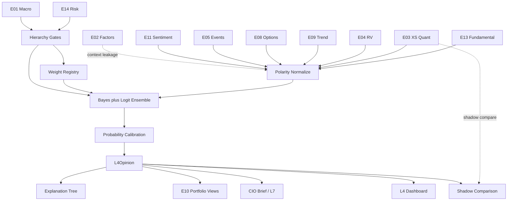

# L4 — Composite Intelligence Engine  
## Institutional Reasoning Layer Specification (AGI Investment Office)

**Document ID:** `L4`  
**Architecture layer:** **E00 §2.5 — Layer 4 Composite Intelligence**  
**Architecture compliance:** **E00 Constitution — Architecture v1.0** (binding)  
**Status:** Implementation-ready Candidate-track specification  
**Version:** 1.0.0  
**Owner:** CIO / Head of Quantitative Research / Head of Research Engineering  
**Lifecycle (E00 §18):** **Experimental → Research (shadow) → Candidate → Production**

### Constitutional role

This is **not** a research alpha engine (E01–E14).  
It is the **brain** of the AGI Investment Office: the single institutional reasoning layer that fuses EngineState evidence into one investment opinion.

**Supremacy:** Subordinate to `E00_AGI_INVESTMENT_OFFICE_CONSTITUTION.md`. On conflict, **E00 wins**.  
Every CIO report, institutional dashboard, composite API, and promoted recommendation **must originate from L4** once Production (E00 §2.5, §2.7, Annex A).

### Hard rules

1. **No indicator calculation** — L4 never computes RSI, PE, GEX, cointegration, etc.  
2. **Consumes EngineState only** — no raw OHLCV, filings blobs, or vendor chains (E00 §2.3–2.5).  
3. **May haircut or gate** — may not invent undocumented alpha (E00 §2.5).  
4. **Research only** — never BUY/SELL/EXECUTE (E00 §1.5).  
5. Obeys **EngineState envelope** for its own output (E00 §5).  
6. Confidence uses **conf-1.0** components + fusion adjustments (E00 §9).  
7. Evidence packs mandatory (E00 §10).  
8. Conflict resolution obeys **authority ladder** (E00 §11).  
9. Dynamic weights via **Weight Registry only** (E00 §12).  
10. **E14 / E01 retain override power**; L4 implements, does not weaken, that ladder.

### Consumed engines (v1.0 exclusive set)

```
E01, E02, E03, E04, E05, E08, E09, E11, E13, E14
```

**Not consumed as peer voters in v1.0:** E06, E07, E10, E12.  
- **E10** is **downstream** (Layer 5) — consumes L4 views.  
- **E12** may enter only after promotion into a registered signal consumed by an allowed engine (E00 §17).  
- **E06/E07** join in Architecture v1.1+ via E00 registry amendment.

---

# 1. Purpose

## 1.1 Mission

Transform multi-engine institutional evidence into a **single, explainable, probability-calibrated investment opinion** for each research object (symbol, sector, index, book theme), suitable for CIO briefs, Composite dashboards, and E10 view construction.

## 1.2 Institutional philosophy

| Principle | Meaning |
|-----------|---------|
| Evidence over narrative | Scores without evidence are rejected |
| Hierarchy over average | Risk and macro can veto fragile bullishness |
| Uncertainty is first-class | Neutral is a valid, often correct, output |
| Attribution always | Every probability shift maps to engines |
| Shadow before crown | L4 does not displace E03 until calibrated superiority (§15) |

Inspired by BlackRock Aladdin risk-aware synthesis, Bridgewater Daily Observations-style structured views, Two Sigma / Citadel research stacks, Bloomberg Intelligence packaging, and Goldman CIO-office discipline — adapted to AGI research-only law.

## 1.3 Decision hierarchy (summary)

See §5 for full justification. Operational order of authority:

```
Risk (E14)
  → Macro (E01)
    → Fundamentals (E13)
      → Cross-Sectional (E03)
        → Relative Value (E04)
          → Trend (E09)
            → Options (E08)
              → Events (E05)
                → Sentiment (E11)
                  → Composite (L4 fusion)
```

**E02** is not a directional voter; it is a **style/residualisation context** and leakage detector.

## 1.4 Evidence-based reasoning

L4 performs:

1. Ingest typed EngineStates  
2. Normalize polarities to a common bullish-relative axis where applicable  
3. Apply hierarchy gates / haircuts  
4. Fuse with Bayesian + ensemble methods under Weight Registry  
5. Calibrate probabilities  
6. Emit explanation tree  

LLM may narrate the explanation tree; **cannot set probabilities alone** (E00 §2.7).

---

# 2. Input Registry

All inputs are **EngineState** (or engine-specific extensions that embed E00 §5 fields). Freshness SLOs align with engine specs; L4 fails soft or hard per §4/§5.

## 2.1 Common consumption fields (every engine)

| Field | Use in L4 |
|-------|-----------|
| `engine`, `version`, `model_version` | Provenance |
| `as_of`, `timestamp_generated` | Freshness |
| `score.normalized_0_100` / signed | Directional/intensity map |
| `confidence.value` + `components` | conf-1.0 |
| `reliability.*` | Sample/accuracy priors |
| `evidence` | Fusion & explanation |
| `explanation.top_drivers`, `falsifiers` | Attribution |
| `warnings`, `stale_inputs` | Haircuts |
| `hash`, `input_hash` | Audit |

## 2.2 Per-engine registry

### E01 — Macro & Regime
| Item | Spec |
|------|------|
| **Consumed objects** | `E01State` — `primary_regime`, axes, `macro_score`, `risk_level`, `size_multiplier`, `vol_target`, `weight_adjustments` |
| **Role** | Hierarchy P1; Weight Registry conditions; size/vol priors passed through metadata |
| **Freshness SLO** | < 6h weekday or `e01_stale` |
| **Reliability** | High on rates/vol axes; medium on slow macro prints |
| **Missing policy** | Confidence ×0.85; no invented regime (E00 §4.3) |

### E02 — Factor & Style
| Item | Spec |
|------|------|
| **Consumed objects** | `E02Exposure` — loadings, dominant_factor, composite style scores |
| **Role** | Style context; leakage check vs E03/E09; not a bull/bear vote |
| **Freshness** | Daily EOD |
| **Missing policy** | Skip leakage check; warn |

### E03 — Cross-Sectional Quant
| Item | Spec |
|------|------|
| **Consumed objects** | `E03Alpha` — `composite_alpha_score`, `agi_tech_score`, probabilities, attribution |
| **Role** | Primary directional equity vote pre-L4-Production; voter in fusion |
| **Freshness** | EOD / flagged intraday tech |
| **Missing policy** | Object may still score from E13/E05; mark incomplete |

### E04 — Stat Arb / RV
| Item | Spec |
|------|------|
| **Consumed objects** | `E04State` for objects linked to symbol (pairs/baskets) |
| **Role** | Market-neutral residual evidence; can oppose directional stack |
| **Freshness** | EOD |
| **Missing policy** | Typical for most names; not required |

### E05 — Event-Driven
| Item | Spec |
|------|------|
| **Consumed objects** | `E05SymbolState` / active `E05EventState` |
| **Role** | Catalyst intensity & signed expected impact; hard events can dominate soft tone |
| **Freshness** | Intraday possible |
| **Missing policy** | Default no active catalyst |

### E08 — Volatility & Options
| Item | Spec |
|------|------|
| **Consumed objects** | `E08State` for symbol/index scope |
| **Role** | Vol regime, EM, dealer/gamma evidence; tail vs short-vol research scores |
| **Freshness** | EOD / intraday index |
| **Missing policy** | Degrade options block; use E01 R_VOL only |

### E09 — CTA / Trend
| Item | Spec |
|------|------|
| **Consumed objects** | `E09State` instrument (index/equity map) |
| **Role** | Medium/long TS trend evidence; conflicts with E04 mean-rev |
| **Freshness** | EOD |
| **Missing policy** | Skip trend voter |

### E11 — Sentiment & Alt-Data
| Item | Spec |
|------|------|
| **Consumed objects** | `E11State` |
| **Role** | Soft voter; capped weight; never overrides hard risk/event |
| **Freshness** | Hours |
| **Missing policy** | Common; no penalty beyond completeness |

### E13 — Equity Fundamental L/S
| Item | Spec |
|------|------|
| **Consumed objects** | `E13Fundamental` — composite, quality/growth/valuation, `side_hint` |
| **Role** | Hierarchy P2 directional fundamental vote |
| **Freshness** | Daily / on filing |
| **Missing policy** | Large gap for many names — completeness↓ |

### E14 — Risk & Crowding
| Item | Spec |
|------|------|
| **Consumed objects** | `E14State` firm + `E14Assessment` for object |
| **Role** | Hierarchy P0 — gate, size_mult, confidence_adjustment, playbook |
| **Freshness** | Firm < 6h; assess on demand |
| **Missing policy** | **Fail closed on Production promote**; Research shadow may continue with `degraded=true` |

---

# 3. Evidence Framework

L4 builds a **unified evidence ledger** from engine packs (E00 §10) plus fusion-generated items.

## 3.1 Buckets

| Bucket | Definition |
|--------|------------|
| **Positive Evidence** | Supports bullish-relative thesis |
| **Negative Evidence** | Supports bearish-relative thesis |
| **Supporting Evidence** | Corroborates another engine’s claim |
| **Contradictory Evidence** | Directly opposes another material claim |
| **Missing Evidence** | Expected engine/feature absent |
| **Unknowns** | Unmeasured material factors |
| **Weak Signals** | Low confidence or low reliability contributors |
| **Strong Signals** | High confidence × material weight × hierarchy-eligible |

## 3.2 Strength classification

\[
\mathrm{strength}_i = c_i \cdot r_i \cdot \tilde\omega_i \cdot m_i
\]
- \(c_i\): engine confidence  
- \(r_i\): reliability  
- \(\tilde\omega_i\): dynamic weight  
- \(m_i\): materiality (|score−50|/50 or impact intensity)

| Class | Rule |
|-------|------|
| Strong | strength ≥ τ_strong (default 0.35) AND hierarchy rank ≤ Fundamentals for directional claims, or any E14/E01 gate claim |
| Weak | strength < τ_weak (default 0.12) |

## 3.3 Ledger item schema

```json
{
  "ledger_id": "uuid",
  "engine": "E03",
  "bucket": "positive|negative|supporting|contradictory|missing|unknown|weak|strong",
  "claim": "string",
  "score_ref": 67.0,
  "confidence": 0.72,
  "strength": 0.41,
  "as_of": "ISO-8601",
  "source_hash": "sha256:..."
}
```

## 3.4 Prohibition

No Production `L4Opinion` may ship with empty evidence when any voter was present. Fabricated LLM evidence is a Release-blocking defect (E00 §10.3).

---

# 4. Conflict Resolution

Implements and specializes E00 §11.

## 4.1 Conflict object

```json
{
  "conflict_id": "uuid",
  "parties": ["E03", "E13", "E01", "E14"],
  "pattern": "tech_bull_fund_bear_macro_risk_off_risk_high",
  "resolution": "haircut|override|block|prefer_neutral|split_horizon",
  "confidence_mult": 0.55,
  "probability_nudge": {"bull": -0.15, "neutral": 0.20, "bear": -0.05},
  "notes": []
}
```

## 4.2 Authority (who overrides whom)

| Priority | Actor | Power |
|----------|-------|-------|
| P0 | **E14** | `block_promotion`, `hard_derisk`, size/confidence hard haircuts |
| P1 | **E01** crisis / `R_STRESS=crisis` | Force defensive posture; disable fragile voters (E04 pairs, E08 short-vol, aggressive E03) |
| P2 | **E13** vs soft engines | Fundamentals outrank E11/E08 sentiment-like confirmation when \|Δ\| large |
| P3 | **E03** vs **E09/E04** | Horizon split; do not delete; MN (E04) can offset directional |
| P4 | **E05** hard catalysts | Can dominate soft E11 tone; still subject to E14 |
| P5 | **E08/E11** | Haircut/confirm only |

## 4.3 Worked example

**Technical Bullish (E03 high) + Fundamental Bearish (E13 low) + Macro Risk Off (E01) + Risk High (E14) + Options Bullish (E08 sentiment) + Sentiment Neutral (E11)**

1. **E14 high/hard** → `confidence_mult ≤ 0.55`; possible `gate=block_promotion` or `research_hedge_only`.  
2. **E01 risk_off** → Weight Registry cuts momentum/trend aggression; raises quality/defensive.  
3. **E03 vs E13** → contradiction ledger; **prefer_neutral** bias: raise \(p_{neutral}\); do not emit high-conviction bull.  
4. **E08 options bullish** → supporting only if not short-gamma accel risk; else contradictory to calm bull.  
5. **E11 neutral** → weak; no rescue of bull case.  
6. **Output:** Neutral or mild bearish-relative opinion, low–moderate confidence, full explanation tree.

## 4.4 When confidence is reduced

- Any P0/P1 active stress  
- Strong contradictions (strength both sides ≥ τ_strong)  
- Stale critical engines (E01/E14/E03)  
- Completeness < 0.5 on hierarchy-critical voters (E14/E01/E13|E03)

## 4.5 When Neutral is preferred

- Bull and bear strong-signal mass within ε (default 0.15) after hierarchy  
- E14 elevated + conflicting E03/E13  
- Missing E13 and E03 disagreement with E09  
- Calibration says overconfident region (reliability diagram)

**Neutral is not failure** — it is an institutional output class.

---

# 5. Decision Hierarchy

## 5.1 Ordered priorities

| Order | Layer | Engine | Justification |
|-------|-------|--------|---------------|
| 1 | **Risk** | E14 | Survival and mandate integrity dominate alpha |
| 2 | **Macro** | E01 | Regime invalidates many micro edges |
| 3 | **Fundamentals** | E13 | Business quality anchors multi-quarter truth |
| 4 | **Cross-Sectional** | E03 | Primary relative equity alpha (current Production spine) |
| 5 | **Relative Value** | E04 | MN residual; hedges directional mistakes |
| 6 | **Trend** | E09 | Medium/long persistence; diversifier |
| 7 | **Options** | E08 | Distribution/dealer evidence; secondary |
| 8 | **Events** | E05 | Catalysts; high impact but episodic |
| 9 | **Sentiment** | E11 | Soft, fast, noisy; capped |
| 10 | **Composite** | L4 | Fusion under rules above — not a new alpha source |

## 5.2 E02 placement

**Context only:** style leakage, residualisation metadata, factor crowding hints into E14 — **no independent bull/bear vote** in v1.0 fusion.

## 5.3 Application mechanics

1. Apply E14 gate → possibly stop promote path.  
2. Apply E01 weight set + disable flags.  
3. Build directional logits from E13, E03, E09, E05 impact, E08 confirmation, E11 soft, E04 offset.  
4. Apply contradiction haircuts.  
5. Calibrate → probabilities.

---

# 6. Weight Engine

## 6.1 Principle (E00 §12)

**Dynamic weights only.** No silent hardcoded Production blend tables in code paths.  
Constants allowed solely for math identities and frozen policy caps.

## 6.2 Weight Registry sets

| weight_set_id | Scope |
|---------------|-------|
| `l4_voters_v1` | Engine voter weights by regime/risk/asset/horizon/liquidity |
| `l4_horizon_v1` | 5d / 21d / 63d opinion heads |
| `l4_calibration_v1` | Probability calibration parameters |

## 6.3 Condition dimensions

Weights depend on:

- **Regime** — E01 primary_regime / axes  
- **Asset** — equity / index / sector  
- **Liquidity** — E14 liquidity_score tier  
- **Holding period** — horizon head  
- **Risk** — E14 playbook / risk_level  
- **Confidence** — per-engine \(c_i\) scales effective weight \(\omega_i c_i\)

## 6.4 Base voter priors (Research defaults registered, not code-hardcoded)

| Voter | Base ω (equity symbol, normal playbook) |
|-------|----------------------------------------|
| E13 | 0.22 |
| E03 | 0.22 |
| E09 | 0.12 |
| E05 | 0.12 |
| E04 | 0.10 |
| E08 | 0.08 |
| E11 | 0.06 |
| E01 | 0.05 (directional macro tilt; mainly conditions) |
| E14 | 0.03 (as continuous risk penalty voter; gates separate) |

E01/E14 primarily act via **conditions and gates**; small direct vote captures risk-on/off tilt.

## 6.5 Example condition multipliers

| Condition | E03 | E09 | E04 | E11 | E13 |
|-----------|-----|-----|-----|-----|-----|
| E01 crisis | ×0.40 | ×0.70 | ×0.30 | ×0.40 | ×1.20 |
| E14 elevated | ×0.75 | ×0.85 | ×0.70 | ×0.60 | ×1.10 |
| E01 expansion risk_on | ×1.15 | ×1.10 | ×0.90 | ×1.05 | ×0.95 |
| Low liquidity tier | ×0.85 | ×0.90 | ×0.50 | ×0.80 | ×1.00 |

After multipliers, renormalise to 1.0 over enabled voters.

---

# 7. Composite Mathematics

## 7.1 Polarity map to bullish-relative score

Map each voter to \(x_i\in[0,1]\):

| Engine | Map |
|--------|-----|
| E03 | `composite_alpha_score/100` |
| E13 | `composite_fundamental_score/100` |
| E09 | `composite_trend_score/100` |
| E05 | `(expected_event_impact+100)/200` |
| E08 | blend: vol-adjusted confirmation — e.g. `options_sentiment_score/100` with accel_risk penalty |
| E11 | `composite_sentiment_score/100` |
| E04 | `0.5 - 0.5*tanh(signed_spread_z/2)` when symbol is rich leg; opposite if cheap leg; 0.5 if no object |
| E01 | map macro_score/100 |
| E14 | `1 - risk_score/100` as “risk-cleared bullish capacity” |

## 7.2 Weighted voting logit

\[
\ell_{\mathrm{bull}}=\sum_i \tilde\omega_i c_i \log\frac{x_i+\varepsilon}{1-x_i+\varepsilon}
\]
\[
\ell_{\mathrm{bear}}=\sum_i \tilde\omega_i c_i \log\frac{1-x_i+\varepsilon}{x_i+\varepsilon}
\]
Neutral logit from contradiction mass \(κ\):  
\[
\ell_{\mathrm{neu}}= \kappa_0 + \kappa_1 \cdot \mathrm{conflict\_mass}
\]

## 7.3 Softmax probabilities

\[
p_k=\frac{e^{\ell_k/T}}{\sum_j e^{\ell_j/T}},\quad k\in\{\mathrm{bull},\mathrm{bear},\mathrm{neu}\}
\]
Temperature \(T\) from calibration set (default 1.0 Research; fit in Candidate).

## 7.4 Bayesian updating (engine order)

Treat hierarchy as sequential Bayes with opinion as Dirichlet(\(α_b,α_r,α_n\)):

1. Prior from E01+E14 defensive Dirichlet  
2. Update with E13 evidence strength  
3. Update with E03  
4. Update with E04/E09/E08/E05/E11 as weaker likelihoods  

Likelihood strengths proportional to \(\tilde\omega_i c_i\).  
Posterior means = probabilities before isotonic calibration.

## 7.5 Stacked ensemble (Candidate+)

Level-0 = voter \(x_i\); Level-1 = calibrated logit model trained walk-forward on forward residual returns labels (21d).  
Champion–challenger vs rule+Bayes blend (E00 §17). Shadow until superiority (§15).

## 7.6 Expected return / risk (research)

\[
\mu_{\mathrm{exp}} = \sigma_{\mathrm{imp}}\big(p_{\mathrm{bull}}-p_{\mathrm{bear}}\big) \cdot g(c)
\]
\(\sigma_{\mathrm{imp}}\) from E08 EM or E14 σ; \(g(c)=c\).  
\[
\sigma_{\mathrm{exp}} = \max(\sigma_{E14},\sigma_{E08},\sigma_{E01\_voltarget})
\]
\[
\mathrm{DD}_{exp,p95} = \mathrm{E14\ expected\_drawdown\ or\ } 2.33\cdot\sigma_{\mathrm{exp}}\sqrt{\Delta}
\]

These are **research expectations**, not promises.

## 7.7 Uncertainty

\[
U = H(p) + (1-c_{\mathrm{fusion}}) + \mathrm{conflict\_mass}
\]
High \(U\) → prefer Neutral / lower size metadata for E10.

## 7.8 Confidence calibration (fusion)

\[
c_{\mathrm{fusion}}= \mathrm{clip}\big(
  \bar c_{\omega}
  \cdot m_{\mathrm{conflict}}
  \cdot m_{\mathrm{fresh}}
  \cdot m_{\mathrm{complete}}
  \cdot m_{E14}
,\,0.05,\,0.95\big)
\]
aligned with conf-1.0 method_version `conf-1.0` + `fusion_mult` metadata.

---

# 8. Institutional Outputs

## 8.1 Canonical `L4Opinion` (E00 §5 envelope + body)

```json
{
  "engine": "L4",
  "version": "1.0.0",
  "model_version": "l4-1.0.0",
  "as_of": "2026-07-25T18:30:00+05:30",
  "universe_id": "NSE_INVESTABLE_L1",
  "symbol": "TCS",
  "object_type": "symbol",
  "score": {
    "raw": null,
    "normalized_0_100": 54.0,
    "normalized_signed": 8.0,
    "unit": "score"
  },
  "confidence": {
    "value": 0.58,
    "components": {},
    "method_version": "conf-1.0",
    "fusion_mult": 0.72
  },
  "reliability": {
    "sample_size": null,
    "historical_accuracy": 0.56,
    "stability": 0.7
  },
  "probabilities": {
    "bullish": 0.34,
    "bearish": 0.28,
    "neutral": 0.38
  },
  "label": "Neutral",
  "expected_return": 0.02,
  "expected_risk": 0.16,
  "expected_volatility": 0.18,
  "expected_drawdown": {"p50": 0.07, "p95": 0.15},
  "dominant_drivers": [
    {"engine": "E13", "contribution": 0.18, "direction": "bullish"},
    {"engine": "E14", "contribution": 0.15, "direction": "risk_penalty"}
  ],
  "contradictions": [],
  "unknowns": [],
  "missing_evidence": [],
  "engine_agreement_matrix": {},
  "hierarchy_trace": [],
  "weight_set_id": "l4_voters_v1",
  "calibration_id": "l4_calibration_v1",
  "e14_gate": "allow_with_haircut",
  "size_metadata": {
    "size_mult_final": 0.75,
    "vol_target": 0.09
  },
  "horizons": {
    "5d": {"probabilities": {}, "confidence": 0.5},
    "21d": {"probabilities": {}, "confidence": 0.58},
    "63d": {"probabilities": {}, "confidence": 0.6}
  },
  "evidence_ledger": [],
  "explanation": {
    "summary": "Neutral institutional view: constructive fundamentals offset by elevated risk and mixed technicals.",
    "why": [],
    "contributing_engines": [],
    "conflicting_engines": [],
    "risks": [],
    "falsifiers": []
  },
  "warnings": [],
  "stale_inputs": [],
  "upstream_hashes": {},
  "input_hash": "sha256:...",
  "hash": "sha256:...",
  "timestamp_generated": "2026-07-25T18:31:00+05:30"
}
```

## 8.2 Label map

| Condition | Label |
|-----------|-------|
| \(p_b\ge0.55\) and \(p_b-p_r\ge0.15\) and \(c\ge0.55\) | Bullish |
| \(p_r\ge0.55\) and \(p_r-p_b\ge0.15\) and \(c\ge0.55\) | Bearish |
| else | Neutral |
| Strong variants | margins ≥0.25 and \(c\ge0.65\) → Strong Bullish/Bearish |

During migration, display labels must not silently replace E03 labels on Production UI (§15).

## 8.3 Signal registry (E00 §7)

| signal_id | Type | Consumers |
|-----------|------|-----------|
| `SIG_L4_BULL_P` | probability | E10, CIO, UI |
| `SIG_L4_BEAR_P` | probability | E10, CIO, UI |
| `SIG_L4_NEU_P` | probability | E10, CIO, UI |
| `SIG_L4_OPINION` | score | E10 views |
| `SIG_L4_CONF` | confidence | All |
| `SIG_L4_MU` | expected return | E10 |
| `SIG_L4_SIGMA` | expected vol | E10/E14 |

---

# 9. Explanation Engine

## 9.1 Requirements

Every `L4Opinion` must answer **WHY**, including:

- Contributing engines (with direction & strength)  
- Conflicting engines  
- Evidence ledger highlights  
- Risk (E14/E01)  
- Confidence decomposition  
- Falsifiers  

## 9.2 Explanation tree

```
Opinion
├── HierarchyGates (E14, E01)
├── Voters
│   ├── E13 ...
│   ├── E03 ...
│   └── ...
├── Conflicts[]
├── EvidenceLedger[]
├── Calibration
└── SizeMetadata
```

## 9.3 Generation

1. Deterministic template from tree (Production-safe).  
2. Optional LLM polish **bound to tree IDs only** — no new claims (E00 §2.7).  
3. Store both `explanation.structured` and `explanation.summary`.

## 9.4 CIO sentence contract

Minimum:  
“View {label} (p_bull={..}, p_bear={..}, p_neu={..}, c={..}). Drivers: …. Conflicts: …. Risks: …. Falsifiers: ….”

---

# 10. API Contracts

E00 §14. Base: `/api/intelligence/l4/`.

### 10.1 `GET /api/intelligence/l4/opinion/{symbol}?horizon=21d`
Current `L4Opinion`.

### 10.2 `GET /api/intelligence/l4/universe?universe_id=&limit=`
Ranked opinions.

### 10.3 `GET /api/intelligence/l4/agreement/{symbol}`
Engine agreement matrix.

### 10.4 `GET /api/intelligence/l4/evidence/{symbol}`
Full evidence ledger.

### 10.5 `GET /api/intelligence/l4/explanation/{symbol}`
Structured + summary.

### 10.6 `GET /api/intelligence/l4/timeline/{symbol}?limit=`
Historical opinions.

### 10.7 `POST /api/intelligence/l4/run`
Service-role: `{ "symbols": [], "universe_id", "reason" }`.

### 10.8 `GET /api/intelligence/l4/calibration/metrics`

### 10.9 Errors
`L4_E14_MISSING`, `L4_INSUFFICIENT_VOTERS`, `L4_STALE`, `L4_SCHEMA`, `L4_INTERNAL`.

---

# 11. Database Design

E00 §13.

```sql
CREATE TABLE l4_opinion (
  id uuid PRIMARY KEY DEFAULT gen_random_uuid(),
  as_of timestamptz NOT NULL,
  object_type text NOT NULL,
  object_id text NOT NULL,
  universe_id text,
  payload jsonb NOT NULL,
  label text NOT NULL,
  p_bull double precision NOT NULL,
  p_bear double precision NOT NULL,
  p_neu double precision NOT NULL,
  confidence double precision NOT NULL,
  model_version text NOT NULL,
  weight_set_id text NOT NULL,
  calibration_id text NOT NULL,
  input_hash text NOT NULL,
  created_at timestamptz DEFAULT now(),
  UNIQUE (as_of, object_type, object_id, model_version)
);
CREATE INDEX l4_opinion_score_idx ON l4_opinion (as_of, p_bull DESC);

CREATE TABLE l4_opinion_current (
  object_type text NOT NULL,
  object_id text NOT NULL,
  as_of timestamptz NOT NULL,
  payload jsonb NOT NULL,
  updated_at timestamptz NOT NULL DEFAULT now(),
  PRIMARY KEY (object_type, object_id)
);

CREATE TABLE l4_evidence_ledger (
  as_of timestamptz NOT NULL,
  object_type text NOT NULL,
  object_id text NOT NULL,
  ledger jsonb NOT NULL,
  PRIMARY KEY (as_of, object_type, object_id)
);

CREATE TABLE l4_agreement_matrix (
  as_of timestamptz NOT NULL,
  object_id text NOT NULL,
  matrix jsonb NOT NULL,
  PRIMARY KEY (as_of, object_id)
);

CREATE TABLE l4_calibration_params (
  calibration_id text PRIMARY KEY,
  params jsonb NOT NULL,
  metrics jsonb,
  is_active boolean DEFAULT false,
  created_at timestamptz DEFAULT now()
);

CREATE TABLE l4_validation_runs (
  id uuid PRIMARY KEY DEFAULT gen_random_uuid(),
  started_at timestamptz,
  finished_at timestamptz,
  method text,
  metrics jsonb,
  model_version text
);

CREATE TABLE l4_migration_flags (
  key text PRIMARY KEY,
  enabled boolean NOT NULL DEFAULT false,
  updated_at timestamptz DEFAULT now()
);

CREATE TABLE l4_shadow_comparison (
  as_of date NOT NULL,
  object_id text NOT NULL,
  e03_score double precision,
  l4_p_bull double precision,
  forward_ret_21d double precision,
  meta jsonb DEFAULT '{}',
  PRIMARY KEY (as_of, object_id)
);
```

RLS: service write; research read. Cache current 60–120s.

---

# 12. Backend Services

```
intelligence-engine/app/engines/l4/
  __init__.py
  config.py
  pipeline.py
  schema.py
  ingest/
    e01.py
    e02.py
    e03.py
    e04.py
    e05.py
    e08.py
    e09.py
    e11.py
    e13.py
    e14.py
  normalize/
    polarity.py
    freshness.py
  hierarchy/
    gates.py
    authority.py
  weights/
    registry_client.py
  fusion/
    bayes.py
    logits.py
    ensemble.py
    uncertainty.py
  calibrate/
    temperature.py
    isotonic.py
  explain/
    tree.py
    templates.py
    llm_polish.py
  persistence.py
  validation/
    calibration.py
    shadow.py
    walk_forward.py
```

Node: `server/services/l4CompositeService.js`.  
CIO agents (`cio_synthesizer`, etc.) **must read L4** once Candidate UI enabled — not scrape engines ad hoc.

## 12.1 Pipeline

1. Fetch EngineStates for object (parallel)  
2. Freshness/completeness audit  
3. Hierarchy gates (E14→E01)  
4. Polarity normalize  
5. Weight Registry resolve  
6. Evidence ledger + conflicts  
7. Bayes + logit fusion (+ ensemble if active)  
8. Calibrate probabilities  
9. Expected µ/σ/DD metadata  
10. Explanation tree (+ optional LLM polish)  
11. Persist opinion/current  
12. Metrics: latency, conflict_rate, gate_rate, stale_ratio

## 12.2 Cron (IST)

| Job | Schedule | Action |
|-----|----------|--------|
| `l4_after_engines` | 18:40 IST weekdays | Universe batch after E03/E13/E14 |
| `l4_intraday_watch` | 12:50 IST | Re-run names with new E05/E11/E08 |
| `l4_shadow_seal` | 19:10 IST | Write shadow comparison vs E03 |
| `l4_weekly_calibrate` | Sunday 20:00 | Reliability diagrams |
| `l4_monthly_validate` | 6th 22:00 | Walk-forward / Brier |

**Order:** after specialised engines; before E10 (E00 §3.2 / §4).

## 12.3 SLOs

| SLO | Target |
|-----|--------|
| Single-symbol fusion | p95 < 2s warm cache of engine states |
| Universe Nifty 500 batch | p95 < 20 min |
| Production promote without E14 | 0 |
| Explanation present | 100% |

---

# 13. Frontend

E00 §15. Route: `/beta/l4-intelligence` (flagged). Watermark **SHADOW** until Production.

## Widgets

1. **Institutional Opinion Hero** — label, p_bull/p_bear/p_neu gauges, confidence, as-of  
2. **Evidence Tree** — expandable ledger  
3. **Probability Gauges** — horizon tabs 5d/21d/63d  
4. **Engine Agreement Matrix** — voters × bullish-relative heat  
5. **Confidence Decomposition** — fusion_mult components  
6. **Hierarchy Trace** — gates fired  
7. **Dominant Drivers / Conflicts**  
8. **Risk & Size Metadata** — E14/E01  
9. **Historical Decision Timeline**  
10. **Shadow vs E03 Panel** (internal) — IC comparison  

No BUY/SELL. No raw engine formulas. E03 Production pages remain default until §15 promotion.

---

# 14. Validation

E00 §16 + probabilistic scoring standards.

| Method | Metric |
|--------|--------|
| Historical replay | Crisis/neutralisation behaviour |
| Calibration | Reliability diagrams per bucket |
| Brier score | \(p\) vs outcome labels |
| ROC / PR | Bull vs not; Bear vs not |
| Precision / Recall | At decision thresholds |
| Walk-forward | Expanding calibrate; embargo |
| Shadow superiority | L4 vs E03 on net Rank IC / Brier (§15 gate) |

**Labels:** forward residual returns vs sector (21d primary) → bull if >+ε, bear if <−ε, else neutral.

**Targets (Candidate→Production):**

| Metric | Target |
|--------|--------|
| Brier (21d, OOS) | ≤ E03 one-vs-rest proxy and ≤ 0.25 absolute aspirational |
| Calibration slope | Document; investigate if ≪1 |
| Shadow IC | Non-inferior for 40 sessions; superior on agreed KPI for promotion |
| Gate integrity | 100% E14 presence on promote |

---

# 15. Migration

## 15.1 Principle

**Current production keeps E03 primary.**  
L4 **shadow-runs** until statistical superiority and CIO/Risk approval.

```
E03 Production UI / scores --------→ unchanged default
L4 shadow opinions ----------------→ internal + Beta flag
Promotion ------------------------→ L4 originates CIO/composite surfaces
```

## 15.2 Flags

```json
{
  "l4_api_enabled": false,
  "l4_shadow_write": true,
  "l4_ui_tab": false,
  "l4_cio_brief_primary": false,
  "l4_e10_views": false,
  "l4_replace_e03_display": false,
  "l4_llm_polish": false
}
```

## 15.3 P0–P4

| Phase | Scope | Exit criteria |
|-------|-------|---------------|
| **P0** | Ingest E01/E03/E13/E14; hierarchy gates; naive weighted vote; `L4Opinion` schema; shadow_write | Envelope+explanation; E03 UI unchanged |
| **P1** | Add E05/E09/E08/E11/E04 voters; Weight Registry; conflict ledger | Agreement matrix API |
| **P2** | Bayes fusion + temperature calibration; Beta UI shadow; Brier dashboard | Reliability diagrams live |
| **P3** | Stacked ensemble challenger; E10 views flag; CIO brief optional dual | Shadow KPI ≥40 sessions |
| **P4** | Production promotion if superiority + approvals; `l4_cio_brief_primary=true` | E00 §17/§18 vote; E03 remains available as voter/engine |

## 15.4 Promotion criteria (mandatory)

1. Walk-forward Brier/IC non-inferior to E03-as-classifier baseline  
2. Calibration review signed by Quant  
3. E14 gate integrity audits green  
4. CIO + Risk written approval  
5. Feature flags flipped with rollback plan  

## 15.5 Rollback

Disable L4 primary flags → E03 display/CIO path restored instantly; L4 tables retained.

---

# 16. Implementation phases (checklist)

| Phase | Deliverables |
|-------|--------------|
| P0 | ingest adapters E01/E03/E13/E14, gates, logit vote, schema, shadow job |
| P1 | remaining voters, weights client, evidence ledger, APIs |
| P2 | Bayes+calibration, UI, validation metrics |
| P3 | ensemble shadow, E10 adapter, CIO dual brief |
| P4 | Production cutover pack |

---

# 17. Non-functional requirements

- Deterministic given upstream hashes + weight_set_id + calibration_id + model_version  
- Full audit of upstream_hashes  
- No raw market I/O in `app/engines/l4`  
- Secrets none beyond service auth  
- LLM polish optional and claim-bound  
- Research disclaimers on all opinions  

---

# 18. Acceptance tests (sample)

1. Missing E14 on promote path → `L4_E14_MISSING` / gate block.  
2. E03 bull + E13 bear + E14 elevated → label Neutral or Bearish-leaning; confidence_mult < 0.7; contradictions non-empty.  
3. E01 crisis → E04/E11 weights reduced per registry fixture.  
4. L4 code path performs zero OHLCV fetches (static architecture test / import ban).  
5. Explanation contains contributing and conflicting engines.  
6. Shadow job writes `l4_shadow_comparison` without changing E03 tables.  
7. Flags `l4_replace_e03_display=false` → Production research pages still show E03 primary.  
8. Warm GET opinion < 300ms when current cache warm.

---

# 19. Dependency graph



---

# 20. E00 compliance matrix

| E00 | L4 |
|-----|-----|
| §1 | Research-only institutional opinion |
| §2.5 | This document is the normative L4 spec |
| §3–§4 | Runs after engines; before E10 |
| §5–§10 | Opinion envelope, signals, conf-1.0, evidence ledger |
| §11 | Authority ladder implemented |
| §12 | Weight Registry dynamic voters |
| §13–§15 | DB/API/UI standards |
| §16–§18 | Calibration validation, ML ensemble gates, lifecycle |
| §19–§20 | Package layout; shadow-then-promote evolution |

---

# 21. Normative downstream contract

After Production promotion:

| Surface | Must read |
|---------|-----------|
| CIO daily brief composite view | `L4Opinion` |
| `/beta` institutional opinion | `L4Opinion` |
| E10 Black–Litterman equity views | `SIG_L4_*` / µ from L4 |
| Publishing opinion strip | `L4Opinion` explanation |

Engine detail pages remain available for drill-down; they must not silently publish a competing “final” opinion.

---

*End of L4 Composite Intelligence Engine Specification v1.0 — governed by E00 Architecture v1.0*
