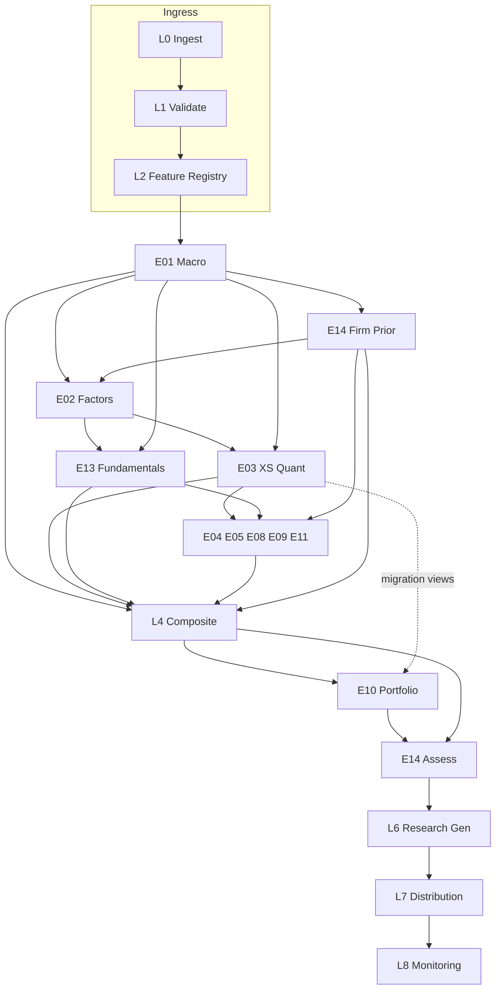

# ORCH — Engine Interaction & Orchestration Control Plane  
## Permanent Operating System Specification for the AGI Investment Office

**Document ID:** `ORCH`  
**Filename:** `L5_ENGINE_INTERACTION_ORCHESTRATION.md`  
**Architecture compliance:** **E00 Constitution — Architecture v1.0** (binding)  
**Status:** Implementation-ready Production-track control-plane specification  
**Version:** 1.0.0  
**Owner:** Head of Research Engineering / Head of Quantitative Research / CIO  
**Audience:** Platform engineers, engine owners, SRE, Quant Ops, CIO Desk  
**Lifecycle (E00 §18):** **Candidate → Production** (orchestration is infrastructure; engines retain their own lifecycle)

### Naming clarification (mandatory)

| Term | Meaning |
|------|---------|
| **This document (`ORCH`)** | Cross-cutting **control plane** that schedules, wires, caches, observes, and fails engines across **E00 Layers 0–8** |
| **E00 Layer 5** | **Portfolio Construction** (`E10`) — a research product layer, **not** this document |
| Filename prefix `L5_` | CIO document series label for the orchestration OS deliverable; **does not** redefine E00 Layer 5 |

**Supremacy:** Subordinate to `E00_AGI_INVESTMENT_OFFICE_CONSTITUTION.md`. On conflict, **E00 wins**.  
Frozen engine specs (E01–E05, E08–E11, E13–E14, L4) remain **immutable** under E00 governance; this document **orchestrates** them — it does not amend their research logic.

### Nature of this document

Inspired by Bloomberg Terminal session orchestration, BlackRock Aladdin workflow control, Google Borg / Kubernetes control planes, Linux schedulers, Airflow DAGs, and Ray distributed execution — adapted to AGI’s research-only Investment Office.

**ORCH never:**

- calculates indicators, alphas, regimes, or portfolios;  
- invents scores, weights, or evidence;  
- places orders or emits BUY/SELL/EXECUTE (E00 §1.5).

**ORCH always:**

- defines execution graphs, dependency contracts, and failure policy;  
- propagates `EngineState`, confidence, and evidence without semantic mutation;  
- enforces E00 authority ladder ordering for promotion paths;  
- provides the only legal integration surface for future engines.

### Hard rules

1. **No research logic** — research formulas live only in engine / L4 / E10 specs.  
2. **Typed contracts only** — engines exchange §5 `EngineState` envelopes and registered features/signals (E00 §5–§7).  
3. **Lower layers never depend on upper layers** (E00 §2).  
4. **E14 fail-closed on promotion** — ORCH must enforce; may not soft-skip (E00 §4.3, §11).  
5. **Weight Registry only** for Production blends — ORCH loads versions; never hardcodes voter weights (E00 §12).  
6. **Deterministic replay** — given identical upstream hashes + registry versions + scheduler config, outputs must match.  
7. **Every new engine** must ship an ORCH integration annex (dependency matrix row + DAG node + failure policy) before Candidate.

---

# 1. Execution Graph

## 1.1 Canonical layered flow (E00 §2, §4.1)

```
Layer 0  External Market / Macro / Fundamental / Alt / Calendar Data
   ↓
Layer 1  Data Validation
   ↓
Layer 2  Feature Registry (PIT persist + online vectors)
   ↓
Layer 3  Research Engines (E01–E14 domain / specialised / risk)
   ↓
Layer 4  Composite Intelligence (L4)
   ↓
Layer 5  Portfolio Construction (E10)
   ↓
Layer 6  Research Generator (briefs, notes, Story/Beta packages)
   ↓
Layer 7  Distribution (APIs, website, publishing)
   ↓
Layer 8  Monitoring (SLO seal, parity, incidents)
```

## 1.2 Exact daily research-cycle order (IST)

ORCH implements E00 §3.2 as a **versioned DAG** (`orch_dag_version`). Node IDs are permanent.

| Step | Node ID | Layer | Component | Mode | Blocking for Production promote? |
|------|---------|-------|-----------|------|----------------------------------|
| 0 | `L0_INGEST` | L0 | Vendor/exchange pulls | Parallel by dataset family | Yes for critical datasets of that path |
| 1 | `L1_VALIDATE` | L1 | Schema/range/PIT/universe checks | Parallel per dataset; barrier before L2 | **Yes** on critical fail |
| 2 | `L2_FEATURES` | L2 | Feature build + registry write | Parallel by feature family; barrier before engines | **Yes** for required features |
| 3 | `E01_MACRO` | L3 | Macro & Regime | Sequential critical path | Soft-block: degraded path allowed with warnings |
| 4 | `E14_FIRM_PRIOR` | L3/X | Risk firm prior | After E01 | Soft for research GET; **hard** later on promote |
| 5 | `E02_FACTOR` | L3 | Factor & Style | After E01 (+ E14 prior preferred) | Soft if E02 Candidate-off |
| 6a | `E03_XS` | L3 | Cross-Sectional Quant | After E01; E02 optional residual | **Yes** for E03-primary Production UI |
| 6b | `E13_FUND` | L3 | Equity Fundamental L/S | Parallel with E03 after E01/E02 context | Soft until Candidate UI on |
| 7 | `SPEC_PARALLEL` | L3 | E04, E05, E08, E09, E11 (+ E06/E07/E12 when registered) | **Parallel** fan-out | Soft; missing specialised → L4 missing_evidence |
| 8 | `L4_COMPOSITE` | L4 | Composite Intelligence | Barrier after required voters | Soft while shadow; hard when L4 primary |
| 9 | `E10_PORTFOLIO` | L5 | Portfolio Construction | After L4 views (or E03 views during migration) | Soft until E10 UI on; E14 still hard on publish |
| 10 | `E14_ASSESS` | L3/X | Object/book risk assessment | After E10 / promoted objects | **Fail closed** |
| 11 | `L6_RESEARCH_GEN` | L6 | Narratives / CIO brief assembly | After gates | Soft LLM; structured scores required |
| 12 | `L7_DISTRIBUTE` | L7 | Cache warm, API publish, newsletter hooks | After L6 seal or score-only seal | Path-dependent |
| 13 | `L8_MONITOR_SEAL` | L8 | Freshness, IC, gate counts, SLO | Always terminal | N/A (observability) |

## 1.3 Critical path (weekday EOD Production)

```
L0 → L1 → L2 → E01 → E14_FIRM_PRIOR → E02 → E03 → L4(shadow|primary) → E10? → E14_ASSESS → L6 → L7 → L8
```

Parallel off-critical work (must not delay E03 Production seal beyond latency budget):

- E13, E04, E05, E08, E09, E11, E12 shadow  
- Deep E14 Monte Carlo / Sunday stress packs  
- Historical replay / calibration jobs  

## 1.4 Mermaid — control-plane DAG



## 1.5 Run kinds

| `run_kind` | Purpose | Scheduler |
|------------|---------|-----------|
| `daily_eod` | Canonical research cycle | Primary cron |
| `intraday_refresh` | Partial nodes (E01 axes, E05 calendar, E08 chains, E14 vol) | Timed slots |
| `on_demand_symbol` | Single-symbol recompute with cache reuse | API / worker |
| `shadow` | L4 / E12 / challenger models | Parallel DAG overlay |
| `replay` | Historical as-of reconstruction | Batch / backtest cluster |
| `canary` | New `orch_dag_version` or engine version | Percentage routing |

---

# 2. Engine Dependency Matrix

Conventions:

- **Blocking** = downstream Production node may not mark `status=success` without it (or must enter documented degraded mode).  
- **Optional** = absence → warning + confidence haircut; never silent zero (E00 §5.2).  
- Latencies are **p95 wall-clock** for the node’s scheduled job on Production hardware class (§10).  
- Cache TTLs are **serving** TTLs; recompute cadence is **refresh**.

## 2.1 Platform nodes

| Node | Consumes | Produces | Blocking deps | Optional deps | Refresh | Latency budget | Cache | Failure behaviour |
|------|----------|----------|---------------|---------------|---------|----------------|-------|-------------------|
| `L0_INGEST` | Vendor APIs, files, CMS | Raw staged datasets + `pulled_at` | Credentials, network allowlist | Secondary vendors | Per dataset schedule | Dataset-specific (macro 120s; OHLCV batch 15m) | Raw object store / DB stage 24h–7d | Retry; quarantine dataset; do not fabricate |
| `L1_VALIDATE` | Staged raw | `ValidationReport`, clean rows | Schema registry | Soft anomaly models | On each ingest | p95 < 60s / dataset | Report 7d | **Fail closed** critical; warn non-critical |
| `L2_FEATURES` | Clean rows, Feature Registry defs | PIT feature snapshots, online vectors | L1 pass for required inputs | Optional feature families | Align to consumers | p95 < 10m full univ.; < 2s online vector | Feature store + Redis/online 5–60m | Skip feature; mark missing; block consumers that require it |

## 2.2 Research engines (Architecture v1.0 frozen set)

| Engine | Consumes | Produces | Blocking deps | Optional deps | Refresh | Latency budget | Cache strategy | Failure behaviour |
|--------|----------|----------|---------------|---------------|---------|----------------|----------------|-------------------|
| **E01** | L2 macro/market features | `E01State`, axes, size/vol priors, weight hints | L2 macro critical set | Secondary prints | EOD + event; weekday stale>6h flagged | Job p95 < 45s; GET < 300ms warm | Current row overwrite; API max-age 60s | Degraded regime; `e01_missing`; downstream ×0.85 conf — **no invented regime** |
| **E14** prior | E01, L2 micro/liquidity, E02 when ready | `E14State` firm prior | E01 preferred | E02 loadings | EOD + midday + stress Sunday | Firm p95 < 60s | Current + history; API 60s | Degraded risk; promote path still needs assess later |
| **E02** | L2 price+fund, E01 timing, E14 crowd opt. | `E02Exposure`, style scores | L2 prices | E01, E14 | EOD | Job p95 < 8m univ. | Snapshot by as_of; API 60–120s | Skip residualisation; E03 warns `e02_missing` |
| **E03** | L2 OHLCV, E01, E02 opt., breadth | `E03Alpha`, rankings, `SM_AGI_TECH` | L2 OHLCV + E01 soft | E02, E05, E11 | EOD (+ tech worker compat) | Job p95 < 20m Nifty500-class; GET < 300ms | Score tables + 60s API | Keep last good Production scores; mark stale; **do not invent ranks** |
| **E13** | PIT fundamentals, E01 soft, E02 context | `E13Fundamental` | L2 fundamentals PIT | E01, E02, E05 revisions | EOD + estimates refresh | Job p95 < 15m | as_of snapshots; API 60–120s | Suppress name; missing_evidence |
| **E04** | Prices, E01 break flag, E02/E03 residuals | `E04State` pairs/baskets | L2 prices; E01 for crisis disable | E02, E03 | EOD + weekly graph | Job p95 < 12m | Pair graph weekly; scores daily | Disable MR in break; empty book OK |
| **E05** | Calendars, filings, E01/E13/E14 refs | `E05State` event assessments | L1 calendar validation | E08 EM, E11 NLP | Calendar 3×/day; EOD scores | Assess p95 < 5s cached; batch < 10m | Event window cache; API 60s | Skip event; decay prior scores |
| **E08** | Options chains/IV, E01 vol, L2 prices | `E08State` vol/GEX/EM intel | L1 chain validation for Production modules | E03, E05, E09 | Intraday slots + EOD | Chain job p95 < 8m; GET < 300ms | Chain snapshots; API 60s | Module flag off; no silent GEX |
| **E09** | Prices, E01, E08 vol opt. | `E09State` TSMOM/panel | L2 prices | E08, E03 demean | EOD | Job p95 < 10m | Panel + instrument; API 60–120s | Flat trend; low confidence |
| **E11** | News/alt vendors, maps, E01 soft | `E11State` soft voters | Entity resolution for covered names | E05, E13 | Intraday news + EOD | Batch p95 < 15m | Doc embeddings TTL; API 60s | Soft voter absent; L4 weight→0 |
| **L4** | EngineStates: E01,E02,E03,E04,E05,E08,E09,E11,E13,E14 | `L4Opinion`, SIG_L4_*, explanation tree | E14 on promote; E03 during migration shadow compare | Specialised voters | After voter barrier EOD | Fusion p95 < 2s warm states; GET < 300ms | Opinion current 60–120s; shadow tables | Shadow continues degraded; primary promote fail-closed on E14 |
| **E10** | L4 (or E03 migration views), E01–E14 constraints | `E10Portfolio`, rebalance preview | **E14 assess path**; views source | Specialised sleeves | EOD + vol-target midday | Optimiser p95 < 120s / book | Portfolio snapshots; API 60s | Infeasible → constrained repair ≤3; never drop E14 hard caps |
| **E14** assess | Candidate objects/books + firm prior | `E14Assessment` | Object payload + risk features | E05/E08 enrichments | On each promote + EOD books | Assess p95 < 5s | Assessment by object hash | **`block_promotion`** / fail closed |

## 2.3 Non-voter / future registry engines (orchestration hooks only)

| Engine | ORCH status v1.0 | Notes |
|--------|------------------|-------|
| E06 Credit | Registered Experimental; DAG slot in `SPEC_PARALLEL` when spec promoted | No Production edges until Candidate |
| E07 Rates | May feed L2 curve features before E01; engine voter optional | Curve features ≠ E07State voter |
| E12 ML Lab | Shadow subgraph only; never L7 Production without E00 §17 | Async promotion pipeline |

## 2.4 Consumer matrix (who reads whom)

| Producer → | E01 | E02 | E03 | E04 | E05 | E08 | E09 | E11 | E13 | E14 | L4 | E10 | L6/L7 |
|------------|-----|-----|-----|-----|-----|-----|-----|-----|-----|-----|----|-----|------|
| E01 | — | B | B | B | O | B | B | O | O | B | B | B | O |
| E02 | | — | O | O | | O | | | O | O | O | O | |
| E03 | | | — | O | O | O | O | | O | O | B | B* | B* |
| E04 | | | | — | | | | | | O | O | O | |
| E05 | | | | | — | O | | O | O | O | O | O | O |
| E08 | | | | | O | — | O | | | O | O | O | |
| E09 | | | | | | O | — | | | O | O | O | |
| E11 | | | O | | O | | | — | O | | O | | |
| E13 | | | O | | O | | | | — | O | B | O | O |
| E14 | | O | O | O | O | O | O | O | O | — | B | B | B |
| L4 | | | | | | | | | | O | — | B† | B† |
| E10 | | | | | | | | | | B | | — | O |

Legend: **B** = blocking/required on Production path; **O** = optional; **B\*** = until L4 promotion; **B†** = after L4 promotion flags.

---

# 3. Execution Scheduler

## 3.1 Scheduler architecture

| Component | Responsibility |
|-----------|----------------|
| `OrchScheduler` | Owns cron, DAG versions, run ledger |
| `OrchExecutor` | Launches node workers (process/container) |
| `OrchBarrier` | Join points (e.g., before L4) |
| `OrchRetry` | Retry/timeout/dead-letter |
| `OrchLock` | Per-node distributed locks (no double EOD write) |
| `OrchRouter` | Canary % / shadow forks |

Implementation targets (v1.0):

- **In-process / worker queue** on Render (or equivalent) with Postgres run ledger — Airflow-class semantics without requiring Airflow.  
- DAG defined as data in `orch_dag_nodes` / `orch_dag_edges` (not scattered cron strings only).  
- Cron entrypoints are thin wrappers that call `OrchScheduler.trigger(run_kind, dag_version)`.

## 3.2 Sequential vs parallel

| Pattern | Nodes | Rule |
|---------|-------|------|
| Strict sequential | L0→L1→L2; E01→E14prior; L4→E10→E14assess→L6→L7→L8 | Edge `dependency_type=blocking` |
| Parallel fan-out | E03 ∥ E13; SPEC engines; L0 dataset families | Same barrier_id; max concurrency §10 |
| Pipeline overlap | E05 calendar refresh during E03 | Allowed if no write conflict on shared tables |
| Shadow fork | L4 shadow, E12 | Read-only vs Production tables; write shadow schema only |

## 3.3 Critical path management

1. Scheduler computes longest blocking path ETA each morning.  
2. If `ETA > daily_eod_budget` (default: seal by **19:30 IST**), ORCH:  
   - sheds non-critical specialised engines to `best_effort`;  
   - keeps E01, E14prior, E03, E14assess, L7 score paths.  
3. L4 shadow may finish after seal; must not block E03 Production UI.  
4. E10 may run `deferred` if flag `e10_ui_enabled=false`.

## 3.4 Async jobs

| Job class | Examples | Delivery |
|-----------|----------|----------|
| Scheduled batch | `daily_eod`, Sunday stress | Cron → queue |
| Event-triggered | Macro print, earnings filing | Webhook/poll → debounce 60–300s → partial DAG |
| On-demand | Symbol drill-down | API → priority queue `interactive` |
| Replay | Walk-forward validation | Batch queue `replay` with PIT store |
| Calibration | L4 temperature, Weight Registry proposals | Offline; promote via registry, not hot path |

## 3.5 Retry logic

| Failure class | Retries | Backoff | Jitter | Dead-letter |
|---------------|---------|---------|--------|-------------|
| Transient network / 429 / 5xx | 5 | Exponential 2s→64s | ±20% | Yes after 5 |
| L1 non-critical validation | 0 (quarantine rows) | — | — | Quarantine table |
| L1 critical validation | 0 | — | — | Block consumers |
| Engine exception (bug) | 1 immediate + 1 delayed 5m | Fixed | — | Page on-call if Production node |
| Timeout (§3.7) | 1 | — | — | Mark `timed_out`; apply failure behaviour |
| Idempotent write conflict | 3 | 1s | Yes | Lock owner wins |

**Idempotency key:** `run_id + node_id + as_of + input_hash`.

## 3.6 Failure handling (scheduler-level)

| Event | Scheduler action |
|-------|------------------|
| Node `failed` blocking | Stop dependents; continue parallel unrelated; emit `orch_pipeline_blocked` |
| Node `degraded` | Continue with warnings propagated in `stale_inputs` / `warnings` |
| Node `skipped` (flag off) | Treat as optional absence |
| Partial universe failure | Persist successes; failed symbols listed in node report; do not blank whole universe |
| Double-schedule | Lock prevents; second run no-ops with `already_running` |

## 3.7 Timeouts (defaults)

| Node | Soft timeout | Hard kill |
|------|--------------|-----------|
| L0 single dataset | 3m | 5m |
| L1 dataset | 2m | 4m |
| L2 feature family | 15m | 20m |
| E01 | 90s | 3m |
| E14 firm | 120s | 4m |
| E02 | 12m | 18m |
| E03 | 30m | 40m |
| E13 | 20m | 30m |
| Each SPEC engine | 15m | 25m |
| L4 full universe | 20m | 30m |
| E10 per book | 3m | 5m |
| E14 assess object | 15s | 30s |
| L6 brief | 120s | 180s |
| Interactive symbol path | 8s budget end-to-end warm | 15s |

## 3.8 Canonical cron map (IST, weekdays unless noted)

| Job ID | Time | Nodes |
|--------|------|-------|
| `orch_premarket_ingest` | 07:00 | L0/L1 macro+calendar subset |
| `orch_features_morning` | 07:45 | L2 incremental |
| `orch_e01_morning` | 08:15 | E01 |
| `orch_e14_prior` | 08:25 | E14 firm prior |
| `orch_core_engines` | 08:35 | E02 → E03 ∥ E13 |
| `orch_spec_parallel` | 09:10 | E04/E05/E08/E09/E11 |
| `orch_l4_shadow` | 09:40 | L4 shadow |
| `e05_calendar_refresh` | 07:30, 12:00, 16:00 | E05 calendar |
| `e08_chain_intraday` | 10:00, 12:30, 14:30 | E08 (when licensed) |
| `e14_midday` | 12:45 | E14 refresh |
| `e10_vol_target_refresh` | 12:45 | E10 scale if enabled |
| `orch_eod_seal` | 18:00–19:10 | Full critical path + E14 assess + L6/L7 |
| `l4_shadow_seal` | 19:10 | Shadow comparison |
| `orch_monitor_seal` | 19:20 | L8 |
| `e14_stress_sunday` | Sun 18:30 | Stress pack |
| `e04_graph_weekly` | Sun 16:00 | Pair graph |

Exact minute drifts allowed ±5m; `orch_dag_version` records the schedule hash.

---

# 4. Feature Registry Orchestration

## 4.1 Sharing model

Features are **shared memory of the Investment Office**, not engine-private caches.

```
L1 clean data → Feature Builder (owner package) → Registry validate → PIT store → Online store → Engines
```

Rules (E00 §6):

1. Unregistered features **cannot** feed Production engines.  
2. Engines read features by **stable `feature_id`**, never by ad-hoc column aliases.  
3. ORCH triggers feature builds from DAG edges `L2_* → engine`; engines do not scrape raw L0.

## 4.2 Ownership

| Field | Rule |
|-------|------|
| `owner_engine` | Engine or platform team accountable for definition + builder |
| `owner_package` | Code path `app/features/...` or `server/features/...` |
| `consumers[]` | Declared in registry; ORCH uses for impact analysis |
| `breaking_change_policy` | Requires registry minor/major bump + consumer ACK |

An engine may **own** features it alone writes; it may **consume** others read-only. Dual-writers for one `feature_id` are forbidden.

## 4.3 Versioning

| Version field | Meaning |
|---------------|---------|
| `feature_version` | Semver of definition (formula/units) |
| `builder_version` | Code that materialises values |
| `as_of` | PIT timestamp/date of economic reality |
| `available_at` | Wall time feature became readable (anti-lookahead) |

ORCH records `(feature_id, feature_version, as_of, input_hash)` in every engine `input_hash` preimage.

## 4.4 Caching

| Tier | Store | TTL / eviction | Use |
|------|-------|----------------|-----|
| PIT warehouse | Postgres / columnar | Permanent for Production as_of | Replay, audit |
| Online vector | Redis / in-proc | 5–60m aligned to refresh | Hot engine runs |
| API response | CDN/app cache | 60–120s | GET endpoints |
| Negative cache | Redis | 30–120s | Missing vendor keys |

Cache keys: `feat:{feature_id}:{feature_version}:{as_of}:{universe_id}`.

## 4.5 Expiry & staleness

| Class | Stale after (weekday) | ORCH action |
|-------|-----------------------|-------------|
| Daily OHLCV features | next session open without refresh | Mark stale; E03 may use prior close with warning |
| Macro prints | per series calendar + 6h E01 rule | E01 degraded |
| Estimates | 24h without refresh job success | E13/E05 soft |
| Options chain | 1 trading session for EOD modules; intraday slots for live modules | E08 module disable |
| Sentiment docs | 6–24h by source | E11 weight→0 if batch failed |

## 4.6 Point-in-time guarantees

ORCH enforces:

1. Builders accept `as_of` and must filter inputs with `available_at ≤ as_of`.  
2. Replay runs set `pit_mode=true` and disable “latest” caches.  
3. Corporate actions applied via registered adjustment tables only.  
4. Universe membership as-of join — no survivorship silent expansion.  
5. CI contract tests fail on future-dated joins (E00 §16).

Violation → node `failed` for Production replay; Research may continue with `pit_violation` warning only in Experimental sandboxes (never Candidate/Production).

---

# 5. Confidence Propagation

## 5.1 Law

All confidence uses **`conf-1.0`** (E00 §9). ORCH does not invent a second methodology.  
ORCH **transports, multiplies, and audits** confidence; engines compute component fields.

## 5.2 Flow

```
Feature coverage (C_complete)
   → Engine local confidence (E0X.confidence.value)
      → Hierarchy gates (E14/E01 multipliers)
         → L4 fusion confidence (fusion_mult × voter conf)
            → E10 view confidence / position sizing haircuts
               → L6/L7 display confidence + disclaimers
```

## 5.3 Between engines

| Edge | Propagation rule |
|------|------------------|
| E01 → E02/E03/E09/E10 | Consumers read `E01.confidence`; if E01 stale/missing apply E00 ×0.85 path; never rewrite E01 |
| E02 → E03 residual | If E02 conf < 0.4, E03 disables residual path and records warning |
| E14 → all promote edges | `confidence_adjustment` multiplies consumer display/fusion conf; `block_promotion` stops publish |
| Specialised → L4 | Voter weight × voter confidence; absent voter ⇒ weight 0, not conf fabrication |
| L4 → E10 | E10 view variance / trust ∝ `L4Opinion.confidence`; low conf → smaller active risk |

## 5.4 Through Composite Intelligence

ORCH guarantees L4 inputs include, for each voter:

- `confidence.value` + `components`  
- `reliability.*`  
- `stale_inputs[]`  
- `version` / `model_version` / `hash`

L4 computes fusion confidence per its frozen spec; ORCH stores `confidence_decomposition` for UI/API.

## 5.5 Into Portfolio Construction

| Input | E10 use |
|-------|---------|
| L4 (or E03) conf | Scales view strength / active share budget |
| E14 size_mult × E01 size_mult | Hard research size envelope |
| E14 confidence_adjustment | Final recommended weight haircut |
| Missing conf | Treat as 0.0 for that view; do not assume 1.0 |

ORCH rejects E10 publish packages lacking confidence fields on every active view line.

## 5.6 Audit fields (mandatory on run report)

```json
{
  "confidence_trace": [
    {"engine": "E03", "value": 0.72, "hash": "sha256:..."},
    {"engine": "E14", "confidence_adjustment": 0.80, "hash": "sha256:..."},
    {"engine": "L4", "value": 0.61, "fusion_mult": 0.85, "hash": "sha256:..."}
  ]
}
```

---

# 6. Evidence Propagation

## 6.1 Evidence graph

ORCH maintains a directed **evidence graph** for each research object (`symbol` / `book_id` / `theme_id`):

```
feature evidence → engine evidence packs → L4 ledger (contributing/conflicting) → E10 rationale refs → L6 citations
```

Nodes are evidence items (E00 §10.2). Edges are `supports | contradicts | derives_from | missing_for`.

## 6.2 Inheritance

| Downstream | Inheritance rule |
|------------|------------------|
| L4 | **References** upstream evidence by `(engine, evidence_id, hash)` — may summarise, must not drop contradictions |
| E10 | Inherits L4 dominant drivers + E14 risks; links view_id → evidence ids |
| L6 | May narrate only claim-bound evidence ids; LLM cannot add scores |
| L7 | Displays packs; cannot strip falsifiers on Production |

## 6.3 Conflicts

ORCH does not resolve research conflicts (L4 / E00 §11 do). ORCH **ensures**:

1. Conflict objects persist in `orch_evidence_conflicts` when L4 emits them.  
2. Promotion path surfaces unresolved P0 conflicts (E14/E01) to L6/L7.  
3. Conflict storage is immutable for a given `opinion_hash`.

## 6.4 Decay

| Evidence class | Decay policy |
|----------------|--------------|
| Price/technical observations | Superseded each EOD by new as_of |
| Event evidence (E05) | Explicit half-life per event type in E05; ORCH schedules decay job |
| Macro prints | Valid until next print or E01 refresh |
| Sentiment spikes | Fast decay per E11; ORCH TTL on online store |
| Risk assessments | Valid for object_hash; recompute on holdings/vol change |

Decayed evidence is **retained historically** with `valid_to`; not deleted.

---

# 7. State Management

## 7.1 EngineState lifecycle

```
requested → running → succeeded | degraded | failed | timed_out | skipped
                ↓
         persisted EngineState
                ↓
         current pointer updated (if success/degraded policy allows)
                ↓
         invalidated (new as_of / upstream hash change)
                ↓
         archived / replayable
```

## 7.2 Persistence

| Store | Contents |
|-------|----------|
| `orch_runs` | run_id, run_kind, dag_version, started/finished, status |
| `orch_run_nodes` | node status, latency_ms, input_hash, output_hash, retries |
| `e0x_*_current` / history tables | Engine-owned per specs |
| `orch_snapshots` | Bundled hashes of all engine currents for a seal |
| Object storage (optional) | Large evidence blobs |

**Current pointer rule:** only `succeeded` or explicitly allowed `degraded` states move `current`. `failed` never overwrites last good Production current.

## 7.3 Invalidation

Triggers:

1. New successful upstream `hash` for a blocking dependency  
2. Feature version bump affecting consumers  
3. Manual `orch invalidate --engine E0X --as_of ...`  
4. Weight Registry / calibration version change for L4/E10  
5. Corporate action backfill for affected symbols  

Invalidation marks current as `stale` and enqueues recompute; serving layer may continue last good until recompute succeeds (except E14 promote path, which re-assesses).

## 7.4 Recomputation

| Mode | Scope | Use |
|------|-------|-----|
| Incremental | Changed symbols/features | Intraday / event |
| Full universe | Entire node | EOD |
| Partial DAG | From node N downward | After hot-fix |
| Targeted promote | Object assess only | CIO publish |

Recompute must pass the same contract validators as scheduled runs.

## 7.5 Snapshots

At `orch_eod_seal` success, ORCH writes:

```json
{
  "snapshot_id": "snap_2026-07-24_eod",
  "as_of": "2026-07-24",
  "dag_version": "orch-1.0.0",
  "engine_hashes": {"E01": "sha256:...", "E03": "sha256:...", "L4": "sha256:...", "E14": "sha256:..."},
  "weight_set_id": "...",
  "feature_registry_version": "...",
  "created_at": "ISO-8601"
}
```

Snapshots are the unit of **historical decision timeline** and CIO audit.

## 7.6 Historical replay

Replay API/job:

1. Load snapshot or as_of PIT features.  
2. Disable online “latest” caches.  
3. Execute DAG subset with `run_kind=replay`.  
4. Write to `*_replay` schema — never clobber Production current.  
5. Emit parity report vs stored hashes when replaying an existing snapshot (bit-stable within float tolerances defined per engine).

---

# 8. Cross-Engine Contracts

## 8.1 Shared schemas

| Contract | Owner doc | ORCH enforcement |
|----------|-----------|------------------|
| `EngineState` envelope | E00 §5 | JSON Schema validation on every node output |
| Feature registry record | E00 §6 | Block Production read if unregistered |
| Signal registry record | E00 §7 | L4/E10 only consume registered signals |
| Score standard | E00 §8 | Polarity + scale checks |
| conf-1.0 | E00 §9 | method_version required |
| Evidence pack | E00 §10 | Required on promote |
| Conflict object | E00 §11 | Persisted when emitted |
| Weight Registry | E00 §12 | L4/E03/E10 blend loads by id |
| API error envelope | E00 §14 | Gateway standard |

## 8.2 Versioning

| Artifact | Versioning |
|----------|------------|
| Engine output | `version` + `model_version` semver |
| ORCH DAG | `orch_dag_version` |
| JSON Schemas | `contracts/v{N}/...` |
| API | `/api/v1/...` (E00 §14.2) |

**Compatibility principle:** additive fields OK; renames/removals require deprecation window.

## 8.3 Compatibility matrix

ORCH maintains `orch_contract_compat`:

| Producer version | Consumer min version | Status |
|------------------|----------------------|--------|
| E01 1.x | E03 ≥1.0, L4 ≥1.0, E14 ≥1.0 | Supported |
| L4 1.x | E10 ≥1.0 | Supported after flag |
| Engine major N+1 | Consumers until ACK | Canary only |

CI runs contract tests across the matrix each PR touching schemas.

## 8.4 Deprecation

1. Mark field/engine output `Deprecated` in registry with `retire_after` date.  
2. Dual-write shim period (E00 §5.3).  
3. Consumers migrate.  
4. ORCH removes edge after retire date; reads fail loud.

## 8.5 Migration (platform)

| Migration | ORCH role |
|-----------|-----------|
| E03 dual-write tech score | Preserve legacy worker until parity gate |
| L4 shadow → primary | Flags in §13; dual opinion write |
| E10 views source E03→L4 | Router flag `e10_views_source` |
| Schema v1→v2 | Expand/contract with backfill jobs |

No migration may silently change Production scores without snapshot + parity report.

---

# 9. Failure Modes

## 9.1 Catalogue

| Mode | Detection | ORCH behaviour | User-visible |
|------|-----------|----------------|--------------|
| Engine unavailable | Heartbeat / job fail | Dependents degraded or blocked per matrix | Warning banner; last good if allowed |
| Partial data | L1 failed_rows > threshold | Per-symbol skip; coverage conf↓ | missing_data evidence |
| Delayed data | `pulled_at` SLA breach | Stale flags; E01 6h rule | stale_inputs |
| Conflicting evidence | L4 conflict ledger | Persist; do not auto-delete | Contradictions panel |
| Missing evidence | Required pack empty on promote | **Fail closed** promote | Gate reason |
| Stale cache | TTL / as_of mismatch | Invalidate + refresh; serve last good with Age header | Confidence↓ |
| DAG deadlock | Barrier timeout | Fail barrier; page | Pipeline blocked |
| Poison message | Repeat crash same input_hash | Dead-letter; quarantine symbol | Symbol suppressed |
| Clock / PIT skew | available_at > as_of | Fail node in Production | Error code `ORCH_PIT_VIOLATION` |

## 9.2 Precedence under multi-failure

1. Safety gates (E14 block, PIT violation)  
2. Data validity (L1 critical)  
3. Critical path engines (E01/E03)  
4. Specialised voters  
5. Narratives (L6 LLM)

## 9.3 Error codes (gateway)

| Code | HTTP | Meaning |
|------|------|---------|
| `ORCH_DEPENDENCY_MISSING` | 503 | Blocking upstream absent |
| `ORCH_E14_REQUIRED` | 409 | Promote without E14 assess |
| `ORCH_STALE_SNAPSHOT` | 409 | Client wrote against stale snapshot |
| `ORCH_PIT_VIOLATION` | 422 | Look-ahead detected |
| `ORCH_TIMEOUT` | 504 | Node hard timeout |
| `ORCH_CONTRACT_INVALID` | 422 | Schema fail |
| `ORCH_DAG_BLOCKED` | 503 | Critical path blocked |
| `ORCH_FLAG_OFF` | 404/403 | Feature flag disables surface |

---

# 10. Performance Targets

## 10.1 Latency

| Path | Target |
|------|--------|
| Warm GET engine/L4 current | p95 < 300ms |
| Interactive symbol recompute (cached features) | p95 < 8s |
| Weekday EOD critical path seal | ≤ 19:30 IST complete |
| E14 assess | p95 < 5s |
| L4 fusion per symbol warm | p95 < 2s |
| Full Nifty500-class E03 job | p95 < 20m |

## 10.2 Memory / CPU

| Node class | Memory guidance | CPU |
|------------|-----------------|-----|
| API gateway | 512MB–1GB | Burst OK |
| E01/E14 firm | 1–2GB | 1–2 cores |
| E03/E02/E13 universe | 4–8GB | 2–4 cores |
| E04 graph / E08 chains | 4–8GB | 2–4 cores |
| E10 optimiser | 2–4GB | 2 cores |
| Replay workers | 8GB+ | Autoscaled |

## 10.3 Storage

| Data | Retention |
|------|-----------|
| Engine current | 1 row semantics + history ≥ 5y for Production |
| Snapshots | ≥ 5y |
| Raw L0 stage | ≥ 90d (re-pullable vendors may be shorter if regenerable) |
| Online cache | Ephemeral |
| Run logs | ≥ 1y |

## 10.4 Scaling & concurrency

| Parameter | v1.0 default |
|-----------|--------------|
| Max parallel SPEC engines | 5 |
| Max symbol shards per engine | 8 |
| Interactive queue concurrency | 20 |
| Replay concurrency | 4 |
| DB pool per worker | 5–10 |

Horizontal scale: shard by `symbol` / `sector` for embarrassingly parallel engines (E03, E13, E09 instrument loop).  
Stateful barriers (L4 universe reduce) remain single-writer per `as_of`.

---

# 11. Observability

## 11.1 Metrics (mandatory)

| Metric | Labels |
|--------|--------|
| `orch_node_latency_ms` | node_id, status, run_kind |
| `orch_node_retries` | node_id |
| `orch_pipeline_blocked` | reason |
| `orch_stale_ratio` | engine |
| `orch_gate_counts` | gate_type (E14 block, conf haircut) |
| `orch_cache_hit_ratio` | tier |
| `orch_contract_fail_total` | engine, schema |
| `orch_dag_eta_seconds` | run_kind |
| `orch_shadow_divergence` | l4_vs_e03 |

## 11.2 Tracing

- W3C `traceparent` propagated across Node gateway → Python workers.  
- Span per DAG node; attributes: `as_of`, `input_hash`, `universe_id`.  
- L4 fusion span includes voter hash set.

## 11.3 Logging

Structured JSON:

`timestamp, level, run_id, node_id, engine, symbol?, code, message, hashes`

PII prohibited. Vendor payloads not logged in full — hashes + counts only.

## 11.4 Audit

Immutable audit events for:

- snapshot seal  
- promotion flag flips  
- Weight Registry activation  
- E14 block decisions  
- manual invalidations  

## 11.5 Health

| Endpoint | Meaning |
|----------|---------|
| `GET /api/v1/orch/health` | Process up |
| `GET /api/v1/orch/ready` | DB + queue ready |
| `GET /api/v1/orch/status` | Per-node last success, stale_ratio, DAG state |

L8 consumes these for SLO burn alerts.

---

# 12. Testing

## 12.1 Integration tests

- Full DAG on fixture universe (tiny) → snapshot hashes stable.  
- E03 Production path succeeds with L4 shadow flag on.  
- E10 publish fails without E14 assess.

## 12.2 Contract tests

- Every engine golden JSON validates `EngineState` schema.  
- Feature IDs referenced by engines exist in registry fixtures.  
- Polarity / score scale assertions.

## 12.3 Replay tests

- Fixed `as_of` fixture → bit-stable scores within tolerances.  
- PIT violation fixtures must fail closed.

## 12.4 Chaos tests

| Fault | Expectation |
|-------|-------------|
| Kill E11 worker | L4 continues; E11 weight 0; warning |
| Freeze E01 >6h | Degraded multipliers; no crash |
| Empty E14 on promote | HTTP 409 `ORCH_E14_REQUIRED` |
| Cache poison wrong as_of | Invalidate; recompute; no silent serve |
| Duplicate cron | One winner via lock |

## 12.5 Gate for ORCH Production

CI green on contract + integration + replay smoke; chaos suite nightly.

---

# 13. Deployment

## 13.1 Feature flags (canonical)

```json
{
  "orch_dag_version": "orch-1.0.0",
  "e03_production_primary": true,
  "l4_shadow_write": true,
  "l4_cio_brief_primary": false,
  "l4_replace_e03_display": false,
  "e10_ui_enabled": false,
  "e10_views_source": "e03",
  "e14_enforce_promote": true,
  "spec_engines_enabled": {
    "E04": false,
    "E05": true,
    "E08": false,
    "E09": false,
    "E11": false,
    "E13": false
  },
  "orch_canary_percent": 0,
  "orch_llm_polish": false
}
```

Flags stored in `orch_feature_flags` with audit trail. Engines may ship additional flags; ORCH is source of truth for **cross-engine** routing.

## 13.2 Canary

1. Deploy new worker version tagged `canary`.  
2. Route `orch_canary_percent` of `on_demand_symbol` (not full EOD) to canary.  
3. Compare contract fail rate, latency, score drift vs control.  
4. Promote to 100% or rollback.

EOD canary uses parallel shadow write, not split-brain Production currents.

## 13.3 Shadow mode

| Component | Shadow behaviour |
|-----------|------------------|
| L4 | Writes shadow opinions; E03 UI unchanged |
| E12 | Lab tables only |
| New ORCH DAG | `run_kind=shadow` clone of edges |

Shadow divergence metrics feed promotion reviews (L4 §15).

## 13.4 Rollback

1. Flip flags to last known good (`e03_production_primary=true`, L4 primary false).  
2. Pin `orch_dag_version` previous.  
3. Redeploy prior worker image.  
4. Invalidate only if bad writes corrupted currents — else keep last good snapshot.

Rollback RTO target: **15 minutes** for flag-only; **60 minutes** for image pin.

## 13.5 Promotion

Promotion of routing (not research math) requires:

1. Contract + integration CI green  
2. Shadow KPI window (per L4/E00) when changing opinion primary  
3. Risk + Engineering ACK for `e14_enforce_promote` changes (default stays true)  
4. Snapshot before/after  

Research engine lifecycle promotions remain governed by E00 §17–§18; ORCH only flips edges/flags after those votes.

---

# 14. Future Distributed Architecture

Architecture v1.0 runs as a **modular monolith + worker queue**. The following is the normative evolution path without changing research contracts.

## 14.1 Microservices

| Service | Extract when |
|---------|--------------|
| `orch-scheduler` | Multi-region / multi-repo engines |
| `feature-service` | Shared feature SLA across teams |
| `engine-e0x` | Independent scale / ownership |
| `l4-fusion` | Heavy calibration / GPU ensemble |
| `e10-optimiser` | CPU-heavy books |
| `gateway` | Already Node edge |

Service boundaries **must** preserve EngineState schemas; no bespoke per-service score semantics.

## 14.2 Event bus

Domain events (async, at-least-once, idempotent consumers):

- `features.built`  
- `engine.state.updated`  
- `l4.opinion.updated`  
- `e14.assessment.completed`  
- `orch.snapshot.sealed`  
- `orch.pipeline.blocked`  

Bus does not replace the DAG for critical ordering; it notifies and triggers incremental refresh.

## 14.3 Message queues

| Queue | Work |
|-------|------|
| `orch.interactive` | Symbol GET recompute |
| `orch.batch` | EOD nodes |
| `orch.replay` | PIT jobs |
| `orch.deadletter` | Poison |

Exactly-once is not assumed; idempotency keys are mandatory.

## 14.4 GPU workers

Attached for:

- E12 model training/inference lab  
- Optional L4 stacked ensemble challenger  
- NLP pipelines inside E11  

GPU workers are **never** on the E14 fail-closed critical path unless their output is already materialised as EngineState with CPU fallback.

## 14.5 ML cluster

Ray / equivalent cluster may execute:

- sharded E03/E12 feature transforms  
- hyperparameter sweeps (Experimental only)  
- distributed replay  

Promotion of any ML artifact into Production still requires E00 §17 gates; ORCH only schedules.

## 14.6 Compatibility promise

Distributed evolution **must not** change:

- E00 layer dependency direction  
- Engine research formulas  
- Authority ladder  
- Research-only boundary  

It may change transport (RPC/queue), packing, and scale.

---

# 15. API Contracts (Orchestration surface)

## 15.1 Endpoints

| Method | Path | Purpose |
|--------|------|---------|
| GET | `/api/v1/orch/status` | DAG + node health |
| GET | `/api/v1/orch/runs/{run_id}` | Run ledger |
| GET | `/api/v1/orch/snapshots/{snapshot_id}` | Seal bundle |
| GET | `/api/v1/orch/snapshots/current` | Latest EOD seal |
| POST | `/api/v1/orch/runs` | Trigger run (`run_kind`, optional node set) — auth admin |
| POST | `/api/v1/orch/invalidate` | Invalidate engine/feature scope — auth admin |
| GET | `/api/v1/orch/dependencies` | Machine-readable dependency matrix |
| GET | `/api/v1/orch/flags` | Effective feature flags |
| GET | `/api/v1/orch/evidence/{object_id}` | Evidence graph view |
| GET | `/api/v1/orch/confidence/{object_id}` | Confidence trace |

All obey E00 §14 (versioning, errors, auth, cache).

## 15.2 Trigger body (admin)

```json
{
  "run_kind": "on_demand_symbol",
  "dag_version": "orch-1.0.0",
  "as_of": "2026-07-24",
  "symbols": ["RELIANCE"],
  "nodes": ["E03_XS", "L4_COMPOSITE", "E14_ASSESS"],
  "pit_mode": false,
  "reason": "cio_desk_refresh"
}
```

---

# 16. Database (Orchestration)

```sql
CREATE TABLE orch_dag_versions (
  dag_version TEXT PRIMARY KEY,
  spec_hash TEXT NOT NULL,
  created_at TIMESTAMPTZ NOT NULL,
  is_active BOOLEAN NOT NULL DEFAULT FALSE
);

CREATE TABLE orch_dag_nodes (
  dag_version TEXT NOT NULL REFERENCES orch_dag_versions(dag_version),
  node_id TEXT NOT NULL,
  layer TEXT NOT NULL,
  engine TEXT,
  max_concurrency INT NOT NULL DEFAULT 1,
  soft_timeout_ms INT NOT NULL,
  hard_timeout_ms INT NOT NULL,
  PRIMARY KEY (dag_version, node_id)
);

CREATE TABLE orch_dag_edges (
  dag_version TEXT NOT NULL,
  parent_node TEXT NOT NULL,
  child_node TEXT NOT NULL,
  dependency_type TEXT NOT NULL CHECK (dependency_type IN ('blocking','optional','shadow')),
  PRIMARY KEY (dag_version, parent_node, child_node)
);

CREATE TABLE orch_runs (
  run_id UUID PRIMARY KEY,
  run_kind TEXT NOT NULL,
  dag_version TEXT NOT NULL,
  as_of DATE,
  status TEXT NOT NULL,
  started_at TIMESTAMPTZ NOT NULL,
  finished_at TIMESTAMPTZ,
  trigger_reason TEXT,
  parent_run_id UUID
);

CREATE TABLE orch_run_nodes (
  run_id UUID NOT NULL REFERENCES orch_runs(run_id),
  node_id TEXT NOT NULL,
  status TEXT NOT NULL,
  attempt INT NOT NULL,
  latency_ms INT,
  input_hash TEXT,
  output_hash TEXT,
  error_code TEXT,
  detail JSONB,
  PRIMARY KEY (run_id, node_id, attempt)
);

CREATE TABLE orch_snapshots (
  snapshot_id TEXT PRIMARY KEY,
  as_of DATE NOT NULL,
  dag_version TEXT NOT NULL,
  engine_hashes JSONB NOT NULL,
  weight_set_id TEXT,
  feature_registry_version TEXT,
  created_at TIMESTAMPTZ NOT NULL
);

CREATE TABLE orch_feature_flags (
  flag_key TEXT PRIMARY KEY,
  flag_value JSONB NOT NULL,
  updated_at TIMESTAMPTZ NOT NULL,
  updated_by TEXT NOT NULL
);

CREATE TABLE orch_feature_flag_audit (
  id BIGSERIAL PRIMARY KEY,
  flag_key TEXT NOT NULL,
  old_value JSONB,
  new_value JSONB NOT NULL,
  changed_at TIMESTAMPTZ NOT NULL,
  changed_by TEXT NOT NULL
);

CREATE TABLE orch_evidence_edges (
  object_id TEXT NOT NULL,
  from_engine TEXT NOT NULL,
  from_evidence_id TEXT NOT NULL,
  to_engine TEXT NOT NULL,
  to_evidence_id TEXT NOT NULL,
  relation TEXT NOT NULL,
  opinion_hash TEXT,
  as_of DATE NOT NULL,
  PRIMARY KEY (object_id, from_engine, from_evidence_id, to_engine, to_evidence_id, relation, as_of)
);

CREATE TABLE orch_contract_compat (
  producer TEXT NOT NULL,
  producer_version TEXT NOT NULL,
  consumer TEXT NOT NULL,
  consumer_min_version TEXT NOT NULL,
  status TEXT NOT NULL,
  PRIMARY KEY (producer, producer_version, consumer)
);
```

RLS: service role write; authenticated research read for status/snapshots; admin for triggers/flags.

---

# 17. Backend package layout

```
intelligence-engine/app/orch/
  __init__.py
  scheduler.py          # cron triggers, DAG load
  executor.py           # run nodes, locks, retries
  barriers.py
  invalidate.py
  snapshots.py
  flags.py
  evidence_graph.py
  confidence_trace.py
  contracts/
    engine_state.schema.json
  dag/
    orch-1.0.0.json
  metrics.py
  api.py                # FastAPI router mounted at /orch

server/services/orchGateway.js   # Node proxy to engine orch API
server/jobs/orchTrigger.js       # Render cron entrypoints
```

**Import ban:** `app/orch` must not import indicator math from engines; it may import only client interfaces (`engines.e01.client.get_state`, etc.).

---

# 18. Frontend (Orchestration / Ops views)

Institutional ops surfaces (authenticated internal):

1. **Pipeline Board** — nodes with status/latency/ETA  
2. **Dependency Matrix Explorer** — machine matrix from API  
3. **Snapshot Timeline** — historical seals  
4. **Evidence Graph** — object-centric  
5. **Confidence Trace** — voter → L4 → E10  
6. **Flag Console** — audited toggles  
7. **Chaos / Incident Panel** — blocked reasons  

These are **control-plane UIs**, not alpha dashboards. Engine research UIs remain owned by engine specs / L4.

---

# 19. Integration annex requirement (future engines)

Any new engine `E0X` PR must include:

1. Dependency matrix row (consumes/produces/blocking/optional/refresh/latency/cache/failure)  
2. DAG node id + edges in `orch-*.json`  
3. Contract fixtures  
4. Flag default (`false` until Candidate)  
5. Failure-mode tests  
6. E00 section citations + this ORCH document citation  

Without the annex, ORCH CI **rejects** Candidate promotion.

---

# 20. E00 compliance matrix

| E00 | ORCH |
|-----|------|
| §1.5 | No execution / no advice |
| §2 | Implements L0–L8 dependency direction |
| §3.2 / §4 | Canonical execution order & failure policy |
| §5–§10 | Transports EngineState, features, signals, scores, conf, evidence |
| §11 | Schedules E14/E01 authority; does not weaken ladder |
| §12 | Loads Weight Registry versions into consumers |
| §13–§15 | Orch tables/APIs/ops UI standards |
| §16–§18 | Replay/chaos; ML remains gated; lifecycle respected |
| §19–§20 | Package layout; evolution via distributed §14 without law change |

---

# 21. Acceptance tests (sample)

1. Blocking L1 failure prevents L2 features for that dataset.  
2. E11 down → L4 shadow still writes; Production E03 unchanged.  
3. Promote API without E14 assess → `ORCH_E14_REQUIRED`.  
4. Duplicate `orch_eod_seal` → single lock winner.  
5. Replay `pit_mode=true` cannot read online latest cache.  
6. Flag `l4_replace_e03_display=false` → public research pages remain E03-primary.  
7. Snapshot seal contains hashes for E01, E03, E14 at minimum.  
8. Warm GET `/orch/status` p95 < 300ms.  
9. New engine without DAG annex fails CI.  
10. ORCH package contains no RSI/PE/GEX formulas (static import/architecture test).

---

# 22. Normative statement

**ORCH is the permanent orchestration specification for AGI Investment Office systems.**

- Research logic lives in frozen engine specs + L4 + E10.  
- System coordination, scheduling, propagation, failure, observability, and deployment routing live here.  
- Every future engine, DAG change, and cross-engine feature **must integrate through this document**.

---

*End of ORCH — Engine Interaction & Orchestration Control Plane v1.0 — governed by E00 Architecture v1.0*
